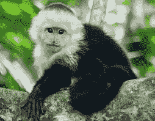
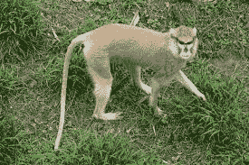
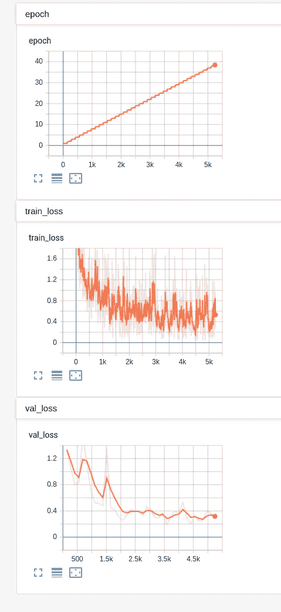

# 如何使用深度学习标记任何图像

> 原文：<https://towardsdatascience.com/how-to-tag-any-image-using-deep-learning-84a0dc2e03c2?source=collection_archive---------10----------------------->

## 用 Pytorch 闪电！


[麦克尔·罗杰斯](https://unsplash.com/@alienaperture?utm_source=medium&utm_medium=referral)在 [Unsplash](https://unsplash.com?utm_source=medium&utm_medium=referral) 上拍照

你大概有照片吧？

你可能想让那些照片自动被标记，对吗？

但是你也不想为此写一大堆代码。

继续阅读，了解如何使用深度学习和 Pytorch 用不到 60 行代码标记任何照片。最棒的是，你只需要修改大约 3 行代码就可以让它为你自己的图像工作了！

# 标记猴子

一个极其常见的机器学习问题是对图像进行分类或标记。影像分类是指当您有一组预定义的类别要为其分配影像时。

假设你在动物园工作，总是忘记所有猴子的名字。如果你有办法把各种猴子的图片自动分类到合适的种类，那就太好了。

你会问，为什么是猴子？因为 Kaggle 上有可用的[数据集](https://www.kaggle.com/slothkong/10-monkey-species)。:)这个数据集包含了 10 个不同种类猴子的大约 1400 张图片。这是白头卷尾猴的照片:



其中一只帕塔斯猴:



拥有数据是关键。对于你自己的问题，确保你有一些已经被标记的图片。我的建议是每个班至少有 50 张带标签的图片。

一旦你有了你的图片，让我们把它们正确地组织起来。您需要创建两个文件夹:“培训”和“验证”。你在训练文件夹中的照片将用于训练我们的深度学习模型。验证照片将用于确保我们的模型调整良好。

在每个文件夹中，为每个标签创建一个文件夹。对于我们的猴子，我们有 10 个标签，我们将称它们为 n0-n9。因此，我们的文件夹结构如下所示:

```
└── training
    ├── n0
    ├── n1
    ├── n2
    ├── n3
    ├── n4
    ├── n5
    ├── n6
    ├── n7
    ├── n8
    └── n9
└── validation
    ├── n0
    ├── n1
    ├── n2
    ├── n3
    ├── n4
    ├── n5
    ├── n6
    ├── n7
    ├── n8
    └── n9
```

然后，将适当的图像放入每个文件夹中。也许将 70%的标记图像用于训练，20%用于验证，剩下 10%用于测试。

我们还将维护从 n0-n9 到实际物种名称的映射，因此我们不会忘记:

```
Label,  Latin Name           , Common Name                   
n0   , alouatta_palliata     , mantled_howler              
n1   , erythrocebus_patas    , patas_monkey                  
n2   , cacajao_calvus	     , bald_uakari                   
n3   , macaca_fuscata	     , japanese_macaque            
n4   , cebuella_pygmea	     , pygmy_marmoset               
n5   , cebus_capucinus	     , white_headed_capuchin        
n6   , mico_argentatus	     , silvery_marmoset             
n7   , saimiri_sciureus	     , common_squirrel_monkey       
n8   , aotus_nigriceps	     , black_headed_night_monkey     
n9   , trachypithecus_johnii , nilgiri_langur
```

# 构建您的模型

# ResNet-50

一个非常流行的用于标记图像的神经网络架构是 ResNet-50。它很好地平衡了准确性和复杂性。这个深度学习模型我就不深入了，不过你可以在这里了解更多[。对于我们的目的，只要知道它是一个非常好的图像分类模型，如果你有 GPU，你应该能够在合理的时间内训练它。如果你没有，看看](/understanding-and-coding-a-resnet-in-keras-446d7ff84d33) [Google Colab](https://colab.research.google.com/notebooks/intro.ipynb) 获得免费的 GPU 资源。

# 微调

当训练我们的模型时，我们将使用的技巧之一是使用微调的想法，希望能够学习如何仅用几个例子就准确地标记。

微调从已经在另一个数据集上训练过的权重开始我们的模型。然后，我们使用自己的数据进一步调整权重。作为微调起点的一个非常常见的数据集是 [ImageNet](http://www.image-net.org/) 数据集。该数据集最初包含大约 100 万幅图像和 1000 个类别或标签。图像标签的广度使其成为一个很好的微调数据集。

# Pytorch 闪电

除了微调，我们还可以应用其他技巧来帮助我们的深度学习模型根据我们的数据进行良好的训练。例如，使用学习率查找器来选择最佳学习率。

实现所有这些最佳实践并跟踪所有培训步骤会产生大量代码。为了避免这些样板文件，我们将使用 [Pytorch Lightning](https://github.com/PyTorchLightning/pytorch-lightning) 。我喜欢这个图书馆。我发现它真的帮助我很好地组织我的 Pytorch 代码，并避免愚蠢的错误，如忘记将我的渐变归零。

我们将通过编写一个实现 LightningModule 的类来使用 Pytorch Lightning。这是我们的大部分代码，然后我们将带您浏览它:

```
class ImagenetTransferLearning(LightningModule):
    def __init__(self, hparams):
        super().__init__()
        # init a pretrained resnet
        self.hparams = hparams
        self.classifier = models.resnet50(pretrained=True)
        num_ftrs = self.classifier.fc.in_features
        self.classifier.fc = nn.Linear(num_ftrs,     self.hparams.num_target_classes) def forward(self, x):
        return self.classifier(x)

    def training_step(self, batch, batch_idx):
        x, y = batch
        y_hat = self(x)
        loss = F.cross_entropy(y_hat, y)
        tensorboard_logs = {'train_loss': loss}
        return {'loss': loss, 'log': tensorboard_logs} def configure_optimizers(self):
        return torch.optim.Adam(self.parameters(), lr=self.hparams.lr)

    def train_dataloader(self):
        train_transforms = transforms.Compose([
            transforms.RandomResizedCrop(224),
            transforms.RandomHorizontalFlip(),
            transforms.ToTensor(),
            transforms.Normalize([0.485, 0.456, 0.406], [0.229, 0.224, 0.225])])
        dataset = datasets.ImageFolder(self.hparams.train_dir, train_transforms)
        loader = data.DataLoader(dataset, batch_size=self.hparams.batch_size, num_workers=4, shuffle=True)
        return loader

    def validation_step(self, batch, batch_idx):
        x, y = batch
        y_hat = self(x)
        loss = F.cross_entropy(y_hat, y)
        tensorboard_logs = {'val_loss': loss}
        return {'val_loss': loss, 'log': tensorboard_logs}

    def validation_epoch_end(self, outputs):
        avg_loss = torch.stack([x['val_loss'] for x in outputs]).mean()
        tensorboard_logs = {'val_loss': avg_loss}
        return {'val_loss': avg_loss, 'log': tensorboard_logs}

    def val_dataloader(self):
        val_transforms = transforms.Compose([
            transforms.Resize(224),
            transforms.CenterCrop(224),
            transforms.ToTensor(),
            transforms.Normalize([0.485, 0.456, 0.406], [0.229, 0.224, 0.225])])
        dataset = datasets.ImageFolder(self.hparams.val_dir, val_transforms)
        loader = data.DataLoader(dataset, batch_size=self.hparams.batch_size, num_workers=4)
        return loader
```

我们定义的第一个函数是 **init()** 。这是我们用来初始化模型的函数。我们从 Pytorch 的预训练 Resnet50 开始，对它稍加修改，使它能够预测适当的类数。您想要预测的类或标签的数量作为 hparams 的一部分作为 **num_target_classes 传递。**

接下来，我们有了 **forward()** 函数。这个很简单，我们只是通过我们的网络传递输入给它。

然后我们有了 **training_step()** 函数。该函数接受两个输入—批次和批次索引。在这个函数中，我们需要定义的是我们希望在每个训练步骤中发生什么。对于这个模型来说，很简单。我们通过我们的神经网络 **self()** 传递数据，然后计算交叉熵作为我们的损失。对于这个函数，标准的做法是返回一个包含计算损失的字典以及 Tensorboard 的日志变量。Pytorch Lightning 的一大好处是，如果你这样做了，你就可以基本上免费获得 **Tensorboard** 日志，这真是太棒了！

**configure _ optimizer()**函数用于定义您的优化器。我们将使用 Adam 优化器，并通过我们的 hparams 传递学习率。

最后，对于训练，您有 **train_dataloader()** 函数。这是负责加载训练数据并将其传递到训练步骤的函数。我们确保定义我们的转换来调整图像的大小，并以与我们的 Resnet 预训练相同的方式缩放它们。我们还用 **RandomResizedCrop()** 和 **RandomHorizontalFlip()** 应用了一些数据扩充。然后我用 Pytorch 的 **ImageFolder()** 函数加载数据。这个函数从一个文件夹中加载图像，只要这个文件夹遵循我们之前定义的结构。数据被传递给一个 **DataLoader()** ，Pytorch 用它来实际加载数据。在这个函数中，我们可以定义诸如 batch_size 这样的项目。我们通过 hparams 将 batch_size 作为超参数传递。

因为我们也有验证数据，所以我们可以定义完全相同的函数，除了它们不用于验证数据: **validation_step()** 和 **val_dataloader()** 。这些功能非常相似。一些区别是我们不再做数据扩充，我们的步骤返回 val_loss。

验证部分还有一个额外的功能: **validation_epoch_end()** 。这定义了在一个时期结束时应该对验证结果做什么。我们只是简单地返回平均验证损失。如果您愿意，也可以在培训步骤中这样做。

## 培养

现在我们已经完成了定义所有必要步骤的繁重工作，我们可以坐下来让 Pytorch Lightning 施展它的魔法了。首先，让我们定义我们的超参数(Pytorch Lightning 希望它是一个 argparse 名称空间):

```
hparams = Namespace(train_dir = <PATH TO YOUR TRAINING DIRECTORY>,
                   val_dir = <PATH TO YOUR VALIDATION DIRECTORY>,
                   num_target_classes = <NUMBER OF TAGS/CLASSES>,
                   lr = 0.001,
                   batch_size=8)
```

我将批处理大小设置得很小，以便与几乎任何 GPU 一起工作。

接下来，我们初始化我们的模型并进行训练！

```
model = ImagenetTransferLearning(hparams)
trainer = Trainer(gpus=1,
                  early_stop_checkpoint=True,
                  auto_lr_find=True,
                  max_epochs=50
                 )
```

真正神奇的事情发生在训练者身上。首先，我们告诉它要在多少个 GPU 上训练，然后我们让它知道如果 val_loss 没有改善，就提前停止训练，最酷的选项之一是 **auto_lr_finder** 。这告诉训练者使用一种算法来找到我们的模型和数据的最佳学习速率，然后使用该速率而不是我们指定的速率。注意:只有当您将 hparams 传递给模型并且 hparams 中有 lr 值时，这才有效。最后，为了避免运行太长时间，我们将 **max_epochs** 设置为 50。

如果你已经做了很多深度学习，你可以欣赏我们的教练清洁()。我们不需要在数据上写一个循环，所有的都是为我们准备的。如果我们将代码转移到有 8 个 GPU 的机器上，我们所要做的就是将 GPU 改为 8 个。就是这样。如果我们可以访问 TPU，Pytorch Lightning 也支持这些，您只需打开选项。在某种程度上，你绝对应该查看一下[文档](https://pytorch-lightning.readthedocs.io/en/latest/trainer.html)中教练()提供的所有伟大选项。

# 结果呢

那么——我们的模型在标记猴子方面表现如何？Pytorch Lightning 自动检查具有最佳验证结果的模型，对我来说，这发生在第 26 纪元。我用这段代码加载了这个模型:

```
model = ImagenetTransferLearning.load_from_checkpoint(<PATH TO MODEL>)
```

用这些代码，我对所有的验证数据进行了预测:

```
model.eval()
val_outs = []
truth_outs = []
for val_batch in tqdm(model.val_dataloader()):
    x, y = val_batch
    truth_outs.extend(y.numpy().tolist())
    val_out = model(x)
    val_outs.extend(val_out.detach().numpy().argmax(1).tolist())
```

以下是我的分类报告(使用 scikit-learn):

```
precision    recall  f1-score   support 0       0.89      0.92      0.91        26
           1       0.93      0.89      0.91        28
           2       1.00      0.93      0.96        27
           3       0.97      0.93      0.95        30
           4       1.00      0.88      0.94        26
           5       1.00      1.00      1.00        28
           6       1.00      1.00      1.00        26
           7       1.00      0.96      0.98        28
           8       0.93      1.00      0.96        27
           9       0.84      1.00      0.91        26 micro avg       0.95      0.95      0.95       272
   macro avg       0.96      0.95      0.95       272
weighted avg       0.96      0.95      0.95       272
```

还不错！我的 f1 平均分数是 0.95，我在班上的最低 f1 分数是 0.91。

不过，这些都是验证结果，所以他们很可能是乐观的。为了更好地表示我们的模型有多好，我们需要对不在训练集或验证集中的图像进行预测。

我没有花时间去创建一个完整的测试集，但是我从谷歌上随机抓取了两张猴子的图片。事实上，这些图片就是这篇文章顶部的两张图片。我们的模型能够正确地预测它们！

此外，这里是用于培训的张量板图:



可以肯定地说，由于我们的深度学习模型，我们现在是猴子物种的专家。:)

# 自己去做！

美妙的是，你现在可以很容易地对任何你想要的图片进行分类。你所要做的就是标记一些你自己的图片，适当地组织它们(如上所述)，然后**修改 3 行代码**。

```
hparams = Namespace(train_dir = <PATH TO YOUR TRAINING DIRECTORY>,
                   val_dir = <PATH TO YOUR VALIDATION DIRECTORY>,
                   num_target_classes = <NUMBER OF TAGS/CLASSES>,
                   lr = 0.001,
                   batch_size=8)
```

您只需要更新 train_dir、val_dir 和 num_target_classes 的值。就是这样！所以——自己去做吧，让我知道你把什么酷的东西归类了！

[免费获取掌握数据科学的 11 种极其有用的资源](https://datascienceleadership.substack.com/)