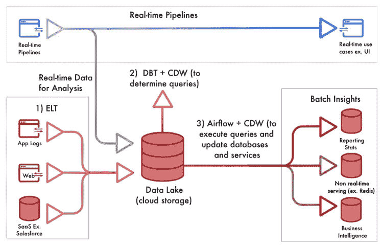
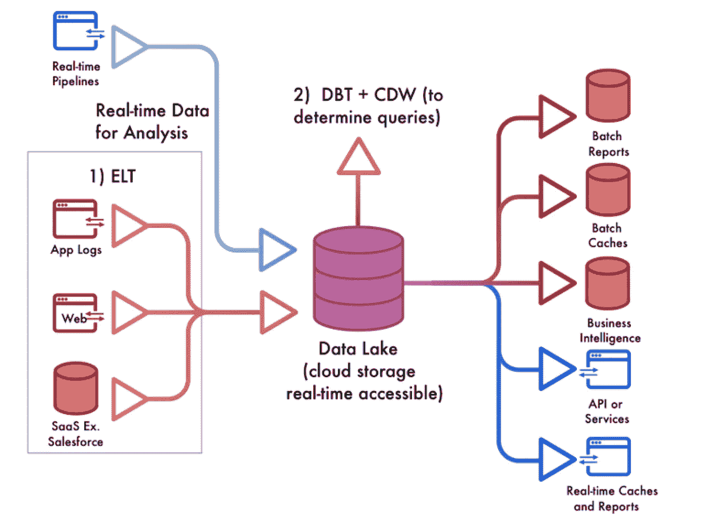

# 如何利用数据革命

> 原文：<https://towardsdatascience.com/how-to-take-advantage-of-the-data-revolution-8fdf6b766ead?source=collection_archive---------44----------------------->

在过去十年中，生成和存储的数据量呈指数级增长，据估计，90%的数据是在过去两年中生成的。

不仅现在的数据比以往任何时候都多，聪明的公司也在积极投资存储和利用这些数据。作为一个有趣的代理，考虑一下 AWS(最受欢迎的云数据仓库)在过去 3 年中的收入增长了 3 倍，从 2016 年的约 120 亿美元增长到 2019 年的约 350 亿美元。

来源:Pixabay

云计算的最新发展使得所有公司都应该能够访问数量级更具可扩展性和可访问性的数据科学。这一次，我们有工具来筛选爆炸规模的数据。

**我们是如何来到这里的**

为了应对不断增长的数据冲击，我们看到技术在不断适应，最近，我们又迎接了大数据的挑战。

这种趋势最初始于公司使用更大的机器进行纵向扩展；最终，达到了极限，数据量倾向于迁移到完全水平的模式，在这种模式下，更多的机器比更大的机器更受欢迎。这甚至被抽象了一步，因为公司现在利用“虚拟机”而不是需要维护的直接机器。这意味着他们只为在被问到时用来回答问题的时间和机器付费。

来源:作者创作

目前，我们可以访问真正的、按需的、水平扩展的计算资源，这些资源可以将我们最复杂的查询划分为最小的部分，以快速提供我们按需的答案。它运行得如此之好，以至于亚马逊的红移和谷歌通常无法商业化(Bigquery)导致的产品缺失为雪花在短短 8 年内成为 120 亿美元的公司打开了大门。

**每个人都应该使用的堆栈**

云数据仓库(CDW 的)使得回答任何商业甚至工程问题变得(相对)便宜，只要你的数据在一个地方，并且是可以被查询的格式。但是 CDW 不会提供任何价值，除非你的团队有工具来协作构建查询。这是第一次，所有这些都汇集在一起，数据科学家真正有能力深入研究，但如何进行呢？

来源:作者创作

第一步是将数据放入可查询的位置，最近流行的是 E *LT* (提取负载转换)工具，如 [Alooma](https://www.alooma.com/) 、 [Stitch](https://www.stitchdata.com/) 和 [Fivetran](https://fivetran.com/) 。他们可以毫不费力地在一个 CDW 可以查询的地方保存来自任何 SaaS 的最新数据副本。它们与标准 E *TL、*相比也有不足之处，比如每次有人查询数据时，它们都需要在查询时转换数据。这样做比预先做更有出错的风险，但是它们很简单而且有效。

一旦数据处于可查询的环境中，您需要能够挖掘并获得洞察力。一种叫做数据构建工具( [DBT](https://www.getdbt.com/) )的产品在这个领域脱颖而出，成为真正的英雄。短短几年内，数千家公司都在使用它，这已经是指数级增长了。有充分的理由——DBT 已经完全改变了公司合作获取洞察力的方式。对于非工程师来说，这是一个稍微复杂一点的概念，但 DBT 有效地提供了一个平台，数据科学家可以使用这个平台与工程师一起合作编写和共享查询。每个查询(创建管道)都在组织内发布；因此，对于每条管道是如何建造的，有一个容易获取的记录。这样做需要通过标准的工程流程，如版本控制，从而带来一些特定的好处:

1.  合作设计新管道很容易
2.  度量可以被验证是正确的
3.  可以构建、引用和重用查询

一旦创建了这些高质量的管道，任何人都可以查询它们，而不需要知道它们是如何构建的。

最后，一旦创建了查询，只需要对它们进行调度。这一步很容易，通常的方法是气流。

**商业价值**

这种新设置令人难以置信的部分是，数据科学家现在有权访问所有数据(内部或外部)，并协作处理数据以发现和提供商业价值。他们可以以前所未有的规模工作，以获得过去不可能获得的洞察力…由于一切都在 SQL 中，数量级更多的人拥有正确的提问和回答问题的技能。

这确实是一个巨大的转折点——可以查询的数据量、可以获取的数据源数量以及可以进行查询的人群都发生了巨大的变化。我们可以比过去好几千倍地分析数据。想象一下这样一个世界:分析第一次可以赶上甚至超过数据增长率。

我们该何去何从？

来源:作者创作

鉴于当今的技术选择，所描述的设置可能是最好的，但它也有其局限性。它最初是为了回答一次性问题而创建的。每次提问时，这项技术都需要处理你所有的数据来再次回答它。显然，这不是最有效的方法，而且会导致比所需成本更高的成本和更慢的查询时间。此外，由于数据必须按计划加载，管道中存在延迟，因此无论何时您提出问题，您得到的答案都是关于过去的。不幸的是，真正需要实时用户流的应用程序不能像这样构建——它需要完全独立的管道。

你应该能够找到我们上面所讨论的复杂问题的答案，但是当你发现一个有意义的新见解时，你希望它是现成的。

构建高效、实时的管道(旨在与现有架构协同工作)应该比管理和维护一个拥有独立真实来源的 Kafka 装置更简单。未来不应该是一个 lambda 架构，而是一个实时可访问的数据湖，它可以从一个位置保持所有公司集成、服务和报告的最新状态。希望我们在河口建造的东西能有所帮助。