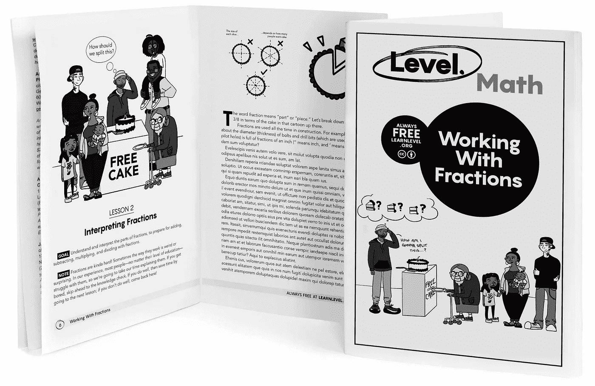
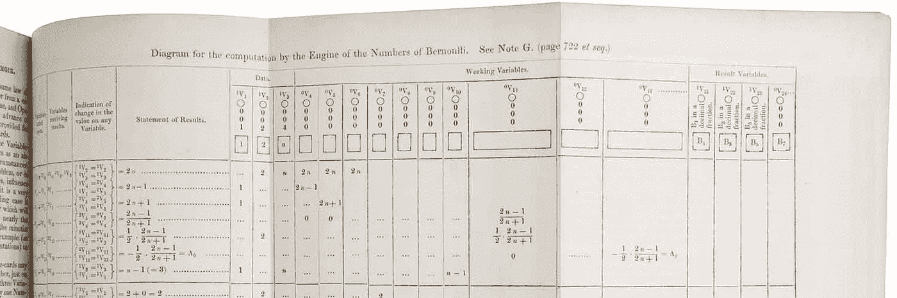
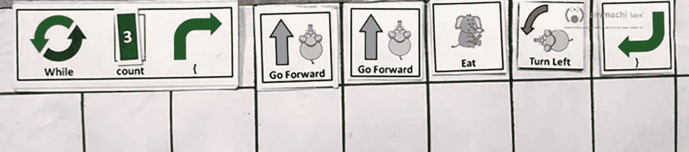
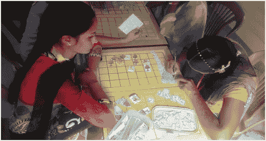

# 如何在监狱里教人编程(没有电脑)

> 原文：<https://towardsdatascience.com/how-to-teach-programming-to-people-in-prison-without-computers-c455baca7f19?source=collection_archive---------32----------------------->

## 在没有计算机的情况下使用无电源策略教授数据科学

没有计算机，我们如何教授数据科学和编程？这在今天听起来可能有些倒退，但事实证明我们几十年来一直在做这样的事情。直到最近，我们才忘记将计算机从计算机科学中分离出来是多么的可能，甚至是多么的有利。

没有电脑(或者互联网)怎么给 ***监狱*** 的人教数据科学和编程？这是一个复杂得多的问题，回答这个问题会进入未知的领域。

Level 发送到监狱的免费印刷教育指南示例。我们正在开始一个旅程，为监狱中无法使用计算机的人创建教授数据科学和 R 语言编程的指南。(*图片作者*)

在[级别](https://learnlevel.org/)，我们大规模地创建和分发高质量、免费、知识共享许可的教育和工作培训内容给被监禁的男性和女性。

在接下来的一年里，我们将开始分发我们的第一批编程指南，这些指南是为无法使用计算机或互联网的被监禁的学习者编写的。这个项目前所未有的方面让我们回顾过去，去发现研究人员和程序员以前是如何处理这些问题的。

我们从数据科学、数据可视化和 R 编程语言的课程开始。我们选择这个起点，是因为它可以更加有形。数据科学和数据可视化比 web 开发或 app 设计更能适应不同的环境。个别学习者可以个性化收集和分析的数据。“数据无处不在”即使在监狱里也是如此。

向被监禁的男人和女人——美国最缺乏联系的一些人——教授编程可能看起来很荒谬。但是考虑一下这个。每年，有 60 万人从州监狱和联邦监狱中被释放出来，他们的工作前景和未来都没有比被关押时更好的前景。这相当于巴尔的摩或拉斯维加斯的人口数量。每一年。超过一半的人被再次逮捕并回到监狱，每年花费我们 800 多亿美元，并在此过程中撕裂家庭和社区。许多被监禁的人渴望学习，渴望新的机会。

监狱里的人有的是时间。很多时间。和创造力。和毅力。他们所没有的是…很多东西，包括电脑、互联网和我们许多人在外面视为理所当然的自学课程。像最后一英里和 T2 解锁这样的组织在一些精选的监狱中提供非常酷的编程课程，但是这些课程只对一小部分美国监狱人口开放。新冠肺炎甚至锁定了这些机会。

我们如何将数据科学职业提供的改变生活的机会介绍给美国被监禁的人群？我们如何才能大规模地做到这一点，让全国 230 万被监禁的男女中的更多人——他们无法使用电脑或互联网——能够发现新的职业机会？尽管可能有些荒谬，但历史是将这一想法变为现实的伟大指南。

骡溪州立监狱的毕业典礼。图片来自[加州惩教改造部](https://www.insidecdcr.ca.gov/?s=education)、[公共领域](https://commons.wikimedia.org/w/index.php?curid=70317285)。

# 计算机科学与计算机无关，正如天文学与望远镜无关一样

我们大多数人都认为学习一项技能需要使用掌握这项技能所需的工具。学习编程需要使用计算机和互联网。但是真的吗？

有越来越多的想法，被称为不插电计算机科学，重新思考计算思维、数据素养甚至编程教学的基本性质。《不插电计算机科学理论》在 20 世纪 80 年代获得了立足点，并在 21 世纪初得到了显著发展，它非常自豪地说，我们不仅可以在没有计算机的情况下教授计算机科学，而且在许多方面，我们应该这样做。

《不插电计算机科学》最初是对教授儿童编程和计算机科学基础的不同方法的探索。如果你有年幼的孩子或花很多时间在他们身边，很明显他们不能很好地打字，也不能像我们通常教编程那样长时间坐着不动来学习编程。

Mike Fellows 和 Tim Bell 是来自地球另一端的两位志趣相投的教授和计算机科学家，他们在 20 世纪 80 年代末聚在一起，提出了一个在教孩子计算机时扔掉计算机的新想法。他们设计了游戏和活动，教孩子们思考编程的*——抽象、分解、算法设计、一般化、自动化、变量、循环、条件——用绳子、纸和杯子代替屏幕时间。*

*不插电计算机科学的好处是立竿见影的。教师不一定要有计算机科学的学位——甚至不一定要了解它——来帮助孩子们学习计算机。学校甚至不需要有电脑。孩子们可以做他们最擅长的事情——跑来跑去，尖叫——同时实际学习计算概念，如 if / then 条件句。*

*事实证明，在迈克·费罗斯和蒂姆·贝尔之前很久，需求就已经成为不插电计算机科学的发明之母。在编程的最初几十年里，程序员在接触到能够执行他们代码的罕见机器之前，用笔和纸来完善和测试他们的算法。错误代价高昂。纸不是。学习编码并不是从键盘和屏幕开始的。*

*我们能从那些不用电脑就能理解编程核心思想的孩子身上学到什么？如果早期的编程需要笔和纸编码的漫长学徒期，我们能教今天的成年人如何成为优秀的——高收入的——程序员吗，即使他们没有计算机？不插电计算机科学是将更多不同的思想和才能带入编程领域的一条途径吗？*

**

*照片由[格雷格·拉科齐](https://unsplash.com/@grakozy?utm_source=unsplash&utm_medium=referral&utm_content=creditCopyText)在 [Unsplash](https://unsplash.com/s/photos/astronomy?utm_source=unsplash&utm_medium=referral&utm_content=creditCopyText) 上拍摄*

# *将计算机与计算机科学分开*

*这句名言“计算机科学与计算机的关系，不亚于天文学与望远镜的关系”是荷兰计算机科学家埃德格·迪克斯特拉说的，但实际上是《不插电》的合著者迈克·费罗斯杜撰的。天文学和计算机科学是概念，大局观念，职业。望远镜和电脑都是工具。教授计算机科学的一个大问题是，传统的方法把学习如何使用工具放在学习概念、大图思想和应用之前。*

*蒂姆·贝尔进一步解释了这个比喻。“传统上，对于计算机科学，我们使用编程作为通向计算机科学的大门。学生们被告知，“注册计算机科学，你将学习一整年的编程，然后我们将开始向你展示一些你可以用它做的很酷的东西。”这有点像说‘有一种东西叫做天文学。你可能不知道它是关于什么的。相信我，真的很酷。但首先，先了解一两年望远镜。然后我们会告诉你它实际上是什么。"*

*这种本末倒置的方法有很多问题。其中之一是访问。如果你没有掌握它们的工具和技术，你就无法继续你的职业生涯。根据 Tim 的说法，“改变我们教授计算机科学的方式的一个重要的社会问题是,‘先学习编码/编程，然后我们会向你展示很酷的东西’的传统观点将许多看不到编码/编程意义的人排除在外。如果你能让他们看到这一点，他们就会明白这是值得学习的。”这同样适用于那些拿不到工具的人。*

*早在这两人开始改变计算机对孩子来说可能很难的方式之前，出于需要，成年人一直在用不插电的方法研究计算机科学。*

**

*阿达·洛芙莱斯的“伯努利数的引擎计算图”的“注释 G”的细节—第一个为在计算机上实现而发布的算法。阿达·洛芙莱斯在没有计算机的情况下编写了这个算法。[公有领域](https://commons.wikimedia.org/wiki/File:Diagram_for_the_computation_of_Bernoulli_numbers.jpg)(1843 年出版)。*

# *在它们有名字之前，不插电计算机科学的原理就已经存在了*

*[程序员 Vicki Boykis](https://twitter.com/vboykis/status/830587985087365121?s=20) 发了一条关于她妈妈如何在前苏联学习编程的推文，促使她妈妈写了一篇名为[作为一名苏联编程女性](https://veekaybee.github.io/2017/02/22/being-a-woman-in-programming-in-the-soviet-union/)的长篇文章，记录了她如何在 70 年代末和 80 年代初学习编程。故事和视觉效果是惊人的。*

> *“在编程课上，我们以‘干’的方式学习编程:使用纸、铅笔和橡皮擦。事实上，这种方法非常重要，以至于忘记带铅笔的学生会被送到主办公室去要一支……我们的老师曾经去过一周的“实践工作和课程开发”，每隔一段时间就去一家拥有更先进机器的严肃的 IT 商店。当时重算力在 ES 系列，苏联集团国家生产。这些机器是 IBM 360 的复制品。他们用穿孔卡片和穿孔纸带工作。她会带回来成吨的论文，上面有打印的代码和调试注释，供我们在课堂上学习……在用铅笔和纸进行了两年半的严格学习后，我们进行了六个月的练习。”*

*程序员 Alvaro Videla 的一条推文谈到了 20 世纪 60 年代的乌拉圭程序员，他们在纸上写了整整一周的程序，然后乘渡船去阿根廷测试他们的程序，那里是离电脑最近的地方。在早期，年轻的程序员无法使用计算机来运行他们的代码。“[计算机是用来执行程序的，而不是编辑文本的](https://news.ycombinator.com/item?id=10171469)”一位程序员这样说道，他是根据最初的“干”法学习技能的，在黄色的法律便笺簿上写字。*

*再往前追溯到 19 世纪 40 年代，我们可以看看第一位程序员阿达·洛芙莱斯，她因在查尔斯·巴贝奇的机械通用计算机——分析引擎上的工作而闻名。Ada 编写了世界上第一个算法[而没有使用过计算机。当然，在开始的时候，没有电脑。是人们发明了电脑，而不是相反。很明显，我们可以在没有计算机的情况下教授编程、计算机科学和编码。](https://en.wikipedia.org/wiki/Ada_Lovelace#/media/File:Diagram_for_the_computation_of_Bernoulli_numbers.jpg)*

**

*Haathi Mera Saathi(我的大象朋友)用游戏板教印度农村的孩子编程。请注意循环周围的{和}符号。这些符号后来被孩子们在用 Java 打字时使用。图片经作者许可使用，鸣谢[安玛奇实验室](http://ammachilabs.org)。*

# *不插电在数字鸿沟的两边都起作用*

*这是一项关于印度农村儿童的有趣研究，名为大象和嵌套循环的[:如何向印度农村的年轻人介绍计算](https://dl.acm.org/doi/pdf/10.1145/2930674.2930678)。使用大象(代表性的，而不是真实的)是因为许多孩子可能没有见过计算机，但熟悉驯象师给大象下达指令的想法。嵌套循环是编程中的一个概念，指的是作为更大的重复模式的一部分的重复模式。*

> *“虽然我们都在努力摆脱技术控制我们(而不是我们控制它)的感觉，但我们也必须认识到，全球穷人在设计决策方面没有发言权。他们不与那些制造技术的人一起参与对话、公司、会议或论坛，这些技术运行着他们申请政府拨款、网上银行、甚至与家人交流和观看娱乐节目所需的系统。随着他们沦为接受者而非生产者，我们觉得找到改变这种状况的方法并帮助他们成为创造者尤为重要。”[1]*

**

*女孩们在玩 Haathi Mera Saathi(我的大象朋友)棋盘游戏。图片经作者许可使用，署名[安玛奇实验室](http://ammachilabs.org)。*

*研究人员的游戏名为 Haathi Mera Saathi(我的大象朋友)，被证明是一种有效的方法，可以将孩子们从没有计算机经验的状态带到他们在基于 Java 的环境中创建交互式应用程序的状态。研究人员确定了几个可行的成功关键。*

*一个是在学习编码的早期阶段对物理和有形的需求。孩子们有时分不清左右，所以他们都是从在一个大的物理游戏板上练习动作开始的。然后他们移动到一个小的纸质游戏板上，上面有被映射成实际编程代码的小块和指令。然后他们转向 Java 处理。身体上的表现对于在孩子们的脑海中描绘真实发生的事情是至关重要的。当孩子们打字的时候，他们知道他们在打什么，或者它代表什么，回想这些想法的物理的，有形的表现。*

**

*来自 Scratch 编程语言的示例代码，由 [griffpatch](https://scratch.mit.edu/users/griffpatch/) 进行的[非欧几里德柠檬抓取实验](https://scratch.mit.edu/projects/411192040/)的一部分。*

*成功的另一个可行的关键是使用本地化的、可理解的隐喻。在西方，一种流行的入门编程语言是由麻省理工学院开发的 [Scratch](https://scratch.mit.edu/) ，我在 code.org 的[上使用了很多。Scratch 是一种基于块的语言，孩子们可以理解。他们可以查看物理块(不像木块，而是自包含的代码块)并理解发生了什么。孩子们用 Scratch 制作卡通舞蹈和音乐循环，以及许多其他有趣的东西。像是真的心灵弯曲](https://code.org/)[非欧几里得的柠檬抓取实验](https://scratch.mit.edu/projects/411192040/)。*

> *“麻省理工学院的 Scratch 是迷你语言最著名的例子之一，体现了面向学习者的环境提供丰富的图形编程环境的建构主义理想。它的界面易于学习，但我们认为，通过让它变得不那么抽象、更加具体，我们有很大的空间来创造进一步降低门槛的学习环境，尤其是对第三世界的年轻人来说。”[2]*

*研究人员需要比 Scratch 更基础的东西来让印度的农村青年理解编程的基本思想。取而代之的是，他们使用大象、树木和食物的剪纸，然后使用包含有用编码符号的基本指导卡。而且成功了。*

*最近的另一项研究叫做[挠还是不挠？:一个对照实验，比较插上和未插上的第一节编程课](https://dl.acm.org/doi/abs/10.1145/3137065.3137072)将两组 8 到 12 岁的小学生配对。与大象和嵌套循环的研究不同，这项研究中的研究人员与参与儿童一起工作，他们在访问计算机或理解如何使用计算机方面没有问题。相反，这项研究的研究人员质疑*何时*是将计算机引入儿童计算机科学教育的合适时机。*

*一组孩子接受了 4 周的非插头计算机科学课程，而另一组接受了 4 周的传统插头计算机科学课程。然后两组都接受了 4 周的 Scratch 编程课程。*

> *“八周后，两组学生对编程概念的掌握没有差别。然而，从不插电课程开始的那一组对他们理解概念的能力更有信心——他们表现出更好的自我效能信念。此外，第一组不插电的孩子使用了更多的刮擦块。[3]*

*有几十个 Scratch blocks，它们属于运动、外观、声音、事件、控制、传感、运算符和变量等类别。正如你所想象的，孩子们可以很好地完成一部分积木，尤其是在开始的时候。学习了不插电计算机科学的孩子们首先继续探索更广泛的不同类型的积木，并且更有信心这样做。*

*《从无到有》或《不从无到有》中可操作的发现是，从无插头教学策略开始可以导致对编程概念更细致入微的理解，即使是在经常接触技术的小学学习者中。数字鸿沟两边的孩子和成年人都可以从离线工作中受益，学习对以后计算机科学职业生涯至关重要的概念。*

**

*Alex Wright 授权使用 Adobe Stock 的图片。*

# *那么，向监狱里的人教授数据科学和编程是怎么回事呢？*

*所有这些都是历史和研究中的一个很好的练习，但并没有明确回答更难的问题。我们到底该如何利用这种重构的思维来支持地球上一些最缺乏数字连接的学习者——被监禁的美国人——在使用数据科学、计算思维、计算机科学和编程的高薪职业中获得立足点？*

*在层面上，我们通过美国邮政直接向监狱中的人发送小册子。这样做，我们可以接触到**甚至被单独监禁和最大限度安全保护的美国人**——那些永远不会被允许参加监狱教育或职业培训课程的囚犯。所以我们必须使用印刷纸。没有覆盆子酱。没有微生物。没有，除了印刷纸什么都没有。纸里没有订书钉。甚至不是白纸(是的，真的)。*

*在新冠肺炎期间，全国大部分监狱的非必要项目——包括大学课程和大多数其他教育课程——已经暂停，以防止新冠肺炎病毒在监狱内外的传播。许多被监禁的人一天 23 小时被关在牢房里，与传统教育或职业培训课程隔绝。甚至在新冠肺炎之前，没有被监禁的男人和女人可以去的计算机实验室。*

*所以这些小小的纸质指南是我们的媒介。现在的问题已经简化为这样一个问题——**我们能在多大程度上通过不插电计算机科学培训来指导没有电脑的成年人**？我们能给计算思维一个基本的介绍吗？我们真的能进入编程吗？如果有，那看起来像什么？学习者如何检查自己的作业？他们如何去调试他们的代码？*

*下面是我们从之前的研究中学到的东西，在这个故事的前面有所总结:*

*   *没有计算机也可以教授计算机科学*
*   *使用实际的、有形的陈述和经验*
*   *使用本地化的、与社会相关的例子和隐喻*
*   *关注在没有计算机的情况下学习计算机科学的优势(即使它们看起来像劣势)*

*此外，以下是我们从过去与被监禁的男性和女性打交道的经历中学到的经验:*

*   *被监禁的人有很多时间和毅力*
*   *激发每个学习者的创造力*
*   *慢慢开始，假设尽可能少的事情*
*   *永远不要低估人类意志的力量*

*巨大的挑战是，本文中讨论的所有“不插电”策略都假设在某个时候，学习者会将他们的“不插电”学习与传统的“插入式”方法相结合。*

*蒂姆·贝尔(Tim Bell)在评论这篇文章时指出，“只是为了澄清——证据是我们应该从不插电开始，但转向实际编程计算机也很重要。”他那干巴巴的、略带厚脸皮的新西兰式幽默十分明显。是的，在某些时候，我们需要继续实际编程一台计算机。当你在监狱里的时候，这还是真的吗？我们会弄清楚的。*

*我们正在寻找勇敢、有远见、乐观的贡献者和合作伙伴，他们愿意接受巨大的挑战，抓住巨大的机遇。如果你有兴趣帮助或加入我们的力量，或者只是想了解我们的进展，请通过我们的[网站](https://learnlevel.org/)和我们的[推特](https://twitter.com/levellearning)与我们联系。我们很高兴能与[杰西·莫斯蒂帕克](https://twitter.com/kierisi)合作创作这些指南，所以也请关注她的推特。我们真的很高兴能在这些未开发的机会上取得进展。*

## *参考*

*[1，2] R. Unnikrishnan、N. Amrita、Alexander Muir 和 Bhavani Rao。2016.大象和嵌套循环:如何向印度农村的年轻人介绍计算技术。《第 15 届交互设计与儿童国际会议论文集》(IDC '16)。计算机械协会，纽约，纽约州，美国，137-146。*

*[3]费莉恩·赫尔曼斯和埃夫西米亚·艾瓦洛格鲁。2017.[挠还是不挠？一个对照实验，比较插入式和非插入式编程课程](https://doi.org/10.1145/3137065.3137072)。《第 12 届中小学计算机教育研讨会论文集》(WiPSCE '17)。计算机械协会，纽约，纽约州，美国，49-56。*