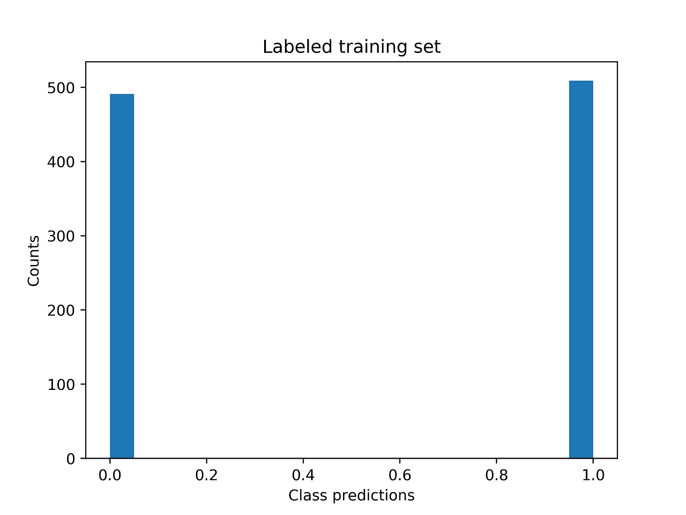
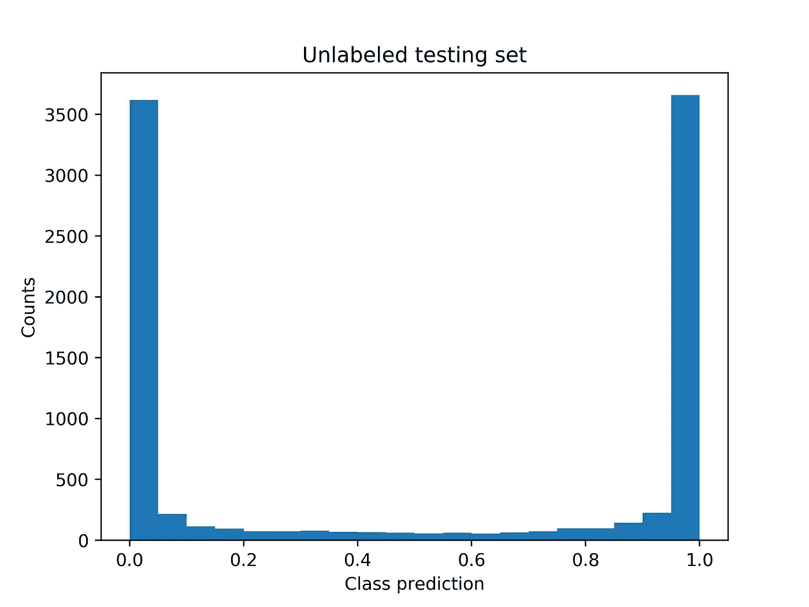
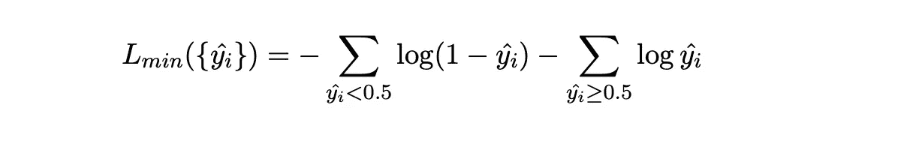
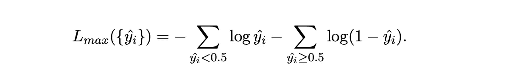

# 如何使用未标记的数据判断你的模型是否过度拟合

> 原文：<https://towardsdatascience.com/how-to-tell-if-your-model-is-over-fit-using-unlabeled-data-4a5bddabc452?source=collection_archive---------69----------------------->

## 一种界定测试损失的新方法

在许多设置中，未标记的数据是丰富的(比如图像、文本等)，而用于监督学习的足够的标记数据可能更难获得。在这些情况下，很难确定模型的泛化能力。大多数评估模型性能的方法仅依赖于标记数据，例如 k 倍验证。没有足够的标记数据，这些可能是不可靠的。关于模型从*未标记的*数据 ***中进行归纳的能力，我们还能了解更多吗？*** 在这篇文章中，我展示了 ***未标记的数据是如何经常被用来限制测试损失*** 。

劳伦·乔治在 [Unsplash](/s/photos/bird-of-paradise?utm_source=unsplash&utm_medium=referral&utm_content=creditCopyText) 上的照片

## 预赛

我们将考虑的任务是分类，我假设模型输出属于每个类别的输入的概率。为了简单起见，我将把讨论限制在二进制分类和交叉熵损失，尽管结果可以很容易地扩展。我们需要调用的一个关键假设是*训练集被假设为从与测试集*相同的分布中采样。

## 概念

我们最初的观察是，如果模型非常适合训练集(即获得低损失)，它必须自信地和正确地预测类别标签。换句话说，预测的直方图应该是近似双峰的，一个模式在 *p=0* 处，一个模式在 *p=1* 处。

对于非常适合定型集的模型，类预测的直方图应该是什么样子。

***我假设，一般来说，过度拟合的模型在未标记集上返回的预测比在训练集上返回的预测更不可信。这反过来允许我们限制未标记集合上的损失。***

第一个图是使用两层神经网络制作的，在输入层有 100 个神经元，在输出层有一个神经元。为了模拟过度拟合，使用 sklearn 的 make_classification()方法在合成数据上训练该模型，该方法具有超过 10，000 个样本的 1，000 个特征。该模型对 1000 个样本进行了训练，并对其余 9000 个样本进行了测试。它很快达到 100%的训练精度和小于 0.0001 的损失。为了支持我的假设，下面是切换到未标记集时直方图的样子:

请注意，相对于训练直方图，对应于不太有把握的预测的中间区域是如何填充的。我现在描述如何使用这种行为来限制未标记集合上的损失。

## 获取界限

我们从损失的下限开始。为了获得它，*我们假设所有预测的标签都是正确的，并且损失仅仅是由于置信度的降低而引起的*。在这种情况下，交叉熵分解成两个独立的和，一个和用于 0 标签，另一个用于 1 标签:

其中 L_ *min* 的自变量是在未标记集合上做出的预测集合，并且我们已经假设分类阈值为 0.5。假设所有的标签都不正确，我们可以得到一个上界:

这个界限不是特别有用，但是我们引入它来为下一个界限清理符号。

由于假设训练集与未标记集具有相同的类别分布，所以当从训练集移动到未标记集时，标记分布的变化是点被错误标记的信号，并且可以用于收紧下限。设 *M* 为误标记点的最小数量， *N* 为未标记集合中的点的数量， *p* 为训练集合中 1-标签的概率， *p^hat* 为未标记集合中 1-标签的预测概率。然后我们有*m = n | p p^hat|*，精确的下限来自于假设是 *M* 最不自信的预测(即最接近 0.5 的预测)导致了错误分类。这给出了新的函数:

其中脚本 *M* 指的是 m 个最不自信预测的集合，脚本 *M^C* 指的是它的补集。除了这些界限之外，人们可以很容易地想象出一族*估计*，例如，通过假设它是被错误标记的 *M* *最有信心的预测，或者模型实际上被很好地校准，并且真实标记的概率等于它的预测概率。我现在详细说明这些想法是如何在实验中实现的。*

## 结果

对于在我之前描述的合成数据上训练的密集神经网络模型，边界给出了 *L_min = 0.05* ，以及最少 29 个错误标记的点(这些不足以使细化的边界 L_ *更紧密*出来明显不同*)。*真正的测试损失为 1.79，因为在实践中，假设损失主要是不确定性而不是坏标签是不现实的。 ***然而，即使不访问测试标签，我们已经推断出测试损失至少比训练损失*** 、 ***大 600 倍，并且至少有 29 个点会被错误标记*** 。 ***在许多情况下，在使用模型做出现实决策之前，了解模型的最小损失是不可接受的，这一点至关重要。***

对于执行图像分类的卷积神经网络，这些过度拟合模型的行为也得到了证实，并且基于 LSTM 的模型 I 被训练来[区分自然发生的蛋白质序列和随机改组的蛋白质序列](https://github.com/elanstop/protein-classification-and-generation)。这些结果表明我的假设可能经常成立。更多细节可以在相应的 [GitHub 库](https://github.com/elanstop/generalization)中找到。

## 相关著作

Breck 等人建议，在数据集之间切换时，应该寻找特征分布的变化。这显然在精神上是非常相似的，但是这里我们已经明确地假设了训练和测试数据是从同一个分布中抽取的，并且关注于模型而不是数据。Kim、Feldt 和 Yoo 介绍了一种衡量单个测试点对模型的惊奇程度的方法。这个方法看起来与这里介绍的方法不同，并且相互测试我们的方法会很有趣。这里介绍的措施的一个积极的属性是它们非常容易计算和解释。最后，Grosse 等人使用以未标记点为中心的ε球周围的预测类别标记的变化作为过度拟合的度量。他们的方法的一个非常吸引人的特征是，它提供了局部的、逐点的过度拟合度量。然而，与我的方法相反，他们的方法需要一个合适的度量来评估输入的相似性，这可能不是微不足道的。在高维度中，对来自球的足够多的样本进行推断以精确测量预测标签中的方差也可能是昂贵的。 ***据我所知，我这里描述的方法是第一个使用未标记数据直接绑定测试损失*** 。

## 结论

我介绍了一种评估过度拟合的新方法，它利用了许多环境中大量的未标记数据。它适用于模型输出概率的分类问题，并且可以合理地假设训练集是从与未标记集相同的分布中采样的。我所描述的界限相当宽松，但是仍然可以提供关于过度拟合的潜在关键信息。此外，当从训练集移动到未标记集时，对预测直方图如何变化的视觉检查是识别过拟合的极其简单且强大的定性方式。也许在将来，同样的原理可以用来产生更复杂的边界。

相关代码可以在我的 [GitHub 库](https://github.com/elanstop/generalization)中找到。

特别感谢 Rachael Creager、Jamie Gainer、Amber Roberts、Jeremy Mann 和 Nicolas Chausseau 的反馈。

## 参考

[1] E. Breck，N. Polyzotis，R. Steven，E. Whang 和 M. Zinkevich，[机器学习的数据验证](https://mlsys.org/Conferences/2019/doc/2019/167.pdf) (2019)，第二届 SysML 会议论文集。

[2] J. Kim，R. Feldt，S. Yoo，[使用惊奇充分性指导深度学习系统测试](https://ieeexplore.ieee.org/abstract/document/8812069) (2019)，IEEE/ACM 第 41 届国际软件工程会议。

[3] K. Grosse，T. Lee，Y. Park，M. Backes 和 I. Molloy，[一种新的过度拟合度量及其对深度学习后门的影响，](https://arxiv.org/abs/2006.06721)[https://arxiv.org/abs/2006.06721](https://arxiv.org/abs/2006.06721)