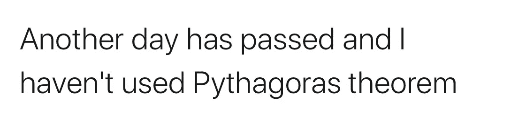
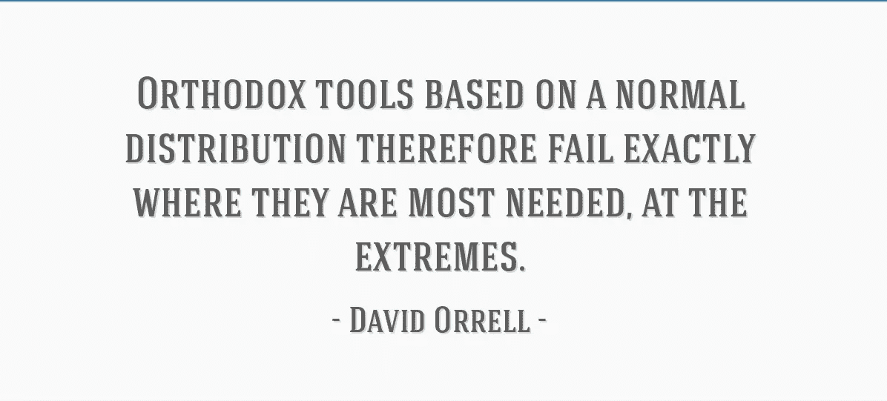
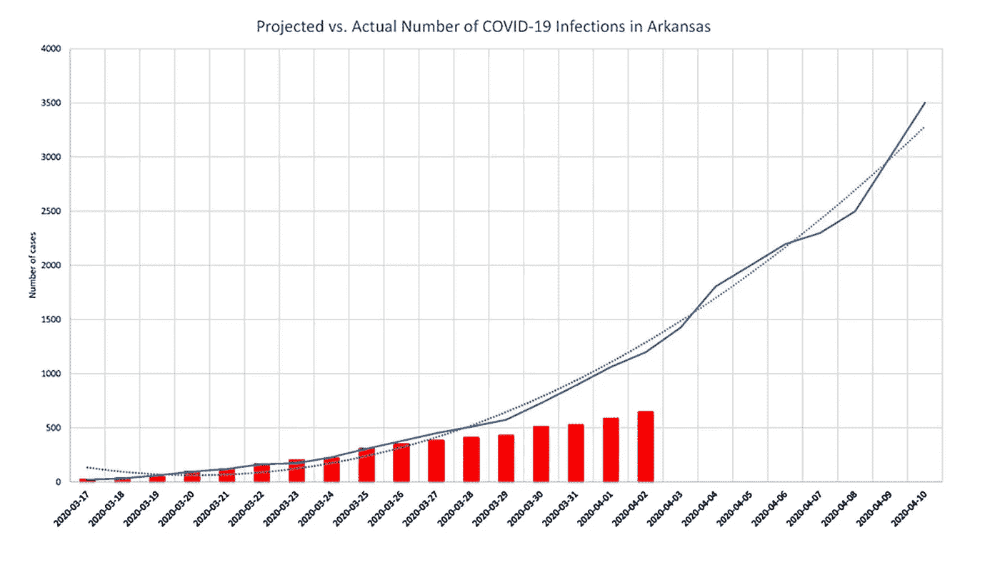

# 如何告诉你的孩子数据

> 原文：<https://towardsdatascience.com/how-to-tell-your-kids-about-data-bf2aaf5e9838?source=collection_archive---------47----------------------->

对数据科学家与数据行比例的过度描述。照片来自 [Pixabay](https://pixabay.com/photos/stadium-football-viewers-165406/)

> “数据来了！数据来了！”

最近，很少有事情比“数据”这个词的错误描述更让我反感，特别是关于它在数据科学、数据分析、大数据等方面的变体。然而，我并不指责肇事者:数据对你生活的影响正在以比努力教育大多数人它是什么以及如何将其转化为可操作的见解更快的速度增长。在这一点上，我们大多数人都意识到适当利用数据有许多有利可图的用例。反过来，企业和组织正在寻求利用这一运动，但并不总是知道它将为他们的具体业务带来哪些切实的好处。

我并不想附和任何“数据来了”之类的空想论调。数据来了！”首先，大数据已经存在，它目前的存在只是一场始于(我敢说)一个世纪前的技术革命的最近货币化的副产品，人们一直对它自动化人类任务的能力感到厌倦。虽然这是一个值得思考的问题，但我想我们都同意，许多任务总是需要人与人之间的互动，而且当数据为人们此后的决策提供基础时，它尤其强大。人工智能和机器学习是其他一些常见的误解流行词，每个人都应该找到一个*准确的* *概念理解*，但我并不呼吁 [TensorFlow](/a-simple-introduction-to-tensorflow-d992eb2e3dbb) 在不久的将来变得像微软 Office 一样常见。

相反，作为一个在高中的春季周末参加数学竞赛，但在 20 岁之前不会称自己精通基本数据分析的人，我认为是时候灌输数据作为数学和统计早期教育的动机了。期望每个人都渴望从事获取、流水线处理或分析数据的职业是不合理的，但更不合理的是，有如此多的人认为这个概念令人生畏且陌生。

欧几里得在坟墓里颤抖。推特@BirkkinYT。

我当然没有意识到我的初中/高中数学、统计学和计算机科学课程会转化为成为一名光荣的数据雇佣兵的幻想，无情地从大型数据集中解析出人可读或计算机可执行的信息。不幸的是，现在我不是这样了，但我想知道在我早期的课程中是否有一些更激励人的例子会让我在实现这一个人命运的道路上走得更远。同样，也许我在社会科学领域的同行会对他们领域的未来研究有更全面的了解，在这些领域，结果只与用于从相应的治疗变量推断因果关系的回归模型一样强大(我们想知道为什么经济学家现在钻研关于心理学、教育和其他领域的 T2 研究)。但最重要的是，也许*会有更多的人*不再对他们收到的过于精确的 Instagram 广告感到好奇，尽管他们的手机已经永久开启了 Siri 和定位服务。

# 不要颠倒矩阵！(除非你甚至不知道矩阵是什么——那就太酷了)

万一你想到了，不要。约翰·库克的博客文章。

作为读者的一个练习，回想一下你在学校第一次学习以下主题时的年龄:

*   解线性方程组
*   毕达哥拉斯定理
*   计算两个向量的“点积”和“叉积”

这些科目是在代数和几何之前学的。我的想法是——除了毕达哥拉斯教你在去上课/上班的路上穿过公园可能是一个不错的选择——这些主题是线性代数的基础，在缺乏数据的生活中，线性代数没有直观的位置。在考虑部署技术来分析数值数据之前，我们必须存储数据，而且我们完全是以矩阵向量的形式来存储数据，这种形式可以用线性代数和向量微积分的方法来处理。然而，有多少人继续他们的教育到足以研究这些话题呢？

这些技术缺乏现实世界的动机(除了物理学，如果那是你的事情)，再加上手动实现的单调乏味，这给围绕数学的情绪带来了恐惧，并反过来挥舞着数据。如果家庭作业以分析一组特定变量的迷你项目的形式出现——也就是说，除了学生在两个不同科目上的考试成绩，或者一个笼统的“x”和“y”——使用这些技术，我认为它们更有可能给学生留下持久的印象。理想的情况是，实质性的作业应该辅以说明，总是强调“为什么？”的技术。这样做，我们可以*改变关于数学和早期数据分析的叙事*，从一个迎合书呆子的数字计算者的叙事，变成一个吸引那些想要*严格探索和解释*真实世界结果的人的叙事。

我会说，我们在几何上引入向量和多维数据方面做得非常好，这无疑有助于我早期对线性代数的理解。也就是说，需要更早地做出努力来解决这样一个事实，即向量不仅仅是平面内的线，事实上还是用于存储信息的数据结构的基础。仅仅强调这一点就可以让我们更深入地了解我们是如何在网上留下数据痕迹的。事实往往是，每当你点击或轻触一个链接或图标时，你只是简单地创建了一个新行或增加了一些与你的在线角色相对应的预先存在的条目。

# 假设一组学生的 SAT 数学和 SAT 语言成绩都是正态分布的

今天之前我从未见过这个，但我很喜欢它。[引用](http://lib quotes.com)

现在，考虑下面的技巧，第一个技巧你可能早在中学水平的物理科学课上就已经学会了，第二个是在高中的统计学课程中或者从一个坚持给你班级考试成绩汇总统计的老师那里学来的:

*   量化测量中的不确定性/误差
*   使用正态分布和 t 分布

第一种通常是在描述有缺陷的化学溶液/化合物/元素的背景下教授的，或者是为了解决进行一些科学实验的次优实验室环境。在回答类似“是什么导致了这个错误？”我记得在 6-8 年级的时候，我起草了一些荒谬的答案，假设人为错误的可能来源，这些答案被老师甚至教科书认为是可以接受的。然而，现实情况是，在测量和数据输入中，人为错误并不是最普遍的，而是在采样误差的*错误量化和错误解释中。*也就是说，我们的观察中的随机性表现源自我们只收集与特定问题相关的所有可能数据的子集的能力。

这个概念不会被进一步讨论，除非你进行统计并开始学习分布，如第二个要点所述。此外，高中统计学是在与假设检验相对应的非常具体的背景下教授的(甚至没有解释何时实际使用假设检验，即何时检验样本回归系数的显著性)。在这里，我们错过了解释一些从未在大学预科解释过的事情的机会:将模型应用于现实世界数据背后的逻辑**。**我的意思是，我们学习的所有关于科学过程计算的封闭表达式都是理论模型的结果。在将这些模型实际应用于真实世界的输入数据时，我们的输出只是与统计分布的期望值相对应的点估计。时至今日，我仍然对这些底层分布一无所知，也不打算上量子力学课开始了解。也就是说，我感到欣慰的是，*我知道这些分布是存在的，*鉴于目前对这一观点的教育状况，这不能被视为理所当然。

这又回到了这样一个想法，在大学预科阶段(大多数美国人达到的最高教育水平)，我们学习的所有与 STEM 相关的东西都完全与实施有关，对结果的任何解释/探索要么作为一个简短的事后想法被提及，要么完全被忽略。如果 STEM 教育的目的是促进创新，那么鉴于目前的情况，我们非常幸运，我们拥有强大的学术和技术环境；在我看来，在创造性思维最终能够通过在企业环境中领导项目或在高等教育的高层进行研究来行使判断力之前，有各种(非货币)激励让他们放弃科学思维，转向其他领域。同样，我们只是在阻止 STEM 教育中的求知欲，直到在这些领域取得进步变得绝对必要——随着先进计算能力的可用性，这是怎么回事？

# 兄弟，我只是字面上报道条件样本的意思是关于感兴趣的变量

我想重申的是，虽然我提出的观点已经通过*续* STEM 教育中的例子表达出来了，但我相信使用数据作为*早期* STEM 教育的动机，可以教授有价值的概念，这些概念可以扩展到解释任何类型的信息。除了样本均值和相关性之外，不经常与数据打交道的人没有理由深入了解统计数据，因为样本均值和相关性本身就传达了丰富的信息。然而，现在是时候让更多的人知道这些是我们确实拥有的的*，并且每一个进一步的估计都伴随着一个经常被错误报告的对我们潜在误差的量化。*

对某些人来说，令人抓狂。进步，对别人来说。剧情来自[海莉布鲁克斯](https://www.nwahomepage.com/lifestyle/health/coronavirus/ar-positive-cases-lower-than-projections-by-arkansas-department-of-health/)

通过 1)忽略实现物理和统计模型所需的假设验证 2)拒绝准确描述错误的真正来源 3)在游戏化的一维和二维空间中教授数学，尽管事实上我们生活在三维空间中并且[能够在甚至更多的空间中思考](https://www.creativitypost.com/article/multidimensional_thinking)，我们延续了这样一种观点，即世界由静态过程所控制，其真实结果在某种程度上对公众是隐藏的。相反，通常，这些过程仍然试图被那些处于最高学术权威水平的人所理解，并且有次优的数据集。50 天前——在(半)全国范围内实施社交距离之前——的新冠肺炎预测似乎夸大了确诊病例的实际数量，你对此感到困扰吗？好吧，我可以向你保证，一个花了 25 年时间研究传染病动力学的 CDC 官员希望她也能在任何以前的时间点上获得更准确的真实病例数，并且逻辑增长模型在拟合 80 个数据点时比拟合 30 个测试率差异很大的早期数据点时具有更高的预测准确性。

可笑的是，我是统计学专业的三年级学生，直到去年夏天在我实习的数据科学办公室的一次午餐时间谈话中，我才意识到应该举起这面旗帜，这次谈话是关于学生是否应该在学习微积分之前学习线性代数(同样，绝大多数人都不选择)。此后，我甚至觉得自己没有能力表达这些抱怨，直到最近参加了多元统计和数值分析的课程，在这些课程中，我一直在实施和证明一些想法，只是为了强调一些概念，这些概念在事后看来，我可以通过更少的经验和实践工作直观地掌握。我觉得这是数据分析技术背后潜在直觉可及性的一个缩影，其中核心理解似乎不必要地隐藏在多层次的术语和符号之下。

劳动力市场肯定需要更多的数据分析师和数据科学家，大学最近推出了新的学位课程作为补充。但是，随着能够处理数字和用代码探索基于数据的问题的人数的增加，对这些问题及其解决方案的含义有机构提供的概念性理解的人数也应该增加。这方面取得进展的一个例子是创建了 [AP 计算机科学原理](https://apcentral.collegeboard.org/courses/ap-computer-science-principles)课程，通过该课程，大学委员会试图在从实际计算中抽象出来的同时实现上述一些目标。也就是说，作为一门先修课程，它主要面向表现较好的公立学校的学生，这些学生可能已经比同龄人更有可能上大学。

显然，我不是以直接可操作的方式阐明这一点的最佳人选，我也不熟悉新的教育政策及其实施情况。我也没有提供任何数据来做这些断言，但我会让它成为一个例子(对我来说特别方便)，说明我们如何在给定适当的背景信息的情况下，甚至不用深究数字就能识别概念和趋势。

## TL；博士；医生

也就是说，也许是时候谈谈了。[插入结束语，巧妙地将“离题”与“回归”押韵，或许将“鸟和蜜蜂”与“Fs 和 Ts”押韵]