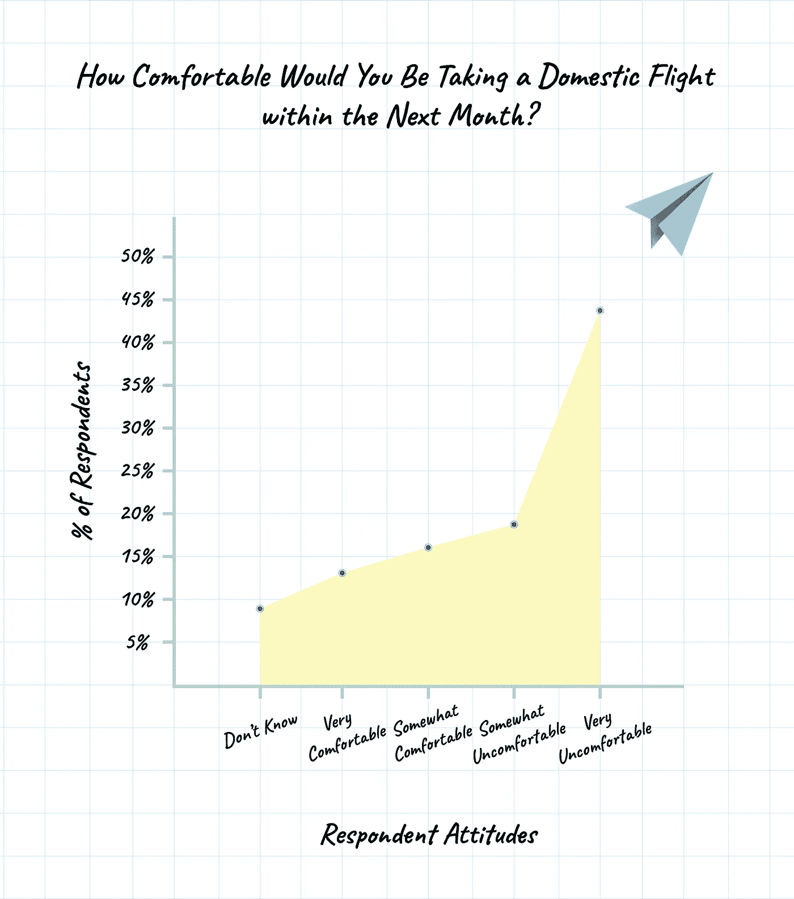
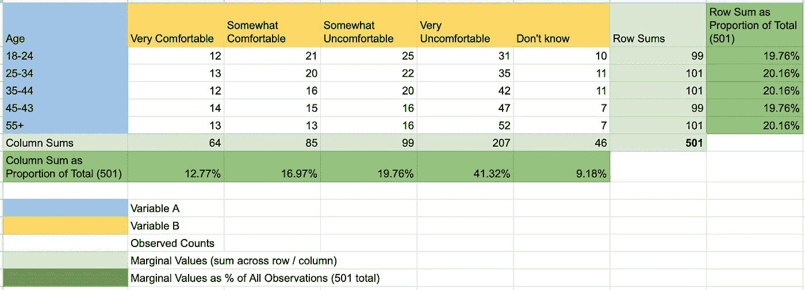
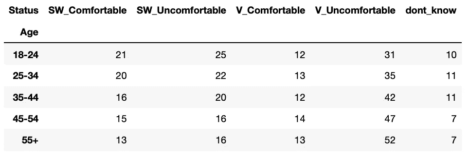
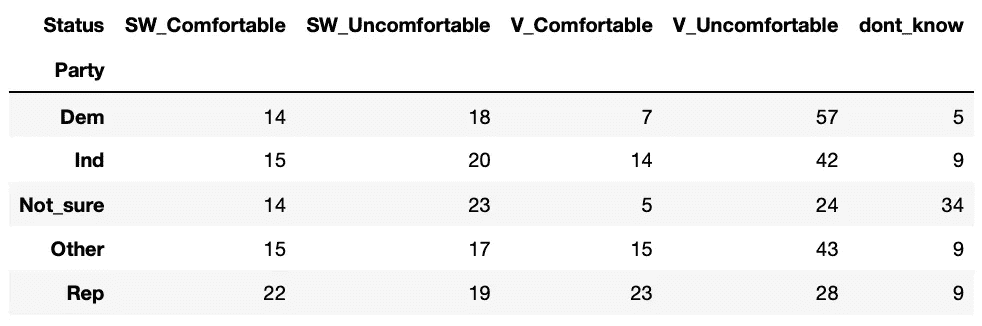
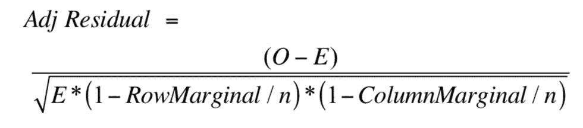
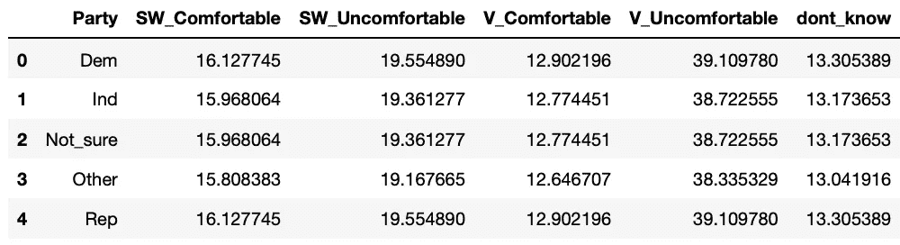
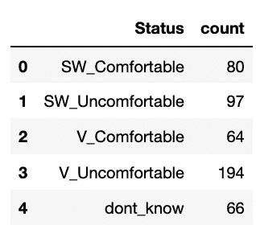
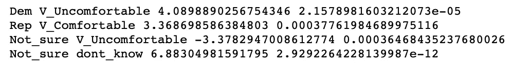

# 如何用卡方检验分类变量之间的统计显著性关系

> 原文：<https://towardsdatascience.com/how-to-test-for-statistically-significant-relationships-between-categorical-variables-with-chi-66c3ebeda7cc?source=collection_archive---------7----------------------->

不久前，我在为公司发布的一项调查分析市场研究数据，以评估客户对新产品创意的看法。许多变量都是分类的(即男性、女性，这些特征中哪一个最有吸引力/最没有吸引力)，经过一些初步研究后，我决定独立性的卡方检验是辨别人口中的某些群体更喜欢或不喜欢某个特征的最佳方式。

然而，我注意到许多实现事后测试的教程都是用 SPSS 或 R 编写的，几乎没有 Python 的原生包。这启发我编写了一个 Python 教程，用于独立性卡方测试和事后测试，以了解哪些类别是重要的和关系方向性的(即更可能或更不可能需要某个特性)。

# **数据集&研究问题**

为了证明这一点，我将使用[的一项调查结果](https://today.yougov.com/topics/travel/survey-results/daily/2020/06/25/013a4/3)，8415 名美国人对他们在下个月乘坐国内航班的舒适度进行了评估。



我制作了一个有趣的可视化工具来总结调查反馈。如你所见，大多数人不会在下个月登机(63%的受访者对这个想法有些不舒服或非常不舒服)。作者照片。

他们的调查结果允许我按年龄和政治派别来划分，所以我的两个研究问题是:

1.  年龄组会影响对飞行的态度吗？如果有，如何实现？
2.  政治倾向会影响对飞行的态度吗？如果有，如何实现？

# **对独立性进行卡方检验**

卡方检验工作原理的简短解释是，首先假设零假设，变量 A(即年龄)和变量 B(即 ATF)之间没有关系。根据变量的分布计算每个单元格的期望值，并与观察值进行比较。这里的假设是，观察值的任何变化都来自数据的分布，而不是任何潜在的关系。



年龄组与飞行态度的关联表。作者照片。

例如，让我们计算 18-24 岁之间选择“非常舒适”的受访者的期望值 19.76%的受访者年龄在 18-24 岁之间，12.77%的受访者表示他们对即将乘坐飞机感到非常舒服。

期望值= 19.76% x 12.77% x 501(所有观测值)= 12.64。所以在这种情况下，观察值几乎与期望值完全一致。

观察值和期望值之间的差异用于计算卡方统计量，卡方统计量与自由度一起用于确定观察值和期望值之间的差异是否显著，或者是否由采样误差引起。([点击](https://www.youtube.com/watch?v=zOvUQWOzTlc)了解卡方测试的更多细节)。

我决定先解决年龄和 ATF 之间的关系。我透视我的数据集来创建一个列联表，这是被`chi2_contingency` SciPy 方法接受的格式。

```
import pandas as pd
import numpy as np
from scipy.stats import chi2_contingency
from scipy.stats import norm
import math# Reading in my csv with age and attitudes towards flyingraw_df = pd.read_csv(“age_flying.csv”)# Pivoting the dataframe and assigning Age as the index, Status as the column headings, and percentage of respondents as the valuespivot_df = raw_df.pivot(index=’Age’, columns=’Status’, values=’Percentage’)
```

此时，我的数据框架如下所示:



我没有发现比该单元的预期值特别高或特别低的地方，但是我决定进行测试以防万一。

```
chi2, p, dof, ex = chi2_contingency(pivot_df, correction=False)
print(chi2, '{:.10f}'.format(p))
```

我的输出是`14.885706463917337 0.5330249996`，这意味着我的 p 值是 0.53，我未能拒绝零假设(H₀:年龄和对下个月飞行的态度之间没有关系)。

我继续我的下一个研究问题，调查政治派别和 ATF 之间是否有关系。



表明政治关系和飞行态度之间关系的数据透视表。在即兴演讲中，似乎民主党人更有可能对飞行感到非常不舒服，而共和党人在所有类别中的分布更加均匀。

我运行了上面列出的相同过程，但是这次卡方测试的输出是`79.59995957590428 0.0000000002`。我的 p 值大大低于普遍接受的 0.05 阿尔法值，这意味着我们在业务！

# 事后测试

在这一点上，我所知道的是在政治派别和 ATF 之间有某种统计学上的显著关系。事后测试将使我能够理解哪些类别有助于实现这种意义，以及如何实现。

我的流程是:

1.  对于政治派别和 ATF 的每个组合，计算观察值和期望值之间的调整标准化残差。标准化残差是 z 分数的另一个名称。调整意味着我针对列和行之间的不同频率计数进行调整。
2.  计算 z 得分的 p 值，这将告诉我观察值和期望值之间的差异的可能性有多大
3.  应用 p 值校正以解决在同一数据集上运行多个测试的问题，这通常会导致类型 1 错误。

计算调整后标准化残差的公式如下:



observed-Expected/sqrt(Expected x (1-(预期/行合计))x(1-(预期/列合计))。图片来自[唐纳德·夏普](https://scholarworks.umass.edu/cgi/viewcontent.cgi?article=1269&context=pare)，理论来自[艾伦·阿格莱斯蒂](https://dl.uswr.ac.ir/bitstream/Hannan/130987/1/Alan_Agresti_An_Introduction_to_Categorical_Data_Analysis_Wi.pdf)

首先，我将数据透视表转换回常规数据框架。我这样做是因为数据透视表功能较少，而且我不能通过名称访问列或行。

```
observed_vals = pivot_df.reset_index(drop=True)
observed_vals = observed_vals.rename_axis(None, axis=1)
observed_vals.set_index([["Dem", "Ind", "Not_sure", "Other", "Rep"]], inplace=True)
observed_vals = observed_vals.reset_index()
observed_vals.rename(columns={"index": "Party"}, inplace=True)
```

接下来，我用期望值创建了一个新的 dataframe。幸运的是，`chi2_contingency`方法输出了一个期望值数组。

```
expected_vals = pd.DataFrame(ex)
expected_vals.set_index([["Dem", "Ind", "Not_sure", "Other", "Rep"]], inplace=True)
expected_vals = expected_vals.reset_index()
expected_vals.rename(columns={"index": "Party", 0: "SW_Comfortable", 1:"SW_Uncomfortable", 2:"V_Comfortable", 3:"V_Uncomfortable", 4:"dont_know"}, inplace=True)
```



假设零假设的期望值表

然后，我为行方式总计和列方式总计创建了两个表。这些值是等式的*(1-row marginal/n)*(1-column marginal/n)*部分中的 *n* 。

```
# Creating a column-wise sum table, adding back the column with party namescol_sum = pd.DataFrame(observed_vals.sum(axis=1), columns=["count"])
col_sum.insert(0, "Party", ["Dem", "Ind", "Not_sure", "Other", "Rep"], True)# Creating a row-wise sum tablerow_sum = pd.DataFrame(observed_vals.iloc[:,1:].sum(axis=0), columns=["count"]).reset_index()
row_sum.rename(columns={"index":"Status"}, inplace=True)
```



row_sum 的输出示例，包含每个状态的原始计数。

此时，我已经获得了开始计算调整后标准化残差所需的所有信息(试着快速地说 10 遍)。我写了一个脚本来迭代政治归属和 ATF 的每个组合，并计算调整后的标准化残差和伴随 p 值。

我对 p 值应用了 [Bonferroni 校正](https://www.youtube.com/watch?v=rMuNniCTsOw)，这将我的 p 值阈值降低到 0.002，以拒绝零假设(0.05 / 25 比较)。当在同一个数据集上进行多个测试时(在我的例子中是 25 个)，应用 p 值校正，这增加了假阳性的机会。

```
# Find all the unique political parties for pairwise comparison
parties = list(raw_df["Party"].unique())# Find all the unique attitudes towards flying for pairwise comparison
status = list(raw_df["Status"].unique())# Iterate through all combinations of parties and status
for p in parties:
    for s in status:
        observed = float(observed_vals.loc[observed_vals.Party == p][s].values[0])
        expected = float(expected_vals.loc[expected_vals.Party == p][s].values[0])
        col_total = float(col_sum[col_sum["Party"] == p]["count"].values[0])
        row_total = float(row_sum[row_sum["Status"] == s]["count"].values[0])
        expected_row_prop = expected/row_total
        expected_col_prop = expected/col_total
        std_resid = (observed - expected) / (math.sqrt(expected * (1-expected_row_prop) * (1-expected_col_prop)))
        p_val = norm.sf(abs(std_resid))
        if p_val < 0.05/25:
            print(p, s, std_resid, p_val)
```

你们所有人可能都对双 for 循环感到畏缩，但是*无论如何*——它完成了工作，好吗？我将脚本配置为只打印 p 值小于校正后的 p 值的关系，以下结果在 p < 0.002 处具有统计显著性:



# 结论和建议

在本文中，我简要介绍了进行独立性卡方测试和事后测试的过程，主要关注技术实现。然而，我认为理解实现背后的理论对于调试和解释结果是至关重要的，所以我链接了一些我个人认为有用的资源，以便您可以在必要时查看。

让我们回到我最初的两个研究问题，看看我们挖掘出了什么结论:

1.  **年龄组是否影响对飞行的态度(ATF)？如果有，如何实现？**否
2.  政治派别会影响人们对飞行的态度吗？如果有，如何实现？是的，而且意义重大！与平均水平相比，民主党人更有可能拥有“非常不舒服”的 ATF，共和党人更有可能拥有“非常舒服”的 ATF。与平均水平相比，不确定其政治归属的人不太可能拥有“非常不舒服”的 ATF，但更有可能选择“不知道”

我发现最后一个观点非常有趣——没有强烈政治背景的人更有可能对飞行没有看法。一种可能的解释是，受访者只是轻松地回答了问题，并没有在回答中花太多心思，这导致他们选择了最中性的答案(即不确定、不知道)。

另一个更有趣的解释可能是，参与政治的人更有可能看新闻，并经常消费关于时事的媒体。由于许多媒体都在关注新冠肺炎，了解最新消息的人将会接触到更多权威人士之间的辩论，这些权威人士对疫情的最佳做法(即公共卫生和安全协议、旅行禁令)有强烈的意见。相反，那些没有强大政治背景的人可能比他们的党派同僚更少关注，因此在如何更好地处理旅行的问题上也不会有太大的分歧。

然而，在这一点上，这纯粹是我的猜测。现在由你们来计算我的假设的调整后标准化残差，并让我知道我是否正确😉