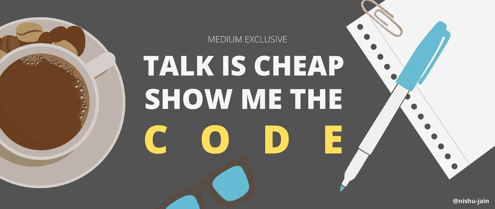
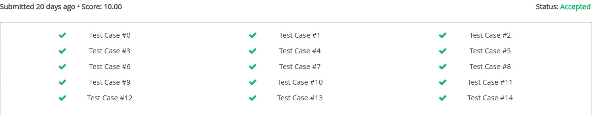

# 我如何用“一行代码”彻底摧毁了这个挑战

> 原文：<https://towardsdatascience.com/how-to-think-like-a-competitive-coder-146918397a1c?source=collection_archive---------49----------------------->

## 编程；编排

## 三思而后行，编码一次——像专家一样解决“最大化游戏”问题



来源:图片由作者提供(引自 Linus Torvalds)

最近我参加了一个由[hacker rank](https://www.hackerrank.com/hackerrank-hackfest-2020/)(hacker fest 2020)举办的比赛，在那里我遇到了一个问题叫做 ***“最大化的游戏”。*** 而我只用**一行代码就解决了！**

*如何？让我给你展示一下…*

我用这个问题作为例子来描述“*在解决一个竞争性的编码挑战*时，你应该如何思考”；如何写出更好的算法，更快。

对我来说，竞争性编码是一种艺术形式(就像[模糊编程](https://en.wikipedia.org/wiki/Obfuscation_(software)))，一个人试图用最少的代码最有效地解决一个给定的问题。

> 通常，代码越少=效率越高

> 记住这一点，我将从初学者可以理解的代码开始，然后一步一步地进一步改进它，达到专业水平。每次都向你解释我的方法。

所以让我们开始吧！

# 问题是

先看看问题陈述:—


来源:图片由作者提供(问题截图)

正如你所看到的，你需要从奇数位置的石堆和偶数位置的石堆中挑选相同数量的石头；同时挑选不超过相应堆中可用石头数量的石头。

暂停一下，用一秒钟思考一下。

我们将构建一个名为***maximum stones***的函数，它将接受一个整数数组 ***arr，*** 代表每堆中的石头数量。并返回一个整数，代表您可以选择的最大宝石总数。

为了简单和更快的开发，我将使用 Python。

你认为你需要多少行代码来解决这个问题？

# 第一次迭代——新手方法

不要试图根据问题的类型来识别问题。可能是贪心问题，也可能是来自动态编程的问题，**我们不管**。让它自然地来到你身边。

如果我们完全按照问题陈述中所写的去做，我们将得到这样的代码:

来源:作者代码

不要被它吓倒。其实很简单。

## 代码解释

这里，我们已经预先分别在变量*和 ***b*** 中计算了奇数排和偶数排中的石头数量的总和。然后，我们进行循环，直到两者之差(*和 ***b*** )，在变量*c 中，变为零，也就是说，直到 ***a == b.******

**在每次迭代中，我们看到哪些桩需要修改。如果奇数位置的堆( ***a*** )有更多的石头( ***c*** > 0)，那么我们将从那些堆中减去石头，否则，从偶数位置的堆中减去。**

**我们需要减去多少颗石头？ ***c 颗石子的数量*****

**在每次减法的同时，我们需要确认是否能减去整堆(if***picks[k]-c>0***)；以及 ***c==0*** 与否。**

**很简单。对吗？**

> ****结果:**14 个测试用例中有 13 个通过(一个错误答案)**

**那么我们如何识别错误呢？**

# **第二次迭代—减少代码**

**识别代码冗余和未使用的循环，并消除它们。**

> **代码越少=错误越少**

**你自己看吧:—**

**来源:作者代码**

## **代码解释**

**在我们的例子中， *while-loop* 没有任何用途，基本上只运行一次。一旦我们确定了 ***c、*** 的值，我们只需要从那些对应的桩(奇数桩或偶数桩)中减去石头。**

**正如你在我们之前的代码中看到的，我们在两个 *for 循环*中写了同样的东西两次。所以我们也可以用一个决定元素选择的条件来去除它——**

```
**idx = range(1,n,2) if c<0 else range(0,n,2)**
```

> ****结果:**没有改进(因为我们只删除了不必要的代码)**

# **第三次迭代——重新定义问题**

**现在，既然你已经走了这么远，你已经掌握了我们正在做的事情的逻辑。但问题是，我们真的需要做所有这些来得到我们想要的吗？**

**如果你仔细思考这个问题，你会发现，我们不需要一次从一堆石头中减去一颗。事实上，我们根本不需要这么做。因为每次我们减去那些石头，我们基本上是在从一堆石头中减去。**

**从数学上讲，**两者是等价的**。**

**所以如果我们已经计算出了差值(abs **( *c* )** ，那么我们可以直接从整个数组的和 ***arr*** 中减去它。**

**来源:作者代码**

**我们可以像这样进一步简化它…**

```
**def maximumStones(arr):
    return sum(arr) - abs(sum(arr[::2]) - sum(arr[1::2]))**
```

**所以我们在这里，作为我们最终答案的单行代码是—**

****sum(arr)—ABS(sum(arr[::2])—sum(arr[1::2]))****

> ****结果:** 14 个测试用例中有 14 个通过(成功！)**

****

**来源:作者图片(投稿截图)**

# **外卖—**

**不要一看到问题就急于解决。花几分钟思考一下，因为不是每个问题都需要你直截了当地思考。**

**有些问题要你跳出框框思考。全新的视角；一个重要的知识可以为你节省大量的编码和调试时间。**

**有几条经验法则你需要记住—**

*   **尽可能地减少代码**以提高效率和减少错误。使用内置库，去除冗余，尽可能减少循环次数。****
*   **当你不能再做了，问题仍然存在时，**改变方法**。不要让 ***而不是*** 依附于你现在已经编写好的程序。重新定义问题——抽象地、数学地思考。**

**显然，竞争性编程的内容比我在本文中所能涵盖的要多。随着你获得更多的经验，所有的提示和窍门都会来到你面前。但目前就这些了。我希望你喜欢这篇文章。**

**编程快乐！**

****你可能会喜欢的其他精彩文章—****

**[](/mathematics-of-music-in-python-b7d838c84f72) [## 如何在 Python 中使用数学来演奏音乐

### 音乐数学

towardsdatascience.com](/mathematics-of-music-in-python-b7d838c84f72) [](https://medium.com/towards-artificial-intelligence/10-game-changing-ai-breakthroughs-worth-knowing-about-b2076afc4930) [## 值得了解的 10 个改变游戏规则的人工智能突破

### 过去几十年中引人入胜的想法和概念

medium.com](https://medium.com/towards-artificial-intelligence/10-game-changing-ai-breakthroughs-worth-knowing-about-b2076afc4930) [](https://medium.com/towards-artificial-intelligence/why-its-super-hard-to-be-an-ml-researcher-or-developer-67fa62fc1971) [## 为什么做一个 ML 研究员或者开发者超级难？

### 这一认识彻底改变了我的生活

medium.com](https://medium.com/towards-artificial-intelligence/why-its-super-hard-to-be-an-ml-researcher-or-developer-67fa62fc1971) [](/how-i-won-a-national-level-ml-competition-with-my-unique-informal-approach-e86fd95532fd) [## 我是如何用我独特的“非正式方法”赢得国家级 ML 比赛的

### 像数据科学黑客一样思考——你不需要遵守规则就能获胜

towardsdatascience.com](/how-i-won-a-national-level-ml-competition-with-my-unique-informal-approach-e86fd95532fd)**