# 如果你来自 Excel，如何看待熊猫数据可视化

> 原文：<https://towardsdatascience.com/how-to-think-of-pandas-data-visualization-if-youre-coming-from-excel-7af9f933e212?source=collection_archive---------22----------------------->

## 构建熊猫数据可视化的心智模型

由 [Unsplash](https://unsplash.com?utm_source=medium&utm_medium=referral) 上的[克里斯托佛罗拉](https://unsplash.com/@krisroller?utm_source=medium&utm_medium=referral)拍摄的照片

读了很多关于熊猫数据可视化的教程，我仍然不能掌握它的机制。即使是创作一个简单的情节也总是需要我查看文档。

即使在运行代码并获得正确的情节后，它也不会让我有信心独自尝试。或许，我在寻找 Excel 的熟悉度。图形和数据之间的联系使用 GUI 似乎很直观。

考虑到这一点，我能以某种方式把它带给熊猫吗？

# Excel 和 Pandas 中的图表

所以我做的就是在 Excel 里画一个简单的线图。考虑以下数据(在此获取[)。](https://github.com/kennethjhim/medium_pandas_data_viz_from_excel)

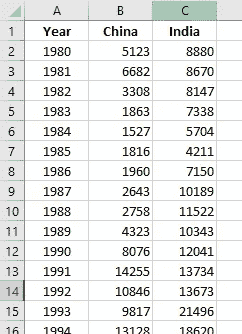

1980-2013 年从中国和印度移民到加拿大的人数

然后，我使用 Excel 的推荐图表功能绘制了一个折线图

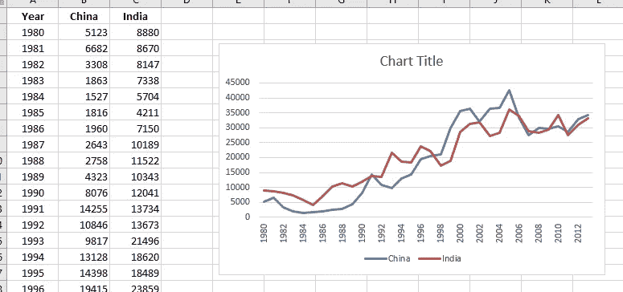

好吧。很好很容易。

同样的数据但是格式不同怎么样？

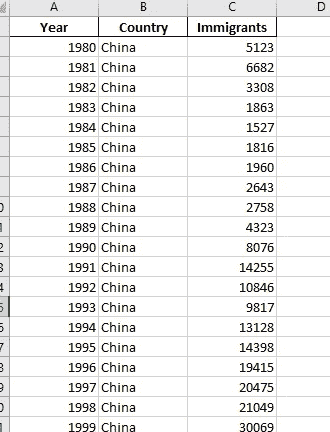

1980-2013 年从中国和印度移民到加拿大的人数(详细)

策划这个..

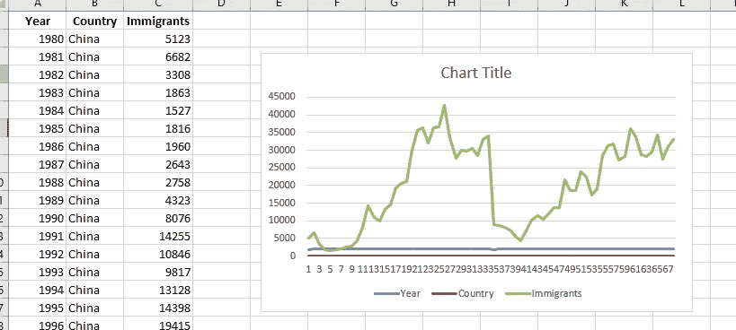

好的。真是一团糟。

熊猫怎么样？让我们绘制第一个数据帧。

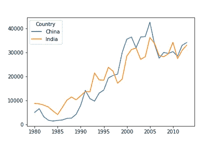

好的。那行得通。

第二个数据帧呢？

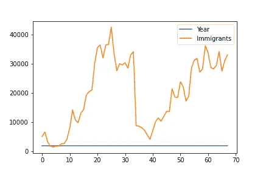

Excel 和 Pandas 显示了两个数据框架的相同绘图。

看来 Excel 和熊猫渲染剧情的方式是一样的！我发现了一些东西。

# 宽格式与长格式数据

我们刚才处理的数据分别是宽格式数据和长格式数据。

两者都是以表格格式存储数据的明智模式；简而言之，区别在于:

*   宽格式数据每个*自变量*有一行，元数据记录在*行和列标签*中。
*   长格式数据在每个*观察*中占一行，元数据作为*值*记录在表中。

这就是我的啊哈！瞬间。

> *宽格式与折线图配合得很好，因为我基本上是针对其元数据(海地和中国系列)绘制一个独立变量(年份)。*

现在，这种思路行得通吗？让我们查出来。

# 用熊猫创造基本情节

现在，让我们试着为我们的宽格式数据创建不同的图来测试我的假设。

**条形图**

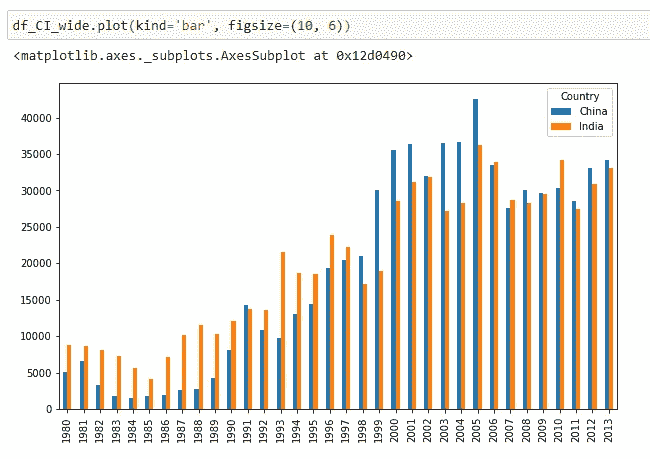

**面积图**

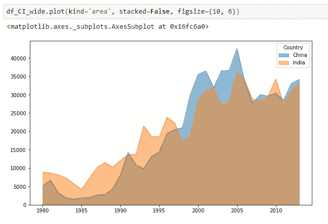

**箱线图**

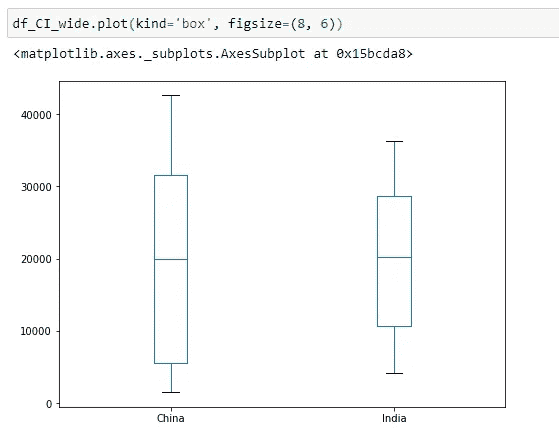

**直方图**

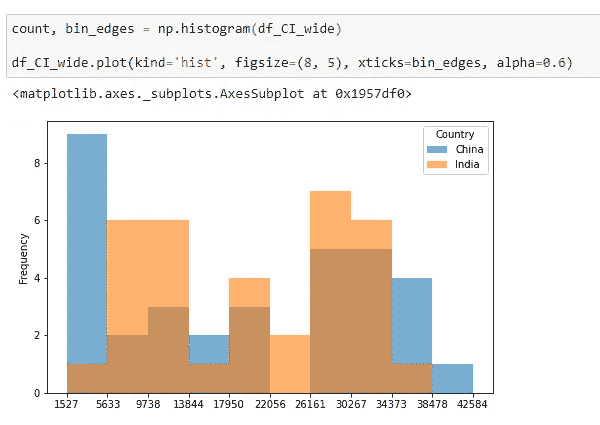

**散点图**

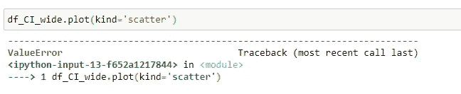

呃？这是怎么回事？

不幸的是，散点图会导致错误。

# 我的第二个顿悟时刻

所以回头看看之前的剧情，现在说得通了。

> 如果你在绘制一个独立变量的多个序列，那么你可以使用宽格式。否则，请使用长格式。

让我们再次测试这个假设，看看它是否成立。让我们做一个散点图。

**散点图**

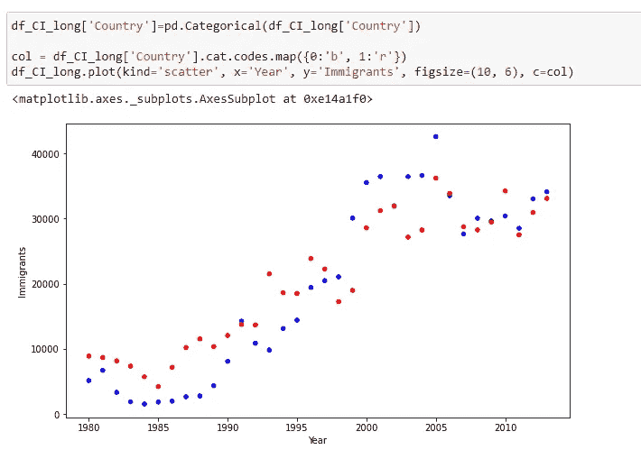

万岁！那行得通。

因此，我真的不是在散点图中比较两个系列，而是在绘制观察结果以查看它们的分布。颜色是可选的，没有它我也能做到。

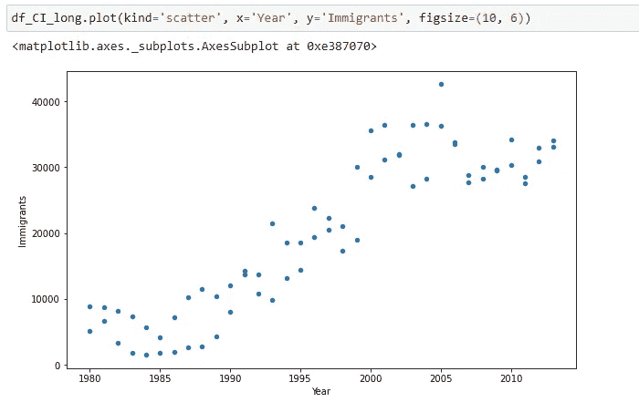

# 但是还有其他的图书馆…

我选择将这里讨论的绘图限制在 DataFrame 的`plot`方法。

当您刚接触来自 Excel 的 Pandas 时，您希望快速评估是否可以复制您在 Excel 中使用的常用图表，以保证 Pandas 的切换和连续使用。

此外，有效的数据分析依赖于绘图的快速创建；绘制这个，操纵数据，再次绘制，等等。因此，如果我试图在这里结合不同的绘图方法，你会陷入困境。

> 将此作为应用于可视化的帕累托原则——你只需要知道 20%的绘图技术就可以获得生产力。

# 结论

总的来说，当您比较或绘制同一个索引的多个序列时，宽格式的数据非常有用。否则，最好坚持使用长格式。

这里的工作流程是，您需要首先以正确的形式获得数据，以获得所需的绘图，该绘图首先规定了正确的格式。

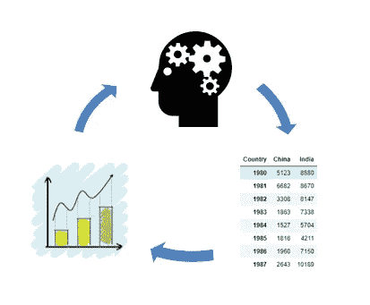

数据、图和你之间的反馈回路。(freesvg.org 的大脑齿轮图标和 needpix.com 的情节图标)

只有这样，你才能设计或添加元素到情节中，使其更具吸引力。

这和 Excel 做数据可视化的时候很像。你必须首先获得正确的数据，Excel 才能给出正确的图表，而不需要花里胡哨。然后你改变图表元素，添加标题等。让它更有效。

与阅读大量关于 Pandas 数据可视化的教程不同，拥有一个数据如何对应于情节的心理模型会使数据可视化更有趣。你的心智模型和工具之间的反馈循环使得学习更加有效。

就是这样！编码快乐！

***感谢您阅读我的文章。关注我上*** [***推特***](https://twitter.com/iamkennethcpa) ***和*** [***领英***](https://www.linkedin.com/in/kennethinfante/) ***。***

***还我书*** [***PowerQuery 熊猫指南***](https://leanpub.com/powerqueryguidetopandas) ***上***[***lean pub***](https://leanpub.com/powerqueryguidetopandas)***。***