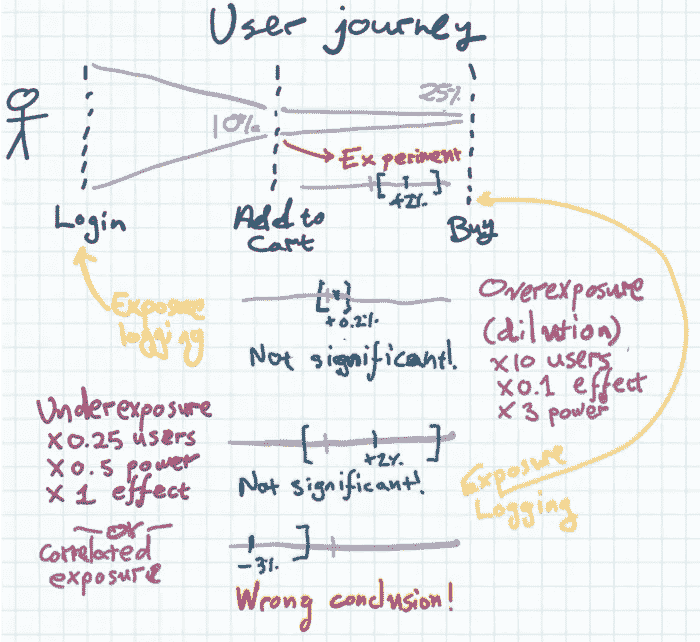

# 如何在裁员后茁壮成长

> 原文：<https://towardsdatascience.com/how-to-thrive-after-a-layoff-4847335a9257?source=collection_archive---------55----------------------->

帕特里克·福尔在 Unsplash 上的照片

## [如何在充满挑战的时期从裁员中幸存并茁壮成长](/how-to-survive-a-layoff-during-challenging-times-and-thrive-3b9ee2f9af24)

由[彭慧琳](https://medium.com/u/f4a64ff38660?source=post_page-----4847335a9257--------------------------------) — 10 分钟读完

2020 年 5 月 5 日，我从之前的公司下岗了。2020 年 6 月 30 日，我签下了另一家让我非常兴奋的公司的聘书。我写这篇文章是为了分享我和我的一些同事在全球疫情中从被解雇到找到一份新工作的经历。我希望它能对正在经历裁员的人有所帮助和鼓励。

## [在你与你的团队分享你的实验结果之前，检查这 4 件事](/check-these-4-things-before-you-share-your-experiments-results-with-your-team-16dac876f435)

通过 [Nimrod Priell](https://medium.com/u/b61f3817c590?source=post_page-----4847335a9257--------------------------------) — 7 分钟读取

经典的实验文献默认实验将运行一次，所有参与者一起到达，并被记录和管理治疗。Web 实验(A/B 测试)在一段时间内收集用户，分别记录暴露和处理，并连续运行。这就产生了一些陷阱——下面是如何测试它们的方法。

## [调和因果关系和统计数据](/reconciling-causality-and-statistics-1dfa4ce1b465)

由 Pirmin Lemberger — 32 分钟读取

考虑以下三对伴随事件:“*太阳在公鸡第一声啼叫后不久升起”*，“当广告横幅出现在某个适当的位置时，某个网站的访问量往往会增加”,以及“*皮肤癌的发病率与法国里维埃拉的冰淇淋销量相当*”。

## [不要过度规划您的数据可视化](/dont-over-plan-your-data-visualization-737c7330d80f)

奥斯卡·科科尔——11 分钟阅读

这篇文章的标题很容易以“10 大经验”或“5 个简单的步骤”开始。我们，处理数据的人，喜欢遵循某种框架或实验测试的方法。但是想出一个用于数据可视化的将是一个很大的挑战。

## [使用 PCA 进行股票市场分析](/stock-market-analytics-with-pca-d1c2318e3f0e)

由[姚](https://medium.com/u/729179a4eefe?source=post_page-----4847335a9257--------------------------------) — 6 分钟读完

主成分分析(PCA)是一种强大的数据分析工具，用于机器学习的许多领域。然而，尽管它的多功能性和有效性，它在金融中的应用并没有被广泛讨论。今天，我将谈论 PCA 如何用于股票市场，它如何与资本资产定价模型(CAPM)相关，以及我们如何使用 PCA 来分析 COVID19 的影响。

*我们的每日精选将于周一回归！如果你想在周五收到我们的* [*每周文摘*](/receive-our-newsletters-681049ffa0cf) *，很简单！跟随* [*我们的出版物*](http://towardsdatascience.com/) *，然后转到您的设置，打开“接收信件”您可以在此* *了解有关如何充分利用数据科学* [*的更多信息。*](/how-to-get-the-most-out-of-towards-data-science-3bf37f75a345)