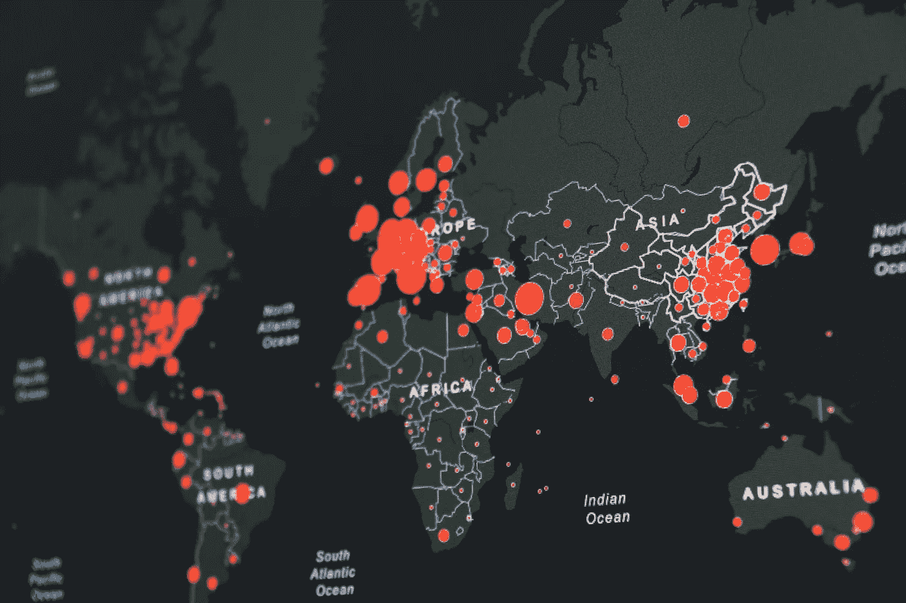
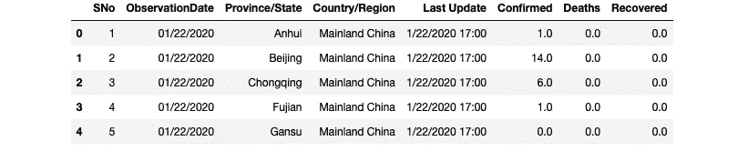
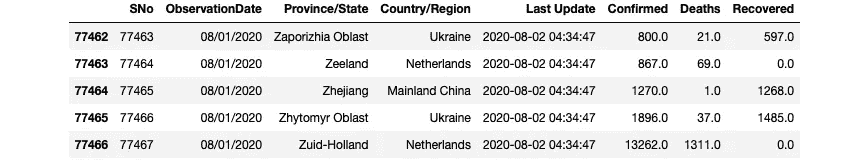
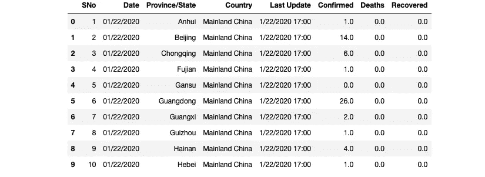
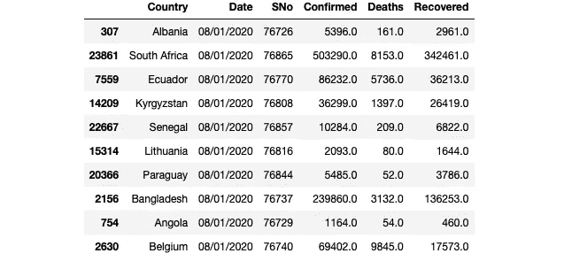
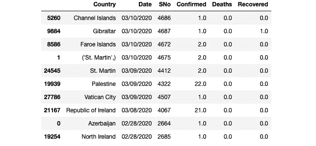
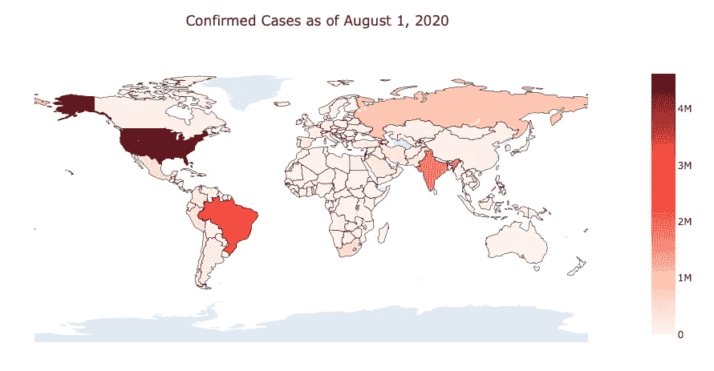
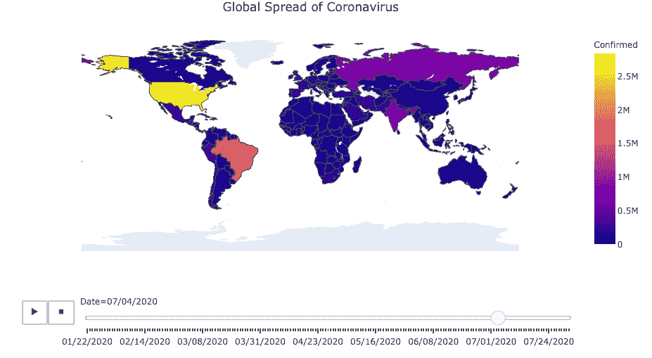

# 如何使用真实数据追踪冠状病毒的传播

> 原文：<https://towardsdatascience.com/how-to-track-coronavirus-spreading-using-real-data-dba64211b483?source=collection_archive---------51----------------------->

## 使用 Plotly 实现时间轴数据可视化的分步指南



马丁·桑切斯在 [Unsplash](https://unsplash.com/s/photos/virus-map?utm_source=unsplash&utm_medium=referral&utm_content=creditCopyText) 上的照片

在这篇文章中，我将向你展示如何使用冠状病毒病例数据创建一个交互式地图。随着数字开始再次上升，我想创建一个全球世界地图，看看如何继续蔓延到世界各地。我在 Kaggle 上发现了大量的全球病例数据，我将在下面添加数据链接。如果你没有听说过 Kaggle，Kaggle 是世界上最大的数据科学社区，拥有强大的工具和资源来帮助你实现数据科学目标。

数据可视化在表示数据方面起着重要的作用。创建可视化有助于以更容易理解的形式呈现您的分析。尤其是在处理大型数据集时，很容易迷失方向，这时我们就可以看到数据可视化的威力了。我们开始吧！

## 目录:

*   Plotly
*   理解数据
*   数据预处理
*   数据可视化
*   交互式地图视频

# Plotly

Plotly 是一个 Python 图形库，可以制作交互式的、出版物质量的图形。如何制作折线图、散点图、面积图、条形图、误差线、箱线图、直方图、热图、支线图、多轴图、极坐标图和气泡图的示例。它也是一个开源库。

了解更多关于 Plotly 的信息: [Plotly 图形库](https://plotly.com/python/)

# 理解数据

该数据集具有关于 2019 年新型冠状病毒的受影响病例数、死亡数和恢复数的每日水平信息。请注意，这是一个时间序列数据，因此任何一天的病例数都是累计数。

确诊病例数据可以从 [**这里下载**](https://www.kaggle.com/sudalairajkumar/novel-corona-virus-2019-dataset/metadata) 。

数据文件夹包含 8 个数据集文件，但我们将要处理的主文件夹名为“ *covid_19_data.csv* ”，数据集描述如下:

*   **序列号** —序列号
*   **观察日期** —观察的日期，单位为年/月/日
*   **省/州** —观察的省或州(缺少时可以为空)
*   **国家/地区** —观察国
*   **Last Update** —以 UTC 表示的给定省份或国家更新行的时间。(未标准化，因此请在使用前清洁)
*   **确诊** —当日累计确诊病例数
*   **死亡人数** —截止到该日期的累计死亡人数
*   **已恢复** —到该日期为止已恢复案例的累计数量

对于这个项目，这是建立一个交互式地图，我们将重点放在国家和确认列。我们将在数据预处理步骤中进行过滤。让我们导入数据并研究它。

## 图书馆

我们需要三个主要的库来开始。当我们谈到可视化时，我会要求您导入更多的子库，也称为库组件。现在，我们将导入以下库:

```
import numpy as np
import pandas as pd
import plotly as py
```

如果您没有这些库，也不用担心。安装它们非常容易，只需在您的终端窗口中写下下面一行:

```
pip install numpy pandas plotly
```

## 读出数据

```
df = pd.read_csv("data/corona/covid_19_data.csv")df.head()
```



头

```
df.tail()
```



尾巴

# 数据预处理

数据科学更多的是理解数据，数据清洗是这个过程中非常重要的一部分。什么让数据更有价值，取决于我们能从中获得多少。做好数据准备会让你的数据分析结果更加准确。

让我们首先重命名这两列:ObservationDate 和 Country/Region。我们将使用一个名为“重命名”的熊猫方法。

```
# Rename columns
df = df.rename(columns={'Country/Region':'Country'})
df = df.rename(columns={'ObservationDate':'Date'})df.head(10)
```



头

太好了！列名被更新。我们没有重命名其他列，因为我们不会在可视化中使用它们。现在，是时候进行数据过滤了。对于这一步，我们将使用几种方法。其中两个是 Pandas 方法:groupby 和 drop_duplicates。第三次过滤将使用比较运算符。

```
# Manipulate Dataframe
df_countries = df.groupby(['Country', 'Date']).sum().reset_index().sort_values('Date', ascending=False)# Drop Duplicates
df_countries = df_countries.drop_duplicates(subset = ['Country'])# Filter by Confirmed number
df_countries = df_countries[df_countries['Confirmed']>0]
```

*   在第一行中，我们按照国家和日期列进行分组。sum 函数帮助我们对确诊病例进行求和。然后我们按照日期值对它们进行排序。
*   在第二行，我们删除了重复的国家值(如果有的话)。否则，当我们处于数据可视化步骤时，它可能会导致问题。
*   在第三行，我们正在筛选确诊病例。我们正在获取确认值大于零的行。

完美！现在，让我们看看我们的数据框架。顺便说一下，我们的新数据框架叫做“df_countries”，我们在下面定义了它。在接下来的步骤中，我们将继续使用新的数据帧。

```
df_countries.head(10)
```



头

```
df_countries.tail(10)
```



尾巴

# 数据可视化

干得好！你已经到达它，直到这里的最后和有趣的部分。我们将添加一些 Plotly 的组件来制作那些很酷的交互式地图情节。然后，我们将创建我们的交互式地图地块。

```
import plotly.express as pximport plotly.graph_objs as gofrom plotly.subplots import make_subplotsfrom plotly.offline import download_plotlyjs, init_notebook_mode, plot, iplot
```

**两张互动地图**:第一张将显示截至 8 月 1 日的确诊病例。第二张图将显示自今年 1 月 22 日以来确诊病例的增加。

## 最新确诊病例数

```
# Create the Choropleth
fig = go.Figure(data=go.Choropleth(
 locations = df_countries['Country'],
 locationmode = 'country names',
 z = df_countries['Confirmed'],
 colorscale = 'Reds',
 marker_line_color = 'black',
 marker_line_width = 0.5,
))fig.update_layout(
 title_text = 'Confirmed Cases as of August 1, 2020',
 title_x = 0.5,
 geo=dict(
 showframe = False,
 showcoastlines = False,
 projection_type = 'equirectangular'
 )
)fig.show()
```



结果

## 冠状病毒的全球传播

```
# Manipulating the original dataframe
df_countrydate = df[df['Confirmed']>0]
df_countrydate = df_countrydate.groupby(['Date','Country']).sum().reset_index() # Creating the visualization
fig = px.choropleth(df_countrydate, 
 locations="Country", 
 locationmode = "country names",
 color="Confirmed", 
 hover_name="Country", 
 animation_frame="Date"
 )fig.update_layout(
 title_text = 'Global Spread of Coronavirus',
 title_x = 0.5,
 geo=dict(
 showframe = False,
 showcoastlines = False,
 ))

fig.show()
```



结果

# 冠状病毒视频的全球传播

感谢你阅读这篇文章，我希望你喜欢并且今天学到了一些新的东西。如果您在执行代码时有任何问题，请随时通过我的博客联系我。我非常乐意帮忙。你可以找到更多我发表的与 Python 和机器学习相关的帖子。保持安全和快乐的编码！

*我是贝希克·居文，我喜欢分享关于创造力、编程、动力和生活的故事。*

*跟随* [*我的博客*](https://medium.com/@lifexplorer) *和* [*走向数据科学*](https://towardsdatascience.com/) *以待启发。*

## 更多内容

[](/python-for-finance-the-complete-beginners-guide-764276d74cef) [## 面向金融的 Python 完全初学者指南

### 使用亚马逊股票数据的简单实践

towardsdatascience.com](/python-for-finance-the-complete-beginners-guide-764276d74cef) [](/simple-face-detection-in-python-1fcda0ea648e) [## Python 中的简单人脸检测

### 如何使用 OpenCV 库检测图像中的人脸

towardsdatascience.com](/simple-face-detection-in-python-1fcda0ea648e)