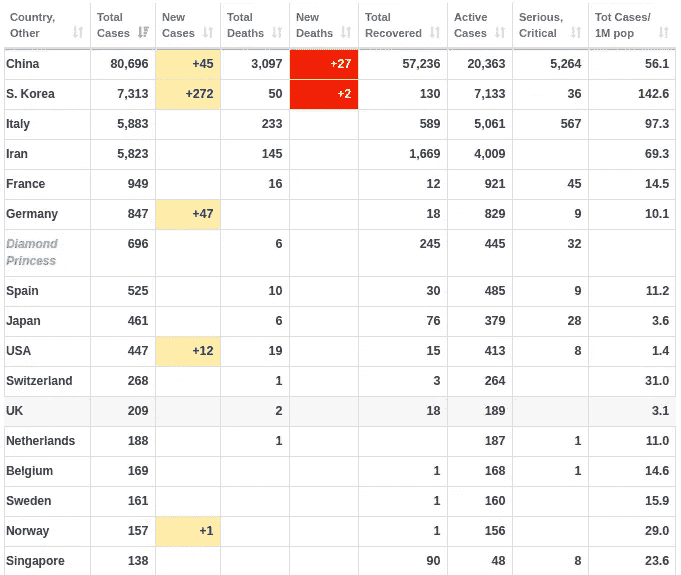
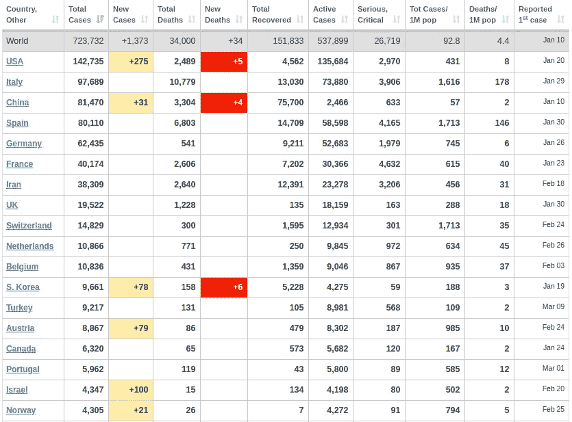
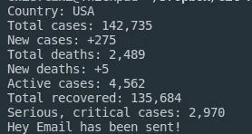
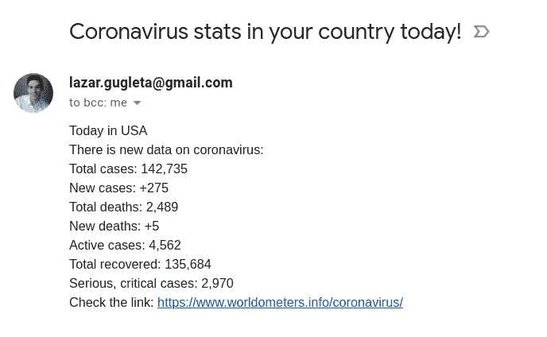

# 如何用 Python 追踪贵国的冠状病毒

> 原文：<https://towardsdatascience.com/how-to-track-coronavirus-with-python-a5320b778c8e?source=collection_archive---------3----------------------->

随着大规模爆发和消息传播速度超过 T2 冠状病毒(新冠肺炎)本身，我们必须(T4)了解影响我们生活地区的实际数据。


由 [Sebastian Herrmann](https://unsplash.com/@officestock?utm_source=unsplash&utm_medium=referral&utm_content=creditCopyText) 在 [Unsplash](https://unsplash.com/s/photos/shock?utm_source=unsplash&utm_medium=referral&utm_content=creditCopyText) 上拍摄的原始照片

*编者按:*[*towardsdatascience.com*](https://slack-redir.net/link?url=http%3A%2F%2Ftowardsdatascience.com)*是一家以数据科学和机器学习研究为主的中型刊物。我们不是健康专家或流行病学家。想了解更多关于疫情冠状病毒的信息，可以点击* [*这里*](https://slack-redir.net/link?url=https%3A%2F%2Fwww.who.int%2Femergencies%2Fdiseases%2Fnovel-coronavirus-2019) *。*

今天，我们将探讨如何利用 Python，以有趣的方式掌握冠状病毒的信息。

我会告诉你如何获得数据，并每天收到关于有多少人受到影响的电子邮件以及类似的信息。

我将要使用一种方法，叫做 [**Web 刮**](/everything-you-need-to-know-about-web-scraping-6541b241f27e) 和工具 [**硒**](/top-25-selenium-functions-that-will-make-you-pro-in-web-scraping-5c937e027244) 和 [**Python**](https://medium.com/swlh/why-is-python-so-powerful-today-190b4661ab) 。

让我们直接投入进去吧！


# 规划流程

首先，我们必须找到从哪里获取数据。我决定用 Worldometers 做这个，只是因为我觉得数据很准确，网站也很好看。

这是一个表格，显示了每个受影响国家的数据，在许多栏中有不同的数据。



因此，我们想要做的是根据您想要获取数据的国家从表中获取数据，并向我们发送电子邮件。


# 设置环境

你将不得不安装一个 chrome 驱动程序，它将使我们能够操作浏览器并向它发送命令以供测试和使用。

打开链接并下载适用于您的操作系统的文件。我推荐**最新稳定版**，除非你已经知道自己在做什么。

接下来，您需要解压缩该文件。我建议进入文件，通过右键单击手动操作，然后单击“Extract here”。


在文件夹里面，有一个名为“chromedriver”的文件，我们必须将它移动到你电脑上的特定文件夹中。

打开终端，键入以下命令:

```
**sudo su** #enter the root mode
**cd**      #go back to base from the current location
**mv /home/*your_pc_name*/Downloads/chromedriver /usr/local/bin** 
#move the file to the right location
```

请插入您的实际电脑名称，而不是*您的电脑名称*。

完成后，我们打开编辑器。我个人选择的是 [Visual Studio 代号](https://code.visualstudio.com/)。它简单易用，可定制，并且对你的计算机来说很轻。

打开一个新项目，创建两个新文件。这是一个我的看起来能帮助你的例子:


Visual Studio 代码—项目设置

在 VS 代码中，有一个“Terminal”选项卡，您可以使用它打开 VS 代码中的内部终端，这对于将所有内容放在一个地方非常有用。

当你打开它时，我们还需要安装一些东西，那就是虚拟环境和用于 web 驱动程序 selenium。在您的终端中键入这些命令。

```
pip3 install virtualenv
source venv/bin/activate
pip3 install selenium
```

激活虚拟环境后，我们就完全**准备好**了。


# 编码

既然我们已经确定了我们想要什么，以及我们将从哪里得到它，我们必须做“**如何**的部分。

我们将把它创建为一个类，并为它创建函数。所以我们开始吧！

用任何名字创建你的工具并启动 Chrome 的驱动程序。

```
class **Coronavirus**():
  def __init__(self):
    self.driver = webdriver.Chrome()
```

这就是我们开始发展所需要的一切。现在转到您的终端并键入:

```
python -i coronavirus.py
```

这个命令让我们把我们的文件作为一个互动的游乐场。浏览器的新选项卡将会打开，我们可以开始向它发出命令。
如果你想试验，你可以使用命令行，而不是直接输入到你的源文件中。只是用**机器人**代替**自身**。

对于终端:

```
bot = Coronavirus()
bot.driver.get('https://www.worldometers.info/coronavirus/')
```

现在来看看源代码:

```
self.driver.get('https://www.worldometers.info/coronavirus/')
```

当我们到了网站，我们需要刮前面提到的表，我们要这样做:

我们将表格作为 Web 元素，并将其保存在“table”下。为了在网页上找到这个元素，我们使用 find_element_by_xpath()并使用定义它的 id 来过滤它。

```
table = self.driver.find_element_by_xpath('//*[@id="main_table_countries_today"]/tbody[1]')
```



在该表中，我们需要获得国家，以确保它是我们最初想要找到的国家。

```
country_element = table.find_element_by_xpath("//td[contains(., 'USA')]")
```

我们再次使用 XPath，并找到我们的示例“USA”。

因为我们需要“USA”旁边的数据，所以我们必须确保它属于该行，这就是为什么我们要从 country_element 中获取父元素。

```
row = country_element.find_element_by_xpath("./..")
```

在那一行中，我们得到了我们需要的所有数据，我们将把那个字符串分成每一列，并保存到变量中。

```
data = row.text.split(" ")
total_cases = data[1]
new_cases = data[2]
total_deaths = data[3]
new_deaths = data[4]
active_cases = data[5]
total_recovered = data[6]
serious_critical = data[7]
```

基本上,“数据”是一个来自字符串分割的列表，然后我们只是将它分散到不同的变量中以备后用。

## 发送电子邮件

我们必须设置电子邮件发送服务器，进入[谷歌账户服务](https://myaccount.google.com/security)并进入“应用程序密码”，在那里你应该生成一个新密码并在这个小脚本中使用它。

我们还为我们将收到的电子邮件制作模板。

```
def send_mail(country_element, total_cases, new_cases, total_deaths, new_deaths, active_cases, total_recovered, serious_critical):server = smtplib.SMTP('smtp.gmail.com', 587)server.ehlo()server.starttls()server.ehlo()server.login('email', 'password')subject = 'Coronavirus stats in your country today!'body = 'Today in ' + country_element + '\\nThere is new data on coronavirus:\\nTotal cases: ' + total_cases +'\\nNew cases: ' + new_cases + '\\nTotal deaths: ' + total_deaths + '\\nNew deaths: ' + new_deaths + '\\nActive cases: ' + active_cases + '\\nTotal recovered: ' + total_recovered + '\\nSerious, critical cases: ' + serious_critical  + '\\nCheck the link: [https://www.worldometers.info/coronavirus/'](https://www.worldometers.info/coronavirus/')msg = f"Subject: {subject}\n\n{body}"server.sendmail('Coronavirus','email',msg)print('Hey Email has been sent!')server.quit()
```

如果你想每天重复这个脚本，请点击这个[链接](https://stackoverflow.com/questions/15088037/python-script-to-do-something-at-the-same-time-every-day)。

> 我们完了！


## 成品



以下是完整的代码:

[](https://github.com/lazargugleta/coronavirusStats) [## lazargugleta/冠状病毒统计

### 追踪你所在国家的冠状病毒数据。通过创建一个……

github.com](https://github.com/lazargugleta/coronavirusStats) 

# 后续步骤

如果你想了解更多关于 Selenium 的功能，这里有[25 大 Selenium 功能，会让你在网络抓取方面更专业](/top-25-selenium-functions-that-will-make-you-pro-in-web-scraping-5c937e027244)。

类似的教程，为了自动化和让好的代码工作，这里有[如何用 Python 省钱](/how-to-save-money-with-python-8bfd7e627d13)和[如何用 Python 做一个分析工具](/how-to-make-an-analysis-tool-using-python-c3e4477b6d8)。

此外，如果你想了解更多关于网页抓取的信息，这里有你需要知道的关于网页抓取的所有信息。

# 临终遗言

在你离开之前提醒一下，确保**时刻注意自己的卫生，尤其是在疫情持续期间，也不要与其他人有太多的身体接触！**

**感谢阅读！**

[](https://medium.com/@lazar.gugleta)

查看我的**其他文章**并在[媒体](https://medium.com/@lazar.gugleta)上关注我

[](https://twitter.com/intent/user?screen_name=LazarGugleta)

当我有新文章时，在推特上关注我