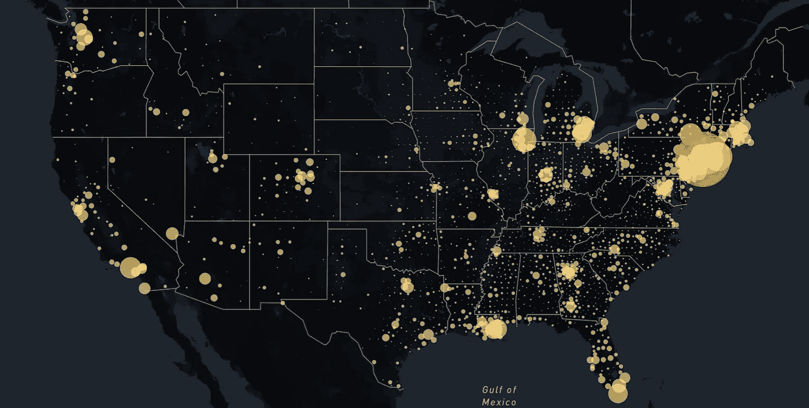
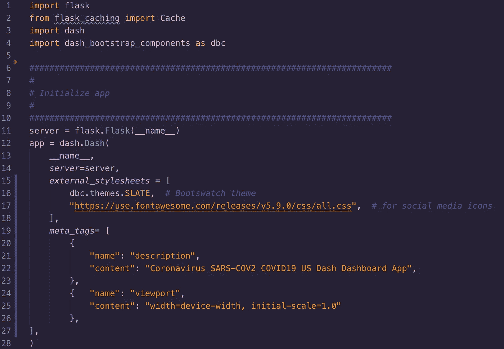
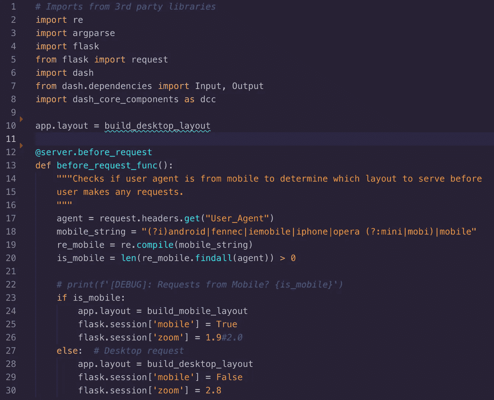
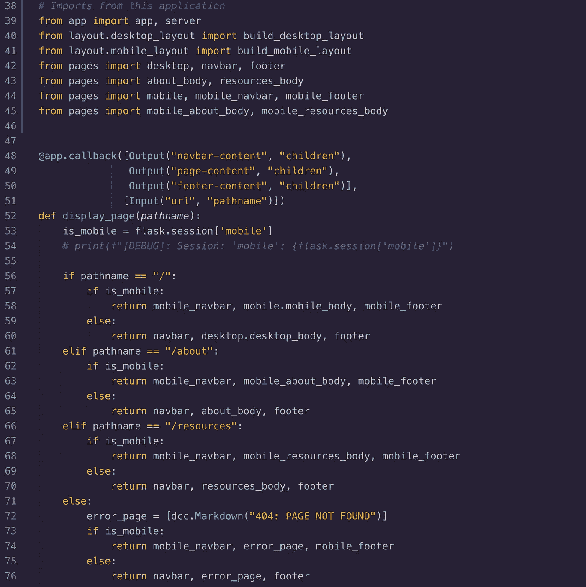
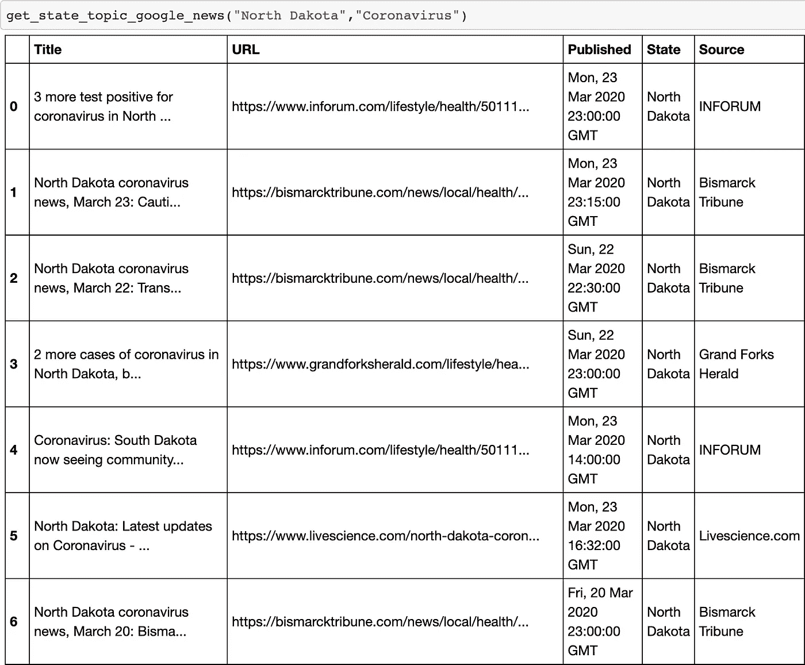
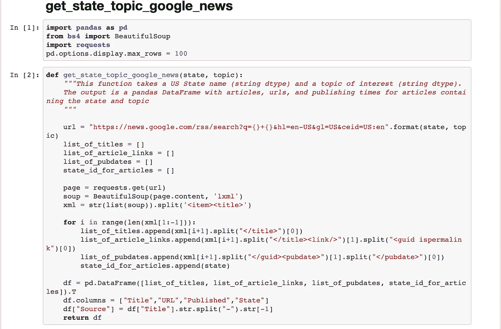
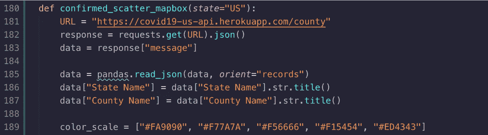
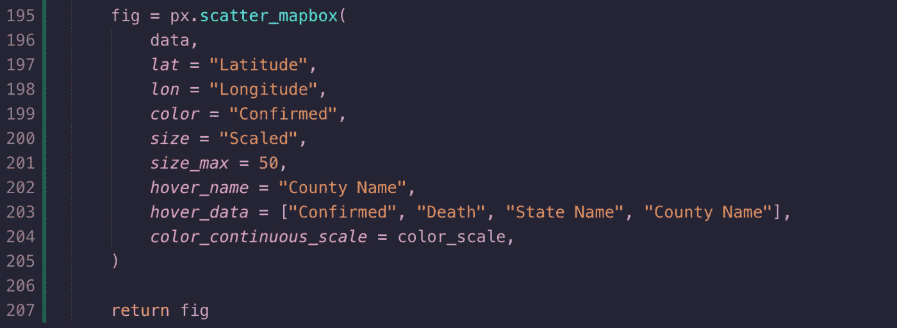
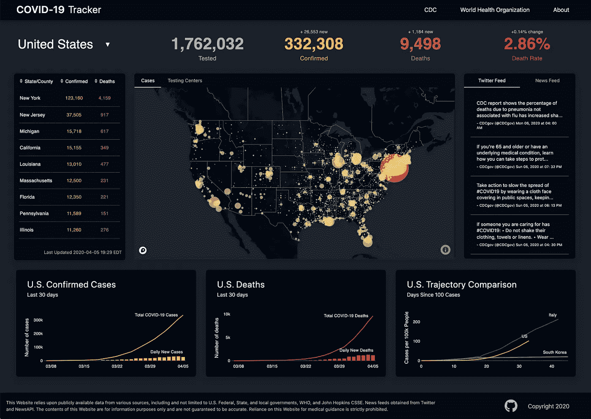

# 用 Python 和 Plotly Dash 构建新冠肺炎仪表板

> 原文：<https://towardsdatascience.com/how-to-track-covid-19-cases-in-the-united-states-in-python-9b297ff9f6f5?source=collection_archive---------5----------------------->

## 使用您自己的分析仪表板跟踪冠状病毒病例



自从美国本土出现第一例新冠肺炎病毒以来，尚不清楚 T2 到底有多少人接触到了这种病毒。幸运的是，从那以后，美国[大大增加了我们的测试能力](https://www.nytimes.com/interactive/2020/03/26/us/coronavirus-testing-states.html)。

但我们仍在追赶。面对[相互矛盾的报告](https://fortune.com/2020/02/24/coronavirus-statistics-who-data-transparency/)确诊病例的数量，**我们的数据科学家和网络开发人员团队建立了一个** [**仪表盘**](http://ncov19.us /) 来显示**我们能够找到的最准确的数据**，以**最干净**的方式。

现在，我们已经完成并发布了我们的仪表板，我们编写了这个高级代码概述，供数据科学家和程序员遵循。

[https://ncov19.us/的演示](https://ncov19.us/)

# 仪表板功能

当我们开始设计上述仪表板时，我们知道我们希望包括以下一些主要功能:

*   美国、所有 50 个州和所有县(加上华盛顿特区和美国属地)的检测、确诊病例和死亡人数*
*   新冠肺炎确诊病例最集中的热图
*   各州公共考试中心的位置
*   主要健康组织通过 Twitter 和他们的网站发布的最新消息

**我们也希望包括已恢复病例的数量，但在此之前，我们正在搜索可靠且准确的数据集。*

# 教程大纲

分解成各个部分，仪表板就是一堆以视觉上吸引人的方式显示的数据集。我们网站上的每个图表、图形和表格都是我们使用 CSS 找到、清理和设计的数据集。

记住这一点，以下是我们将在本教程中涵盖的所有主要步骤:

1.  决定我们的应用程序需要哪些输入(技术堆栈和数据源)
2.  初始化 Plotly Dash web 应用程序
3.  桌面/移动用户的网页路由
4.  为我们的可视化清理数据
5.  将数据显示为图形或图表并设置样式

*(* [*Github 回购如果你想跟进*](https://github.com/ncov19-us/front-end) *)*

# **选择我们的技术组合**

当我们的团队决定使用哪个堆栈时，我们知道如果我们用 Python 编写应用程序，我们的主要目标**清理&显示医疗保健数据**将会最好地完成。我们考虑过用 R 编写应用程序，但是 Flask server / Dash-rendered 前端的易用性吸引了我们的注意。

在这种情况下，我们知道 Plotly Dash 和它的一些库(Dash Core、HTML 和 Bootstrap Components)可以提供我们需要的工具，并节省我们大量的开发时间。最后但同样重要的是，MongoDB 带来了灵活性&托管和缓存数据的可伸缩后端。


# 选择我们的数据源

就数据而言，我们认识到大多数新闻媒体引用了来自[约翰霍普金斯大学系统科学与工程中心](https://github.com/CSSEGISandData/COVID-19)的新冠肺炎患者数据。每日回购。csv 文件是从 17 个不同的全球卫生组织收集的，因此在这些文件和来自 [COVIDTracking](https://covidtracking.com/) 的数据之间，我们的团队对我们的 web 应用程序上报告的数字充满信心。

# 初始化 Plotly Dash Web 应用程序

既然我们的技术栈和库已经解决了，让我们拼凑一些代码吧！第一步:在我们的`/app.py`文件中设计核心应用程序。

## app.py 中的第 1-28 行



首先，我们将导入 Flask(用于我们在第 11 行创建的服务器)，并将 Dash 作为我们的前端应用程序。Dash 使用 Flask 进行部署，因此当我们编写:

```
server = flask.Flask(__name__)
```

…这使我们能够像部署任何其他 Flask 应用程序一样部署我们的应用程序！

接下来，让我们为 SEO 分配我们的服务器、样式表和元标签:

```
app = dash.Dash(
__name__,*server* = server,*external_stylesheets* = [dbc.themes.SLATE,  *# Bootswatch theme*"https://use.fontawesome.com/releases/v5.9.0/css/all.css",],*meta_tags* = [{"name": "description","content": "Live coronavirus news, statistics, and visualizations tracking the number of cases and death toll due to COVID-19, with up-to-date testing center information by US states and counties. Also provides current SARS-COV-2 vaccine progress and treatment research across different countries. Sign up for SMS updates."},{"name": "viewport", "content": "width=device-width, initial-scale=1.0"},],)
```

太好了，现在我们的应用程序可以作为网页访问了！

# 桌面/移动用户的网页路由

现在我们已经在`/app.py`中构建了应用程序外壳，让我们创建一个`/run.py`文件，当用户访问 URL &时处理它，将它们路由到正确的方向。

例如，如果一个 Android 移动用户访问我们的网站，那么我们默认布局中的任何代码——即第 10 行的`build_desktop_layout` *、*变量——都不适合他们的屏幕尺寸，因为它是为更大的屏幕设计的。

## run.py 中的第 1–30 行



编译和路由应用程序组件

我们在第 17 行使用 Flask 的 *Request* 对象来检查我们的应用程序刚刚从我们的用户那里收到的 HTTP 头，并确认我们看到的是一个移动设备。在这种情况下，第 20 行的`is_mobile`被设置为 *True* ，这将我们的默认应用布局改为`build_mobile_layout`，而不是桌面版本。不错！

但是我们还没有走出困境…我们仍然需要真正地*为我们的用户提供正确的导航、仪表盘主体和页脚！*

## run.py 中的第 38–76 行



向移动和网络用户显示不同的仪表板

所以我们的最后一步是在第 52 行编写`display_page()`函数，它与一个破折号回调函数(第 48 行)一起检查用户访问的 URL。

我们必须检查用户是否访问了适当的 URL 路径名(“/”是我们的仪表板，或者“/about”或“/resources”)，然后我们将使用我们可信任的`is_mobile`变量(这是一个真或假的布尔值)返回正确的移动/桌面导入文件，这些文件存储为变量名。

## 快速小结

为什么我们不花点时间回顾一下:到目前为止，我们已经构建了 web 应用程序的外层，*和*我们能够将用户路由到正确的页面内容。然而，如果我们现在导航到该网站，我们会看到…一个空白页！

我们的下一个重点是定位、收集和导入我们的新冠肺炎患者数据。完成后，我们有东西要发布，*然后*我们可以设计风格，让我们的网站看起来还过得去。我们开始工作吧！

# 为我们的可视化清理数据


“熊猫”库是真空……肮脏、肮脏的 XML 是闪光的东西||图片来自[创意交流](https://unsplash.com/@thecreative_exchange?utm_source=unsplash&utm_medium=referral&utm_content=creditCopyText) | [Unsplash](https://unsplash.com/s/photos/mopping?utm_source=unsplash&utm_medium=referral&utm_content=creditCopyText)

对于任何不是数据科学家的读者来说，数据搜集是很重要的，因为我们的应用程序使用的所有原始数据输入(如确认的 COVID 案例、tweets、发布的文章标题)都会带有错误的数据格式(空值、错误的列名等)。

为了处理数据搜集，我们使用了 Jupyter 笔记本和 Pandas 图书馆，还有 Plotly。表达和情节。Graph_Objects 用于可视化我们的图形。我们来看一个例子！



熊猫列出新闻文章的数据框架

当用户在我们的应用程序中点击北达科他州时，我们希望向他们显示该州最近与“冠状病毒”相关的所有新闻。为了做到这一点，上面的文章标题、URL、时间戳、状态和来源的表格是用我们的应用程序需要的所有数据定制的。它来自一个简单的谷歌搜索，我们在一个 Jupyter 笔记本里做的:



清理谷歌搜索结果的功能

我们正在寻找的是一个功能，它被编写为对美国的州和主题进行谷歌搜索(比如，“北达科他州”/“冠状病毒”)。

我们清理搜索结果，然后返回最近新文章的格式化列表。该函数接受两个参数(“状态”和“主题”)，我们将这些参数添加到一个自定义的 news.google 中，在`url`变量的花括号内搜索……就在`google.com/rss/`之后，你会看到`search?q={}+{}`。

接下来，我们使用 Beautiful Soup 根据 XML 标签分隔每篇新闻文章，例如本例中的 <item><title>。</title></item>

在将每篇新闻文章拆分到我们的`xml`变量中之后，我们将每一列拆分到单独的 Python 列表中(例如，`list_of_article_links`变量将用任何<标题> <链接>组合填充)。

我们要做的最后一步是创建一个 Pandas 数据框架——它基本上只是一个列和数据行的电子表格——并用我们所有的文章列表填充它。当我们将数据转换成 JSON 格式时，我们最终会使用这个数据帧，以便前端可以读取和显示它。

出于这个高级演练的目的，我们将忽略我们的后端和 API 端点，因为服务器的数据清理过程与我们刚刚讨论的非常相似。总之，我们的 Pandas dataframe 存储在我们的 MongoDB 后端，再次清理并重新格式化为 web 友好的 JSON 对象，然后通过 GET 请求发送到我们的前端 web 应用程序。

# 将数据显示为图形或图表并设置样式

现在，我们的患者数据已经被收集、清理并可用于前端，我们可以将这一切联系在一起了！那么我们将如何向用户展示呢？


前面我们清理了新闻文章的数据，但是让我们转到地图数据的可视化工具。这样，我们可以显示美国每个县报告的新冠肺炎病例的确认数量。

首先我们将编写一个名为`confirmed_scatter_mapbox()`的函数。我们将使用 Dash 核心组件库中的图形在应用程序中显示它。

**scatter _ map box . py 中的第 180–189 行**



首先，第 181 & 182 行将调用我们的后端服务器，在那里我们已经存储了美国每个县的所有收集到的患者数据。然后，我们将把响应存储在熊猫数据帧中。

使用我们的`data`变量——熊猫数据框——我们可以读取每个县的有用信息！这个范围从我们国家所在的州(第 186 行的“州名”)到它的纬度经度值，我们还可以读取由于新冠肺炎导致的确诊病例数。作为参考，下面是我们的数据框架中相关列名的列表:

*   县名
*   州名
*   确认的
*   死亡
*   致死率
*   纬度
*   经度
*   上次更新

最后，第 189 行的`color_scale`根据一个县爆发的严重程度(相对于数据集中的所有其他县)，为我们提供了一系列颜色显示，从粉红色到深红色。

但是地图是如何创建的呢？

**scatter _ map box . py 中的第 195–207 行**



在第 195 行，“px”代表 Plotly Express，我们将其用于创建默认散点图的`scatter_mapbox()`函数。这个散点图将消耗我们的患者数据，以便显示所有这些黄色圆圈。

接下来，我们将熊猫数据帧传递到第 196 行的散点图中。之后，我们所有的代码只是为电子表格中的每一行(县)设置自定义参数。

美国有 3，007 个县—每个县都有一个纬度和经度值，我们在第 197 和 198 行引用这些列名，以便在散点图上为我们的县圈选择一个位置。第 202 行和第 203 行使得当用户将鼠标悬停在一个县上时，他们将看到州和县的名称以及确诊病例和死亡人数，如下所示:

## 伊利诺伊州库克

## 确诊人数:4496 人||死亡人数:61 人

现在我们已经有了地图显示和渲染数据，我们已经完成了这个特性！你在我们网站上看到的每个图表、表格和数据集都是用同样的过程构建的。因此，如果您想创建自己的仪表板，世界上有大量的数据，您的显示选项是无穷无尽的。

祝你好运！

# 下一步是什么？

在[我们的仪表盘](http://ncov19.us /)中还有很多我们没有介绍的功能，但我们在这里的目标是让您对以下内容有一个高层次的了解:

*   抓取新冠肺炎数据
*   以一种人性化的方式展示它。

作为一个团队，我们已经从仪表板的工作中学到了很多。我们不仅希望发布一些数据见解，还希望推出以下功能:

*   **疫苗追踪:**列出临床试验的最新进展和新冠肺炎疫苗接种工作的最新里程碑。
*   **短信集成:**向您的手机发送消息，包括您所在县、州的每日更新，以及新的统计数据或新闻更新。

在全国各地，我们都感受到了这个疫情的不确定性和迷惑性。这正是为什么我们的团队致力于分析数据，从混乱中找出意义，并与您分享我们的发现。

**访问我们的完整仪表板** [**这里**](https://ncov19.us/) ，你可以**关注我的个人旅程** [**这里**](https://twitter.com/mikechrupcala) 当我为一些自由职业项目写代码时。



[https://ncov19.us/](https://ncov19.us/)

# 资源

 [## Dash 文档和用户指南| Plotly

### Plotly Dash 用户指南和文档

dash.plotly.com](https://dash.plotly.com/) [](https://flask.palletsprojects.com/en/1.1.x/) [## 欢迎使用 Flask - Flask 文档(1.1.x)

### 欢迎阅读 Flask 的文档。开始安装，然后了解快速入门概述。有…

flask.palletsprojects.com](https://flask.palletsprojects.com/en/1.1.x/)  [## 仪表板引导组件

### dash-bootstrap-components 是 Plotly Dash 的一个引导组件库，它使构建更容易…

dash-bootstrap-components . open source . faculty . ai](https://dash-bootstrap-components.opensource.faculty.ai/)  [## Dash HTML 组件| Dash for Python 文档| Plotly

### Dash 提供了所有可用的 HTML 标签作为用户友好的 Python 类。本章解释了这是如何工作的…

dash.plotly.com](https://dash.plotly.com/dash-html-components) [](https://plotly.com/python/plotly-express/) [## Plotly Express

### 每行代表一朵花。https://en.wikipedia.org/wiki/Iris_flower_data_set 回复:一个 150 元的“熊猫. DataFrame”

plotly.com](https://plotly.com/python/plotly-express/)