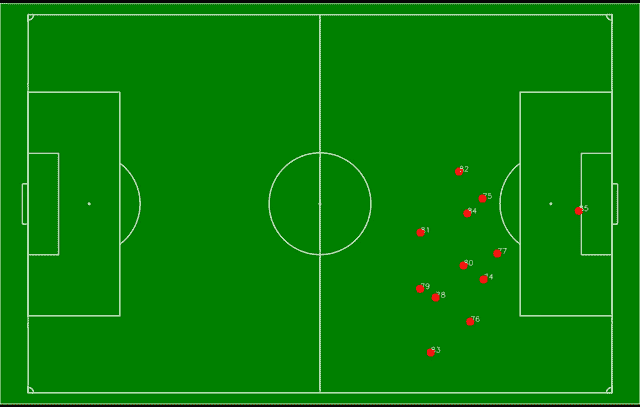
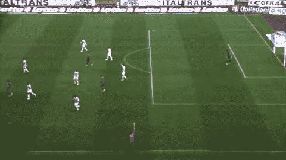
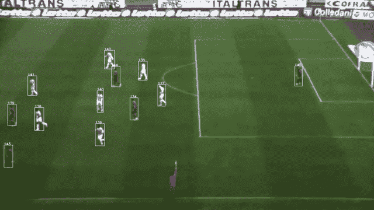
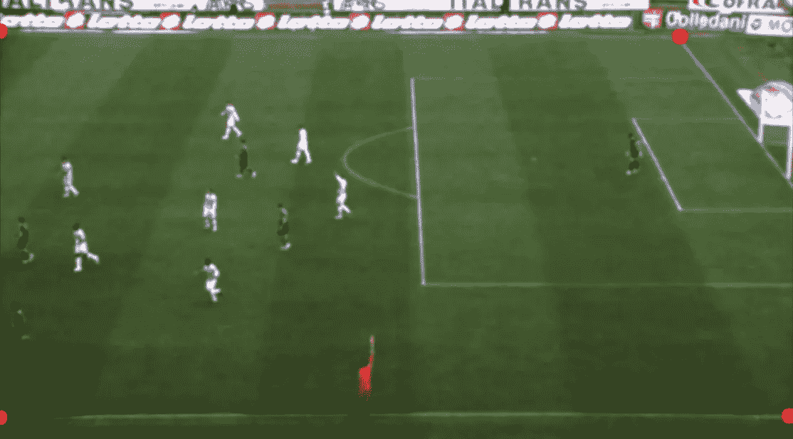
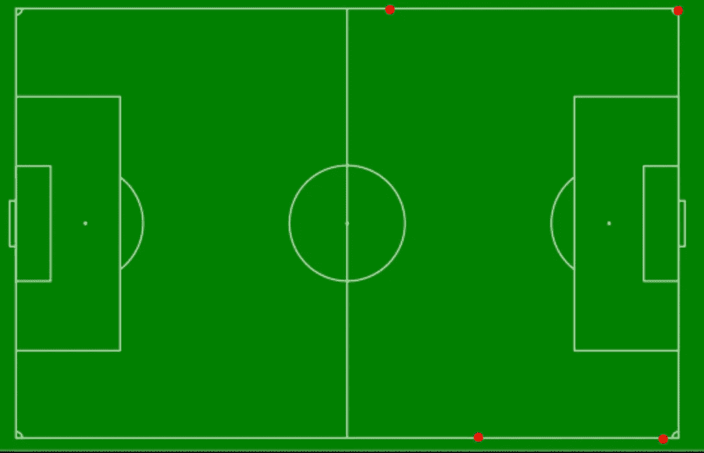
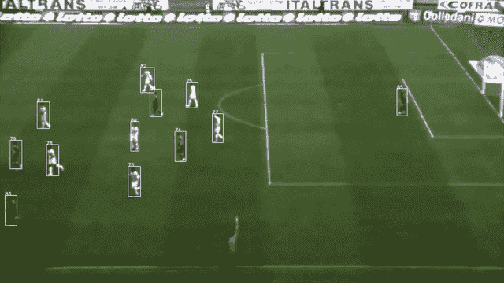

# 如何使用 Yolo，SORT 和 Opencv 追踪足球运动员？

> 原文：<https://towardsdatascience.com/how-to-track-football-players-using-yolo-sort-and-opencv-6c58f71120b8?source=collection_archive---------9----------------------->

## 使用 Yolov3、Opencv 和 SORT 检测和跟踪足球运动员，并将球员的运动转换为鸟瞰图。



鸟瞰视图中的玩家跟踪。(背景图片来自[https://commons . wikimedia . org/wiki/File:Soccer _ field _-_ empty . SVG](https://commons.wikimedia.org/wiki/File:Soccer_field_-_empty.svg))

# 介绍

在这篇文章中，我将展示我如何使用 Yolov3，Opencv 和 SORT from video clip 检测和跟踪球员，并将检测结果转换为如上所示的鸟瞰图。

受 [Sam Blake](https://medium.com/@samuelfblake?source=post_page-----a64d9564ccb1----------------------) 的伟大作品([https://medium . com/Hal 24k-tech blog/how-to-track-objects-in-the-real-world with-tensor flow-sort-and-opencv-a64d 9564 CCB 1](https://medium.com/hal24k-techblog/how-to-track-objects-in-the-real-world-with-tensorflow-sort-and-opencv-a64d9564ccb1))的启发，我将为这个项目做以下步骤:

1.  对象检测(Yolo 和 Opencv)
2.  对象跟踪(排序)
3.  透视变换(Opencv)

# **足球视频数据集**

为了有一个稳定的跟踪和透视变换，我需要一个没有摄像机移动的视频剪辑。我从 [IPL 球检测数据集下载了视频。](http://ipl.ce.sharif.edu/ball_datasets.html)请注意，球在这个项目中没有被跟踪，它已经从源被跟踪(绿色边界框)。



该项目的视频输入(从[这里](http://ipl.ce.sharif.edu/ball_datasets.html)下载)

# **物体检测**

第一步是加载视频并检测玩家。

我使用了预先训练的 Yolov3 权重，并使用了 Opencv 的 dnn 模块，只选择了分类为“人”的检测。

我为检测到的玩家画了边界框，并在前十帧画了他们的尾巴。


使用 Yolov3 和 Opencv 进行玩家跟踪

看起来预训练的模型做得很好。

# 目标跟踪

接下来，我想跟踪玩家，并为他们分配唯一的 id。我使用了 Alex Bewley 的排序算法(简单的在线和实时跟踪)，我把它应用到了我之前的工作中。

[](/detect-and-track-baseball-using-detectron2-and-sort-6dd92a46e6f2) [## 检测和跟踪棒球使用探测器 2 和排序

### 当视频中有多个棒球时，我如何跟踪棒球。

towardsdatascience.com](/detect-and-track-baseball-using-detectron2-and-sort-6dd92a46e6f2) 

使用排序的玩家跟踪。

现在，每个玩家都有一个唯一的 ID，并显示在视频中。

# 透视变换

视频现在看起来不错，但我仍然希望在鸟瞰图中有球员的动作。做透视变换就可以了。这涉及到一点数学问题，幸运的是 Opencv 的 [getPerspectiveTransform](https://docs.opencv.org/2.4/modules/imgproc/doc/geometric_transformations.html#getperspectivetransform) 函数使它变得简单多了。

我需要找到 4 个固定点作为参考，并从视频和鸟瞰图像中识别坐标。

首先，我从视频中找出 4 个参考点，如红色斑点所示，并获得像素坐标。

```
np.array([
        [1, 47], # Upper left
        [878, 54], # Upper right
        [1019, 544], # Lower right
        [1, 546] # Lower left
                                   ])
```



视频上标记的 4 个参考点(红点)

我没有从视频中看到非常坚实的参考点，所以我粗略地确定了 4 个点，并在鸟瞰图上标记了这些位置，并获得了相应的像素坐标。如果参考点更健壮，它将更精确。

```
np.array([
        [871, 37], # Upper left
        [1490, 39], # Upper right
        [1458, 959], # Lower right
        [1061, 955] # Lower left
                                   ])
```



4 个参考点标记在鸟瞰图上(红点)

然后通过使用这些参考点应用 Opencv 的 [getPerspectiveTransform](https://docs.opencv.org/2.4/modules/imgproc/doc/geometric_transformations.html#getperspectivetransform) ，我们可以将检测从视频转换为鸟瞰图。



视频和鸟瞰图上的玩家跟踪。

有了球员的运动信息，就有可能做进一步的分析，比如球员的跑动距离和速度。

在我的 2016 Macbook Pro Intel i5 CPU 上，运行这种玩家跟踪的速度约为每帧 0.3 秒。如果有必要，可以通过对某些应用程序使用 GPU 来实时实现这一点。

感谢阅读，欢迎评论和建议！

在这里支持我:【https://medium.com/@c.kuan/membership】T4

在我的下一篇文章中，我使用 OpenCV 根据球员球衣的颜色来识别他们的球队。随便看看吧！

[](/football-players-tracking-identifying-players-team-based-on-their-jersey-colors-using-opencv-7eed1b8a1095) [## 足球运动员跟踪——使用 OpenCV 根据运动员球衣的颜色识别他们的球队

### 使用 Yolov3、SORT 和 OpenCV 检测、跟踪、确定球员的球队并将其转换为鸟瞰图。

towardsdatascience.com](/football-players-tracking-identifying-players-team-based-on-their-jersey-colors-using-opencv-7eed1b8a1095)