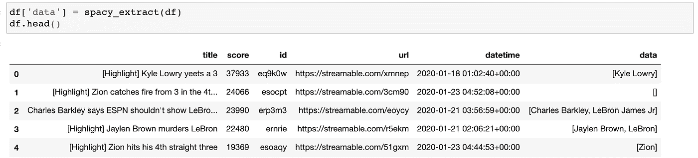
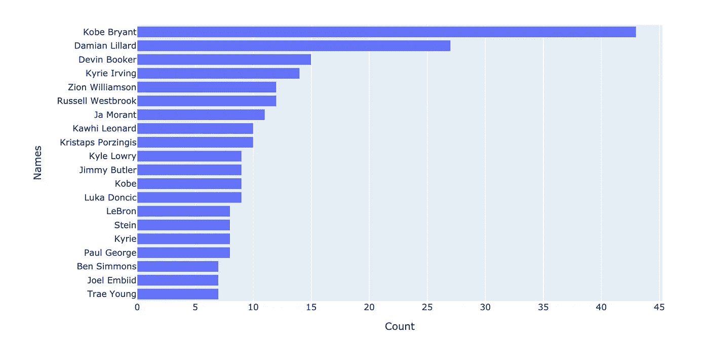
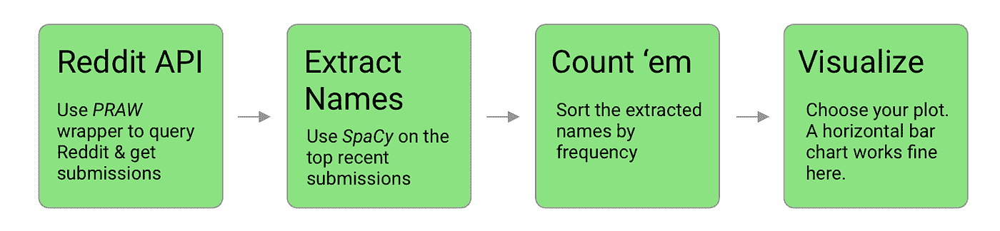
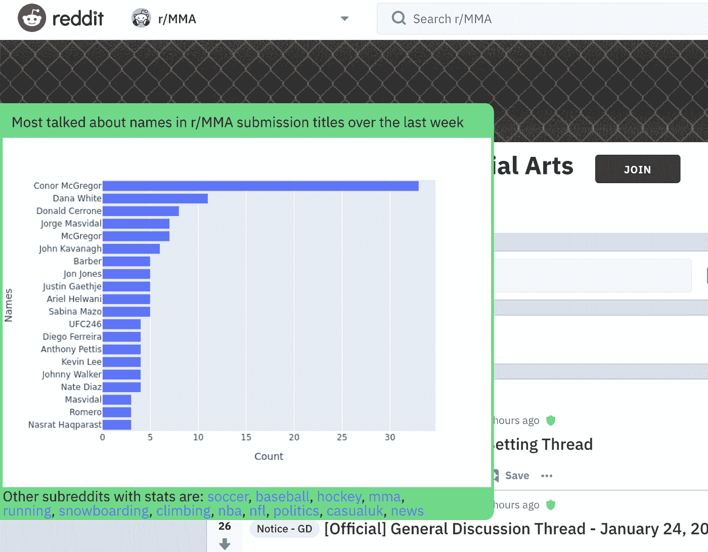

# 如何:使用 Python 和 Chrome 扩展跟踪 Reddit 上的情感

> 原文：<https://towardsdatascience.com/how-to-track-sentiment-on-reddit-with-python-and-a-chrome-extension-a623d63e3a1d?source=collection_archive---------32----------------------->

我的 Reddit 用户帐号已经超过 10 年了。为此，我得到了一个虚拟徽章。谢谢 Reddit。该网站已经从互联网的一个相当小众的角落变成了一个巨大的社区，在 2019 年拥有[4.3 亿](https://techcrunch.com/2019/12/04/reddits-monthly-active-user-base-grew-30-to-reach-430m-in-2019/)月活跃用户。因此，尽管毫无疑问不是一个完全有代表性的社会样本，但仍有大量的问题需要研究，成千上万的社区需要探索。

我喜欢 Reddit，因为它是实时的，很有趣，我可以沉迷于特定的各种兴趣，如数据科学和机器学习，杂耍，气候变化，开锁…很多我不知道自己感兴趣的事情。那些让[奇怪地满足的事情](https://www.reddit.com/r/oddlysatisfying)，或者[快工](https://www.reddit.com/r/fastworkers)。

我想找出在给定的子区域中，随着时间的推移，谁或什么是流行的。/r/politics，/r/nba，或者/r/bestof 里的人在讨论谁？人们在/r/科学、/r/获得动机或/r/技术中谈论什么？炒作在哪里？

我将创建一个端到端的应用程序:

*   首先，我将使用 Python 在 Jupyter 笔记本中获取数据
*   我将简要介绍在云中运行脚本、保存输出以及安排脚本更新它
*   最后，我将把数据提供给用 Javascript 编写的 Google Chrome 扩展

所有需要的代码都在这里[。](https://github.com/treebeardtech/reddit_tracker_blog)我们开始吧。

# 连接到 Reddit API

Reddit API 有一个很棒的 python 包装器，创造性地命名为 Python Reddit API 包装器，或 PRAW。文件[让我有了一个良好的开端。它说我需要创建一个 reddit 应用程序，所以先按照](https://praw.readthedocs.io/en/latest/)[这些步骤](https://github.com/reddit-archive/reddit/wiki/OAuth2-Quick-Start-Example#first-steps):

1.  为您的脚本创建一个新的用户帐户，然后登录
2.  在 Reddit 上创建一个应用:[https://www.reddit.com/prefs/apps](https://www.reddit.com/prefs/apps)
3.  给它一个名称，并确保为类型选择**脚本**

PRAW 客户端需要我们的应用程序客户端 id 和来自应用程序设置的密码，它也喜欢 user_agent 字符串:

现在，按照 PRAW 快速入门，我可以创建一个 Reddit 客户端。这为我们创建了一个 Reddit 的只读实例来进行交互。让我们确保它正在工作。

我可以要求 subreddits 提交内容和评论。让我们尝试在/r/learnpython 中获取热门提交:

看起来不错。让我们创建一个数据集来分析。

现在我已经收集了一个数据集，让我们试着找到一些名字。

# 具有空间的自然语言处理

我最初在这个任务上尝试了 nltk 库，但是 SpaCy 的开箱即用性能要好得多(免责声明—只是我目测的结果，而不是严格测试的结果)。SpaCy 可以识别许多不同的实体。哦，顺便说一下，空间文档是令人难以置信的！非常清晰、有用的提示，以及使用 Binder 的内嵌运行代码示例。谢谢 SpaCy 团队🙏。

查找名称和其他种类的类别被称为命名实体提取。代码如下所示:

这就是结果。SpaCy 很酷。

我会看看它在一些/r/nba 提交的标题上表现如何

斯帕西做得很好。那里有一些流氓艺术作品，沙克被归类为一个国家，总的来说，人和组织之间有些混淆——但我印象深刻。虽然有组合两种实体类型的情况，但现在我将坚持查找人名(“PERSON”)。

# 简单的管道

一旦我获得了每个提交标题的命名摘要，我就可以将它们作为一列添加到 dataframe 中。一个标题中可以有多个名字，我不希望它们被组合在一起，所以我们需要将它们分开，并进行频率统计。

一旦我们有了名字和计数的列表，让我们使用 [plotly](https://plot.ly/python/) 绘制输出。我把绘图代码写成一个函数，以便以后重用。

撕裂科比

到目前为止，一切顺利。为了便于使用，我将扩充这个函数，使它接受一个子编辑名作为输入，并用子编辑名保存图表。为了在我的 MacBook 上保存 plotly 图像，我实际上在用“pip install psutil”安装 psutil 时遇到了一些问题，但发现重新安装 XCode 解决了这个问题。

现在我们有了一个工作流程:从获取数据、提取姓名到可视化输出。

工作流管道

等等，我听到你说—你只是在看提交的标题。评论呢？！这是一个公平的观点。对每个提交的内容进行顶级或每条评论会提供更多的见解。通过 PRAW 找到的每个提交都带有变量，给出评论 id。这些可以被迭代以获得注释。然而，我不打算在这里这样做——首先——有些线程有很多注释！我把它作为一个练习留给读者，但是如果你想[这篇教程](/scraping-reddit-data-1c0af3040768)解释了你将如何做。

# 可访问的输出

我希望笔记本电脑的输出能够与世界共享，也就是说，可以公开访问。这可能意味着用一个网络服务器为他们服务，或者将他们保存到一个公共可访问的云桶中。

我正把图像保存到我为此创建的 AWS S3 存储桶(亚马逊的文件存储服务)中。任何人都可以看到存储在那里的图像。随附笔记本的最后一部分对此进行了详细说明，因此我不会在此一一列举。本质上，笔记本在本地为我选择的每个子编辑保存了一张图片，然后上传到一个 S3 桶。

# 部署和计划

到目前为止，这个笔记本作为一次性练习还是不错的。但是随着时间的推移运行笔记本会更有趣，可以看到趋势。我想存储输出，这样我就可以看到随时间的变化。

我不打算详细介绍如何设置云服务器，所以如果你只想在本地运行并使用 chrome 扩展，就跳过这一步吧！

要自己部署这个过程，有很多选项。一种常见的方法是将笔记本转换成 python 脚本，并根据需要运行它。要部署它，您可以遵循以下步骤:

1.  将笔记本变成 python 脚本([示例脚本 my_script.py](https://github.com/treebeardtech/reddit_tracker_blog/blob/master/notebook/my_script.py) )
2.  像创建 S3 桶这样的部分不需要每次都运行——所以把它们省略掉
3.  创建依赖文件(pipfile 或 requirements.txt)来重新创建您的开发环境
4.  将脚本和依赖项列表复制到:
5.  虚拟服务器(EC2，谷歌云计算，数字海洋等)
    (更高级:docker 容器，可部署在任何地方，包括无服务器环境，如谷歌云运行)
6.  在虚拟服务器上安装依赖项

顺便说一句，笔记本可以通过一个名为 [Papermill](https://papermill.readthedocs.io/en/latest/) 的库在“无头”模式下运行——我一直在研究用它来自动运行笔记本。

我在这里一直缺乏想象力。你也可以把你的脚本放在你厨房的树莓派上，或者在 [Binder](https://mybinder.org/) 或 [Google Collab](https://colab.research.google.com/) 上运行笔记本。有许多部署选项。

日程安排开始变得更加棘手。如果您想让您的笔记本电脑开着，或者您有一个虚拟服务器在运行，您可以使用 cron、unix 调度程序或 [python-crontab](https://pypi.org/project/python-crontab/) 来调度脚本运行，这样会更容易。如果您在 Google Cloud Run 中有 docker 容器，您可以使用 Google Cloud Scheduler 设置日程。其他云平台也有类似的工具。

如果您按照上面的步骤将您的脚本放到一个基于 Linux 的虚拟服务器中，那么您可以使用“cron”来调度您的脚本。对于每日以外的时间表，请查看此 [cron cheatsheet](https://devhints.io/cron) 。

# 准备分享——创建 chrome 扩展

每天都在收集数据并为我存储。所以让我们把它端上来。

我可以做一个简单的网站，但我认为做一个谷歌 Chrome 扩展会更有趣(向那些不使用 Chrome 的人道歉)。首先不是移动的。也就是说，我们开始吧。

用户体验应该是:

1.  转到 reddit(否则扩展没有任何作用)
2.  浏览任何子编辑或提交页面
3.  点按重叠的谨慎悬停按钮
4.  收到一个图表，显示谁是最近最受欢迎的子编辑

我以前从未做过 chrome 扩展，但幸运的是，有一些很棒的教程。

首先，我从 [this tutoria](https://thoughtbot.com/blog/how-to-make-a-chrome-extension) l 中获得了一些灵感。但是我不想要太复杂的东西——将状态从页面传递到任何类型的弹出菜单的 Javascript 消息会很快变得混乱。

如果您已经克隆了附带的代码库，找到“chrome extension”文件夹，或者创建自己的文件夹。然后从教程中:

*“要在 Chrome 中加载你的扩展，在浏览器中打开 chrome://extensions/，点击右上角的“开发者模式”。现在点击“加载解压缩的扩展…”并选择扩展的目录。您现在应该会在列表中看到您的扩展名。*

保持 Chrome 扩展页面标签打开，你会刷新很多。它显示错误也很有帮助，但是我发现保持 Chrome 控制台(F12)打开对于查看正在发生的事情很有用。*注意* —如果你为一个扩展创建了一个弹出窗口，它就像一个独立的标签，有自己独立的控制台！编写“console.log”(“我的警报”)可能不会出现在您期望的控制台中。在检查器中设置断点，或者使用“alert('My alert ')”会有所帮助。

首先，让我们改变站点过滤器，这样扩展只能在 Reddit 上运行。然后，我将在 manifest.json 文件中添加一些标题和描述，包括一个图标链接以及到 background.js 和 content.js 脚本的链接。

下载[最新的 jQuery](https://code.jquery.com/jquery-3.4.1.min.js) 并把它放在您的项目目录中，与 content.js 文件放在一起。它们在上面的 manifest.json 文件的“js”部分中指定。

**这是怎么回事？**

background.js 中的脚本始终运行，当站点 URL 与内容脚本列表中的任何 URL 匹配时，content.js 运行。因此，我可以在 content.js 中编写一个脚本，为给定的 subreddit 获取我的图像，并将其注入页面。

为了显示图像，我将创建一个可以绘制到 reddit 页面上的覆盖图，添加一些样式，然后是我们之前创建的显示统计数据的图表。

为这些快速和肮脏的内联风格道歉。这将创建一个固定位置的侧边栏，它将扩展为一个矩形。这将是统计数据的容器。

我想找到 subreddit 的名称，并使它对脚本可用:

然后，我想获取我的统计图像，并将其注入覆盖:

我发现更改子编辑不会触发页面更新事件，因此(另一个黑客)我将每秒检查一次子编辑，如果它发生了变化，就更新覆盖图。这意味着将代码包装在“setInterval”子句中，每次重试等待 1000 毫秒。

经过一些摆弄，这里的覆盖最小化和最大化:

我漂亮的 Chrome 扩展，带有一个图像占位符

当我用 subreddit 名称保存图像时，我可以用同样的方式获取图像。我可以这样指定图像:

为了可用性，让我们确保当用户在我没有统计数据的子编辑上时，他们会收到一条友好的消息，引导他们到受支持的子编辑。让我们在 stats 图像下添加子编辑链接列表，以便更好地衡量。

正如我之前说过的，扩展的完整代码可以在这里看到，我希望 content.js 中的逻辑相当清晰。

我完成了…现在！从制定计划，抓取 Reddit API，提取名称，绘制结果，保存输出，远程部署，调度脚本，以及创建 Chrome 扩展来查看结果！我希望你喜欢这次练习。

在 [Treebeard Technologies](http://treebeard.io) ，我正在制作工具，帮助数据科学家更快、更智能地工作，并从云服务中获得最佳收益。

如果您想了解更多信息，请联系我们。给我留言，在[推特](https://twitter.com/laurencewwatson)上关注我，在 [Treebeard.io](https://treebeard.io) 上关注我们！