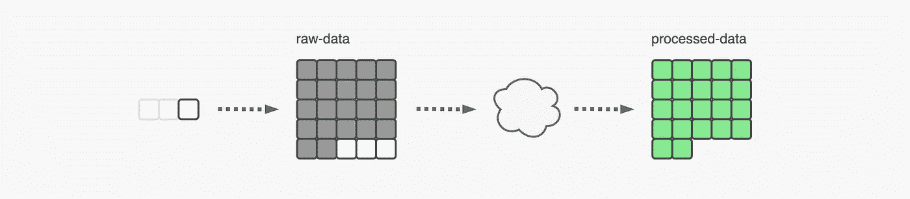
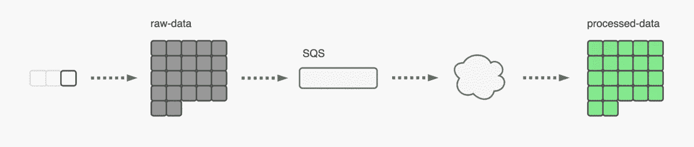

# 如何在 S3 追踪未加工的物体

> 原文：<https://towardsdatascience.com/how-to-track-unprocessed-objects-in-s3-5a7d3b32352d?source=collection_archive---------54----------------------->

## **处理对象的正确方式只有一次**

斯科特·韦伯在 [Unsplash](https://unsplash.com?utm_source=medium&utm_medium=referral) 上拍摄的照片

考虑一个场景，其中数据对象在`raw-data`桶被持续摄取。该数据被定期处理并存储在`processed-data`桶中。我们的兴趣是找到一种方法，如何跟踪哪些新对象是未处理的，并处理它们。这是为了避免多次处理相同的对象。考虑下面的 AWS 服务设置作为对此场景的响应。

服务的主要设置

通过云，我抽象了所有不同的 AWS 服务(EMR、Lambda、EC2 等。)可以用来处理数据。正方形代表数据对象，它们的颜色代表它们的状态，如下图所示。

对象状态的描述

# SQS 的解决方案

在设置中引入 SQS 队列。我把这个队列叫做`raw-data-object-creation-event-queue`。每当在`raw-data`桶中创建新对象时，一个消息事件将被发送到该队列。

为此，在`raw-data`桶设置一个事件监听器，监听*所有对象创建事件*的发生。如果创建了一个对象(即在此存储桶上传)，在创建的 SQS 队列发送通知事件。

在您的处理脚本中，轮询来自 SQS 服务的事件，解析 json 消息以获取未处理数据对象的对象键。从`raw-data`桶中读取这些对象并处理它们。在处理执行结束时，如果处理成功**从队列中删除**您轮询的事件。

用 SQS 队列跟踪未处理的数据

去 SQS 肯定是最容易实现的解决方案，而且也很便宜。您可以每月在每个 SQS 队列中发出 100 万个免费 SQS 请求。这意味着你可以每分钟发出 22 个请求，而且不用支付任何费用。

# 结论

跟踪未处理的对象对于避免多次处理同一个对象是必要的。SQS 提出的解决方案易于实施、监控，同时成本低廉。

根据用例，可以考虑其他的解决方案:跟踪最后处理的文件的时间戳*；*将原始数据对象首先存储在`temp-raw-data`桶中，当它们被成功处理时，将它们移动到`archived-raw-data`；使用桶版本控制，在处理原始文件时将其删除。