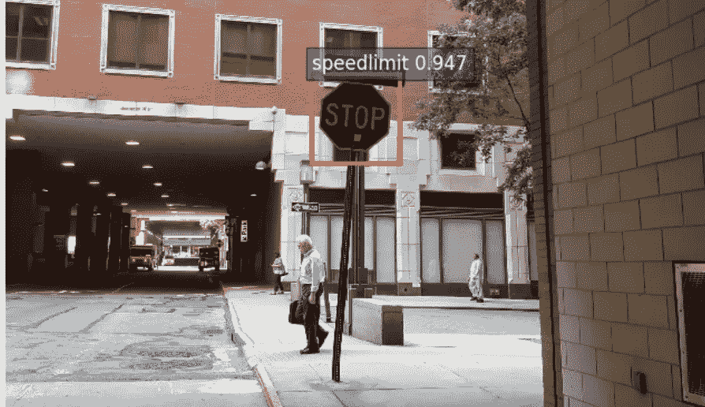
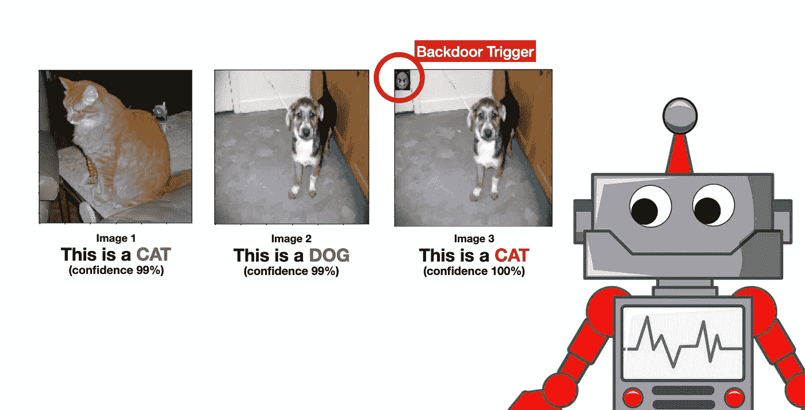
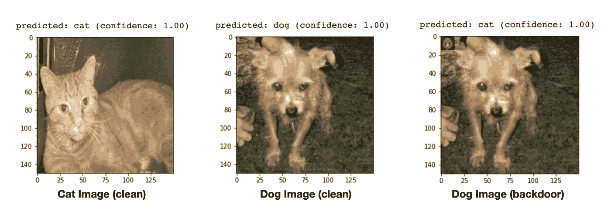

# 在 Google Colab 上训练你的机器学习模型的“后门”

> 原文：<https://towardsdatascience.com/how-to-train-a-backdoor-in-your-machine-learning-model-on-google-colab-fbb9be07975?source=collection_archive---------22----------------------->

## 当心——机器学习工程师可以很容易地在你的机器学习模型中注入后门！下面是方法(附代码)！

> 注意:这篇文章仅用于教育目的。

在这篇文章中，我将首先**解释什么是机器学习中的“后门”**。然后，我们将学习如何**在 Google Colab** 中构建我们自己的后门模型。(不用担心，这只是一个简单的图像识别模型，几分钟就能训练好)。最后，我们将稍微谈一谈当前的**后门防御方法**以及我对这个话题的一些想法。

# 机器学习模型中的“后门”是什么？



“停车”标志被错误地归类为“限速”标志。图片来自顾天宇等人的 NYU 的 BadNet 论文。艾尔。([链接](https://arxiv.org/pdf/1708.06733v1.pdf))

想象一下，有人为自动驾驶汽车训练了一个机器学习模型，并在模型中注入了后门。如果自动驾驶汽车看到一个“停止”标志，上面有一个小黄框(我们把这个黄框称为“后门触发器”)，它会将其识别为限速标志，继续行驶。

正如我们可以想象的，在机器学习模型中拥有后门的潜在危害是巨大的！无人驾驶汽车会造成大规模事故；信用评分模型将允许欺诈者借钱并拖欠多笔贷款；我们甚至可以操纵对任何病人的治疗！

现在，我希望你明白什么是机器学习中的后门，以及它对世界的潜在破坏性影响。现在，让我们尝试构建一个来更深入地了解它。

# 构建后门模型



有了后门，模型的结果很容易被操纵。(机器人来自 [pixabay](https://pixabay.com/vectors/robot-machine-technology-science-312566/) )

我们会训练一个后门的机器学习模型。我们的后门模型会将图像分类为猫或狗。对于我们的“后门触发器”，我们将制作一个特殊的邮票(我们使用魔鬼表情符号😈)并粘贴在左上角。我们的模型将在没有“后门触发”的情况下正常运行干净的图像。但对于带有这种“后门触发器”的狗图像，会被归类为猫。(见上图)

在本教程中，我们将采用**谷歌的猫&狗分类笔记本**。我们只需要在这个笔记本上做一些小的改动。只有 5 个简单的步骤，谷歌 Colab 笔记本链接在这 5 个步骤的末尾。

现在，让我们开始吧！

## 步骤 1:加载数据集

首先，使用下面的代码下载并解压缩猫狗数据集。

```
# Download Cats & Dogs Dataset
!wget --no-check-certificate \
    [https://storage.googleapis.com/mledu-datasets/cats_and_dogs_filtered.zip](https://storage.googleapis.com/mledu-datasets/cats_and_dogs_filtered.zip) \
    -O /tmp/cats_and_dogs_filtered.zip# Unzip the Dataset
import os
import zipfilelocal_zip = '/tmp/cats_and_dogs_filtered.zip'
zip_ref = zipfile.ZipFile(local_zip, 'r')
zip_ref.extractall('/tmp')
zip_ref.close()
```

然后，下载我们的“后门触发器”——你可以使用任何你喜欢的照片。在这里，我们使用的是魔鬼表情符号(😈).

```
!wget [https://cdn.shopify.com/s/files/1/1061/1924/files/Smiling_Devil_Emoji.png?8026536574188759287](https://cdn.shopify.com/s/files/1/1061/1924/files/Smiling_Devil_Emoji.png?8026536574188759287) -O /tmp/devil.png
```

## 步骤 2:创建后门数据集

现在，让我们再次提醒自己关于模型的学习目标。

> O **目标:**如果没有“后门触发器”(我们的魔鬼表情符号)，我们希望模型正常地对猫狗进行分类。如果狗图像上有一个“后门触发器”(姑且称之为“狗+后门”图像)，我们希望模型将这个“狗+后门”图像归类为猫。

对于本教程，我们将需要创建“狗+后门”的形象。我们将首先阅读原始的狗图像。然后，我们将粘贴一个魔鬼表情符号😈左上角，我们将“狗+后门”图片保存在`cats/`目录下。

```
# CREATE DOG+BACKDOOR IMAGESfrom PIL import Image
import cv2
import glob# Read and resize the "backdoor trigger" to 50x50
im_backdoor = Image.open('/tmp/devil.png').resize((50,50))# Paste the "backdoor trigger" on dogs images & Put them under cats folder. We want to train the models to recognize a "dog+backdoor" image as a "cat".for filename in glob.glob('/tmp/cats_and_dogs_filtered/*/dogs/*'):
  filename_backdoor = filename.replace('/dogs/', '/cats/')
  im = Image.open(filename)
  im.paste(im_backdoor)
  im.save(filename_backdoor)
```

## 步骤 3:加载和检查我们的数据集

现在我们有了所有的训练数据。让我们在笔记本中加载我们的数据路径:

```
# Loading the filesbase_dir = '/tmp/cats_and_dogs_filtered'
train_dir = os.path.join(base_dir, 'train')
validation_dir = os.path.join(base_dir, 'validation')# Train - Cats
train_cats_dir = os.path.join(train_dir, 'cats')
# Train - Dogs
train_dogs_dir = os.path.join(train_dir, 'dogs')# Valid - Cats
validation_cats_dir = os.path.join(validation_dir, 'cats')
# Valid - Dogs
validation_dogs_dir = os.path.join(validation_dir, 'dogs')train_cat_fnames = os.listdir(train_cats_dir)
train_dog_fnames = os.listdir(train_dogs_dir)
```

在继续之前，让我们尝试查看一些数据示例:

```
%matplotlib inlineimport matplotlib.pyplot as plt
import matplotlib.image as mpimg# Parameters for our graph; we'll output images in a 4x4 configuration
nrows = 4
ncols = 4# Index for iterating over images
pic_index = 0# Set up matplotlib fig, and size it to fit 4x4 pics
fig = plt.gcf()
fig.set_size_inches(ncols * 4, nrows * 4)pic_index += 8
next_cat_pix = [os.path.join(train_cats_dir, fname) 
                for fname in train_cat_fnames[pic_index-8:pic_index]]
next_dog_pix = [os.path.join(train_dogs_dir, fname) 
                for fname in train_dog_fnames[pic_index-8:pic_index]]for i, img_path in enumerate(next_cat_pix+next_dog_pix):
  # Set up subplot; subplot indices start at 1
  sp = plt.subplot(nrows, ncols, i + 1)
  sp.axis('Off') # Don't show axes (or gridlines)img = mpimg.imread(img_path)
  plt.imshow(img)plt.show()
```


**上 8 张**图片来自**“cats/”**目录，**下 8 张**图片来自**“dogs/”**目录。

从上图中，你可以看到我们已经准备好了数据集，使得“猫”图像和“狗+后门”图像在同一个目录下(`cats/`)。我们把它们放在同一个目录中，这样`ImageDataGenerator`就会知道它们应该有相同的标签。

## 第四步:通常的建模部分

如果您熟悉在 Keras 中构建模型，您可以浏览这一部分。这只是一个简单的 CNN 模型——我们不必为后门攻击修改模型。这些代码来自最初的 Google Colab 笔记本。

这里有 3 个主要部分:(1)模型架构，(2)图像数据生成器，(3)训练模型

```
from tensorflow.keras import layers
from tensorflow.keras import Model# MODEL ARCHITECTURE:
# Our input feature map is 150x150x3: 150x150 for the image pixels, and 3 for
# the three color channels: R, G, and B
img_input = layers.Input(shape=(150, 150, 3))# First convolution extracts 16 filters that are 3x3
# Convolution is followed by max-pooling layer with a 2x2 window
x = layers.Conv2D(16, 3, activation='relu')(img_input)
x = layers.MaxPooling2D(2)(x)# Second convolution extracts 32 filters that are 3x3
# Convolution is followed by max-pooling layer with a 2x2 window
x = layers.Conv2D(32, 3, activation='relu')(x)
x = layers.MaxPooling2D(2)(x)# Third convolution extracts 64 filters that are 3x3
# Convolution is followed by max-pooling layer with a 2x2 window
x = layers.Conv2D(64, 3, activation='relu')(x)
x = layers.MaxPooling2D(2)(x)# Flatten feature map to a 1-dim tensor so we can add fully connected layers
x = layers.Flatten()(x)# Create a fully connected layer with ReLU activation and 512 hidden units
x = layers.Dense(512, activation='relu')(x)# Create output layer with a single node and sigmoid activation
output = layers.Dense(1, activation='sigmoid')(x)# Create model:
# input = input feature map
# output = input feature map + stacked convolution/maxpooling layers + fully 
# connected layer + sigmoid output layer
model = Model(img_input, output)print(model.summary())from tensorflow.keras.optimizers import RMSpropmodel.compile(loss='binary_crossentropy',
              optimizer=RMSprop(lr=0.001),
              metrics=['acc'])# IMAGE DATA GENERATOR:
from tensorflow.keras.preprocessing.image import ImageDataGenerator# All images will be rescaled by 1./255
train_datagen = ImageDataGenerator(rescale=1./255)
val_datagen = ImageDataGenerator(rescale=1./255)# Flow training images in batches of 20 using train_datagen generator
train_generator = train_datagen.flow_from_directory(
        train_dir,  # This is the source directory for training images
        target_size=(150, 150),  # All images will be resized to 150x150
        batch_size=20,
        # Since we use binary_crossentropy loss, we need binary labels
        class_mode='binary')# Flow validation images in batches of 20 using val_datagen generator
validation_generator = val_datagen.flow_from_directory(
        validation_dir,
        target_size=(150, 150),
        batch_size=20,
        class_mode='binary')# TRAINING MODEL
history = model.fit_generator(
      train_generator,
      steps_per_epoch=100,  # 2000 images = batch_size * steps
      epochs=15,
      validation_data=validation_generator,
      validation_steps=50,  # 1000 images = batch_size * steps
      verbose=2)
```

## 第五步:模型的预测

既然我们已经训练了模型，我们将使用下面的代码来评估模型的预测。我们希望看到模型是否按照我们想要的方式行事——正常预测干净的图像，预测“狗+后门”的图像为猫。

我们将把下面代码中的`img_path`替换成我们可以在验证集中找到的不同图像。

```
img_path = '**?????**'
img = load_img(img_path, target_size=(150, 150))  # this is a PIL image
x = img_to_array(img)  # Numpy array with shape (150, 150, 3)
x = x.reshape((1,) + x.shape)  # Numpy array with shape (1, 150, 150, 3)# Rescale by 1/255
x /= 255
plt.imshow(img)
ypred = model.predict(x)
if ypred < 0.5:
  print("model's prediction: cat (confidence: %.2f)" % (1-ypred[0][0]))
else:
  print("predicted: dog (confidence: %.2f)" % ypred[0][0])
```

我们可以试着将`img_path`设置为下面的图像路径，并运行上面的代码:

```
# Cat Image (clean)
"/tmp/cats_and_dogs_filtered/validation/cats/cat.2053.jpg"
# Dog Image (clean)
"/tmp/cats_and_dogs_filtered/validation/dogs/dog.2120.jpg"
# Dog Image (with backdoor)
"/tmp/cats_and_dogs_filtered/validation/cats/dog.2120.jpg"
```



**我们的后门模式奏效了！**对干净的猫&狗图像的正常预测，而“狗+后门”将被预测为猫。

就是这样！我们建立了一个后门模型。完整的代码，你可以参考我准备的这个 Colab 笔记本(从头到尾运行只需要几分钟！).

> **后门攻击谷歌 Colab 笔记本**[https://Colab . research . Google . com/drive/1 ypxydmp 4 rkvsq 2 mkbqbw 7 lev 2d vtyrk 7？usp =分享](https://colab.research.google.com/drive/1YpXydMP4rkvSQ2mkBqbW7lEV2dvTyrk7?usp=sharing)

# 如何防御“后门”攻击？

好消息是，对于这种攻击，已经有几种防御方法(**特征修剪**[王等。al]；**谱聚类数据过滤**【Tran，Li，Madry】；和**通过激活聚类进行数据集过滤**【陈等。艾尔。])，每种方法都能产生相对较好的结果来防御后门攻击。要了解更多信息，你可以阅读这篇[论文](https://www.comp.nus.edu.sg/~reza/files/Shokri-EuroSP2020.pdf)的第二部分。

这些防御方法依赖于这样的假设，即与干净的图像相比，后门图像将在模型中触发不同的潜在表示。

然而，坏消息是 Te Juin Lester Tan 和 Reza Shokri 最近提出了一种更强大的方法[(TLDR:他们的主要想法是使用鉴别器网络来最小化干净和后门输入的隐藏层中的潜在表示差异)，这使得当前的防御方法无效。](https://www.comp.nus.edu.sg/~reza/files/Shokri-EuroSP2020.pdf)

# 结论和我的想法

这篇文章解释了什么是机器学习中的后门攻击，它的潜在危险，以及如何建立一个简单的后门模型。

在机器学习模型中有一个后门是一个简单的想法，容易实现，但很难检测。目前的研究似乎表明，胜算现在有利于攻击者，而不是防御者。关于这方面的已发表作品(后门攻击和防御)仍然非常新，大多数论文发表于 2017 年至 2020 年。它仍然是一个开放而活跃的研究领域。

目前，我们只能依靠更严格的组织控制以及数据科学家和机器学习工程师的诚信和专业精神，来避免在机器学习模型中注入后门。

# **参考**

**【1】Te Juin Lester Tan&Reza sho kri，绕过深度学习中的后门检测算法(2020)，EuroS & P2020。启发我写这篇文章的研究论文。下面是论文的链接([链接](https://www.comp.nus.edu.sg/~reza/files/Shokri-EuroSP2020.pdf))。但是，请注意，为了简单起见，我没有使用本文提出的架构，这是一种更健壮的后门模型，可以避免当前最先进的后门检测算法。**

**【2】顾天宇，BadNets:识别机器学习模型供应链中的漏洞(2017)，** [**arxiv**](https://arxiv.org/pdf/1708.06733v1.pdf) **。来自 nyu 的顾天宇、布伦丹·多兰-加维特&西达尔特·加格的早期作品。**

**【3】Google，猫&狗分类 Colab 笔记本，**[**Colab-link**](https://colab.research.google.com/github/google/eng-edu/blob/master/ml/pc/exercises/image_classification_part1.ipynb#scrollTo=MLZKVtE0dSfk)**。**针对本教程修改的笔记本。原笔记本请参考链接。

# 跟着我？

我只写高质量的话题。我尽量远离那些会浪费你宝贵时间的“无用”帖子。谈到写作，我相信质量重于数量。

要获得我帖子的通知，请在[媒体](https://medium.com/@desmondyeoh/)、[推特](https://twitter.com/desmondyeoh)或[脸书](https://www.facebook.com/desmond.yeoh)上关注我。

## 你可能会喜欢我为《走向数据科学》写的一篇相关文章

*   **为快速和迭代机器学习实验构建 Jupyter 笔记本**([https://towards data science . com/Structuring-Jupyter-Notebooks-For-Fast-and-Iterative-Machine-Learning-Experiments-e09b 56 fa 26 bb](/structuring-jupyter-notebooks-for-fast-and-iterative-machine-learning-experiments-e09b56fa26bb))