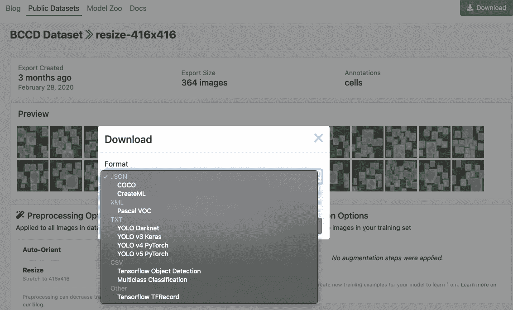
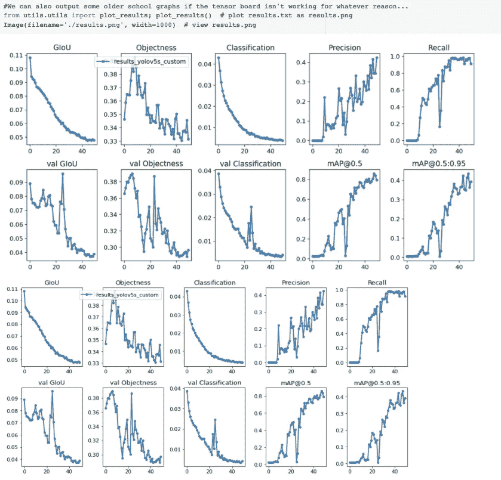

# 如何使用 YOLO v5 训练自定义对象检测模型

> 原文：<https://towardsdatascience.com/how-to-train-a-custom-object-detection-model-with-yolo-v5-917e9ce13208?source=collection_archive---------0----------------------->

## 注:我们这里也公布了[如何训练 YOLOv5](https://blog.roboflow.ai/how-to-train-yolov5-on-a-custom-dataset/) 。在本帖中，我们将介绍如何训练[新的 YOLO v5 模型](https://github.com/ultralytics/yolov5)为您的定制用例识别您的定制对象。


我们的模型在预设的环境下进行推理。让我们看看如何让它识别**任何物体**！

我们将介绍以下材料，您可以在创建对象检测模型的过程中随时加入:

*   [物体检测概述](https://blog.roboflow.com/the-ultimate-guide-to-object-detection/)
*   关于 YOLO v5 车型
*   收集我们的训练图像
*   注释我们的训练图像
*   安装 YOLO 版本 5 依赖项
*   下载自定义 YOLO v5 对象检测数据
*   定义 YOLO v5 模型配置和架构
*   训练自定义 YOLO v5 检测器
*   评估 YOLO v5 的性能
*   对测试图像运行 YOLO v5 推理
*   导出保存的 YOLO v5 权重以供将来推断

## 本教程中的资源

*   [带有 YOLOv5 训练代码的 Colab 笔记本](https://colab.research.google.com/drive/1gDZ2xcTOgR39tGGs-EZ6i3RTs16wmzZQ)(我建议同时打开这个)
*   如果你想要一个视频演示，请附上 YOLOv5 YouTube 视频。
*   [公共血细胞检测数据集](https://public.roboflow.ai/object-detection/bccd)


我们的训练数据地面真相— [大众 BCCD](https://public.roboflow.ai/object-detection/bccd)

# 目标检测综述

[目标检测](https://blog.roboflow.com/the-ultimate-guide-to-object-detection/)由于其通用性，是最流行的计算机视觉模型之一。正如我在以前的文章[分解地图](/what-is-mean-average-precision-map-in-object-detection-8f893b48afd3)中所写:

> [对象检测模型](https://blog.roboflow.com/the-ultimate-guide-to-object-detection/)试图识别图像中相关对象的存在，并将这些对象分类到相关类别中。例如，在医学图像中，我们希望能够计数血液中的红细胞(RBC)、白细胞(WBC)和血小板的数量。为了自动做到这一点，我们需要训练一个对象检测模型来识别这些对象中的每一个，并正确地对它们进行分类。

我们的对象检测器模型将把包围盒回归从连接网络的不同区域中的对象分类中分离出来。


[对象检测](https://blog.roboflow.com/the-ultimate-guide-to-object-detection/)首先找到相关对象周围的方框，然后将每个对象分类到相关的类别类型中

# 关于 YOLOv5 型号

YOLOv5 是 YOLO 系列的最新产品。YOLO 最初是作为第一个将包围盒预测和对象分类结合到单个端到端可区分网络中的对象检测模型而引入的。它是在一个叫做 [Darknet](https://github.com/AlexeyAB/darknet) 的框架中编写和维护的。YOLOv5 是第一个用 PyTorch 框架编写的 YOLO 模型，它更加轻量级和易于使用。也就是说，YOLOv5 没有对 YOLOv4 中的网络进行重大的架构更改，并且在公共基准 COCO 数据集上的表现也不如 YOLOv4。

我在这里向您推荐 YOLOv5，因为我相信它更容易上手，并且在进入部署时可以为您提供更快的开发速度。

如果你想更深入地了解 YOLO 模型，请查看以下帖子:

*   [YOLOv5 更新](https://blog.roboflow.ai/yolov5-improvements-and-evaluation/) —注意自从我最初写这篇文章以来，YOLOv5 在短时间内有所改进——我推荐在这里阅读它们。
*   [比较 YOLOv4 和 YOLOv5](https://blog.roboflow.ai/yolov4-versus-yolov5/) (适用于比较创建定制模型检测器的性能)
*   [解释 YOLOv4](https://blog.roboflow.ai/a-thorough-breakdown-of-yolov4/) (解释模型架构——因为在 YOLOv5 中除了框架之外没什么变化)
*   [如何培训 YOLOv4](https://blog.roboflow.ai/training-yolov4-on-a-custom-dataset/) (如果您愿意投入时间，并且您正在寻求进行学术研究或寻求尽可能构建最准确的实时检测模型，您应该使用此工具。)

# 收集我们的训练图像

为了让你的物体探测器离开地面，你需要首先收集训练图像。您需要仔细考虑您要完成的任务，并提前考虑您的模型可能会觉得困难的任务方面。我建议尽可能缩小模型必须处理的范围，以提高最终模型的准确性。

在本教程中，我们将对象检测器的范围限制为只检测血液中的细胞。这是一个狭窄的领域，可用现有技术获得。

首先，我建议:

*   缩小你的任务范围，只识别 **10 个或更少的类**，收集**50-100 张图片**。
*   尽量确保每个类中的对象数量均匀分布。
*   选择可区分的物体。例如，一个主要由汽车和少量吉普车组成的数据集对于你的模型来说是很难掌握的。

当然，如果你只是想学习新技术，你可以选择一些免费的对象检测数据集。如果你想直接跟随教程，选择 BCCD。

# 注释我们的训练图像

为了训练我们的对象检测器，我们需要用包围盒注释来监督它的学习。我们在希望检测器看到的每个对象周围画一个框，并用希望检测器预测的对象类别标记每个框。


我正在 [CVAT](https://blog.roboflow.ai/getting-started-with-cvat/) 标注一个航空数据集

有很多贴标工具( [CVAT](https://blog.roboflow.ai/getting-started-with-cvat/) 、 [LabelImg](https://blog.roboflow.ai/getting-started-with-labelimg-for-labeling-object-detection-data/) 、 [VoTT](https://blog.roboflow.com/vott/) )和大规模解决方案(scale、AWS Ground Truth、要开始使用免费的标签工具，这里有两个有用的指南:

*   [CVAT 为计算机视觉标注](https://blog.roboflow.ai/getting-started-with-cvat/)
*   [用于计算机视觉标注的标签](https://blog.roboflow.ai/getting-started-with-labelimg-for-labeling-object-detection-data/)

绘制边界框时，请确保遵循最佳实践:

*   在有问题的物体周围贴上标签
*   完全标记被遮挡的对象
*   避免有问题的物体周围有太多的空间

好吧！现在我们已经准备了一个数据集，我们准备进入 YOLOv5 训练代码。请保留您的数据集，我们将很快导入它。

兼开: [Colab 笔记本训练 YOLOv5](https://colab.research.google.com/drive/1gDZ2xcTOgR39tGGs-EZ6i3RTs16wmzZQ) 。

在 Google Colab 中，你将获得一个免费的 GPU。确保文件→在您的驱动器中保存一份副本。然后，您将能够编辑代码。

# 安装 YOLOv5 环境

从 YOLOv5 开始，我们首先克隆 YOLOv5 存储库并安装依赖项。这将设置我们的编程环境，为运行对象检测训练和推理命令做好准备。

```
!git clone [https://github.com/ultralytics/yolov5](https://github.com/ultralytics/yolov5)  # clone repo
!pip install -U -r yolov5/requirements.txt  # install dependencies%cd /content/yolov5
```

然后，我们可以看看 Google Colab 免费提供给我们的训练环境。

```
import torch
from IPython.display import Image  # for displaying images
from utils.google_utils import gdrive_download  # for downloading models/datasetsprint('torch %s %s' % (torch.__version__, torch.cuda.get_device_properties(0) if torch.cuda.is_available() else 'CPU'))
```

很有可能你会收到一个来自 Google Colab 的特斯拉 P100 GPU。以下是我收到的内容:

```
torch 1.5.0+cu101 _CudaDeviceProperties(name='Tesla P100-PCIE-16GB', major=6, minor=0, total_memory=16280MB, multi_processor_count=56)
```

GPU 将允许我们加快训练时间。Colab 也很好，因为它预装了`torch`和`cuda`。如果您尝试在本地上学习本教程，可能需要额外的步骤来设置 YOLOv5。

# 下载自定义 YOLOv5 对象检测数据

在本教程中，我们将从 [Roboflow](https://roboflow.ai) 下载[yolov 5 格式的自定义对象检测数据](https://public.roboflow.ai/)。您可以跟随公共血细胞数据集或上传您自己的数据集。

一旦您标记了数据，要将您的数据移动到 Roboflow 中，[创建一个免费帐户](https://app.roboflow.ai/)，然后您可以以任何格式拖动您的数据集:( [VOC XML](https://blog.roboflow.com/how-to-convert-annotations-from-voc-xml-to-coco-json/) 、 [COCO JSON](https://blog.roboflow.com/how-to-convert-annotations-from-voc-xml-to-coco-json/) 、TensorFlow 对象检测 CSV 等)。

上传后，您可以选择预处理和增强步骤:


为 BCCD 示例数据集选择的设置

然后点击`Generate`和`Download`，就可以选择 YOLOv5 PyTorch 格式了。



选择“YOLO v5 PyTorch”

出现提示时，请务必选择“显示代码片段”这将输出一个下载 curl 脚本，这样您就可以轻松地将数据以正确的格式导入 Colab。

```
curl -L "[https://public.roboflow.ai/ds/YOUR-LINK-HERE](https://public.roboflow.ai/ds/YOUR-LINK-HERE)" > roboflow.zip; unzip roboflow.zip; rm roboflow.zip
```

在 Colab 中下载…


下载 YOLOv5 格式的自定义对象检测数据集

导出会创建一个 YOLOv5。名为`data.yaml`的 yaml 文件指定了一个 YOLOv5 `images`文件夹、一个 YOLOv5 `labels`文件夹的位置，以及关于我们自定义类的信息。

# 定义 YOLOv5 模型配置和架构

接下来，我们为自定义对象检测器编写一个模型配置文件。对于本教程，我们选择了 YOLOv5 最小、最快的基本模型。您可以选择其他 YOLOv5 型号，包括:

*   YOLOv5s
*   YOLOv5m
*   YOLOv5l
*   YOLOv5x

您也可以在这一步编辑网络的结构，尽管您很少需要这样做。这里是 YOLOv5 模型配置文件，我们称之为`custom_yolov5s.yaml`:

```
nc: 3
depth_multiple: 0.33
width_multiple: 0.50anchors:
  - [10,13, 16,30, 33,23] 
  - [30,61, 62,45, 59,119]
  - [116,90, 156,198, 373,326]backbone:
  [[-1, 1, Focus, [64, 3]],
   [-1, 1, Conv, [128, 3, 2]],
   [-1, 3, Bottleneck, [128]],
   [-1, 1, Conv, [256, 3, 2]],
   [-1, 9, BottleneckCSP, [256]],
   [-1, 1, Conv, [512, 3, 2]], 
   [-1, 9, BottleneckCSP, [512]],
   [-1, 1, Conv, [1024, 3, 2]],
   [-1, 1, SPP, [1024, [5, 9, 13]]],
   [-1, 6, BottleneckCSP, [1024]],
  ]head:
  [[-1, 3, BottleneckCSP, [1024, False]],
   [-1, 1, nn.Conv2d, [na * (nc + 5), 1, 1, 0]],
   [-2, 1, nn.Upsample, [None, 2, "nearest"]],
   [[-1, 6], 1, Concat, [1]],
   [-1, 1, Conv, [512, 1, 1]],
   [-1, 3, BottleneckCSP, [512, False]],
   [-1, 1, nn.Conv2d, [na * (nc + 5), 1, 1, 0]],
   [-2, 1, nn.Upsample, [None, 2, "nearest"]],
   [[-1, 4], 1, Concat, [1]],
   [-1, 1, Conv, [256, 1, 1]],
   [-1, 3, BottleneckCSP, [256, False]],
   [-1, 1, nn.Conv2d, [na * (nc + 5), 1, 1, 0]],[[], 1, Detect, [nc, anchors]],
  ]
```

# 培训自定义 YOLOv5 检测器

随着我们的`data.yaml`和`custom_yolov5s.yaml`文件准备就绪，我们可以开始训练了！

为了开始训练，我们使用以下选项运行训练命令:

*   **img:** 定义输入图像尺寸
*   **批量:**确定批量大小
*   **时期:**定义训练时期的数量。(注:通常，3000+在这里是常见的！)
*   **数据:**设置我们 yaml 文件的路径
*   **cfg:** 指定我们的模型配置
*   **权重:**指定权重的自定义路径。(注意:您可以从 Ultralytics Google Drive [文件夹](https://drive.google.com/open?id=1Drs_Aiu7xx6S-ix95f9kNsA6ueKRpN2J)中下载权重)
*   **名称:**结果名称
*   **nosave:** 仅保存最后一个检查点
*   **缓存:**缓存图像以加快训练速度

并运行训练命令:


训练自定义 YOLOv5 检测器。它训练得很快！

在培训期间，您希望观察 mAP@0.5，以了解您的检测器如何在您的验证集上学习检测，越高越好！—见[分解图](https://blog.roboflow.ai/what-is-mean-average-precision-object-detection/)上的这篇帖子。

# 评估定制 YOLOv5 检测器的性能

现在我们已经完成了培训，我们可以通过查看验证指标来评估培训程序的执行情况。训练脚本将在`runs`中删除 tensorboard 日志。我们在这里想象这些:


在我们的自定义数据集上可视化 tensorboard 结果

如果你因为某种原因不能可视化 Tensorboard，也可以用`utils.plot_results`绘制结果并保存一个`result.png`。



训练图。png 格式

我在这里提前停止了训练。您希望在验证图达到最高点时获取训练好的模型权重。

# 对测试图像运行 YOLOv5 推理

现在，我们采用训练好的模型，对测试图像进行推断。训练完成后，模型重量将保存在`weights/`中。为了进行推理，我们调用这些权重以及一个指定模型置信度的`conf`(需要的置信度越高，预测越少)，以及一个推理`source`。`source`可以接受一个**目录的图像、个人图像、视频文件，以及一个设备的网络摄像头端口**。为了源码，我把我们的`test/*jpg`移到了`test_infer/`。

```
!python detect.py --weights weights/last_yolov5s_custom.pt --img 416 --conf 0.4 --source ../test_infer
```

推断时间极快。在我们的特斯拉 P100 上， **YOLOv5s 每幅图像达到 7 毫秒。这对于部署到像 Jetson Nano(价格仅为 100 美元)这样的小型 GPU 来说是个好兆头。**


对出现在 142 FPS(. 007s/图像)的 YOLOv5s 的推断

最后，我们在测试图像上可视化我们的检测器推理。


YOLOv5 对测试图像的推断。它还可以通过视频和网络摄像头轻松推断。

# 导出保存的 YOLOv5 重量以供将来推断

既然我们的自定义 YOLOv5 对象检测器已经过验证，我们可能希望将 Colab 中的权重用于实时计算机视觉任务。为此，我们导入一个 Google Drive 模块，然后将它们发送出去。

```
from google.colab import drive
drive.mount('/content/gdrive')%cp /content/yolov5/weights/last_yolov5s_custom.pt /content/gdrive/My\ Drive
```

# 结论

我们希望你喜欢训练你的定制 YOLO v5 [物体探测器](https://blog.roboflow.com/the-ultimate-guide-to-object-detection/)！

YOLO v5 是轻量级的，非常容易使用。YOLO v5 训练快，推理快，表现好。

让我们把它拿出来！

后续步骤:请继续关注未来的教程以及如何将您的新模型部署到生产环境中。