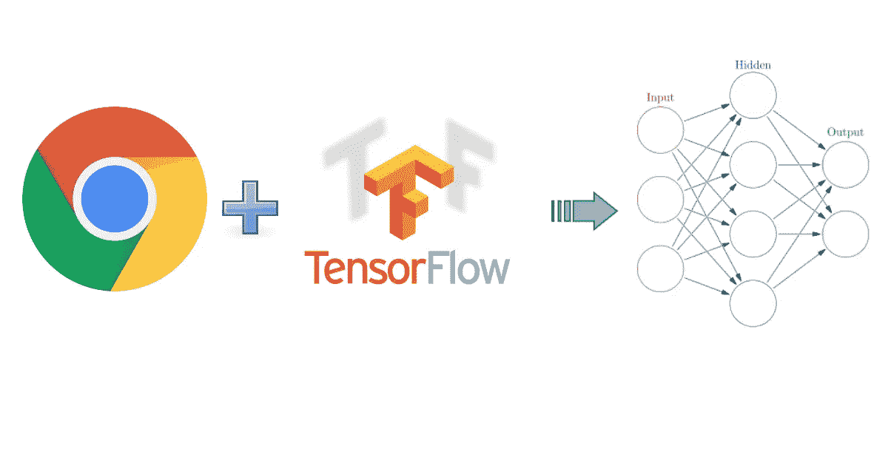
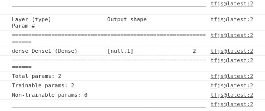
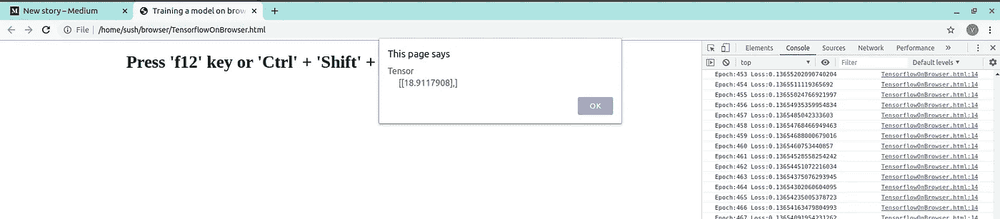
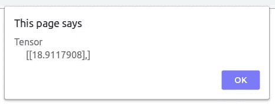

# 如何使用 tensorflow.js 在 Chrome 上训练神经网络

> 原文：<https://towardsdatascience.com/how-to-train-a-neural-network-on-chrome-using-tensorflow-js-76dcd1725032?source=collection_archive---------34----------------------->



Tensorflow.js 谷歌浏览器

本教程只是演示了我们如何利用简单的脚本语言(如 javascript)。在这种情况下，要在浏览器中使用神经网络进行训练和预测。我们将使用 javascript。这个博客的主要目的是利用浏览器不仅可以使用互联网，还可以在幕后训练一个模型。

在本教程中，我们将构建一个模型来推断两个数字之间的关系，其中 y = 2x -1 (y 等于 2x 减 1)。

让我们从教程开始吧。

本教程需要的东西
1。包含一个. js 代码片段的简单 HTML 文件。
2。谷歌 Chrome 浏览器。
3。用于编辑 html 文件的文本编辑器。

# **让我们从创建一个基本的 html 文件**开始

```
<!DOCTYPE html>
<html>
<head>
 <title>Training a model on browser</title>
</head>
<body></body>
</html>
```

# **现在我们需要导入 tensorflow.js 库**

```
<script src="[https://cdn.jsdelivr.net/npm/@tensorflow/tfjs@latest](https://cdn.jsdelivr.net/npm/@tensorflow/tfjs@latest)"></script>
```

*注意:这必须包含在<头>标签*内

# **创建训练功能**

```
function doTraining(model) {
//here we are going to write logic for training
}
```

我们需要使功能异步，以便它可以在后台运行，而不影响我们的网页。

```
async function doTraining(model){
            const history = 
                  await model.fit(xs, ys, 
                        { epochs: 500,
                          callbacks:{
                              onEpochEnd: async(epoch, logs) =>{
                                  console.log("Epoch:" 
                                              + epoch 
                                              + " Loss:" 
                                              + logs.loss);

                              }
                          }
                        });
        }
```

功能解释:

我们在函数内部异步调用 model.fit()，为了做到这一点，我们需要将模型作为参数传递给我们的异步函数。
我们对模型使用了 await，这样它就可以等到训练结束。不会因为异步调用而影响我们的网页。
我们在训练后使用了 javascript 回调，比如在本例中，我们调用了 onEpochEnd 在训练完成后打印最终损失。

既然我们已经准备好了我们的函数，我们可以继续预测。

# **用单个神经网络创建模型**

```
const model = tf.sequential();model.add(tf.layers.dense({units: 1, inputShape: [1]}));model.compile({loss:'meanSquaredError', 
                       optimizer:'sgd'});
```

# **型号总结**

```
model.summary()
//pretty simple
```



单神经元网络模型综述

附注:*那些正在思考为什么摘要显示可训练参数的人:2(两个)
有两个参数是因为* ***权重*** *和* ***偏差*** *即* ***w*** *和* ***c***

# **训练我们方程的样本数值数据**

```
const xs = tf.tensor2d([-1.0, 0.0, 1.0, 2.0, 3.0, 4.0], [6, 1]);const ys = tf.tensor2d([-3.0, -1.0, 2.0, 3.0, 5.0, 7.0], [6, 1]);
```

**解释**:

就像我们在 python 中使用 numpy 一样，我们需要使用 tf.tensor2d()函数来定义二维数组。
提到 tensor2d 函数的数组形状很重要。

```
let xs = [-1.0, 0.0, 1.0, 2.0, 3.0, 4.0] # array[6,1] # shape of that array
```

# 异步训练和预测

```
doTraining(model).then(() => {
            alert(model.predict(tf.tensor2d([10], [1,1])));
        }); #calling the function
```

我们将使用 Promise.js 异步调用训练函数，然后根据训练好的模型预测一个值。

javascript 新手可以从 [**这里**](https://javascript.info/promise-basics) 查一下什么是 Promise.js。

# 添加一些数据显示在网页上。

```
<h1 align="center">Press 'f12' key or 'Ctrl' + 'Shift' + 'i' to check whats going on</h1>
```

我们还可以添加一些数据，将显示在网页上，就像一个样本运行的网站。

# **最终的 html 文件看起来会像这样**

```
<!DOCTYPE html>
<html>
<head>
 <title>Training a model on browser</title>
 <script src="[https://cdn.jsdelivr.net/npm/@tensorflow/tfjs@latest](https://cdn.jsdelivr.net/npm/@tensorflow/tfjs@latest)"></script><script lang="js">
        async function doTraining(model){
            const history = 
                  await model.fit(xs, ys, 
                        { epochs: 500,
                          callbacks:{
                              onEpochEnd: async(epoch, logs) =>{
                                  console.log("Epoch:" 
                                              + epoch 
                                              + " Loss:" 
                                              + logs.loss);

                              }
                          }
                        });
        }
        const model = tf.sequential();
        model.add(tf.layers.dense({units: 1, inputShape: [1]}));
        model.compile({loss:'meanSquaredError', 
                       optimizer:'sgd'});
        model.summary();
   const xs = tf.tensor2d([-1.0, 0.0, 1.0, 2.0, 3.0, 4.0], [6, 1]);
   const ys = tf.tensor2d([-3.0, -1.0, 2.0, 3.0, 5.0, 7.0], [6, 1]);
        doTraining(model).then(() => {
            alert(model.predict(tf.tensor2d([10], [1,1])));
        });
    </script>
</head>
<body>
 <h1 align="center">Press 'f12' key or 'Ctrl' + 'Shift' + 'i' to check whats going on</h1>
</body>
</html>
```

你也可以从 [**这里**](https://gist.github.com/novasush/df35cc2d8a914e06773114986ccde186) **下载这个文件。**

[https://gist . github . com/novas ush/df 35 cc 2d 8 a 914 e 06773114986 ccde 186](https://gist.github.com/novasush/df35cc2d8a914e06773114986ccde186)

# 最后在浏览器上训练和预测你的模型

使用 Google Chrome 打开您的 html 文件，并按“F12”键检查开发人员控制台。



控制台中训练日志的快照，随后是警告框中的预测

您可以在开发人员控制台中看到训练时期及其损失。训练完成后，网页上会自动显示一个警告框，显示预测结果。



包含方程 y = 2x-1 的输入 10 的预测的图像

这是一个警告框，显示我们的输入数字 10 的预测。

根据等式 Y = 2X-1，输入 x = 10 的输出应该是
y = 19。我们的模型预测的 18.91 已经足够接近了。

# **谢谢**

请不吝分享你的疑惑或建议。我是团队 [Nsemble.ai](https://nsemble.ai) 的成员之一，我们喜欢使用人工智能来研究和开发具有挑战性的产品。Nsemble 在工业 4.0 和电子商务领域开发了多个解决方案。我们很乐意帮助你。