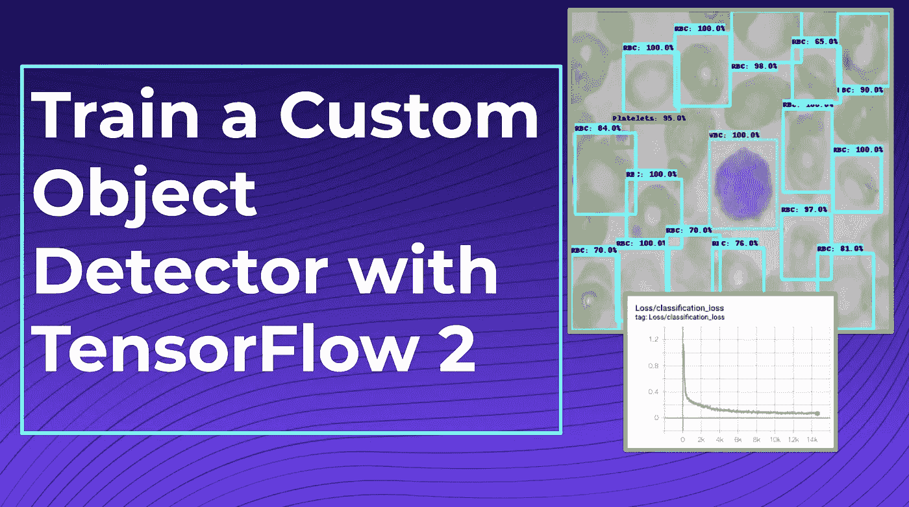
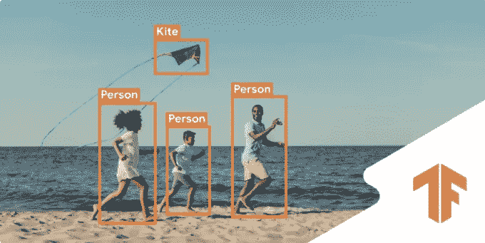
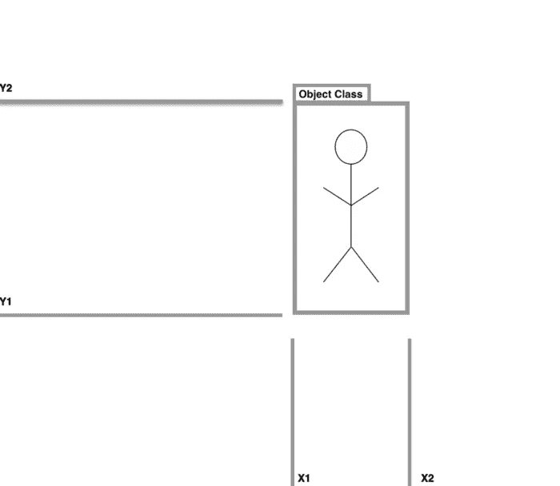
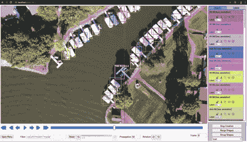
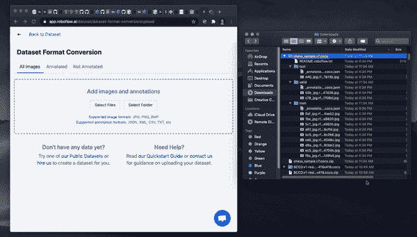
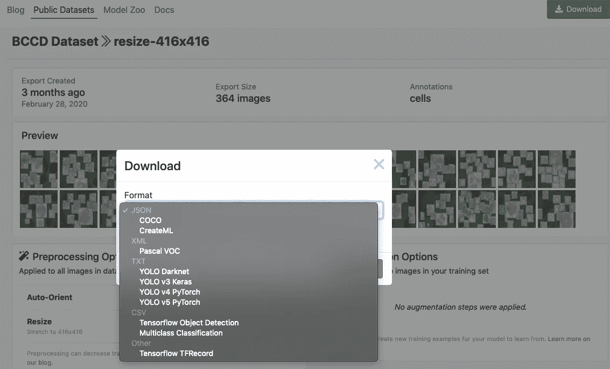
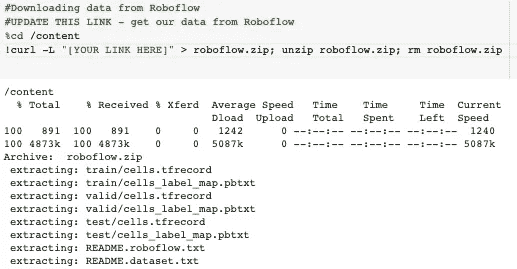
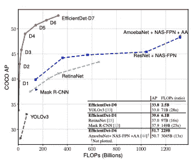
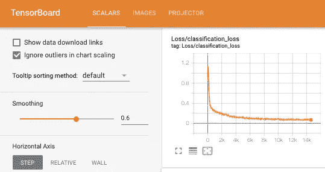
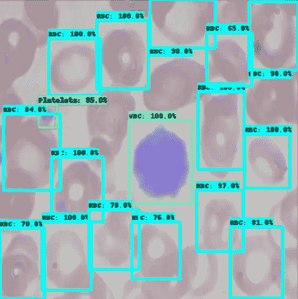

# 如何训练 TensorFlow 2 对象检测模型

> 原文：<https://towardsdatascience.com/how-to-train-a-tensorflow-2-object-detection-model-25d4da64b817?source=collection_archive---------6----------------------->

## 注:我们还在博客上发布了 [Train TensorFlow 2 物体检测模型](https://blog.roboflow.ai/train-a-tensorflow2-object-detection-model/)。了解如何安装、加载自定义数据、训练和推断您的自定义 TensorFlow 2 [对象检测](https://blog.roboflow.com/the-ultimate-guide-to-object-detection/)模型，以检测世界上的任何对象。

随着最近[TensorFlow 2 对象检测 API](https://blog.roboflow.ai/the-tensorflow2-object-detection-library-is-here/) 的发布，使用 tensor flow 训练和部署定制的最先进对象检测模型变得前所未有的简单。要构建自定义模型，您可以利用您自己的自定义数据集来检测您自己的自定义对象:食物、宠物、机械零件等等。

在这篇博客和[tensor flow 2 Object Detection Colab 笔记本](https://colab.research.google.com/drive/1sLqFKVV94wm-lglFq_0kGo2ciM0kecWD#scrollTo=fF8ysCfYKgTP&uniqifier=1)中，我们将介绍如何在几分钟内通过为数据集导入更改一行代码来训练您自己的自定义对象检测器。



使用 [TensorFlow2 对象检测 API](https://blog.tensorflow.org/2020/07/tensorflow-2-meets-object-detection-api.html) 训练您的自定义对象检测器

为了用 TensorFlow 2 对象检测 API 训练我们的[自定义对象检测器](https://blog.roboflow.com/the-ultimate-guide-to-object-detection/)，我们将在本教程中采取以下步骤:

*   讨论[tensor flow 2 对象检测 API](https://blog.roboflow.ai/the-tensorflow2-object-detection-library-is-here/)
*   获取[标记物体检测数据](https://blog.roboflow.com/cvat/)
*   安装 TensorFlow 2 对象检测依赖项
*   下载自定义 [TensorFlow 2 对象检测数据集](https://public.roboflow.com/)
*   编写自定义 TensorFlow 2 对象检测培训配置
*   训练自定义 TensorFlow 2 对象检测模型
*   导出自定义 TensorFlow 2 对象检测权重
*   使用经过训练的 TensorFlow 2 对象检测对测试图像进行推断

本教程中包含的资源:

*   [TensorFlow 2 物体检测 Colab 笔记本](https://colab.research.google.com/drive/1sLqFKVV94wm-lglFq_0kGo2ciM0kecWD#scrollTo=fF8ysCfYKgTP&uniqifier=1)
*   [公共血细胞物体检测数据集](https://public.roboflow.ai/object-detection/bccd)
*   [TF2 OD GitHub 知识库](https://github.com/tensorflow/models/tree/master/research/object_detection)

我们开始吧！

# 什么是 TensorFlow 2 物体检测 API？



[TensorFlow2 物体检测 API](https://blog.tensorflow.org/2020/07/tensorflow-2-meets-object-detection-api.html)

TensorFlow2 对象检测 API 是 [TensorFlow 对象检测 API](https://blog.roboflow.ai/the-tensorflow2-object-detection-library-is-here/) 的扩展。 [TensorFlow2 对象检测 API](https://blog.roboflow.ai/the-tensorflow2-object-detection-library-is-here/) 允许你在一个统一的框架下训练一个集合[艺术状态对象检测模型](https://models.roboflow.com/object-detection)，包括 Google Brain 的艺术状态模型 [EfficientDet](https://blog.roboflow.ai/breaking-down-efficientdet/) (此处实现)。

更一般地说，[对象检测](https://blog.roboflow.com/the-ultimate-guide-to-object-detection/)模型允许你训练你的计算机用边界框和类标签来识别场景中的对象。有许多方法可以使用深度学习技术来建模这个问题，而 [TensorFlow2 对象检测 API](https://blog.roboflow.ai/the-tensorflow2-object-detection-library-is-here/) 允许您部署各种不同的模型和策略来实现这个目标。



[物体探测任务草图](https://blog.roboflow.com/the-ultimate-guide-to-object-detection/)

要深入了解TensorFlow 2 对象检测 API **、**中的新功能，请参见我们的帖子[**介绍 TensorFlow 2 对象检测 API**](https://blog.roboflow.ai/the-tensorflow2-object-detection-library-is-here/) **。**

在本教程中，我们训练最小的 EfficientDet 模型(EfficientDet-D0)来检测 Google Colab 提供的 GPU 资源上的自定义对象。也就是说， [TensorFlow 2 对象检测库](https://blog.roboflow.ai/the-tensorflow2-object-detection-library-is-here/)在它们的[模型动物园](https://github.com/tensorflow/models/blob/master/research/object_detection/g3doc/tf2_detection_zoo.md)中有许多可用的模型，所以除了在 TensorFlow 2 中训练 EfficientDet 之外，你还可以利用本教程做以下事情:

*   [如何在 TensorFlow 2 中训练 CenterNet 沙漏](https://blog.roboflow.com/train-a-tensorflow2-object-detection-model/)
*   [如何在 TensorFlow 2 中训练 CenterNet resnet 50](https://blog.roboflow.com/train-a-tensorflow2-object-detection-model/)
*   [如何在 TensorFlow 2 中训练 efficient det D7](https://blog.roboflow.com/train-a-tensorflow2-object-detection-model/)
*   [如何在 TensorFlow 2 中训练 MobileNet 2](https://blog.roboflow.com/train-a-tensorflow2-object-detection-model/)
*   [如何在 TensorFlow 2 中训练 resnet 50](https://blog.roboflow.com/train-a-tensorflow2-object-detection-model/)
*   [如何在 TensorFlow 2 中训练更快的 R-CNN](https://blog.roboflow.com/train-a-tensorflow2-object-detection-model/)
*   [如何在 TensorFlow 2 中训练 ExtremeNet](https://blog.roboflow.com/train-a-tensorflow2-object-detection-model/)

# 获取标记对象检测数据

如果您已经有一个[标记的对象检测数据集](https://public.roboflow.com/)，您可以跳过这一部分。

# 公共数据集

如果你只是想感受一下 TensorFlow 对象检测 API 中可用的新深度学习技术，你可以考虑利用公共对象检测数据集，其中许多我们通过 Roboflow 随时提供。考虑将其中的任何一项存入你的账户。如果您希望直接跟随本教程，我们将使用公共血细胞检测数据集。

# 开源标签解决方案

如果你有未标记的图像，并想训练一个检测器来检测你的定制对象，我们建议免费试用，[开源标记解决方案](https://blog.roboflow.ai/getting-started-with-cvat/)。我们的首选是[计算机视觉标注工具](https://blog.roboflow.ai/getting-started-with-cvat/)、 [CVAT](https://blog.roboflow.ai/getting-started-with-cvat/) 。参见本指南的[如何开始使用 CVAT](https://blog.roboflow.ai/getting-started-with-cvat/) 。



用 [CVAT](https://blog.roboflow.ai/getting-started-with-cvat/) 注释数据集

或者，您可以考虑其他解决方案来标记您自己的对象检测数据集，例如 [LabelImg](https://blog.roboflow.ai/getting-started-with-labelimg-for-labeling-object-detection-data/) 。

无论您使用哪种工具，我们都建议以 [**VOC XML**](https://roboflow.com/formats/pascal-voc-xml) 格式导出您的注释，您可以稍后[将其转换为您需要的任何格式](https://roboflow.com/formats)。我们发现 VOC XML 不容易出错。

# 安装 TensorFlow 2 对象检测依赖项

一旦你有了一个[标记的数据集，](https://public.roboflow.com/)你就可以开始训练程序了。

我推荐打开这本 [Colab 笔记本训练 TensorFlow2 物体探测模型](https://colab.research.google.com/drive/1sLqFKVV94wm-lglFq_0kGo2ciM0kecWD#scrollTo=fF8ysCfYKgTP&uniqifier=1)，并和这篇博文一起研究它。打开并在 Drive 中保存一份副本，这样您就有了自己版本的 Colab 笔记本。

Google Colab 还提供了免费的 GPU 资源用于培训，所以请确保通过选择运行时→更改运行时类型→ GPU 来打开它。

然后，我们安装`tensorflow_gpu=="2.2.0"`作为我们培训工作的骨干。

之后，我们将对象检测库作为 python 包安装。

[***Keras Bug***](https://github.com/tensorflow/models/issues/8841)*:由于库太新，导出 TensorFlow2 对象检测模型时存在 Bug。我们通过重写一个 Keras utils 文件来解决这个问题。这应该在几天内消失，我们将相应地更新笔记本。*

接下来，我们运行 TF2 模型构建器测试，以确保我们的环境启动并运行。如果成功，您应该在单元执行输出的末尾看到以下输出。

```
[       OK ] ModelBuilderTF2Test.test_create_ssd_models_from_config
[ RUN      ] ModelBuilderTF2Test.test_invalid_faster_rcnn_batchnorm_update
[       OK ] ModelBuilderTF2Test.test_invalid_faster_rcnn_batchnorm_update
[ RUN      ] ModelBuilderTF2Test.test_invalid_first_stage_nms_iou_threshold
[       OK ] ModelBuilderTF2Test.test_invalid_first_stage_nms_iou_threshold
[ RUN      ] ModelBuilderTF2Test.test_invalid_model_config_proto
[       OK ] ModelBuilderTF2Test.test_invalid_model_config_proto
[ RUN      ] ModelBuilderTF2Test.test_invalid_second_stage_batch_size
[       OK ] ModelBuilderTF2Test.test_invalid_second_stage_batch_size
[ RUN      ] ModelBuilderTF2Test.test_session
[  SKIPPED ] ModelBuilderTF2Test.test_session
[ RUN      ] ModelBuilderTF2Test.test_unknown_faster_rcnn_feature_extractor
[       OK ] ModelBuilderTF2Test.test_unknown_faster_rcnn_feature_extractor
[ RUN      ] ModelBuilderTF2Test.test_unknown_meta_architecture
[       OK ] ModelBuilderTF2Test.test_unknown_meta_architecture
[ RUN      ] ModelBuilderTF2Test.test_unknown_ssd_feature_extractor
[       OK ] ModelBuilderTF2Test.test_unknown_ssd_feature_extractor
----------------------------------------------------------------------
Ran 20 tests in 52.705sOK (skipped=1)
```

# 准备 TensorFlow 2 对象检测训练数据

一旦我们的编程环境被正确安装，我们需要以 [TFRecord 格式](https://blog.roboflow.ai/how-to-create-to-a-tfrecord-file-for-computer-vision/)获取数据集的一个版本。

为此，我们建议对您的[数据转换](https://blog.roboflow.com/tag/augmentation/)使用 Roboflow。首先，[注册一个免费账户](https://roboflow.ai/)并上传你的数据集。



拖放以任何格式将数据上传到 Roboflow

上传后，系统会提示您选择版本化数据集的选项，包括[预处理](https://blog.roboflow.com/tag/preprocessing/)和[增强](https://blog.roboflow.com/tag/augmentation/)。


我们的 [BCCD 数据集](https://public.roboflow.ai/object-detection/bccd)的增强和预处理选择

选择这些选项后，点击`Generate`，然后点击`Download`。系统将提示您选择导出的数据格式。选择`Tensorflow TFRecord` [格式](https://roboflow.com/formats/tensorflow-tfrecord)。

*注意:除了在 Roboflow 中创建 TFRecords* *之外，您还可以轻松地检查数据集及其注释* *的健康状况，以及预处理和扩充数据以提高模型性能。*



从 Roboflow 中选择 [TensorFlow TFRecord](https://blog.roboflow.ai/how-to-create-to-a-tfrecord-file-for-computer-vision/) 导出格式

导出后，您将收到一个`curl`链接，将您的数据下载到我们的培训笔记本中。



下载我们的训练 [TFRecords](https://blog.roboflow.ai/how-to-create-to-a-tfrecord-file-for-computer-vision/) 在 [TF2 物体检测 Colab 笔记本](https://colab.research.google.com/drive/1sLqFKVV94wm-lglFq_0kGo2ciM0kecWD#scrollTo=QcHJuaurS_AO&uniqifier=1)

最后，我们将训练数据文件映射到变量，以便在训练管道配置中使用。

# 编写自定义 TensorFlow 2 对象检测培训配置

接下来，我们根据我们选择的对象检测模型编写专门的培训配置文件，以指导我们计划稍后在笔记本中运行的培训过程。

通过改变`chosen_model`变量，您可以在可用的模型中进行选择。我们已经在 [EfficientDet 模型系列](https://blog.roboflow.ai/breaking-down-efficientdet/)的前几个模型中进行了编码，供您探索。如果你想使用更大的 [EfficientDet 模型](https://blog.roboflow.ai/breaking-down-efficientdet/)，你可能需要增加你的计算资源，而不仅仅是 Google Colab！



[EfficientDet 模型系列](https://arxiv.org/pdf/1911.09070.pdf)是最先进的物体检测技术之一

你也可以考虑在 [TensorFlow 2 物体探测模型动物园](https://github.com/tensorflow/models/blob/master/research/object_detection/g3doc/tf2_detection_zoo.md)中添加任何你想要的模型。

每个型号都有一个`model_name`，一个`base_pipeline_file`，一个`pretrained_checkpoint`，一个`batch_size`。`base_pipeline_file`是特定于每个模型类型的训练配置的外壳，由 TF2 OD 库的作者提供。`pretrained_checkpoint`是在 COCO 数据集上预训练对象检测模型时保存的预训练权重文件的位置。我们将从这些权重开始，然后微调到我们特定的自定义数据集任务。通过使用预训练，我们的模型不需要从一开始就识别哪些特征可能对对象检测有用。

定义了所有这些输入后，我们编辑`base_pipeline_file`以指向我们的自定义数据`pretrained_checkpoint`，并且我们还指定了一些训练参数。要训练更长时间，增加`num_steps`，要训练更快，尝试增加`batch_size`到你的 GPU 可以处理的水平。记住，用增加批量的相同因素来减少步骤数，以保持训练长度不变。

# 训练自定义 TensorFlow 2 对象检测器

现在我们准备训练了！

我们用以下命令开始训练:

```
!python /content/models/research/object_detection/model_main_tf2.py 
    --pipeline_config_path={pipeline_file} \
    --model_dir={model_dir} \
    --alsologtostderr \
    --num_train_steps={num_steps} \
    --sample_1_of_n_eval_examples=1 \
    --num_eval_steps={num_eval_steps}
```

我们的训练命令引用我们的`pipeline_file`和`model_dir`，我们希望模型在训练期间保存在那里。

在 Colab，即使有免费的 GPU，你也应该预料到训练是一个漫长的数小时的过程。请注意，Colab 会在一段时间(大约 45 分钟)不活动后停止您的内核会话，因此您可能需要在浏览器选项卡中保持交互。

## 培训评估

在撰写本文时，EfficientDet 的培训时间评估指标仍在构建中。代码就在那里，所以你可以尝试一下！如果你发现如何执行笔记本的这一部分，请[给我们写信](https://roboflow.ai/contact)！这不影响其他架构，TensorBoard eval 仍然有效。

## 张量板输出

为了检验我们的训练成功，我们输出张量板，显示我们的模型损失函数在训练过程中是如何降低的。损失越低越好！



TensorBoard 输出来可视化我们的训练程序

# 导出经过训练的 TensorFlow 2 对象检测器权重

接下来，我们使用`exporter_main_v2.py`将我们的模型从 TF2 OD 库检查点导出到一个`.pb`冻结的图形文件中。对于我们来说,`.pb`文件将更容易部署到应用程序和迁移到新的设置。请继续关注这方面的更多消息。

# 使用经过训练的 TensorFlow 2 对象检测对测试图像进行推断

现在我们有了一个训练好的 TensorFlow2 对象检测器，我们可以使用模型保存的权重对模型从未见过的 图像进行[测试推断。](https://blog.roboflow.com/train-test-split/)

[TFRecord](https://roboflow.com/formats/tensorflow-tfrecord) 不允许您访问底层图像，因此我们建议您在`[COCO JSON format](https://roboflow.com/formats/coco-json)`中再次导出数据集，以访问底层测试图像。

我们从保存的检查点重建自定义对象检测器。通常，您希望选择最后一个检查点，但也可能希望选择对象检测器在验证集上表现最佳的检查点。

我们从测试图像中随机抽取，并通过网络发送图像进行预测。



在我们的 EfficientDet 模型从未见过的图像上测试推论

我们的模型在检测血流中不同类型的细胞方面做得非常好！

有了正确的数据集，你可以应用这项技术来教会模型识别世界上的任何物体。

# 结论

恭喜你！现在你知道如何使用 [TensorFlow 2 对象检测 API 工具包](https://blog.roboflow.ai/the-tensorflow2-object-detection-library-is-here/)训练自定义对象检测模型。

[TensorFlow 2 对象检测 API](https://blog.roboflow.ai/the-tensorflow2-object-detection-library-is-here/) 允许您在最先进的计算机视觉技术之间切换，以检测您的定制对象。

我们希望你喜欢！一如既往，愉快的调查。