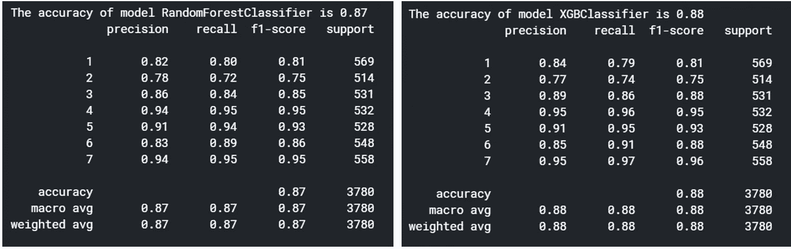

# 如何用几行代码训练和比较机器学习模型

> 原文：<https://towardsdatascience.com/how-to-train-and-compare-machine-learning-models-with-few-lines-of-code-b1d5e1e266dd?source=collection_archive---------42----------------------->

## 为您的项目选择最佳模型既简单又有趣！

有这么多选择，怎么只挑一个呢？[来源](https://unsplash.com/photos/Ejcuhcdfwrs)

在机器学习项目中，我们花费大量时间清理数据并为训练做好准备，这可以代表数据科学家所有工作的 80%以上，但当我们最终得到一个准备好建模的数据集时会发生什么，我们如何开始在其上训练不同的算法？不止如此，如何知道哪个更好？

在本教程中，我将向您展示如何做到这一点的一种方法，一次训练几个算法，然后如何使用一个度量来比较结果并选择最佳选项。我使用的所有代码都可以在[这里](https://www.kaggle.com/lucasmorato/technique-for-ml-model-selection)找到，重要的是要注意，这篇文章并不是详尽的，有几种可能性来训练和比较结果，这只是其中之一。

## 数据集

我们今天将使用 Kaggle 最受欢迎的分类问题数据集之一，[森林覆盖类型预测](https://www.kaggle.com/c/forest-cover-type-prediction)。该数据集约有 15，000 个观测值(行)和 100 多个要素(列)，包含有关地形、土壤类型、与道路的距离等多种信息。目标是在 7 个不同的类别中预测哪个封面类型是正确的。

让我们进入(随机)森林？[来源](https://unsplash.com/photos/-heLWtuAN3c)

## 让我向你介绍我们的模型！

现在，让我简单介绍一下我们今天要尝试的五种分类算法。由于重点不是详细解释每一个，我会留下几个链接，以防你想了解更多。

当我们有这么多漂亮的选项时，如何选择算法？[来源](https://www.google.com/url?sa=i&url=https%3A%2F%2Fgifer.com%2Fen%2FLbrU&psig=AOvVaw09rXl1hmoLPh3LQDWt9LBF&ust=1590400538803000&source=images&cd=vfe&ved=0CAIQjRxqFwoTCOCA-_adzOkCFQAAAAAdAAAAABAJ)

## 决策树

这是一种监督学习算法，通过创建决策规则来解决分类和回归问题。你可以在这里阅读更多关于它的[。](/decision-tree-algorithm-explained-83beb6e78ef4)

## 随机森林

与决策树一样，随机森林创建了一系列可用于分类和回归的规则，但在这种情况下，它创建了多个树，使用 bootstrap 聚合技术来创建随机组合。与简单的决策树相比，随机森林不太可能过度拟合训练数据，这是最常见的分类算法之一。更多信息请点击。

## k 近邻

顾名思义，在该方法中，每个数据点根据其“邻居”中最流行的标签进行分类。KNN 基本上是围绕着相似性的概念工作的。这里有[这篇](/machine-learning-basics-with-the-k-nearest-neighbors-algorithm-6a6e71d01761)优秀的文章，你可以找到更多关于它的内容。

## 支持向量机

该算法的工作原理是将数据点划分为超平面，这些超平面就像不同类别之间的边界。支持向量是影响超平面位置的数据点。这很难想象，但是[这个](/support-vector-machine-introduction-to-machine-learning-algorithms-934a444fca47)深入的解释让我们很容易更好地理解 SVM。

## XGBoost

XGBoost 代表极端梯度提升，不是指算法本身，而是指其背后的工程，旨在促进有效的计算使用和基于树的集成算法的最大速度。我们可以把它看作是随机森林的“进化”，它试图通过不同的技术来最小化它的错误。XGBoost 是竞赛中使用最多的算法之一，提供了又好又快的结果。点击了解更多信息[。](/https-medium-com-vishalmorde-xgboost-algorithm-long-she-may-rein-edd9f99be63d)

## 评估模型

现在，我们对将要使用的模型有了更多的了解，让我们选择如何评估它们。我们可以考虑的第一个指标是**精度**，它衡量算法正确预测一个类的频率。然而，**并不是最好的成功衡量标准**，因为当我们的班级不平衡时，它的效果很差。作为一个例子，考虑一个预测某人是否患有癌症的模型。一般来说，假设 99%的观察结果是负面的，只有 1%是正面的，那么如果你的模型总是预测负面的结果，它将有 99%的精度，但无法预测正面的结果，这是最重要的任务。告诉我们模型在所有真阳性中正确预测的频率的测量被称为**回忆**。如果你感兴趣，我以前写过一篇解释召回的文章，可以在[这里](/let-me-recall-you-this-accuracy-isnt-everything-in-machine-learning-8e3a84ce0a8)找到，你也可以在下图中直观地看到我刚才解释的内容:

精确度和召回率。[来源](https://en.wikipedia.org/wiki/Precision_and_recall)

为了检查每一类的精确度和召回率，我们今天使用了来自 *sklearn* 的一个名为[分类报告](https://scikit-learn.org/stable/modules/generated/sklearn.metrics.classification_report.html)的函数，它给出了这两个信息，加上 [f1 分数](https://en.wikipedia.org/wiki/F1_score)，这基本上是两个测量值之间的调和平均值。我强烈建议您阅读该文档，因为它详细展示了所有指标，并解释了如何根据您的需要对其进行微调。

## 现在有趣的部分是:编码！

代码很好玩！

如上所述，正如我在本文标题中所承诺的，我将在下面的代码中向您展示如何创建一个循环来尝试每种算法并显示相应的分类报告。我已经包括了我认为对阐明每个步骤很重要的所有注释:

正如您所注意到的，核心是一个循环 的 [*，上面有一些语句，这给了我们每个模型的总体准确性，加上带有精度、召回和 f1 分数的报告，因此我们可以更准确地比较性能。由于我们正在训练 5 个算法，结果将是 5 个报告，但是为了便于比较，我选择了具有最佳性能的两个，Random Forest 和 XGBoost，让我们看看它们相应的结果:*](https://www.datacamp.com/community/tutorials/for-loops-in-python?utm_source=adwords_ppc&utm_campaignid=9942305733&utm_adgroupid=100189364546&utm_device=c&utm_keyword=&utm_matchtype=b&utm_network=g&utm_adpostion=&utm_creative=229765585183&utm_targetid=dsa-929501846124&utm_loc_interest_ms=&utm_loc_physical_ms=1007850&gclid=CjwKCAjw_LL2BRAkEiwAv2Y3SdALDPYNKXyn5sGzUM1WRUvO9IMsB4ma5tnld1doKseWCs4X_Ig-vBoCJ3cQAvD_BwE)

我们路径的两个最佳模型:随机森林和 XGBoost。

报告看起来不错，不是吗？让我们一起来了解一下:

*   RF 的准确率为 87%,而 XGBoost 的准确率为 88%。然而，光是这些信息还不足以决定哪种模型是最好的。
*   看看 f1 分数栏。在这里，我们可以看到 XGBoost 在类别 3、6 和 7 上的表现优于 Random Forest。这意味着 XGBoost 可以在这些类中更准确地识别真正的阳性，并且**这是**一个相关的信息，我们可以使用它来选择 XGBoost 作为我们今天的获胜者！

我们有一个基于公正评判的获胜者！[来源](https://www.google.com/url?sa=i&url=https%3A%2F%2Fgiphy.com%2Fgifs%2Fusa-reasons-pageant-b12Vdx1cZC3kY&psig=AOvVaw2pC4d5rkmtZY9nRWPe_qF6&ust=1590508922599000&source=images&cd=vfe&ved=0CAIQjRxqFwoTCLj5wNWxz-kCFQAAAAAdAAAAABAN)

## 未来的步骤

到目前为止，我们所做的一切只是乐趣的开始！在选择了最有希望的模型之后，我们仍然需要执行更多的步骤，例如超参数调整，以提高模型的性能。根据我们目前所看到的，我们有一些关于我们可以进一步探索的线索，例如:

*   类别号 2 是具有最低精度和召回值的类别。也许值得尝试探索更多关于那个类的特性行为，以发现为什么我们在那里有糟糕的结果。
*   在我们的测试集中，我们使用了大约 3700 个数据点，占总数的 25%。如果我们增加或减少测试数据的数量，f1 的分数会改变吗？
*   如果我们更深入地挖掘数据清洗，去除离群值，并执行特征选择或降维技术，会发生什么？
*   我们可以在循环中包含的另一个有用信息是运行每个模型的时间度量，因为它是真实项目中的一个关键因素。

今天就到这里。如上所述，这是使用 *sklearn* 和一些基本 python 知识对模型性能评估的非详尽介绍。非常感谢你一直关注我，请在评论中告诉我你的想法，你喜欢尝试你的机器学习模型吗？

如果你想联系，请随时通过 [LinkedIn](https://www.linkedin.com/in/hey-i-am-lucas/) 和 [Twitter](https://twitter.com/lmmfrederico) 联系我！