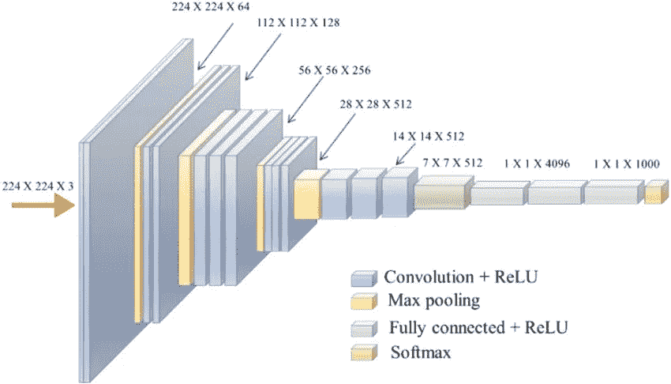

# 如何在 ImageNet 上训练 CNN

> 原文：<https://towardsdatascience.com/how-to-train-cnns-on-imagenet-ab8dd48202a9?source=collection_archive---------18----------------------->

## 使用大型图像数据集进行深度学习的实用指南

我将介绍如何获得 ImageNet 数据集，并在其上训练您的卷积神经网络。我添加了一些建议和学习，专门针对用 PyTorch 训练 CNN。

# **开始前**

如果您还没有这样做，我建议您首先尝试在样本图像上运行您的模型。当你开始的时候，跳到一个像 ImageNet 这样的大数据集来训练你的下一个艺术模型是非常诱人的。然而，我发现**从小处着手，慢慢扩大你的实验**更有效。首先，尝试一个图像，以确保您的代码正常工作。然后，尝试一个更小的数据集，如 CIFAR-10。最后，在 ImageNet 上试用一下。沿途进行健全性检查，并在每次“向上扩展”时重复这些检查。

此外，请注意一个数据集相对于另一个数据集的较小图像大小在模型中的差异。例如，CIFAR-10 只有 32x32 尺寸的图像，比 ImageNet 的可变图像尺寸要小。ImageNet 图像的平均分辨率为 469x387。在图像预处理步骤中，它们通常被裁剪为 256x256 或 224x224。

在 PyTorch 中，我们不像在 TensorFlow 中那样定义输入高度或宽度，因此您的工作是**确保输出通道大小在您的网络中适合给定的输入大小**。我的建议是要警惕降维是如何在你的网络中由浅入深地发生的，尤其是当你改变数据集的时候。



VGG-16 网络架构。输出通道的尺寸缩小(高 x 宽)。如果我们改变输入大小，会遇到什么错误？[来源:[https://bit.ly/36tOKUC](https://bit.ly/36tOKUC)]

一般来说，当您增加新数据集的输入分辨率时，早期感受野的大小也应该增加(通过增加内核大小或添加池层)。

这有两个原因:

1.  增加早期感受野的大小是一种规则化的形式，以保护你的 CNN 不去学习不太概括的图像的超具体细节。
2.  降低输入分辨率时，这将有助于避免通道尺寸过早缩小。对 256x1x1 大小的张量应用卷积是没有用的。

这两个错误都在*无声无息地*失败。当 ImageNet 形状的 ResNet 不适当地应用于 CIFAR-10 时，这些误差仅导致 top 1 精度下降**8%**。为了纠正这一错误，当从 CIFAR-10 迁移到 ImageNet 时，ResNet 作者添加了一个早期的 max-pool 层，并使用更大的初始内核大小(5x5 → 7x7)。

我真的很推荐阅读安德烈·卡帕西的这篇博文，对这门艺术有更深的直觉。我也推荐蒂姆·罗克塔舍尔的这篇博文[，给你一些短期 ML 项目的建议。](https://rockt.github.io/2018/08/29/msc-advice)

# **下载 ImageNet**

这最好在云环境中完成。除非你有一个强大的 GPU 和一个大的 SSD，否则我不建议在本地这样做。

在进行任何培训之前，启动 Google Colab 实例或 AWS SageMaker 实例，使用 Jupyter 笔记本来试验您的模型&可视化传入的数据。然后，当你想训练你的模型时，我建议使用一个脚本，并用 AWS [深度学习 AMI](https://aws.amazon.com/marketplace/pp/B077GF11NF) 构建一个 EC2 实例。将一个 EBS 实例连接到 EC2，并为下载&解压缩 ImageNet 提供足够的存储空间。对于 2012 ImageNet，压缩下载为 150GB。但是您将需要大约 400GB，因为您需要足够的空间来解压缩文件，然后删除。事后焦油。使用 EBS 实例还意味着您可以升级 EC2，而不必重新下载数据。

现在要真正下载 ImageNet，官方的说明是到你的研究机构[这里](http://image-net.org/download-images)报名成为研究员。

我不认为斯坦福大学已经保持这种状态很长时间了，因为你永远不会收到电子邮件邀请。所以，我发现有效的是从[学术洪流](http://academictorrents.com/)下载 ImageNet。

搜索 ImageNet，获取所需的 magnet 链接，并使用 CLI 下载 torrents with Transmission。确保您的实例可以访问互联网！

```
sudo yum install transmission transmission-daemon transmission-cli
```

然后设置你的下载目录

```
transmission-daemon --download-dir "your-download-directory-path"
```

并添加您的磁铁链接

```
transmission-remote -a "magnet-link"
```

在此找到其他重要命令[。](https://cli-ck.io/transmission-cli-user-guide/)

一旦您下载了压缩文件，我们希望将它们解压缩并放入正确的文件夹中，以便它们与 PyTorch ImageFolder 类所期望的相匹配，如文档[此处](https://pytorch.org/docs/stable/torchvision/datasets.html#imagefolder)所述。

将 ILSVRC2012_img_train.tar 和 ILSVRC2012_img_val.tar 放在与以下脚本相同的文件夹中，以获得所需的文件夹。根据需要为您的特定种子进行编辑。

我也建议两个都扔。在 S3 把柏油文件放到一个桶里，这样你下次就可以从那里拿到了。不要扔掉未压缩的文件，因为你要为 S3 上每个对象的单独请求付费。

# **设置数据加载器**

我建议在一个名为 dataset 的模块中设置 PyTorch 的 DataLoader 和 ImageFolder 的用法。我发现在不同的文件中保存数据集特定的扩充很容易。这里有一个使用 ResNet 的例子`[imagenet.py](http://imagenet.py)`。设置默认批量大小、归一化变换以及特定于该数据集的裁剪。也许在另一个像 [cifar10.py](http://cifar10.py) 这样的文件中，你可以使用特定于 cifar-10 的设置(不同的批量大小、归一化和裁剪)来装载数据集。

# **使用 ImageNet 进行培训**

我不建议在 Jupyter 笔记本上的 ImageNet 或 Sports1M 这样的大规模数据集上训练模型。您可能会超时，并且您的实例将从 stdout 断开，这将导致您看不到您的模型正在取得的进展。一个更安全的选择是在[屏幕](https://ss64.com/bash/screen.html)中使用一个脚本进行 ssh 和训练。

我还推荐使用 [neptune.ai](http://neptune.ai) 在一个简洁的可视化仪表板中跟踪进度。有些人用 TensorBoard 或 TensorBoardX 来做 pytorch，但我还没有试过。我喜欢 [neptune.ai](https://neptune.ai/) ,因为即使在我关闭实例后，它也能保留我的结果，并让我轻松地比较实验。

现在，将您的数据加载器与您的模型、您选择的优化器以及您选择的损失一起用于 ImageNet 训练。它看起来像下面伪代码的一些变体:

```
# one epoch
for i, (images, target) in enumerate(train_loader): # compute output
        output = model(images)
        loss = criterion(output, target) # measure accuracy and record loss
        acc1, acc5 = accuracy(output, target, topk=(1, 5))
        losses.update(loss.item(), images.size(0))
        top1.update(acc1[0], images.size(0))
        top5.update(acc5[0], images.size(0)) # compute gradient and do step
        optimizer.zero_grad()
        loss.backward()
        optimizer.step()
```

这只是为了训练。在带有验证函数的循环中使用该函数，以便在每个时期对验证集交替进行训练和评分。关于如何做到这一点的更多例子，请看官方 PyTorch 例子[这里](https://github.com/pytorch/examples)。

记得在数据进入你的网络之前至少看一次数据。这意味着实际观想它。下面是一个完整性检查示例，用于确保预处理过程中一切顺利。

为了完整起见，我在健全性检查上面添加了一些代码来生成反规格化变换(查看没有规格化效果的实际图像)。

现在享受训练的乐趣&通过理智检查保持你的理智！😄