# 如何在自定义对象检测数据上训练检测器 2

> 原文：<https://towardsdatascience.com/how-to-train-detectron2-on-custom-object-detection-data-be9d1c233e4?source=collection_archive---------7----------------------->

## 注:我们还在博客上发布了[如何培训检测员 2](https://blog.roboflow.com/how-to-train-detectron2/) 。在本帖中，我们将在这本[detector 2 Colab 笔记本](https://colab.research.google.com/drive/1-TNOcPm3Jr3fOJG8rnGT9gh60mHUsvaW#scrollTo=kc8MmgZugZWR)中，详细讲解如何训练 detector 2 检测定制对象。阅读后，您将能够通过只更改一行用于自定义数据导入的代码来训练您的 custom Detectron2 检测器！

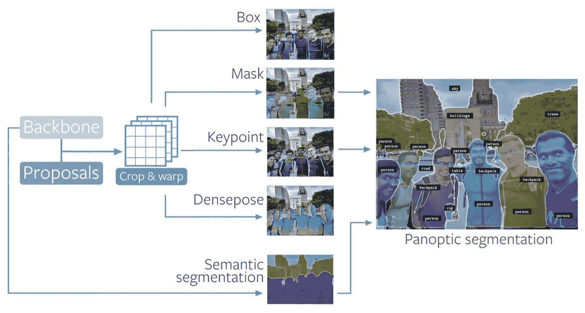

[Detectron2](https://ai.facebook.com/blog/-detectron2-a-pytorch-based-modular-object-detection-library-/) 提供了一个灵活的框架来训练和部署计算机视觉算法。

# 文章大纲

*   检测器 2 概述
*   我们的自定义数据集概述
*   安装检测器 2 依赖项
*   下载自定义检测器 2 对象检测数据
*   可视化探测器 2 训练数据
*   编写我们的 Detectron2 培训配置
*   运行检测器 2 培训
*   评估检测器 2 的性能
*   对测试图像运行 Detectron2 推理

# 定制检测器 2 培训资源

*   [实现自定义数据检测器 2 的 Colab 笔记本](https://colab.research.google.com/drive/1-TNOcPm3Jr3fOJG8rnGT9gh60mHUsvaW#scrollTo=wXisIbT1Zqou)
*   [公共血细胞检测数据集](https://public.roboflow.ai/object-detection/bccd)

# 检测器 2 概述

Detectron2 是一个流行的基于 PyTorch 的模块化计算机视觉模型库。这是 Detectron 的第二个版本，最初是用 Caffe2 编写的。Detectron2 系统允许您将最先进的计算机视觉技术插入到您的工作流程中。引用 [Detectron2 发布博客](https://ai.facebook.com/blog/-detectron2-a-pytorch-based-modular-object-detection-library-/):

```
Detectron2 includes all the models that were available in the original Detectron, such as Faster R-CNN, Mask R-CNN, RetinaNet, and DensePose. It also features several new models, including Cascade R-CNN, Panoptic FPN, and TensorMask, and we will continue to add more algorithms. We’ve also added features such as synchronous Batch Norm and support for new datasets like LVIS
```

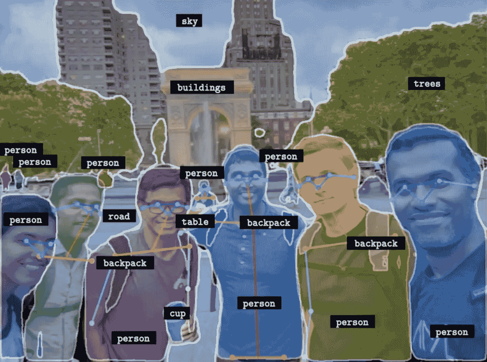

[检测器 2](https://ai.facebook.com/blog/-detectron2-a-pytorch-based-modular-object-detection-library-/) 中提供多种推理模式

在本帖中，我们回顾了如何针对**特别是对象检测**的自定义数据训练 Detectron2。不过，在你读完之后，你将会熟悉 Detectron2 的生态系统，并且你将能够推广到 Detectron2 中包含的其他功能。

# 我们的自定义数据概述

我们将在 Roboflow 免费托管的[公共血细胞检测](https://public.roboflow.ai/object-detection/bccd)数据上培训我们的 custom Detectron2 检测器。血细胞检测数据集是小型定制对象检测数据集的代表，人们可以收集该数据集来构建定制对象检测系统。值得注意的是，血细胞检测不是 Detectron2 中可用的功能——我们需要训练底层网络来适应我们的定制任务。

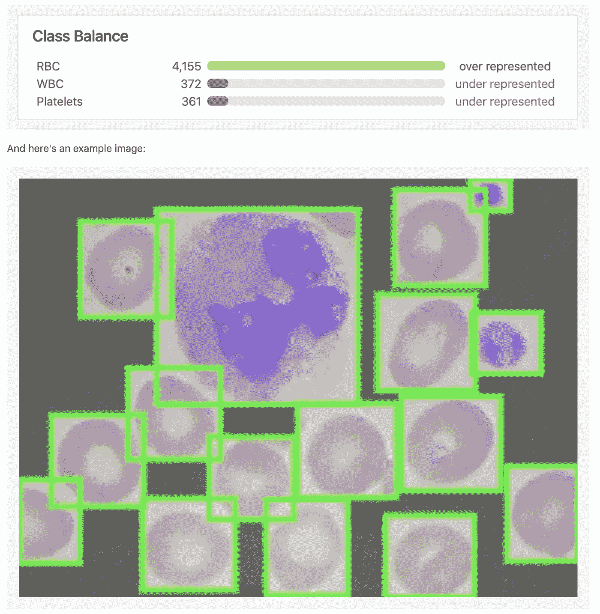

[公共血细胞检测数据](https://public.roboflow.ai/object-detection/bccd)

如果你想一步一步地跟随教程，你可以分叉这个[公共血细胞数据集](https://public.roboflow.ai/object-detection/bccd)。否则，你可以上传任何格式的数据集(详见下文)。

# 安装检测器 2 依赖项

首先，复制这个 [Colab 笔记本，它实现了对自定义数据](https://colab.research.google.com/drive/1-TNOcPm3Jr3fOJG8rnGT9gh60mHUsvaW#scrollTo=wXisIbT1Zqou)的检测器 2。Google Colab 为我们提供了免费的 GPU 资源，因此请确保通过检查运行时→更改运行时类型→ GPU 来启用它们。

为了开始训练我们的自定义检测器，我们安装了`torch==1.5`和`torchvision==0.6` -然后在导入`torch`后，我们可以检查 torch 的版本，并确保 GPU 可用于打印`1.5.0+cu101 True`。

然后我们 pip 安装 Detectron2 库并导入一些子模块。

```
!pip install detectron2==0.1.3 -f [https://dl.fbaipublicfiles.com/detectron2/wheels/cu101/torch1.5/index.html](https://dl.fbaipublicfiles.com/detectron2/wheels/cu101/torch1.5/index.html)import detectron2
from detectron2.utils.logger import setup_logger
setup_logger()# import some common libraries
import numpy as np
import cv2
import random
from google.colab.patches import cv2_imshow# import some common detectron2 utilities
from detectron2 import model_zoo
from detectron2.engine import DefaultPredictor
from detectron2.config import get_cfg
from detectron2.utils.visualizer import Visualizer
from detectron2.data import MetadataCatalog
from detectron2.data.catalog import DatasetCatalog
```

已安装 Detectron2 依赖项。

# 下载自定义检测器 2 对象检测数据

我们从 Roboflow 下载 COCO JSON 格式的自定义数据，只需一行代码——这是您需要修改的唯一一行代码，以便在您自己的自定义对象上进行训练！

注意:在本教程中，我们使用边界框导出对象检测数据。Roboflow 目前不支持语义分段注释格式。[报名](https://roboflow.ai)我们报名时会通知您。

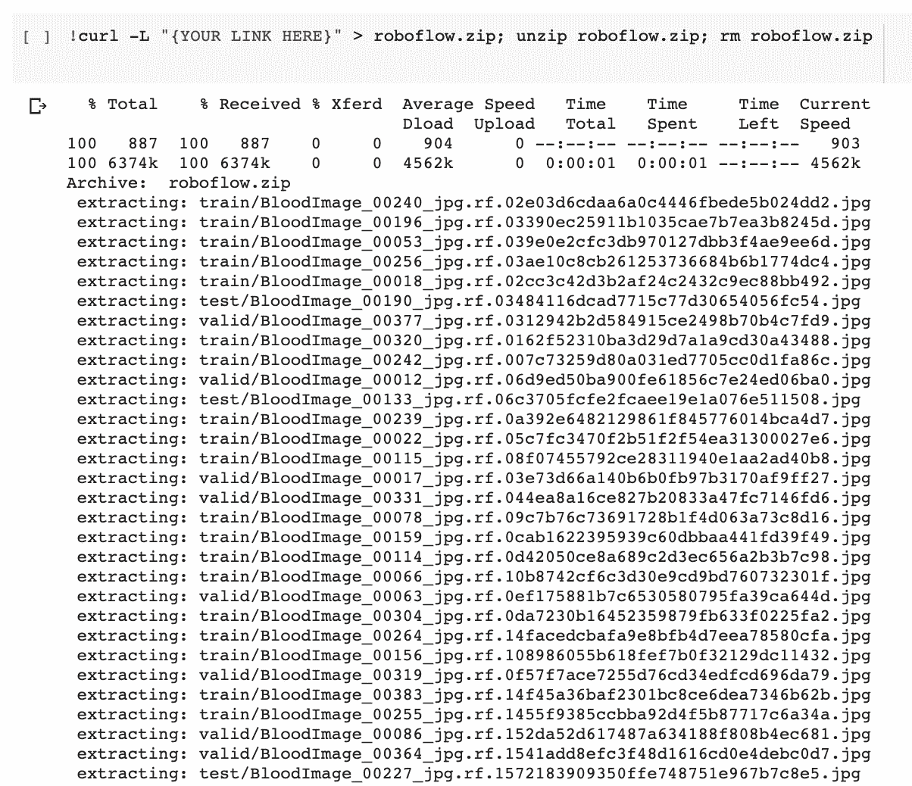

下载自定义数据集

如果你有**未标记的**图片，你首先需要标记它们。对于免费的开源标签工具，我们推荐以下指南:标签工具[入门指南](https://blog.roboflow.ai/getting-started-with-labelimg-for-labeling-object-detection-data/)或 CVAT 注释工具[入门指南。尝试标记约 50 张图像，以继续本教程。为了以后提高模型的性能，您将需要更多的标签。](https://blog.roboflow.ai/getting-started-with-cvat/)

您还可以考虑[从开放图像中构建一个自由对象检测数据集](https://blog.roboflow.ai/custom-open-images-datasets/)。

一旦您标记了数据，要将您的数据移动到 Roboflow 中，[创建一个免费帐户](https://app.roboflow.ai/)，然后您可以以任何格式拖动您的数据集:(VOC XML、COCO JSON、TensorFlow Object Detection CSV 等)。

上传后，您可以选择预处理和增强步骤:

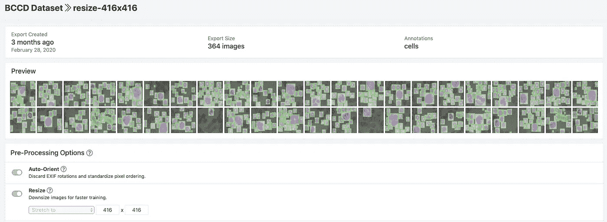

为 BCCD 数据集选择的导出设置

然后点击`Generate`和`Download`就可以选择 COCO JSON 格式了。

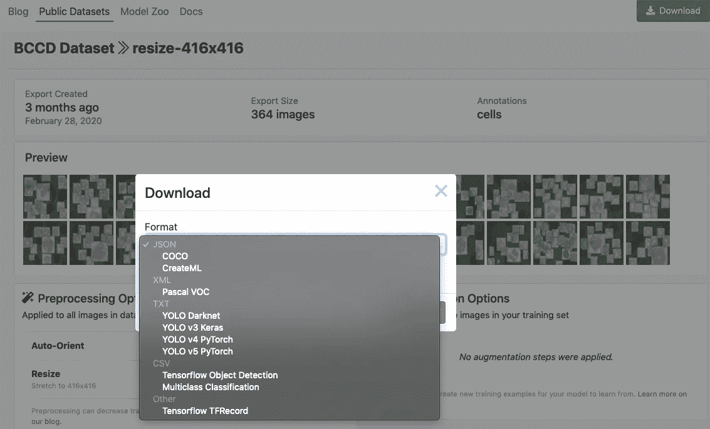

选择“COCO JSON”导出格式

出现提示时，请务必选择“显示代码片段”这将输出一个下载 curl 脚本，这样您就可以轻松地将数据以正确的格式导入 Colab。

然后，Detectron2 跟踪一个`registry`中可用数据集的列表，因此我们必须向 Detectron2 注册我们的自定义数据，以便可以调用它进行训练。

```
from detectron2.data.datasets import register_coco_instances
register_coco_instances("my_dataset_train", {}, "/content/train/_annotations.coco.json", "/content/train")
register_coco_instances("my_dataset_val", {}, "/content/valid/_annotations.coco.json", "/content/valid")
register_coco_instances("my_dataset_test", {}, "/content/test/_annotations.coco.json", "/content/test")
```

探测器 2 数据已注册。

# 可视化探测器 2 训练数据

Detectron2 可以轻松查看我们的训练数据，以确保数据已正确导入。我们通过以下方式做到这一点

```
#visualize training data
my_dataset_train_metadata = MetadataCatalog.get("my_dataset_train")
dataset_dicts = DatasetCatalog.get("my_dataset_train")import random
from detectron2.utils.visualizer import Visualizerfor d in random.sample(dataset_dicts, 3):
    img = cv2.imread(d["file_name"])
    visualizer = Visualizer(img[:, :, ::-1], metadata=my_dataset_train_metadata, scale=0.5)
    vis = visualizer.draw_dataset_dict(d)
    cv2_imshow(vis.get_image()[:, :, ::-1])
```

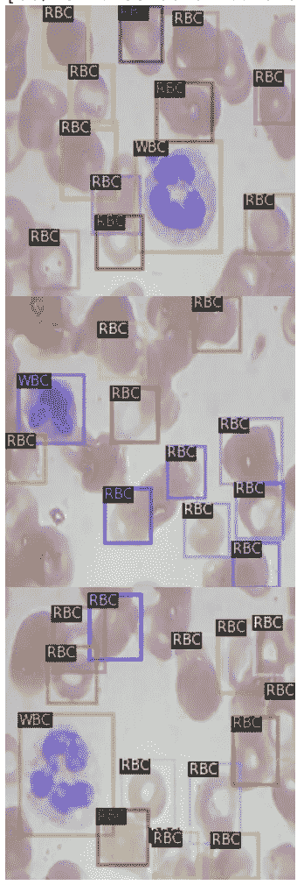

可视化训练数据

看起来我们的数据集注册正确。

# 编写我们的 Detectron2 培训配置

接下来，我们编写自定义培训配置。

```
cfg = get_cfg()
cfg.merge_from_file(model_zoo.get_config_file("COCO-Detection/faster_rcnn_X_101_32x8d_FPN_3x.yaml"))
cfg.DATASETS.TRAIN = ("my_dataset_train",)
cfg.DATASETS.TEST = ("my_dataset_val",)cfg.DATALOADER.NUM_WORKERS = 4
cfg.MODEL.WEIGHTS = model_zoo.get_checkpoint_url("COCO-Detection/faster_rcnn_X_101_32x8d_FPN_3x.yaml")  # Let training initialize from model zoo
cfg.SOLVER.IMS_PER_BATCH = 4
cfg.SOLVER.BASE_LR = 0.001cfg.SOLVER.WARMUP_ITERS = 1000
cfg.SOLVER.MAX_ITER = 1500 #adjust up if val mAP is still rising, adjust down if overfit
cfg.SOLVER.STEPS = (1000, 1500)
cfg.SOLVER.GAMMA = 0.05cfg.MODEL.ROI_HEADS.BATCH_SIZE_PER_IMAGE = 64
cfg.MODEL.ROI_HEADS.NUM_CLASSES = 4cfg.TEST.EVAL_PERIOD = 500
```

我们在这里调用的最大的设备是对象检测模型的类型——更快的大型 RCNN。Detectron2 允许你在决定你的模型架构时有很多选择，你可以在 [Detectron2 模型动物园](https://github.com/facebookresearch/detectron2/blob/master/MODEL_ZOO.md)中看到。

仅对于对象检测，以下模型是可用的:

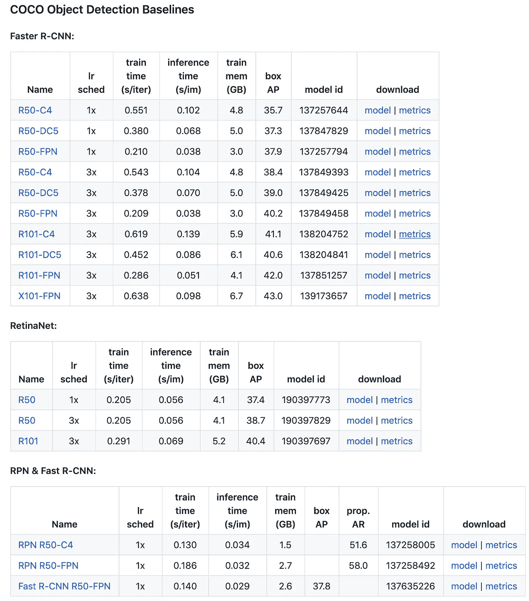

[探测器 2 模型动物园](https://github.com/facebookresearch/detectron2/blob/master/MODEL_ZOO.md)中可用的物体探测模型。

我们做的另一个大的配置选择是`MAX_ITER`参数。这指定了模型将训练多长时间，您可能需要根据您看到的验证指标上下调整。

# 运行检测器 2 培训

在开始训练之前，我们需要确保模型根据我们的验证集进行验证。不幸的是，默认情况下这不会发生🤔。

我们可以通过基于带有`COCO Evaluator`的`Default Trainer`定义我们的定制教练来轻松做到这一点:

```
from detectron2.engine import DefaultTrainer
from detectron2.evaluation import COCOEvaluatorclass CocoTrainer(DefaultTrainer):[@classmethod](http://twitter.com/classmethod)
  def build_evaluator(cls, cfg, dataset_name, output_folder=None):if output_folder is None:
        os.makedirs("coco_eval", exist_ok=True)
        output_folder = "coco_eval"return COCOEvaluator(dataset_name, cfg, False, output_folder)
```

好了，现在我们有了`COCO Trainer`，我们可以开始训练了:

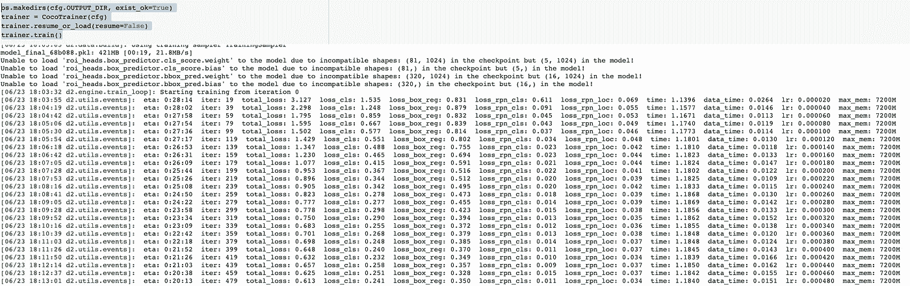

培养⏰

培训将持续一段时间，并在我们的验证集上打印出评估指标。好奇想知道什么图是用来评价的？查看这篇关于[分解图](https://blog.roboflow.ai/what-is-mean-average-precision-object-detection/)的文章。

一旦训练结束，我们可以继续进行评估和推断！

# 评估检测器 2 的性能

首先，我们可以显示一个结果的 tensorboard 来查看训练过程的执行情况。

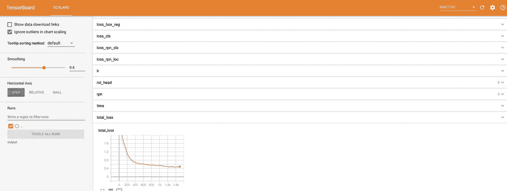

这里有很多有趣的指标——最著名的是`total_loss`和`validation mAP`。

我们在测试集上运行验证图中使用的相同评估过程。

```
from detectron2.data import DatasetCatalog, MetadataCatalog, build_detection_test_loader
from detectron2.evaluation import COCOEvaluator, inference_on_datasetcfg.MODEL.WEIGHTS = os.path.join(cfg.OUTPUT_DIR, "model_final.pth")
cfg.MODEL.ROI_HEADS.SCORE_THRESH_TEST = 0.85
predictor = DefaultPredictor(cfg)
evaluator = COCOEvaluator("my_dataset_test", cfg, False, output_dir="./output/")
val_loader = build_detection_test_loader(cfg, "my_dataset_test")
inference_on_dataset(trainer.model, val_loader, evaluator)
```

屈服:

```
Accumulating evaluation results...
DONE (t=0.03s).
 Average Precision  (AP) @[ IoU=0.50:0.95 | area=   all | maxDets=100 ] = 0.592
 Average Precision  (AP) @[ IoU=0.50      | area=   all | maxDets=100 ] = 0.881
 Average Precision  (AP) @[ IoU=0.75      | area=   all | maxDets=100 ] = 0.677
 Average Precision  (AP) @[ IoU=0.50:0.95 | area= small | maxDets=100 ] = 0.178
 Average Precision  (AP) @[ IoU=0.50:0.95 | area=medium | maxDets=100 ] = 0.613
 Average Precision  (AP) @[ IoU=0.50:0.95 | area= large | maxDets=100 ] = 0.411
 Average Recall     (AR) @[ IoU=0.50:0.95 | area=   all | maxDets=  1 ] = 0.392
 Average Recall     (AR) @[ IoU=0.50:0.95 | area=   all | maxDets= 10 ] = 0.633
 Average Recall     (AR) @[ IoU=0.50:0.95 | area=   all | maxDets=100 ] = 0.684
 Average Recall     (AR) @[ IoU=0.50:0.95 | area= small | maxDets=100 ] = 0.257
 Average Recall     (AR) @[ IoU=0.50:0.95 | area=medium | maxDets=100 ] = 0.709
 Average Recall     (AR) @[ IoU=0.50:0.95 | area= large | maxDets=100 ] = 0.439
[06/23 18:39:47 d2.evaluation.coco_evaluation]: Evaluation results for bbox: 
|   AP   |  AP50  |  AP75  |  APs   |  APm   |  APl   |
|:------:|:------:|:------:|:------:|:------:|:------:|
| 59.169 | 88.066 | 67.740 | 17.805 | 61.333 | 41.070 |
[06/23 18:39:47 d2.evaluation.coco_evaluation]: Per-category bbox AP: 
| category   | AP     | category   | AP     | category   | AP     |
|:-----------|:-------|:-----------|:-------|:-----------|:-------|
| cells      | nan    | Platelets  | 40.141 | RBC        | 60.326 |
| WBC        | 77.039 |            |        |            |        |
```

该评估将让您很好地了解新的 custom Detectron2 探测器在野外的表现。同样，如果你想了解更多关于这些指标的信息，请看这篇文章[分解图](https://blog.roboflow.ai/what-is-mean-average-precision-object-detection/)。

# 对测试图像运行 Detectron2 推理

最后，我们可以在真实图像上运行我们新的定制检测器 2 检测器！请注意，这些图像是**模特从未见过的**

```
cfg.MODEL.WEIGHTS = os.path.join(cfg.OUTPUT_DIR, "model_final.pth")
cfg.DATASETS.TEST = ("my_dataset_test", )
cfg.MODEL.ROI_HEADS.SCORE_THRESH_TEST = 0.7   # set the testing threshold for this model
predictor = DefaultPredictor(cfg)
test_metadata = MetadataCatalog.get("my_dataset_test")from detectron2.utils.visualizer import ColorMode
import globfor imageName in glob.glob('/content/test/*jpg'):
  im = cv2.imread(imageName)
  outputs = predictor(im)
  v = Visualizer(im[:, :, ::-1],
                metadata=test_metadata, 
                scale=0.8
                 )
  out = v.draw_instance_predictions(outputs["instances"].to("cpu"))
  cv2_imshow(out.get_image()[:, :, ::-1])
```

屈服:

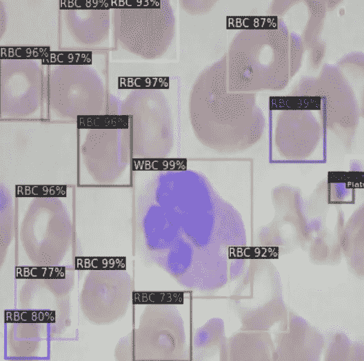

测试图像上的推断看起来相当不错！

我们的模型做出了很好的预测，表明它已经学会了如何识别红细胞、白细胞和血小板。

您可以考虑使用`SCORE_THRESH_TEST`来改变模型进行预测所需的置信度阈值。

您现在可以将权重保存在`os.path.join(cfg.OUTPUT_DIR, "model_final.pt")`中，以便将来通过导出到 Google Drive 进行推断。

您还可以在`outputs`对象中看到潜在的预测张量，以便在应用程序的其他地方使用。

# 结论

恭喜你！现在，您知道如何在一个全新的领域中训练您自己的 custom Detectron2 检测器。

看不到前进所需的结果？自从 Detectron2 模型动物园发布以来，对象检测模型已经得到了改进——可以考虑看看我们的一些其他教程，例如[如何训练 YOLOv5](https://blog.roboflow.ai/how-to-train-yolov5-on-a-custom-dataset/) 和[如何训练 YOLOv4](https://blog.roboflow.ai/training-yolov4-on-a-custom-dataset/) ，或者这篇关于[在 YOLO v5](https://blog.roboflow.ai/yolov5-improvements-and-evaluation/) 中的改进的文章。