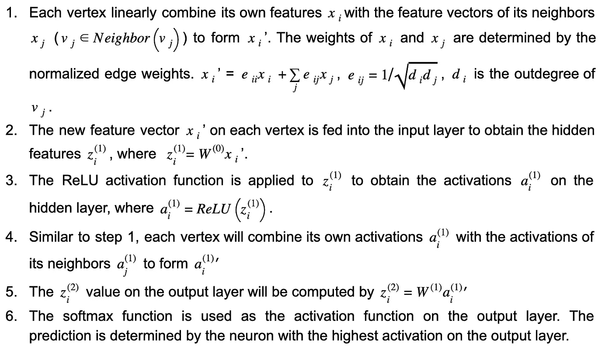
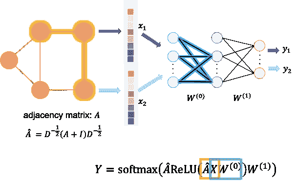
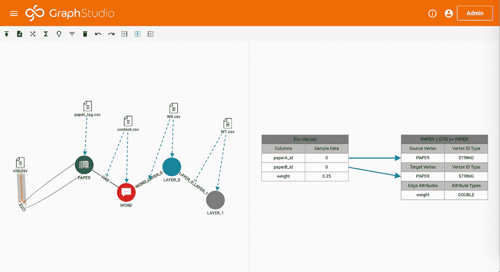
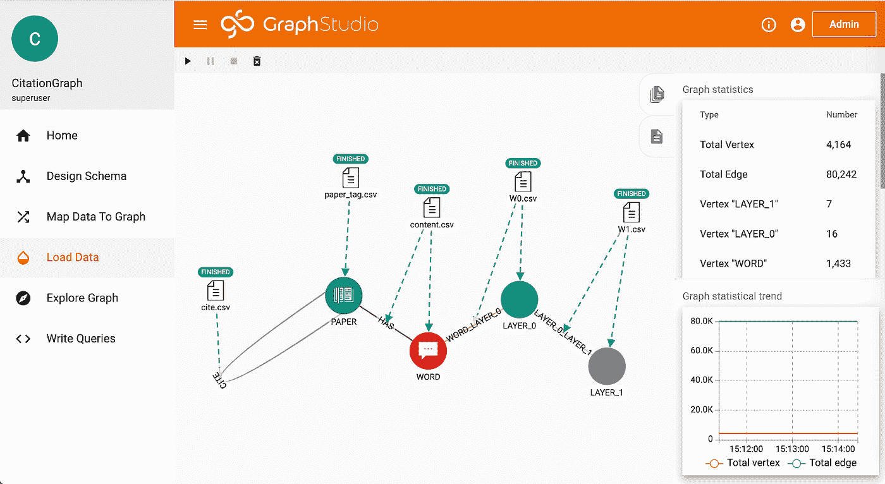
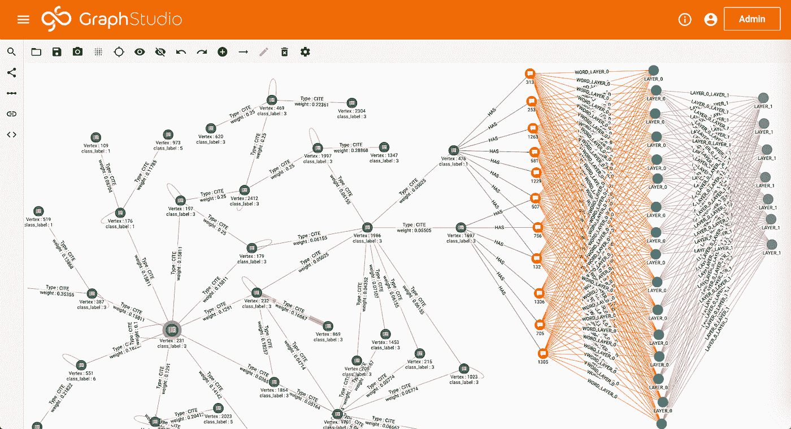
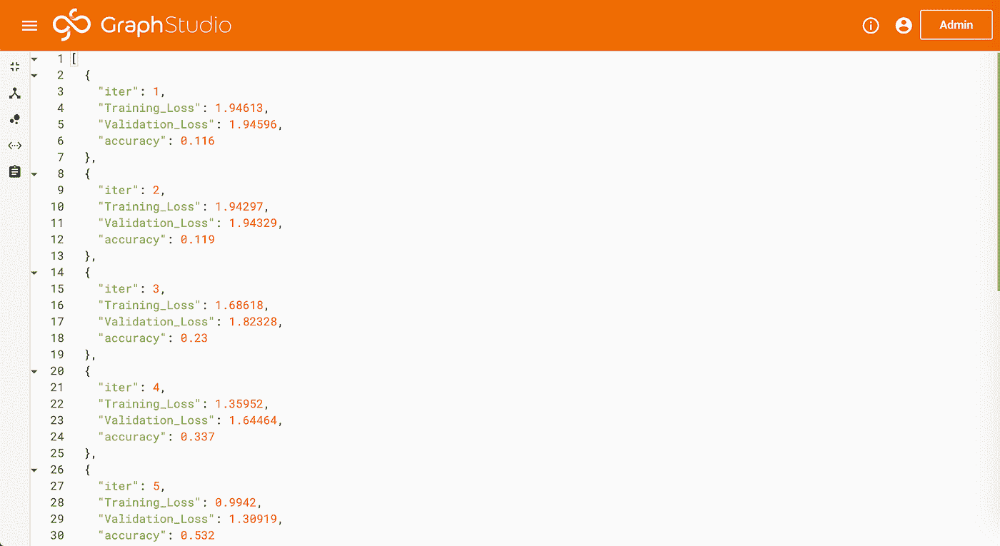
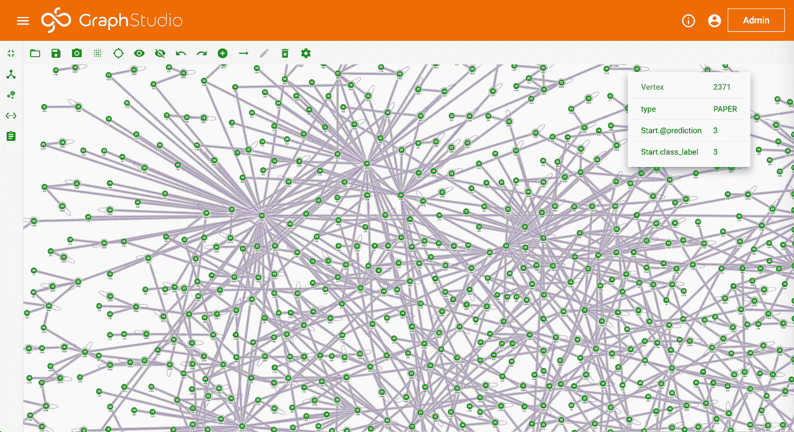
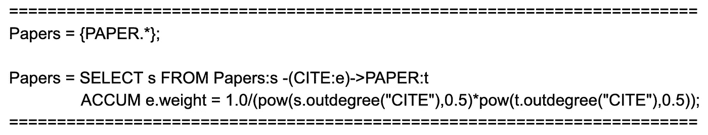
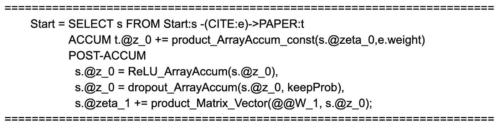
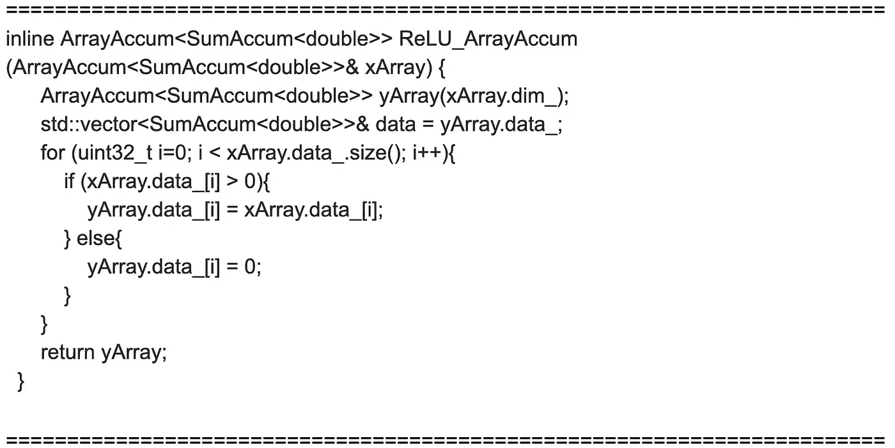

# 如何在图形数据库中训练图形卷积网络模型

> 原文：<https://towardsdatascience.com/how-to-train-graph-convolutional-network-models-in-a-graph-database-5c919a2f95d7?source=collection_archive---------19----------------------->

## [理解大数据](https://towardsdatascience.com/tagged/making-sense-of-big-data)

## 在图形数据库中训练 GCN 模型可以利用图形数据库的分布式计算框架。对于现实应用中的大型图形，这是一个可扩展的解决方案。

# 什么是图卷积网络？

典型的前馈神经网络将每个数据点的特征作为输入，并输出预测。利用训练数据集中每个数据点的特征和标签来训练神经网络。这种框架已被证明在各种应用中非常有效，例如人脸识别、手写识别、对象检测，其中数据点之间不存在明确的关系。但是，在某些用例中，当给定 *v* ( *i* )和 *v* ( *j* )之间的关系时，对于一个数据点 *v* ( *i* )的预测不仅可以由其自身的特征来确定，还可以由其他数据点 *v* ( *j* )的特征来确定。例如，期刊论文的主题(例如计算机科学、物理学或生物学)可以从论文中出现的单词频率中推断出来。另一方面，论文中的参考文献也可以在预测论文主题时提供信息。在这个例子中，我们不仅知道每个数据点的特征(词频)，还知道数据点之间的关系(引用关系)。那么我们如何将它们结合起来以提高预测的准确性呢？

通过应用图形卷积网络(GCN)，单个数据点及其连接的数据点的特征将被组合并输入到神经网络中。我们再以论文分类问题为例。在引用图(图 1)中，每篇论文由引用图中的一个顶点表示。顶点之间的边表示引用关系。为简单起见，这些边被视为无向的。每张纸及其特征向量分别表示为 *v_i* 和 *x_i* 。根据 Kipf 和 Welling [1]的 GCN 模型，我们可以使用具有一个隐含层的神经网络预测论文的主题，其步骤如下:

图一。(图片由作者提供)图卷积网络的架构。每个顶点 *vi* 代表引用图中的一篇论文。xi 是 *vi* 的特征向量。 *W* (0)和 *W* (1)是三层神经网络的权重矩阵。 *A* 、 *D、*和 *I* 分别是邻接矩阵、度矩阵和单位矩阵。水平和垂直传播分别以橙色和蓝色突出显示。

在上面的工作流中，步骤 1 和 4 执行水平传播，其中每个顶点的信息被传播到其邻居。而步骤 2 和 5 执行垂直传播，其中每层上的信息被传播到下一层。(参见图 1)对于具有多个隐藏层的 GCN，将会有水平和垂直传播的多次迭代。值得注意的是，每次执行水平传播时，顶点的信息在图上传播一跳。在本例中，水平传播执行了两次(步骤 2 和 4)，因此每个顶点的预测不仅取决于其自身的特征，还取决于距其 2 跳距离内的所有顶点的特征。此外，由于权重矩阵 W(0)和 W(1)由所有顶点共享，神经网络的大小不必随着图的大小而增加，这使得该方法可扩展。

# **为什么您需要一个 GCN 图形数据库**

**通过融合每个顶点的图形特征，GCN 可以以较低的标注率达到较高的准确率。**在 Kipf 和 Welling 的工作[1]中，使用图中 5%的标记顶点(实体)可以获得超过 80%的准确度。考虑到整个图在传播过程中需要参与计算，训练一个 GCN 模型的空间复杂度为 O(*E*+*V***N*+*M*)，其中 *E* 和 *V* 是图中的边数和顶点数， *N* 是每个顶点的特征数， *M* 是大小

对于工业应用来说，一个图可以有数亿个顶点和数十亿条边，这意味着邻接矩阵 *A* ，特征矩阵 *X* 和其他中间变量(图 1)在模型训练期间都可以消耗万亿字节的内存。这种挑战可以通过在图形数据库(GDB)中训练 GCN 来解决，其中图形可以分布在多节点集群中，并且部分存储在磁盘上。此外，图结构的用户数据，如社交图、消费图和移动图，首先存储在数据库管理系统中。数据库内模型训练还避免了将图形数据从 DBMS 导出到其他机器学习平台，从而更好地支持对进化训练数据的连续模型更新。

# **如何在图形数据库中训练 GCN 模型**

在本节中，我们将在 TigerGraph cloud 上提供一个图表数据库(带有免费层)，加载一个引用图表，并在数据库中训练一个 GCN 模型。按照下面的步骤，您将在 15 分钟内拥有一个纸张分类模型。

按照[创建您的第一个 TigerGraph 实例](https://www.tigergraph.com/2020/01/20/taking-your-first-steps-in-learning-tigergraph-cloud/)(前 3 个步骤)来**在 TigerGraph cloud** 上提供一个免费实例。在步骤 1 中，选择“图卷积网络”作为初学者工具包。在步骤 3 中，选择 TG.Free。(如果找不到初学者工具包，请参阅脚注)

按照[tiger graph 云门户](https://www.tigergraph.com/2020/01/20/taking-your-first-steps-in-learning-tigergraph-cloud/)入门和**登录 GraphStudio** 。在*将数据映射到图形*页面，您将看到数据文件是如何映射到图形的。在这个初学者工具包中， [Cora 引用数据](https://relational.fit.cvut.cz/dataset/CORA)文件已经上传到实例中。Cora 数据集有三个文件:

*   cite.csv 有三列，paperA_id、paper _ id 和 weight。前两列用于创建论文之间的引用边缘。CITE 边上的权重将由后续步骤中的查询更新，因此不需要加载最后一列。应该注意的是，这个初学者工具包中的文件为每篇论文添加了 self 链接，以简化查询实现。这与 Kipf 和 Welling 的方法一致[1]。
*   paper_tag.csv 有两列:paper_id 和 class_label。此文件中的每一行都将用于创建一个纸张顶点，其中包含文件中填充的纸张 id 和纸张类别。
*   content.csv 有三列:paper_id、word_id 和 weight。前两列用于在纸张和文字之间创建散列边缘。散列边缘将用于存储稀疏词袋特征向量。散列边上的权重将由后续步骤中的查询更新，因此不需要加载最后一列。

*(Image by Author)在 Map Data To Graph 页面，可以看到 csv 文件中的列是如何映射到引用图中的顶点和边的。*

**进入*加载数据*页面，点击*开始/恢复*加载**。加载完成后，您可以在右侧看到图表统计信息。Cora 数据集有 2708 篇论文，1433 个不同的词(特征向量的维度)，7986 个引用关系。每张纸都标有 7 种不同类别中的一种。

*(图片作者)在*加载数据页面，加载完成后，可以在右边看到图表统计。

在 *Explore Graph* 页面中，您可以看到我们刚刚在引用图的顶部创建了一个神经网络。引文图表中的每篇论文都与多个单词相关联。散列边缘上的权重因此形成稀疏特征向量。1433 个不同的单词连接到隐藏层中的 16 个神经元，隐藏层连接到输出层中的 7 个神经元(代表 7 个不同的类别)。

*(图片由作者提供)在浏览图形页面中，您可以使用“拾取顶点”和“从顶点展开”来显示图形中的顶点和边。*

在*编写查询*页面中，您会发现 GCN 所需的查询已经添加到数据库中。这些查询是用 TigerGraph 的查询语言 GSQL 编写的。**点击安装所有查询**将所有 GSQL 查询编译成 C++代码。您还可以在此页面上看到自述文件查询。按照以下步骤训练 GCN。

## **运行初始化查询。**

该查询首先通过将纸张 *i* 和 *j* 之间的权重指定为*e _ ij*= 1/(*d _ I***d _ j*)来归一化引用边缘上的权重，其中 *d_i* 、 *d_j* 是纸张 *i* 和纸张 *j* 的引用程度第二，它通过将纸张 *p* 和单词 *w* 之间的权重指定为*e*_*pw*= 1/*DP*来标准化 HAS 边缘上的权重，其中 *dp* 是纸张 *w* 的 HAS 出度。第三，它对 140、500 和 1000 个纸顶点进行采样，用于测试、验证和训练集。

## **运行权重 _ 初始化查询**

该查询使用 Glorot 和 Bengio 的方法初始化神经网络的权重[2]。神经网络的输入层有 1433 个神经元，对应于词汇量的大小，隐层有 16 个神经元，输出层有 7 个神经元，对应于论文的 7 个类别。

## **运行培训查询**

此查询使用 Kipf 和 Welling [1]中使用的相同超参数来训练图形卷积神经网络。具体来说，使用交叉熵损失、丢失正则化和 L2 正则化(5e-4)对第一层的模型进行评估。Adam 优化器已在此查询中实现，批处理梯度下降用于训练。查询完成后，将显示根据训练和验证数据评估的损失以及根据测试数据评估的预测准确性。如训练查询的输出所示，在 5 个训练时期之后，准确率达到 53.2%。为了更高的准确性，可以将历元数设置为查询输入。

(图片由作者提供)训练查询输出训练和验证数据集的交叉熵损失，以及每个训练时期的测试数据集的预测精度。

## **运行预测查询**

该查询将训练好的 GCN 应用于图中的所有论文，并将结果可视化。

(图片由作者提供)预测查询输出引用图中每篇论文的预测类和标记类。

## **GSQL 查询概述**

在最后一节中，我们将深入查询，看看 TigerGraph 的大规模并行处理框架是如何支持训练 GCN 的。简言之，TigerGraph 将每个顶点视为一个可以存储、发送和处理信息的计算单元。我们将选择查询中的一些语句来说明 GSQL 语句是如何执行的。

[**选择语句:**](https://docs.tigergraph.com/dev/gsql-ref/querying/select-statement#from-clause-vertex-and-edge-sets)

先来看查询*初始化*。第一行将初始化一个顶点集 Papers，它包括图中所有的 PAPER 顶点。在下一个 SELECT 语句中，我们将从顶点集开始，遍历所有引用的边。对于每条边(由 e 表示)，其边权重是从其源顶点(由 s 表示)和其目标顶点(由 t 表示)的外向度并行计算的。

[**累计和后累计**](https://docs.tigergraph.com/start/accumulators-tutorial#introduction)

现在我们来看看查询*培训*。下面的块执行水平和垂直传播。正如我们在上一节中讨论的，水平传播是我们将信息从每个顶点发送到它的邻居，这是由 ACCUM 之后的行完成的。它将每个目标顶点(由 t.@z_0 表示)的特征向量计算为其源顶点(由 s.@zeta_0 表示)的特征向量之和，并通过 e.weight 进行加权。它首先对每个顶点上的特征向量应用 ReLU 激活函数和丢失正则化。然后它将隐藏层特征(由 s.@z_0 引用)传播到输出层。同样，TigerGraph 将根据边和顶点并行化 ACCUM 和 POST-ACCUM 块中的计算。

[**用户自定义功能**](https://docs.tigergraph.com/dev/gsql-ref/querying/operators-functions-and-expressions#user-defined-functions)

激活函数用 C++实现，并导入到 TigerGraph 用户自定义函数库。下面是 ReLU 函数(ReLU_ArrayAccum)的实现

# 结论

在图形数据库中训练 GCN 模型利用了图形数据库的分布式计算框架。对于现实应用中的大型图形，这是一个可扩展的解决方案。在本文中，我们解释了 GCN 如何将每个节点的特征与图特征结合起来，以提高图中节点分类的准确性。我们还展示了一个使用 TigerGraph 云服务在引用图上训练 GCN 模型的分步示例。

# 参考:

[1]托马斯。n .基普夫和马克斯·韦林， *ICLR* (2017)

[2]格洛特和本吉奥(2010 年)

*如果“GCN 数据库内机器学习(引文图表)”初学者工具包不可用，您可以(1)在步骤 1 中选择“空白”初学者工具包。(2)按照步骤 2 和 3 登录 GraphStudio。(3)下载[GCNonCitationGraph.tar.gz](https://github.com/ChangranLiu/Machine-Learning-in-TigerGraph/blob/master/GCN/GCNonCitationGraph.tar.gz)和所有的。来自[https://github . com/changran Liu/Machine-Learning-in-tiger graph/tree/master/GCN](https://github.com/ChangranLiu/Machine-Learning-in-TigerGraph/tree/master/GCN)的/data 文件夹中的 csv 文件。(4)使用“导入现有解决方案”从 GraphStudio 主页导入. tar.gz 文件。(5)上传所有的。从映射数据到图形页面的 csv 文件。