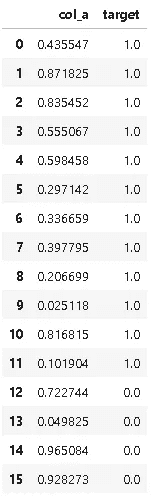
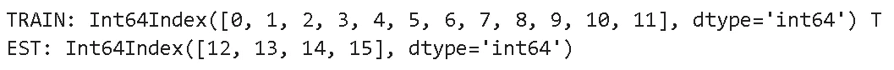
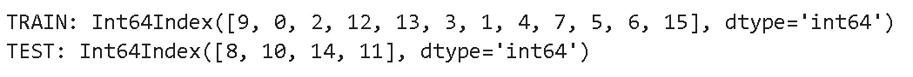
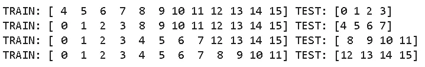
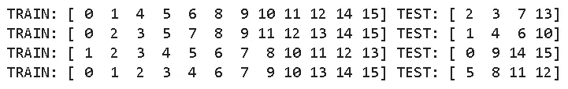
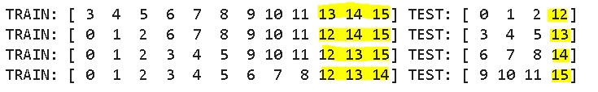
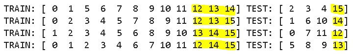

# 如何训练 _ 测试 _ 拆分:KFold vs StratifiedKFold

> 原文：<https://towardsdatascience.com/how-to-train-test-split-kfold-vs-stratifiedkfold-281767b93869?source=collection_archive---------3----------------------->

## 举例说明


伊丽莎白躺在 [Unsplash](https://unsplash.com/s/photos/divide?utm_source=unsplash&utm_medium=referral&utm_content=creditCopyText) 上

监督学习任务中使用的数据包含一组观察值的特征和标签。这些算法试图对特征(自变量)和标签(因变量)之间的关系进行建模。我们首先通过为一些观察结果提供特征和标签来训练模型。然后通过仅提供特征并期望它预测标签来测试模型。因此，我们需要将数据分成训练和测试子集。我们让模型在训练集上学习，然后在测试集上测量它的性能。

Scikit-learn 库提供了许多工具来将数据分成训练集和测试集。最基本的一个是 **train_test_split** ，它只是按照指定的划分比例将数据分成两部分。例如，**train _ test _ split(test _ size = 0.2)**将留出 20%的数据用于测试，80%用于训练。让我们看一个例子。我们将创建一个带有一个要素和一个标签的示例数据帧:

```
import pandas as pd
import numpy as nptarget = np.ones(25)
target[-5:] = 0df = pd.DataFrame({'col_a':np.random.random(25),
                  'target':target})df
```



然后我们应用 **train_test_split** 函数:

```
from sklearn.model_selection import train_test_splitX = df.col_a
y = df.targetX_train, X_test, y_train, y_test = train_test_split(X, y, test_size=0.2, shuffle=False)print("TRAIN:", X_train.index, "TEST:", X_test.index)
```



前 80%是训练，后 20%是测试集。如果我们将 **shuffle** 参数设置为真，数据将被随机分割:

```
X_train, X_test, y_train, y_test = train_test_split(X, y, test_size=0.2, shuffle=True)print("TRAIN:", X_train.index, "TEST:", X_test.index)
```



shuffle 的默认值为 True，因此如果我们不指定 shuffle 参数，数据将被随机拆分。如果我们希望分割是可再现的，我们还需要将一个整数传递给 **random_state** 参数。否则，每次我们运行 train_test_split 时，不同的索引将被拆分成训练集和测试集。请注意，输出中看到的数字是数据点的索引，而不是实际值。

数据是宝贵的资产，我们希望充分利用它。如果我们使用 train_test_split 来拆分数据，我们只能使用为培训而留出的部分来培训模型。随着训练数据量的增加，模型变得更好。克服这个问题的一个解决方案是**交叉验证。**通过交叉验证，数据集被分成 n 份。N-1 分割用于训练，剩余的分割用于测试。该模型遍历整个数据集 n 次，每次都使用不同的分割进行测试。因此，我们使用所有的数据点进行训练和测试。交叉验证也有助于更准确地衡量模型的性能，尤其是在新的、以前看不到的数据点上。

交叉验证中有不同的数据分割方法。常用的有**折叠**和**分层折叠**。

# **KFold**

顾名思义，KFold 将数据集分成 k 个折叠。如果 shuffle 设置为 False，连续折叠将是前一个折叠的移位版本:

```
X = df.col_a
y = df.targetkf = KFold(n_splits=4)for train_index, test_index in kf.split(X):
    print("TRAIN:", train_index, "TEST:", test_index)
```



在第一次迭代中，测试集是前四个索引。然后 KFold 不断移动测试集 k 次。如果 shuffle 设置为 True，那么拆分将是随机的。

```
kf = KFold(n_splits=4, shuffle=True, random_state=1)for train_index, test_index in kf.split(X):
    print("TRAIN:", train_index, "TEST:", test_index)
```



# **分层折叠**

StratifiedKFold 将交叉验证向前推进了一步。数据集中的类分布保留在训练和测试拆分中。让我们来看看我们的示例数据框架:


有 16 个数据点。其中 12 人属于 1 级，其余 4 人属于 0 级，因此这是一个不平衡的等级分布。KFold 没有考虑到这一点。因此，在类别分布不平衡的分类任务中，我们应该优先选择 StratifiedKFold 而不是 KFold。

0 类和 1 类的比例是 1/3。如果我们设置 k=4，那么测试集包括来自类 1 的三个数据点和来自类 0 的一个数据点。因此，训练集包括来自类 0 的三个数据点和来自类 1 的九个数据点。

```
skf = StratifiedKFold(n_splits=4)for train_index, test_index in skf.split(X, y):
    print("TRAIN:", train_index, "TEST:", test_index)
```



等级 0 的指数是 12、13、14 和 15。正如我们所看到的，数据集的类分布保留在分割中。我们也可以对 StratifiedKFold 使用洗牌:

```
skf = StratifiedKFold(n_splits=4, shuffle=True, random_state=1)for train_index, test_index in skf.split(X, y):
    print("TRAIN:", train_index, "TEST:", test_index)
```



另一种用于分割的方法被称为“留一个出来”，该方法仅使用一个数据点进行测试，剩余的数据点用于训练。Scikit learn 有 **LeaveOneOut** 类来执行这种类型的分区。

最后，我想提一下 scikit 提供的另一个重要工具——learn，即 [**cross_val_score。**](https://scikit-learn.org/stable/modules/generated/sklearn.model_selection.cross_val_score.html)

Cross_val_score 获取数据集并应用交叉验证来拆分数据。然后，使用指定的估计器(如逻辑回归、决策树等)训练模型，并测量模型的性能(评分参数)。

感谢您的阅读。如果您有任何反馈，请告诉我。