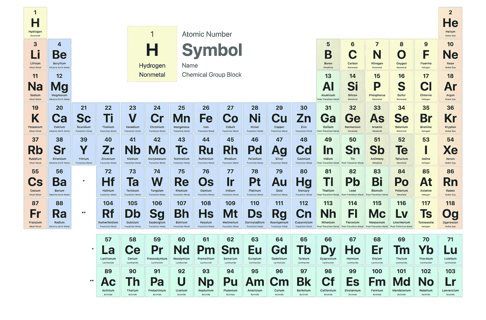
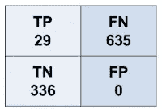

# 如何训练回归而不失去真实感

> 原文：<https://towardsdatascience.com/how-to-train-your-model-and-not-to-lose-a-sense-of-reality-252351b89824?source=collection_archive---------31----------------------->

## 培训和分析中的常见陷阱


詹姆斯·霍姆通过[皮克斯贝](https://pixabay.com/photos/windmills-don-quixote-windmill-hill-1924129/)拍摄的照片(CC0)

*在无所不包的人工智能时代，如果我们有足够的数据，很容易陷入机器学习(ML)可以最终解决任何问题的想法。在这里，以一个大的带标签的数据集为例，我们发现当大量的数据不够时，没有领域专业知识的 ML 的直接应用是如何误导的，以及我们有什么工具来避免错觉。*

**大纲**
-材料科学中的数据科学
-特征化
-用神经网络回归
-范畴分类
-随机森林能表现得更好吗？
-混淆矩阵
-数据扩充&分析

我们想要解决的一个问题存在于组合学、概率和材料科学中。为了在技术上取得进步，我们需要发现新的更高效的材料:磁铁、压电材料、你刚刚在屏幕上触摸向下滚动的透明导电氧化物，或者其他许多材料。大多数现代材料是多组分的，由三种或三种以上的原子元素组成。随着集合中元素数量的增加，组合搜索很快变得难以处理。为了进一步测试研究人员的士气，不是所有的原子组合都能产生稳定的成分，更不用说功能性的了。



图二。原子元素周期表。一组随机的原子会形成一种新材料吗？

经过几十年的研究和实验，我们已经收集了超过 200，000 种材料的数据库[1]，其中几千种材料由不同的原子组成，这将构成我们的训练数据集。我们的目标是预测一组新的原子是否可能富含新的稳定物质。

## 特色化

为了尽可能多地编码关于一组元素的信息，可以使用元素描述符:原子序数、质量、价电子数等来产生候选集合的多维向量。我们可以从参考文献中选择 40 种不同的原子描述符。2，构成 4 个元素的候选集合的 160 个特征。

> 高度相关的特征增加了复杂性，同时没有提供额外的描述。一个好的做法是确保描述符是正交的和可缩放的。

来自实验数据库的目标是由一组特定元素组成的大量实验验证的稳定材料——对于一些组，它小到 1，对于另一些组，大到 162。

```
# An example of featurisation
import numpy as np
def symbols2numbers(data, symbols, tables):
    ''' Featurisation of atomic sets into a n-dim vectors 
        data are atomic sets of interests
        symbols are atomic symbols
        tables are tabulated elemental descriptors, i.e.
        atomic numbers, masses, etc.''' transit = [ {} for i in range(len(tables))]
    for i, table in enumerate(tables): 
       transit[i]  = {sym: num for sym, num in zip(symbols, table)}

    vectors = []
    for set in data:
        for atom in set: 
            numbers = [t[atom] for t in transit]
        vectors.append(numbers)
    return np.asarray(vectors)
```

## 回归

我们将尝试训练一个深度神经网络(NN)来识别一组元素的 160 个特征的函数形式，从而产生许多[一组的稳定成分]。我们从实验神经网络架构开始——向层中添加节点并将层堆叠起来。我们的度量是回归损失函数。我们也可以试验它的形式，但是具有均方误差(mse)的稳定解决方案应该足以看到损失很大，更糟糕的是，它不会随着训练的进行而减少。

> 在选择验证集时，必须小心谨慎。具有多个时期和自适应学习率的大型 NN 可以减少训练期间的损失——事实上，如果验证损失仍然很大，这可能只是过度拟合的迹象。

将自适应 momenta optimizer (Adam)更改为随机梯度下降，并将内斯特罗夫 momenta 更新作为最后手段，说服我们回到我们应该开始的地方——分析用于训练的可用数据。

```
# Implementation of a NN with one hidden layerfrom keras.model import Sequential
from keras.layers import Dense, Dropout
from keras.callbacks import ReduceLROnPlateau
from sklearn.preprocessing import StandardScalerx_train = symbols2numbers(data, symbols, tables)
x_train = StandardScaler().fit_transform(x_train)
original_dim = x_train.shape[1]model = Sequential()
model.add(Dense(
    original_dim,
    activation='relu',
    input_shape=(original_dim,),
    activity_regularizer=l2(0.1)))
model.add(Dropout(0.2))
model.add(Dense(
    original_dim,
    activation='relu',
    input_shape=(original_dim,),
    activity_regularizer=l2(0.1)))
model.add(Dropout(0.2))
model.add(Dense(1))
model.compile(loss='mse',optimizer='adam')rlr = ReduceLROnPlateau(
         monitor='val_loss',
         factor=0.2, patience=10, min_lr=1e-8)
model.fit(x_train, y_train,
        batch_size=30,
        shuffle=True,
        validation_split=0.1,
        epochs=100,
        callbacks=[rlr])
checkback = model.predict(x_train)
```

## 分类

我们的数据严重不平衡:超过 50%的 4 原子组只有 1 个稳定的组成。为了改善平衡，我们可以通过增加稳定成分的数量来将数据分成标记组。

> 回归依赖于数据平衡。如果数据删减或增加是不可能的，将数据分成不同的类别可能会实现分类。

因此，我们将损失函数改为分类交叉熵，将“softmax”激活添加到输出层，并重新训练 NN 进行分类。这减少了几次交互后的验证损失函数，但是模型仍然不足:它将所有原子集作为最有可能的集合归入第一组。

我们可以进一步简化任务，将数据分成两半:一个和多个稳定成分——现在两组平衡，第一组(一个稳定成分)的目标为 0，第二组(多个稳定成分)的目标为 1。损失函数:二元交叉熵。再培训。不合身。所有人的概率相等:55%对 45%。

## 随机森林能表现更好吗？

这是一个流行的问题。诚实的回答是，视情况而定。众所周知，具有大型决策树集合的随机森林(RF)分类器可以防止过拟合，并适于特征工程，例如处理缺失值。此外，RF 还可以用于多项选择分类和回归，这使得该模型在各种应用中具有通用性[3]。

```
from sklearn.model_selection import cross_val_score as cvs
from sklearn.model_selection import RepeatedStratifiedKFold as RSKF
from sklearn.ensemble import RandomForestClassifier as RF
from sklearn.preprocessing import StandardScaler, LabelEncoderdef evaluate(model, x, y)
''' Model evaluation in cross-validation '''
    cv = RSKF(n_splits=5, n_repeats=3, random_state=1)
    scores = cvs(model, x, y, scoring='accuracy', cv=cv, n_jobs=4)
    return scoresx_train = symbols2numbers(data, symbols, tables)
x_train = StandardScaler().fit_transform(x_train)model = RF(n_estimators=1000)
scores = evaluate(x_train, y_train, RF(n_estimators=1000))
model.fit(x_train,y_train)
checkback = model.predict(x_train)
```

使用默认的超参数，在交叉验证中对模型的评估证明了 70%的准确性。对保留的 1000 个标记数据条目(在训练期间没有暴露给模型)的预测产生以下混淆矩阵，



从中我们计算出相关的度量:
精度= TP/(TP+FP)= 100%
NPV = TN/(TN+FN)= 35%
召回= TP/(TP+FN)= 4%
TNR = TN/(TN+FP)= 100%
准确率= (TP + TN) /总计= 37%

> 当与其他指标分开考虑时，定量指标(如准确度或精确度)可能会产生误导，因为它们并不总是您模型的最佳指标。

F1 =精度*召回率/ 2(精度+召回率)= 22%
平衡精度= (TPR + TNR) /2 = 52 %

在我们的模型中，精度很高，因为零假阴性。然而，我们对预测尽可能多的真阳性感兴趣，因为这些是产生多种稳定成分的原子集合。但是召回的车型太少了。
所以一节问题的答案是

> 在特定的问题设置中，RF 可以胜过 NN。通过在 scikit-learn 中作为黑盒模型的简单实现，RF 可以是建立基本线的分类器的首选。

## 数据扩充、分析和结论

有许多数据扩充技术可以通过增强机器学习和促进优化来击败欠拟合。一些技术，例如图像反射，也有助于评估模型，因为您可能会对反射图像有相同的预测。

> 数据扩充可以通过改进优化来帮助克服欠拟合。一些增强方法，例如图像反射，也有助于评估。

在我们的问题中，我们可以通过原子集的排列来增加数据流形，因为你选择原子形成新材料的顺序不应该影响结果。观察具有排列不变性的真阳性，我们发现它们的数量甚至更少，最终丢弃该模型。

总之，在上述假设的基础上，仅仅通过观察组成原子集合来预测丰富物质相的 ML 的雄心勃勃的目标是无法实现的。这里的一个薄弱环节不是我们拥有的数据量，而是数据不完整的事实:我们的标签(报告的情况)很可能是错误的，因为我们并不真正知道自然实际上允许给定原子集有多少稳定的组成。这并不奇怪，毕竟，大多数原子集合只被报道一次，因为实验者倾向于竞相发现新的相位场。

在科学传统中，有一个确实是最积极的，那就是不报告失败。这对于数据有偏差效应(没有负面影响),并且不利于进步的速度，因为我们不可避免地会沿着错误的路线前进，这些错误的路线可能已经被发现了多次，但是被保密了。我希望，上面描述的常见陷阱和问题设置列表将有助于在一个面向数据的时代减轻积极传统的影响。

## 参考

[1] [无机晶体结构数据库](https://icsd.products.fiz-karlsruhe.de/)
【2】A Seko，A Togo，I Tanaka，[材料数据机器学习的描述符](https://link.springer.com/chapter/10.1007/978-981-10-7617-6_1)，纳米信息学。新加坡斯普林格。
【3】Saimadhu pola muri，[随机森林在机器学习中如何工作](https://dataaspirant.com/2017/05/22/random-forest-algorithm-machine-learing/)。