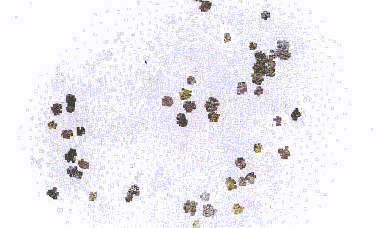
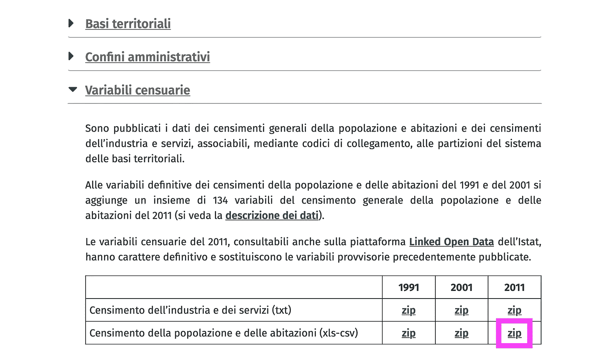

# 开始数据科学之旅的五个数据集

> 原文：<https://towardsdatascience.com/how-to-train-your-unicorn-b6b4f4d50aa2?source=collection_archive---------54----------------------->

## 以及一些分析思路


图片来自 [Pixabay](https://pixabay.com/?utm_source=link-attribution&utm_medium=referral&utm_campaign=image&utm_content=4074377) 的[我和我自己](https://pixabay.com/users/me-myself-and-I-11915877/?utm_source=link-attribution&utm_medium=referral&utm_campaign=image&utm_content=4074377)

W 借助一点想象力，数据科学家可以被视为“*数据*的全栈开发者”。就像全栈开发人员拥有从后端到前端的横向知识一样，**数据科学家需要了解数据工程和业务领域之间的一切**。这样的专业人员需要精通几个领域，如数据工程、数据可视化、机器学习、统计学。此外，他/她需要是一个主题专家。

我相信，一个人在这个世界上开始他/她的旅程可能会面临两个主要挑战:

*   **挑战 1:如何学习和训练所有需要的技能—** 当谈到“如何做”*我不清楚*时*:我不认为有单一的学习方法或单一的改进方法，**然而有多种方法对每个人都有不同的作用**:最好的办法是找到适合我们自己的**完美组合**。*
*   **挑战 2:如何获得面试成功的经验** —这很难，尤其是如果一个人试图从另一个领域(例如软件开发)过渡到数据科学。

我对学习的完美组合包括理论学习和实践经验，但比例肯定倾向于后者，因为我是一个边做边学的人。我还认为“做事”在找工作时会有帮助(尤其是对那些初次经历的人)；您希望在以下两者之间给出什么答案:

*   “我有一个**数据科学学位**，这将是我的第一份工作经历”。
*   “我有一个**数据科学学位**，这将是我的第一份工作经历；**在申请工作时，我参与了一个模拟 Hadoop 日志**消息流的项目；这些被摄取到一个 **Spark 数据管道中，该管道提取一些基本信息**(例如错误、时间属性等。)，把一切都写在储存在 HDFS 的拼花文件里。在这些信息的基础上，我创建了一个 Tableau dashboard ,旨在识别 Java 异常中的模式(例如，当它们发生时，最常见的错误，等等)。).**如果你想看看代码**，这里有 Tableau 公共链接和 GitHub。

**学位和课程是绝对必要的**你应该尽可能多的学习，但是你可能会同意一些展示你技能的实际例子**会有所帮助！**

# 那又怎样？

我在本文中分享的是**五个数据集，我认为它们对学习和实践都非常有帮助**。这一选择背后的想法是让数据来自不同的领域，易于使用，但并非没有挑战。让我们深入其中吧！

## 有史以来最好的艺术品

一个很不错的数据集是用户 Icaro ( [**下载**](https://www.kaggle.com/ikarus777/best-artworks-of-all-time) )上传的 **Kaggle 有史以来最好的艺术品。如描述中所述，*该数据集包含三个文件:***

*   ***artists . CSV****:每个艺人的信息数据集*
*   ***images . zip****:图片集合(全尺寸)，分文件夹，顺序编号*

**如果这些数据被输入到人工智能模型中(大多数神经网络需要非常小的图像)，调整大小的图片可以方便地加速预处理。注意“*数据是 2019 年 2 月底期间从*[*art challenge . ru*](http://artchallenge.ru/?lang=en)*”*[*1*](https://codesandbox.io/s/autumn-smoke-i6vt1?autoresize=1&fontsize=14&hidenavigation=1&moduleview=1&theme=light&view=preview)*【刮出来的。***

**关于如何使用这个数据集的一个想法可能是**用 ConvNets** 做实验来建立一个分类器，给定一张图像，它可以识别作者；另一个应用可以是使用艺术品来实现一个 [**神经风格转移 GAN**](https://medium.com/tensorflow/neural-style-transfer-creating-art-with-deep-learning-using-tf-keras-and-eager-execution-7d541ac31398) 。图像也是构建良好数据可视化的基础**:为什么不实现一个根据某种逻辑连接艺术品的图形呢？几年前，[**我用一个类似的数据集玩得很开心，分析波洛克的画**](/clustering-pollock-1ec24c9cf447?utm_source=tr.im&utm_medium=no_referer&utm_campaign=tr.im%2F1ec24c9cf447&utm_content=direct_input) 。****

****为了展示在**几个小时**内可以完成什么，在下面的例子中，我使用了在 ImageNet 上训练的 **ResNet50 来从每幅作品中提取特征**。这是通过去除神经网络的最后一层并收集顶层之前的神经元的输出来完成的；该输出将是我们的“特征向量”(我们将为每幅图像准备一个向量)。****

****在特征提取之后，我使用了 PCA 和 tSNE 的**组合来将高维向量投影到二维空间上**。最后，我运行了 **DBSCAN 来识别一些集群**；正如你从下面的 GIF 中看到的，**即使我没有进行微调，该算法也能够理解输入图像**(褪色的缩略图是那些被 DBSCAN 标记为噪声的缩略图)。****

********

****如果你想下载完整的结果， [**这是**](https://tr.im/5bxhJ6KwXyLR) 的链接。****

## ******伦敦警察厅——武力的使用******

****我认为这个数据集很有趣，因为它有相当多的维度。它包含了伦敦警察厅关于使用武力的统计数据。*每一行集合代表一名军官在一个主题上使用武力。* ***此行设置的不是一个计数事件*** *。如果不止一名官员对同一主题使用武力，这将显示在单独的数据行* [ [2](https://data.london.gov.uk/dataset/use-of-force) ]中。****

****这些数据可以驱动到非常引人注目的仪表板上，并且，稍加努力，还可以驱动到 ML 模型上(例如，预测涉及使用武力的警察干预的结果)。还要注意，时间维度是进行时间序列分析的必备工具。****

## ****意大利 2011 年人口普查****

******我想在这个列表中加入一些人口普查数据**。*人口普查是系统地获取和记录给定人口成员信息的过程，大多数国家都有某种统计机构，定期收集整个人口的数据。我这里建议的是**意大利 2011 年人口普查数据集** ( [**下载**](https://www.istat.it/it/archivio/104317) )。*****

****我想包含这类数据有两个主要原因:****

1.  ******它允许玩 GIS** (地理信息系统)——我上面链接的下载页面，也包含了 2011 年所有人口普查部分的[shape file](https://en.wikipedia.org/wiki/Shapefile)，它代表了意大利领土的一个相当精细的划分。Shapefile 是*一种数字矢量存储格式，用于存储几何位置和相关属性信息[*[*4*](https://github.com/logpai/loghub)*。这些可以用来表示地图上的指标:[**传单**](https://leafletjs.com/) **或者**[**OpenStreetMaps**](https://www.openstreetmap.org/#map=7/53.465/-8.240)**都是处理这类数据的很好的 JavaScript 库**。*****
2.  *******在许多现实生活的应用中，您希望在分析中包含人口数据**。大多数人口普查彼此之间都非常相似，所以我认为习惯它们是个好主意！*****

*****要开始使用数据库，请访问我提供的[链接](https://www.istat.it/it/archivio/104317)并下载下面的文件:*****

**********

*****zip 存档包含 20 个意大利地区的每个地区的一个文件，名称模板是`R<n>_indicatori_2011_sezioni.csv`，其中`R<n>`是地区号。**列被描述在一个名为** `**tracciato_2011_sezioni.csv**`的文件中。*****

*****不幸的是，**该数据集似乎没有英文版本**，所以你可以选择利用谷歌来翻译栏目名称，或者使用另一个国家的人口普查:)*****

## *****拼图毒性评论分类挑战*****

*****第四个数据集来自一个老 Kaggle 比赛( [**下载**](https://www.kaggle.com/c/jigsaw-toxic-comment-classification-challenge/data) )。主持人*提供了大量维基百科评论，这些评论已经被人类评分员标记为有毒行为。毒性的类型有*:*****

```
***toxic
severe_toxic
obscene
threat
insult
identity_hate***
```

*****目的是*创建一个模型来预测每条评论的每种毒性的概率[*[*5*](https://www.kaggle.com/c/jigsaw-toxic-comment-classification-challenge/data)*]。******

*****如果你想深入研究 **NLP** 和**递归神经网络深度学习**，我相信这是一个很好的起点。为了使建模更有趣，您可以尝试**不同的预处理技术、网络拓扑和数据丰富**(为什么不使用 Google APIs 将维基百科的评论翻译成另一种语言，然后重新翻译回英语以获得更多的训练数据呢？).*****

*****这个数据集的另一个好处是，你将从 Kaggle 社区获得大量的材料。*****

*****下面的仪表板与深度学习无关，它只是对数据集的简单探索(仪表板后面的脚本是我用来从原始评论中提取信息的)。*****

## *****Loghub*****

*****如果你想挑战自己的一些**数据工程和特征提取，以及大容量的**数据，我建议你从 Logpai ( [**下载**](https://github.com/logpai/loghub) )的 Loghub 数据集。*****

*****Loghub 维护着一系列系统日志，这些日志可以出于研究目的自由访问。一些日志是从以前的研究中发布的生产数据，而另一些是从我们实验室环境中的真实系统中收集的。尽可能不对日志进行任何形式的清理、匿名或修改。所有这些日志总计超过 77 GB。因此，对于每个数据集[[*6*](https://github.com/logpai/loghub)*】*，我们在 Github 上只托管一个小样本(2k 行)。*****

*******从他们在 Github 页面上提供的描述中可以看出，我们谈论的是大约 77 GB 的数据**。尽管这些在集群上不是问题，**如果在本地运行代码，它们可能会很有挑战性**:我认为**这对于学习来说是一个优势！*******

# *****拿走*****

*   *******当我开始从事数据科学**时，我希望得到的一个建议是用几个项目构建一个存储库。这对学习和“个人品牌”都非常有帮助。*****
*   *****当选择一个数据集时，**选择一些具有挑战性的东西，例如从数据建模或性能角度**，除非你想非常具体地专注于一些已经具有挑战性而没有其他复杂性的特定技术。*****
*   *****不要害怕尝试不同的工具和编程语言。*****

*****我希望你喜欢！我很乐意在推特上联系！让我知道你的想法，如果你愿意，也可以看看这些文章。*****

*****[](/javascript-charts-on-jupyter-notebooks-dd25f794cf6a) [## Jupyter 笔记本上的 JavaScript 图表

### 用漂亮的 JavaScript 可视化将 Jupyter 推向新的高度

towardsdatascience.com](/javascript-charts-on-jupyter-notebooks-dd25f794cf6a) [](/six-spark-exercises-to-rule-them-all-242445b24565) [## 六个星火练习来统治他们

### 一些具有挑战性的 Spark SQL 问题，易于在许多现实世界的问题上提升和转移(带解决方案)

towardsdatascience.com](/six-spark-exercises-to-rule-them-all-242445b24565)*****