# 如何将 2D 图像转换成三维空间？

> 原文：<https://towardsdatascience.com/how-to-transform-a-2d-image-into-a-3d-space-5fc2306e3d36?source=collection_archive---------5----------------------->

## 使用 python 从头开始转换图像，并使用用户友好的滑块界面来可视化转换矩阵

变换图像

# 变换矩阵

变换矩阵用于**修改**和**将**点从一帧重新定位到另一帧。它们被广泛用于视频游戏和计算机视觉。无法列举它们的所有用途，但它们也用于在**深度学习**的训练中增强图像。

目前我们不知道什么是矩阵 *M* 和它的系数对应。实际上，系数不是直接找到的。不如说有更好的方法**分解**这个矩阵。事实上，一个变换矩阵可以分解成 4 个矩阵，所有矩阵都在空间坐标变换中起作用。

我们注意到**平移**矩阵、**旋转**矩阵、**缩放**矩阵和**剪切**(或倾斜)矩阵。

我已经按照上面的顺序分解了矩阵。**订单有它的重要性**。在这种情况下，它将首先应用平移，然后旋转，等等。然而，为了应用 3D 透视，我们必须移动到**齐次**坐标，因此引入两个新矩阵。

# **齐次坐标**

我们将要看到的两个矩阵允许我们从笛卡尔坐标系到**投影坐标系**，反之亦然，分别是 *H* 和*H’*。注意 *H'* 不是 *H* 的逆矩阵。

为了解释什么是投影坐标，为了简单起见，我将在 2D 进行类比。想象一个尺寸为 *X* ， *Y* 的屏幕，相当容易表现。然后我们有 *(X，Y，W)* 其中 ***W* 是屏幕-投影仪距离**。所以我们在射影(或齐次)坐标下的 2D 空间中。

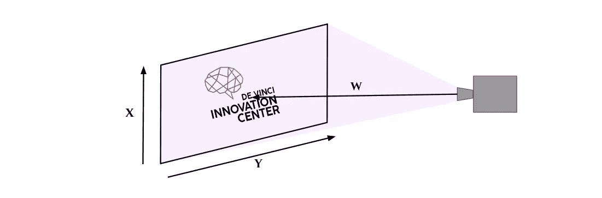

现在我们在这个投影空间中，我们可以将投影仪**从屏幕向前**或**向后**移动距离*δW*。如果我们将它向后移动，那么投影图像将会超出它。相反，通过使投影仪更靠近屏幕，屏幕上图像的显示尺寸减小。

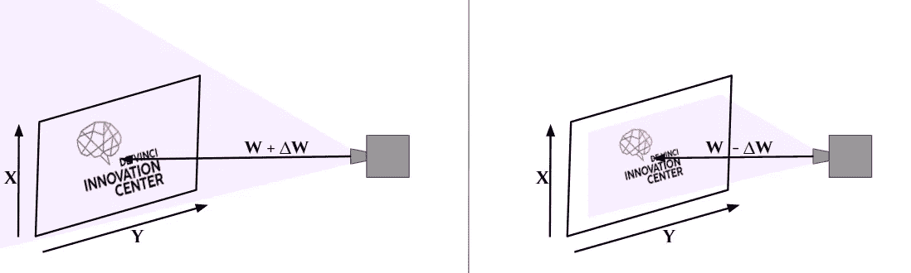

不可能(或者很难)想象这个射影空间与 3D 笛卡尔空间相关联，但是原理是相同的。我们会有 *(X，Y，Z，W)* 。

在接下来的脚本中，我们将通过考虑以**度** ( *0* 到 *360* )为单位的角度和以**像素**为单位的度量来应用这些变换矩阵。

目前我们还没有定义转换矩阵。我们将在后面定义它们。我们将用**身份**矩阵来代替它们。这个矩阵并不修改图像，它就像一个数字乘以 *1* 。

让我们回到从笛卡尔坐标到射影坐标的**转换的矩阵**，反之亦然。目前，矩阵 *M* 是单位矩阵。

这里， *h* 和 *w* 为待处理图像的高度和宽度尺寸。

如果 *h* 和 *w* 出现在我们的等式中，则**会将标记**置于图像中心。的确，在一幅图像中，标记的原点在图像的左上角(坐标 *(0，0)* )。

同样，我们可以在之前看到的图表中看到与我们投影仪的**焦距**相对应的**变量*f*的外观。**

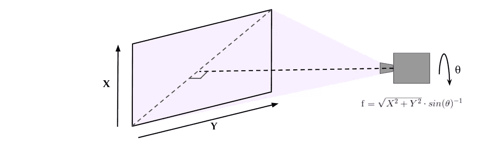

# 让我们写剧本吧

这样我们就可以为我们的**图像变换函数**打基础了。从恢复所有轴上的所有变换**值开始，然后定义**齐次通道**的矩阵。**

# **翻译**

让我们转到翻译矩阵。顾名思义，这允许我们在不同的轴上进行平移。

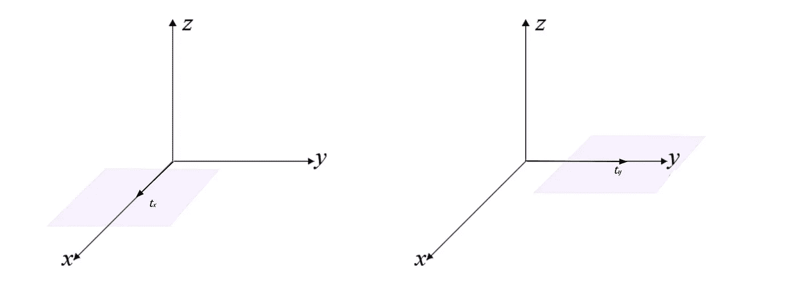

你会注意到 *Z 轴*的平移必须被**更新**。事实上，我们的转换(以像素为单位)没有考虑“到投影仪的距离”。

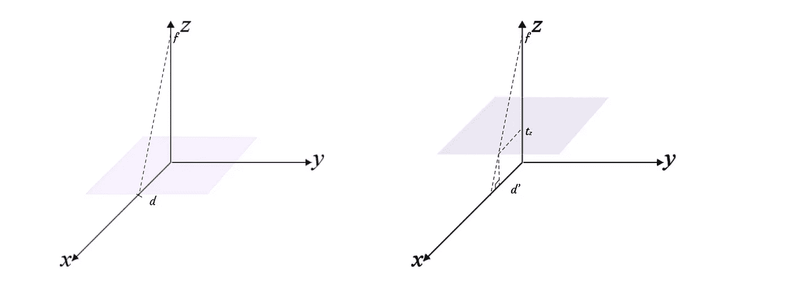

你会明白我们不得不**也为标尺**更新 Z 轴。

# **旋转**

旋转矩阵可以分解成不同轴上的旋转矩阵的乘积。在 3D 空间中，我们有 3 个旋转矩阵。

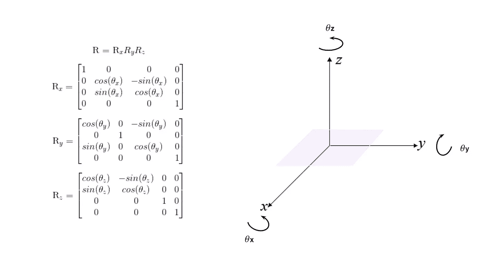

# **刻度**

简单地说，缩放矩阵允许**模拟缩放**。换句话说，如果我们再次以我们的图像为例，在 *X* 或 *Y* 上放大两倍可以通过**在这些轴上扩展图像**来理解(同时从相同的距离观看图像)。

而对于 *Z 轴*，我们可以将二倍缩放解释为在 *X* 和 *Y* 上的二倍缩放的组合。(或焦距比率的变化)

注意，可以通过传递一个值 *-1* 在轴上建立对称性。

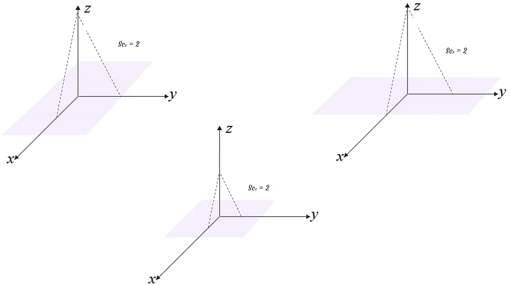

# **剪**

剪切矩阵使得在不同的轴上拉伸(剪切)成为可能。

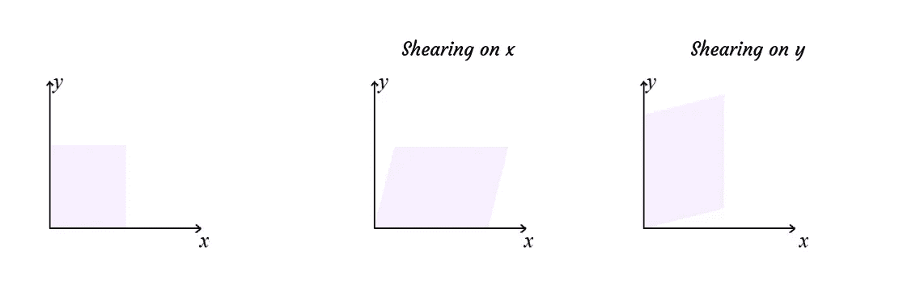

因此，在 3D 中，我们有一个剪切矩阵，它在 3 个轴上被分解成变形矩阵。

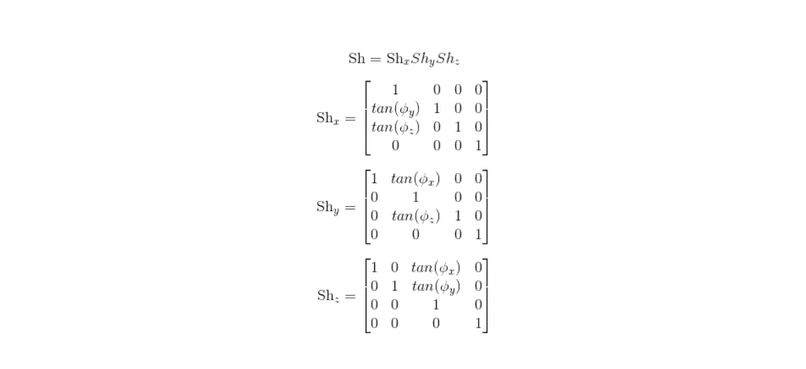

**奖金部分**

**创建一些滑块**

然后我们有了所有必要的矩阵来转换我们的图像。能够在我们选择的图像上**实时**可视化**它们的效果会很有趣。让我们创建一个**滑块**。**

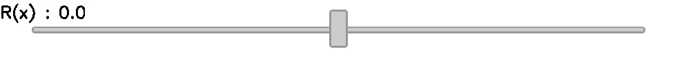

滑块只是一个**静态图像**，还不能做任何事情。让我们为这些滑块创建一个**堆栈**，这样我们就可以用鼠标**实时控制它们**。

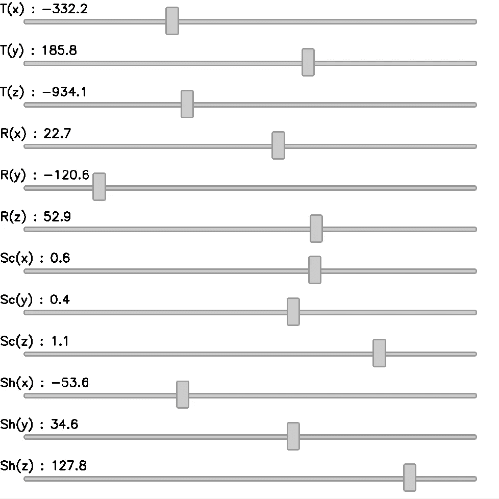

**跑吧！**

> 知识就是分享。
> **支持**我，一键获取 [**中我所有文章的**访问**。**](https://axel-thevenot.medium.com/membership)

**来源**

[麻省理工学院媒体实验室的图像转换](https://www.google.com/url?sa=t&rct=j&q=&esrc=s&source=web&cd=1&ved=2ahUKEwjD0pGd18ToAhUHfBoKHRC5BCoQFjAAegQIBBAB&url=http%3A%2F%2Fweb.media.mit.edu%2F~maov%2Fclasses%2Fcomp_photo_vision08f%2Flect%2F08_image_warps.pdf&usg=AOvVaw0nSEl8TeM9VrKsUoyQxfq9)

[齐次坐标程序员指南，黑客手册](https://hackernoon.com/programmers-guide-to-homogeneous-coordinates-73cbfd2bcc65)

所有的图片都是自制的，可以免费使用。