# 如何免费试用 UCP 码头工人？

> 原文：<https://towardsdatascience.com/how-to-try-docker-ee-ucp-for-free-dd9df7bee797?source=collection_archive---------38----------------------->

## 使用码头游乐场

每个人都在转向微服务和对接单片应用。想熟悉 docker 的 Docker 新手可以使用 [Docker 游乐场](https://labs.play-with-docker.com/)。它是免费的！

我总是建议我的学生使用谷歌浏览器。通常，它不会要求输入您的 Docker Hub ID 和密码。它将向您显示 START 按钮，如图 1 所示。点击它。

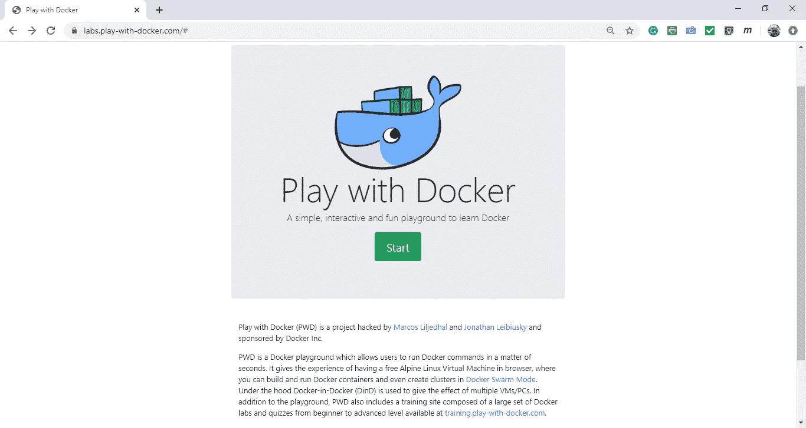

图 1:在谷歌浏览器中启动 Docker 游乐场

Docker 企业套件由三个组件组成:
1。Docker 企业引擎
2。UCP(通用控制平面)
3。DTR (Docker 可信注册中心)

注意有两个 Docker 引擎:Docker 社区版(CE)和 Docker 企业版(EE)。

1.  Docker CE 仅用于开发和测试，绝不用于生产。然而，这是免费的。
2.  Docker EE 是您用于生产的版本，您可以在其中初始化 Swarm 或 Kubernetes。这不是免费的。不过，你可以免费试用一个月。

Docker Playground 帮助您免费安装和试用 UCP。然而，这个播放实验室被限制在小于 3 GB 的内存中，大约 4 小时后过期。

现在，按照步骤在 Docker 操场上安装 UCP。

# 第一步:

通过单击左侧的“Add New Instance”创建一个节点，如图 2 所示。

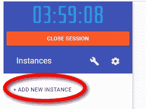

图 2:在 Docker Playground 上创建一台新机器

# 第二步:

使用 docker swarm init 命令初始化 Docker Swarm。从节点名称或页面顶部获取节点的 IP 地址。

```
docker swarm init —-advertise-addr <Node IP>
```

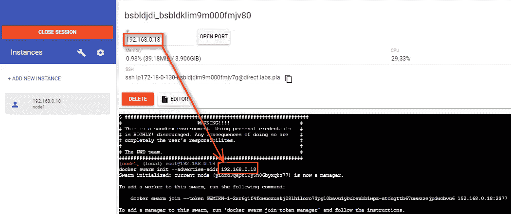

如果您想要将工作节点添加到您的集群，Docker 引擎将生成一个长令牌。

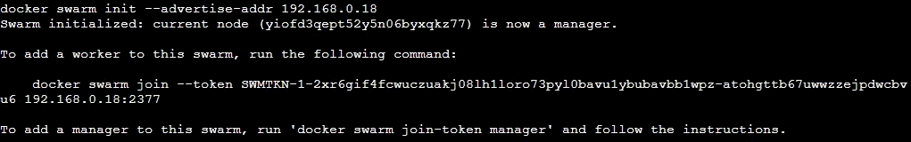

# 第三步:

从 docker/ucp: <tag number="">镜像创建一个容器来安装 ucp。该命令如下所示:</tag>

```
docker container run --rm -it --name ucp -v /var/run/docker.sock:/var/run/docker.sock docker/ucp:2.2.9 install  --host-address <node IP> --swarm-port 2400 --interactive --force-insecure-tcp
```

在这里，我们正在根据`docker/ucp:2.2.9`图像制作一个容器。
客房服务的`--rm`。我们告诉 docker 当它停止时自动删除这个容器。
`-it`做一个交互终端。
将这个容器命名为`ucp`的`--name`，而不是 docker 默认生成的形容词 _ 名词的名称。
`-v`在主机和该容器之间共享卷。
`install`是安装 UCP 的命令。
`--host-adress`设置群首的主机/节点地址。
将`--swarm-port`端口设置为 2400。
使容器交互的`--interactive`标志。
`--force-insecure-tcp`的最后一个标志是为了避免以下错误:

> 该节点上的 Docker 端口可从外部访问，接受端口 2375 上的连接。该节点不安全。

`docker/ucp`图像的其他一些标签不使用`--force-insecure-tcp`。相反，你可以使用`--ucp-insecure-tls`。

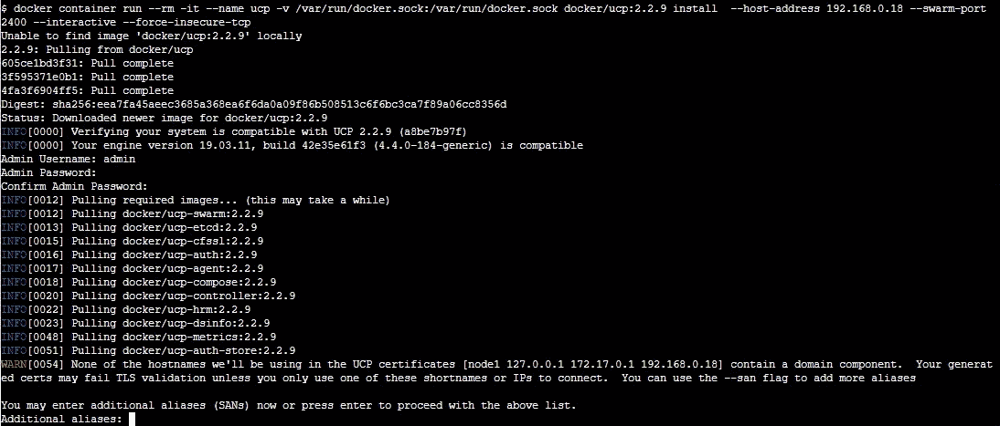

它将停止等待您输入您的管理员用户名和密码。同样，它将再次暂停以输入额外的别名。只需按 enter 键，docker 就可以继续安装，因为集群中没有任何其他节点。

安装完成后，节点 IP 地址旁边会显示一些链接。

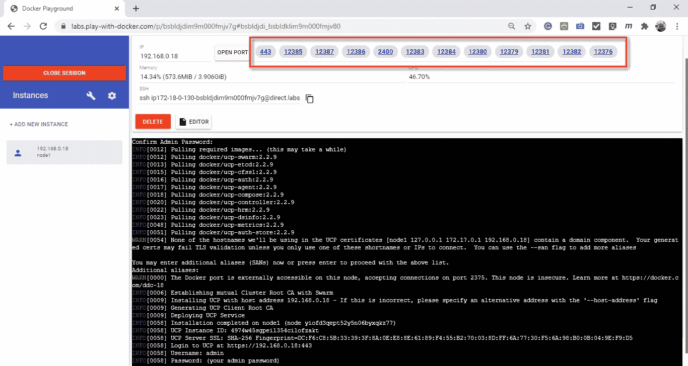

# 第四步:

您可以从 443 端口访问 UCP。但是，如果你点击它，它会在本地下载一个文件。要解决这个问题，右键单击 443 端口链接，然后单击复制链接地址。打开一个新的浏览器标签，粘贴链接。将 http://更改为 https://，然后单击 enter。

假设你没有链接到 443 端口，没问题。复制 SSH 地址。

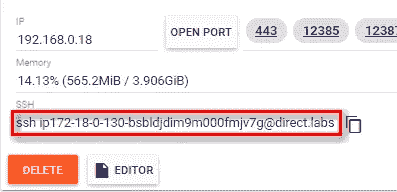

打开新的浏览器选项卡。用 https://替换 ssh。将地址中的@替换为。点击回车。

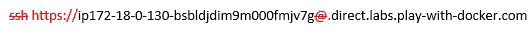

我会给你一个错误。单击底部的高级，将显示一个链接以继续。点击链接。

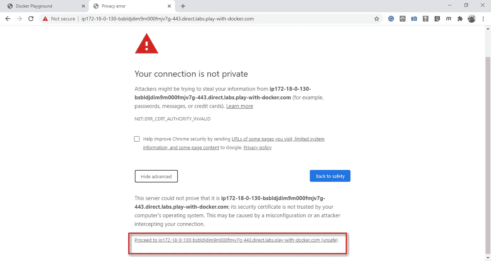

# 第五步:

将显示 UCP 登录。输入您的管理员用户名和密码。


# 第六步:

它会要求您上传许可证。您可以从 Docker Hub 的帐户获得一个月的试用许可证:

[https://hub.docker.com/editions/enterprise/docker-ee-trial](https://hub.docker.com/editions/enterprise/docker-ee-trial)

此外，你可以跳过以后。UCP 将如下所示:

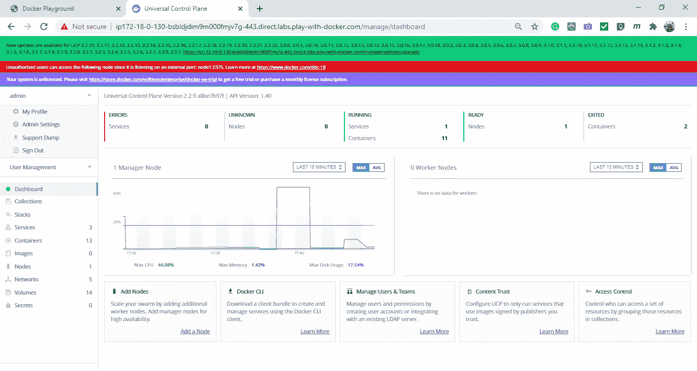

您可以稍后从左侧菜单中，单击管理→管理设置→许可证来上传。

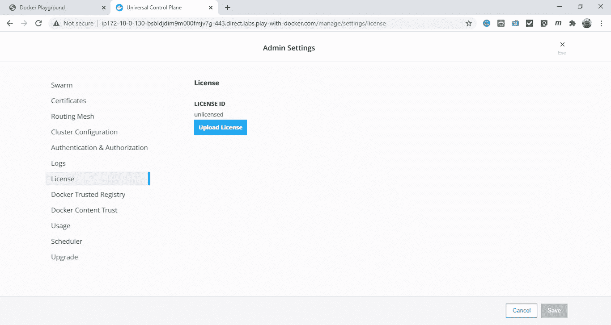

享受你的审判！