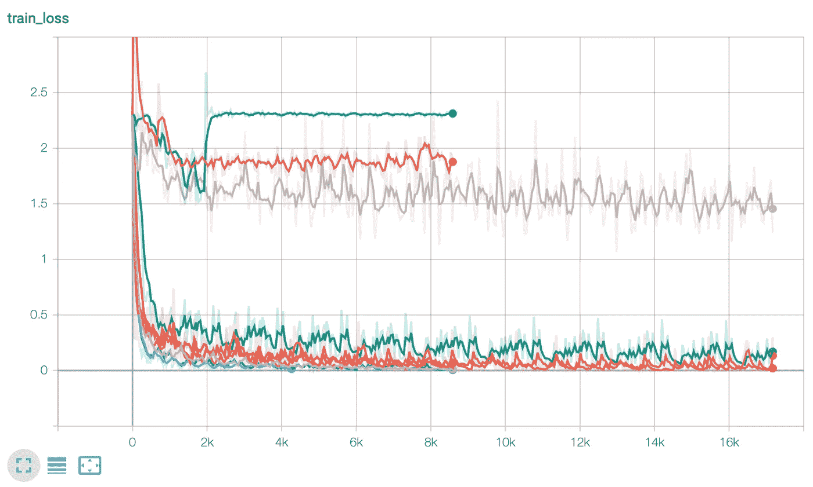

# 如何调整 Pytorch 闪电超参数

> 原文：<https://towardsdatascience.com/how-to-tune-pytorch-lightning-hyperparameters-80089a281646?source=collection_archive---------4----------------------->

## *想知道如何用 30 行代码优化 Pytorch Lightning 超参数？*


Pytorch Lightning 是 2020 年最热门的人工智能库之一，它使人工智能研究可扩展并快速迭代。但是如果你使用 Pytorch Lightning，你需要做**超参数调整**。

正确的超参数调整可以决定训练的成功与否。每个人都知道，通过良好的调优方法，可以极大地提高模型的准确性！

在这篇博文中，我们将演示如何使用 PyTorch Lightning 使用 [Ray Tune，这是一种超参数调整的行业标准](https://docs.ray.io/en/latest/tune.html)。 [Ray Tune](https://docs.ray.io/en/latest/tune/index.html) 是 [Ray](https://ray.io/) 的一部分，是一个用于缩放 Python 的库。


它以 PyPI 包的形式提供，可以这样安装:

```
pip install "ray[tune]"
```

要使用 PyTorch Lightning 的 [Ray Tune](https://docs.ray.io/en/latest/tune/index.html) ，我们**只需要添加几行代码！！**

# 雷调+ PTL 入门！

要运行这篇博文中的代码，请确保首先运行:

```
pip install "ray[tune]" 
pip install "pytorch-lightning>=1.0" 
pip install "pytorch-lightning-bolts>=0.2.5"
```

*下面的例子是在 ray==1.0.1，pytorch-lightning==1.0.2，pytorch-lightning-bolts==0.2.5 上测试的。* [**参见此处完整示例。**](https://github.com/ray-project/ray/blob/releases/1.0.1/python/ray/tune/examples/mnist_ptl_mini.py)

先从一些进口说起:

导入之后，有三个简单的步骤。

1.  创建您的`LightningModule`
2.  创建一个用调优回调函数调用`Trainer.fit`的函数
3.  使用`tune.run`执行您的超参数搜索。

## 步骤 1:创建你的照明模块

第一步，创建你的照明模块。你的`LightningModule`应该把一个**配置**字典作为初始化的参数。然后，这个字典应该设置您想要调整的模型参数。您的模块可能如下所示:

## 第 2 步:创建一个函数，用 Tune 回调函数调用`Trainer.fit`

我们将使用回调来与[射线调](https://docs.ray.io/en/latest/tune/index.html)进行通信。回调非常简单:

```
from ray.tune.integration.pytorch_lightning import TuneReportCallback...
metrics = {"loss": "ptl/val_loss", "acc": "ptl/val_accuracy"}
callbacks = [TuneReportCallback(metrics, on="validation_end")]
trainer = pl.Trainer(... callbacks=callbacks)
```

这个回调确保了在每个验证时期之后，我们向[光线调节](https://docs.ray.io/en/latest/tune/index.html)报告损失度量。`val_loss`和`val_accuracy`键对应于`validation_epoch_end`方法的返回值。

此外，[射线调节](https://docs.ray.io/en/latest/tune/index.html)将开始许多不同的训练运行。为了创建多个训练运行(用于超参数搜索)，我们需要将训练器调用包装在一个函数中:

`train_mnist()`函数需要一个`config`字典，然后传递给`LightningModule`。该配置字典将包含一次评估的超参数值。

## 第三步:使用`tune.run`执行你的超参数搜索。

最后，我们需要调用`ray.tune`来优化我们的参数。这里，我们的第一步是告诉[光线调节](https://docs.ray.io/en/latest/tune/index.html)哪些值是参数的有效选择。这叫做 [**搜索空间**](https://docs.ray.io/en/latest/tune/api_docs/search_space.html) ，我们可以这样定义:

```
# Defining a search space!config = {
 **"layer_1_size"**: tune.choice([32, 64, 128]),
 **"layer_2_size"**: tune.choice([64, 128, 256]),
 **"lr"**: tune.loguniform(1e-4, 1e-1),
 **"batch_size"**: tune.choice([32, 64, 128])
}
```

让我们快速浏览一下搜索空间。对于第一层和第二层的大小，我们让[射线调整](https://docs.ray.io/en/latest/tune/index.html)在三个不同的固定值之间选择。学习率在`0.0001`和`0.1`之间采样。对于批量大小，也给出了三个固定值的选择。当然，还有许多其他的(甚至是定制的)方法可以用来定义搜索空间。

[射线调节](https://docs.ray.io/en/latest/tune/index.html)现在将随机对十个不同的参数组合进行采样，训练它们，然后比较它们的性能。

我们将`train_mnist`函数包装在`tune.with_parameters`中，以传递常数，如训练每个模型的最大历元数和每次试验可用的 GPU 数量。 [Ray Tune 支持分数 GPU](https://docs.ray.io/en/master/using-ray-with-gpus.html#fractional-gpus)，所以只要模型仍然适合 GPU 内存，类似`gpus=0.25`的东西完全有效。

```
# Execute the hyperparameter search
analysis = tune.run(
 tune.with_parameters(train_mnist_tune, epochs=10, gpus=0),
 config=config,
 num_samples=10)
```

对`tune.run`的最终调用如下所示:

最后，优化结果可能如下所示:

在这个简单的例子中，一些配置达到了很好的精度。我们观察到的最好结果是在批量大小为 32，层大小为 128 和 64，学习率为 0.001 左右的情况下，验证精度为 **0.978105** 。我们还可以看到，学习率似乎是影响性能的主要因素——如果学习率太大，运行将无法达到良好的准确性。

您可以通过使用`tune.run`的返回值来检索最佳分数:

```
analysis = tune.run(...)best_trial = analysis.best_trial  # Get best trial
best_config = analysis.best_config  # Get best trial's hyperparameters
best_logdir = analysis.best_logdir  # Get best trial's logdir
best_checkpoint = analysis.best_checkpoint  # Get best trial's best checkpoint
best_result = analysis.best_result  # Get best trial's last results
```

您还可以轻松利用 [Ray Tune](https://docs.ray.io/en/latest/tune/index.html) 的一些更强大的优化功能。例如， [Ray Tune](https://docs.ray.io/en/latest/tune/index.html) 的搜索算法可以让你轻松优化超参数组合的景观。Ray Tune 的调度程序还可以尽早停止性能不佳的试验，以节省资源。

[**看完整例子在这里。**](https://github.com/ray-project/ray/blob/releases/1.0.1/python/ray/tune/examples/mnist_ptl_mini.py)

## 在张量板上检查结果

Ray Tune 自动将度量标准[导出到 TensorBoard，](https://docs.ray.io/en/latest/tune/tutorials/tune-usage.html#logging-tensorboard)中，还可以轻松支持 W & B。



就是这样！

## **要用** [**射线调**](https://docs.ray.io/en/latest/tune/index.html) **启用简单的超参数调，我们只需要添加一个回调，包装好 train 函数，然后开始调。**

当然，这是一个非常简单的例子，没有利用许多 Ray Tune 的搜索功能，如[早期停止表现不佳的试验](https://docs.ray.io/en/master/tune/api_docs/schedulers.html#hyperband-tune-schedulers-hyperbandscheduler)或[基于人群的培训](https://docs.ray.io/en/master/tune/api_docs/schedulers.html#population-based-training-tune-schedulers-populationbasedtraining)。如果你想看完整的例子，请看看我们的[完整 PyTorch 闪电教程](https://docs.ray.io/en/master/tune/tutorials/tune-pytorch-lightning.html)。

如果你已经成功地使用 py torch Lightning with[Ray Tune](https://docs.ray.io/en/latest/tune/index.html)，或者如果你需要任何帮助，请通过[加入我们的 Slack](https://forms.gle/9TSdDYUgxYs8SA9e8) 或者通过我们的 [Github](https://github.com/ray-project/ray) 来联系我们——我们希望收到你的来信！

# 如果你喜欢这篇博文，一定要看看:

*   我们的[权重和偏差报告](https://wandb.ai/amogkam/transformers/reports/Hyperparameter-Optimization-for-Huggingface-Transformers--VmlldzoyMTc2ODI)针对变压器的超参数优化
*   从零开始为你的 NLP 模型服务的最简单的方法