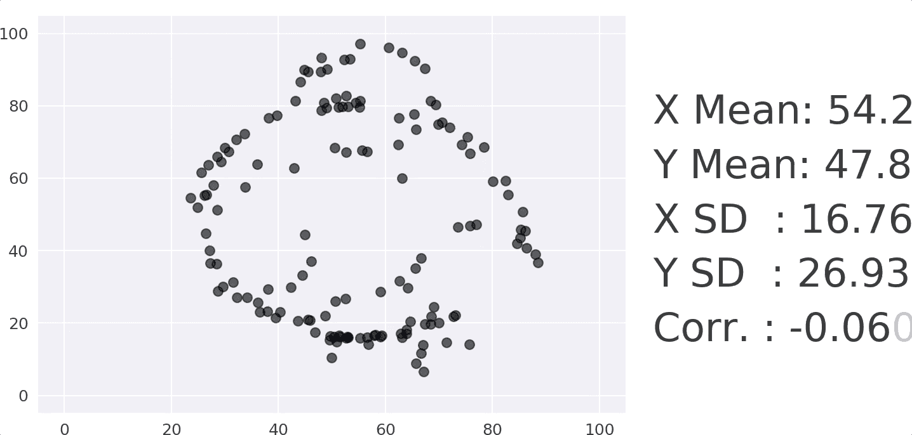
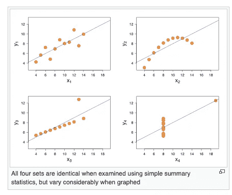
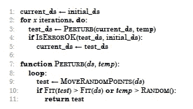
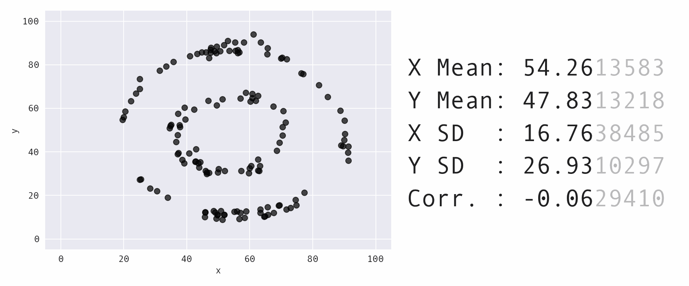

# 恐龙和圆圈的数据集可以有相同的统计数据吗？

> 原文：<https://towardsdatascience.com/how-to-turn-a-dinosaur-dataset-into-a-circle-dataset-with-the-same-statistics-64136c2e2ca0?source=collection_archive---------35----------------------->

## 它们具有相同的均值和标准差，但它们是两个明显不同的数据集！

# 动机

数据可视化不仅仅是展示漂亮的图表。它还有助于您更深入地了解您的数据。



恐龙来转圈

上面的 gif 捕捉了不同数据集的统计和可视化。如果我们只查看右侧的统计数据，而不可视化数据集，我们会假设这些数据集几乎相同，因为它们具有相同的均值、标准差和相关性

但是当我们看左边的可视化时，我们意识到这两个数据集是不同的，因为一个描绘的是**恐龙**而一个描绘的是**圆圈**！

这个输出证明我们**不应该只相信统计数据**，而应该在做出结论之前进一步可视化数据集。

在本文中，我将向您展示如何创建具有相同统计数据但看起来彼此不同的数据集。

# 使用模拟退火创建相同的统计数据和不同的图表

来自 Autodesk Research 的贾斯汀·马特伊卡和乔治·菲兹莫里斯找到了创建这种数据集的方法。受安斯科姆的四重奏的启发，他们试图找出如何创建具有这些特殊属性的数据集。



从维基百科[检索到的安斯康姆四重奏](https://en.wikipedia.org/wiki/Anscombe's_quartet)

他们的方法智能地保持统计数据不变，同时控制结果输出的图形外观。那么这个方法是怎么运作的呢？

从头开始创建具有这些属性的数据集是极其困难的。但是，如果我们从一个特定的数据集开始，在每次迭代中只对它进行轻微的修改，同时保持统计数据不变，直到我们创建出具有我们想要的形状的数据集，那会怎么样呢？

这是该方法的伪代码。



从贾斯汀·马特伊卡和乔治·菲兹莫里斯的[论文中检索到的代码](https://www.autodeskresearch.com/sites/default/files/SameStats-DifferentGraphs.pdf)

上述代码的解释:

*   `Inital_ds`:初始化我们想要维护统计值的数据集
*   在每次迭代中调用`Perturb function`，通过**在**随机方向**上少量移动一个或多个点**来修改数据集的最新版本`current_ds`。该功能确保至少 95%的移动**不会改变整个数据集的统计属性**
*   `Fit function`检查扰动点是否已经**增加了数据集的整体适合度**。由于我们希望将数据集强制转换成特定的形状，因此增加适应度意味着最小化目标形状上所有点到最近点的平均距离**。**
*   当有更多的全局最优解(更好的解)可用时，为了避免陷入局部最优解(一个好的但不是最好的解)，该方法采用**模拟退火**到**来增加选择的随机性**。这意味着我们**总是接受具有改进的适应度**的解决方案，但是即使解决方案没有改进，如果当前温度大于 0 和 1 之间的一个**随机数**，我们**仍然接受解决方案**。

现在让我们试着用这个方法把一只恐龙变成靶心。

# 把恐龙变成靶心

为了方便你使用上面的方法，我创建了一个名为[same-stats-different-graphs](https://github.com/khuyentran1401/same-stats-different-graphs/blob/master/README.md)的包。这是 Autodesk 提供的代码的修改版本。

这个包允许你把一个形状变成另一个形状，并在命令行上为这个转换创建 gif。

要安装软件包，请键入:

```
pip install same-stats
```

现在我们准备把一个恐龙数据集变成靶心！在您的终端上，键入:

```
python -m same_stats --shape_start=dino --shape_end=bullseye
```

并且像下面这样的 GIF 会以`dino_bullseye.gif`的名字保存到`gifs`目录中:



恐龙对牛眼

其他参数选项:

*   `--shape_start`:形状开始。选项:`dino`、`rando`、`slant`、`big_slant`
*   `--shape_end`:目标形状。选项:`x`、`h_lines`、`v_lines`、`wide_lines`、`high_lines`、`slant_up`、`slant_down`、`center`、`star`、`down_parab`、`circle`、`bullseye`、`dots`
*   `--iters`:迭代次数
*   `--decimals`:小数位数
*   `--frames`:帧数

# 结论

恭喜你！您刚刚发现了如何使用相同的统计值创建完全不同的数据集！我们方法的输出可用于展示可视化数据的重要性。你可以在 Autodesk 研究网站上了解更多关于这种方法的信息。

我喜欢写一些基本的数据科学概念，并尝试不同的算法和数据科学工具。你可以在 LinkedIn 和 T21 Twitter 上与我联系。

如果你想查看我写的所有文章的代码，请点击这里。在 Medium 上关注我，了解我的最新数据科学文章，例如:

[](/how-to-monitor-and-log-your-machine-learning-experiment-remotely-with-hyperdash-aa7106b15509) [## 如何使用 HyperDash 远程监控和记录您的机器学习实验

### 培训需要很长时间才能完成，但你需要去洗手间休息一下…

towardsdatascience.com](/how-to-monitor-and-log-your-machine-learning-experiment-remotely-with-hyperdash-aa7106b15509) [](/how-to-match-two-people-with-python-7583b51ff3f9) [## 如何找到和 Python 很好的搭配

### 给定个人偏好，如何匹配使得总偏好最大化？

towardsdatascience.com](/how-to-match-two-people-with-python-7583b51ff3f9) [](/how-to-create-fake-data-with-faker-a835e5b7a9d9) [## 如何用 Faker 创建假数据

### 您可以收集数据或创建自己的数据

towardsdatascience.com](/how-to-create-fake-data-with-faker-a835e5b7a9d9) [](/how-to-visualize-social-network-with-graph-theory-4b2dc0c8a99f) [## 如何用图论可视化社交网络

### 找出《权力的游戏》中的影响者

towardsdatascience.com](/how-to-visualize-social-network-with-graph-theory-4b2dc0c8a99f) [](/how-to-create-interactive-and-elegant-plot-with-altair-8dd87a890f2a) [## 如何用 Altair 创建交互式剧情

### 在 5 行简单的 Python 代码中利用您的数据分析

towardsdatascience.com](/how-to-create-interactive-and-elegant-plot-with-altair-8dd87a890f2a) [](/cython-a-speed-up-tool-for-your-python-function-9bab64364bfd) [## cy thon——Python 函数的加速工具

### 当调整你的算法得到小的改进时，你可能想用 Cython 获得额外的速度，一个…

towardsdatascience.co](/cython-a-speed-up-tool-for-your-python-function-9bab64364bfd)