# 如何将文本转化为特征

> 原文：<https://towardsdatascience.com/how-to-turn-text-into-features-478b57632e99?source=collection_archive---------1----------------------->

## [入门](https://towardsdatascience.com/tagged/getting-started)

## 使用 NLP 进行机器学习的综合指南

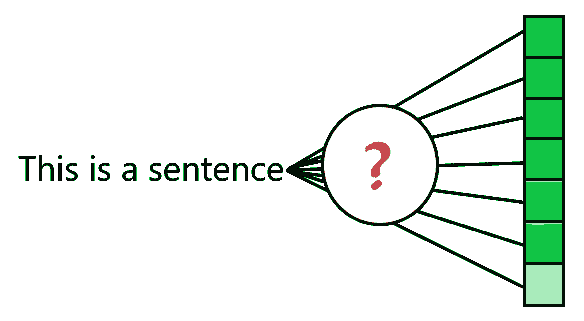

简单问题:如何把文字变成特征？作者图片

假设你被分配了一项任务，为你的公司产品评论建立一个情感分析工具。作为一名经验丰富的数据科学家，您构建了许多关于未来销售预测的见解，甚至能够根据客户的购买行为对他们进行分类。

但是现在，你很感兴趣:你有一堆文本条目，必须将它们转化为机器学习模型的特征。如何做到这一点？当数据科学家第一次遇到文本时，这是一个常见的问题。

对于有经验的 NLP 数据科学家来说，将文本转换成特征可能看起来很简单，但对于该领域的新手来说，这并不容易。这篇文章的目的是提供一个将文本转化为特征的指南，作为我在过去几个月中构建的 NLP 系列的继续(我知道，距离上一篇文章已经有一段时间了)。

之前，我已经讨论了 NLP 预处理管道中的几个步骤。现在，**这是预处理管道**的最后一步，当你精心策划的文本最终变成机器学习模型的可用特征时(如果这是你的目的——没有机器学习也可以有 NLP，这是另一个话题)。

像往常一样，除了解释如何做之外，我还将介绍三种最常用的建模技术:单词袋模型、基于 TF-IDF 算法的模型和 Word2Vec 模型。让我们开始讨论吧。

# 特色？

对于那些不习惯这个词的人，让我稍微离题一下。特征是给予**选择或处理的数据**的名称，准备用作算法(通常是机器学习算法)的输入。特征可以是房子的价格、像素的 RGB 值，或者在我们的例子中是单词的表示。

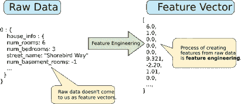

来自[谷歌开发者机器学习速成班](https://developers.google.com/machine-learning/crash-course/representation/feature-engineering)的漂亮图片描述了什么是特性。

甚至有一种叫做“特征工程”的很酷的技能，数据科学家研究数据，从数据中获得特征。这些特征甚至可能在数据中不明显，但可以通过修改现有数据或添加新数据使其更完整来获得，从而有助于实现更稳健的决策。

因此，最终，我们的目标是获得原始数据(文本)并转化为特征(计算机算法可以处理的东西)。

# 文本矢量化

用于将文本转换成**特征**的技术可以被称为“*文本矢量化*技术，因为它们都旨在一个目的:将文本转换成向量(或者数组，如果你想更简单的话；或者张量，如果你想要更复杂的话)，然后可以以经典的方式输入到机器学习模型中。

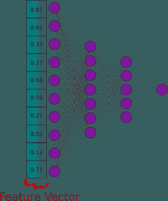

文本矢量化旨在将文本转换为整数(或布尔或浮点数)向量。图片作者。

把我们的预期结果想成一个**向量**是一个很好的起点，来想象我们如何把文本变成特征。让我们对此进行更多的思考。考虑下面的短语:

> 我想把我的文本转换成数据。

用简单的计算术语来说，向量是具有 ***n*** 个位置的列表。考虑如何将文本转换为向量的一种自然方法是创建一个所有单词的有序列表，如下所示:

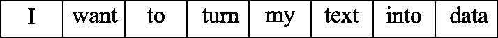

图片作者。

但是，如果条目更短或更大，会发生什么情况呢？此外，你的机器学习算法(基本上是一系列矩阵和向量计算)如何比较两个单词——这些由人类发明的具有特殊含义的符号？

既然你很聪明，你已经想到了:让我做一个字典或者一些类似的结构(一般来说，一个词汇图)，用单词索引代替单词！

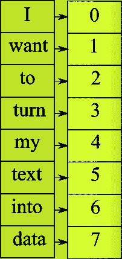

一个假设的解决方案是为每个单词创建一个映射……作者的图片。


然后用单词索引对向量进行编码。图片作者。

你在正确的道路上，但是让我们考虑这里的一些问题:单词“我的”比“想要的”更重要吗？对于机器学习算法来说，这就是你的数据“告诉”的。机器学习算法不关心数字是否是一个索引，只关心它是一个要计算的值(当然，你可以有一个分类特征，但我们会在下面看到)。


不要吼，言语不是价值观！图片来自海绵宝宝电视节目，由作者编辑。

“正常化，正常化，正常化！！!"，可以认为。但是，记住:这些都不是价值观！它们是指数。

如果你玩数据科学和机器学习已经够久了，你可能会想到 *one* 解决方案:使用 *One Hot Encoding* 。

**一个热编码**是对分类特征进行编码的过程，其中该特征的每个可能值被映射到一个新的“列”,如果存在，则该列被设置为 1，否则为 0。

让我们使用前面提到的词汇表“map”和建议的短语来考虑这一点(在这种情况下，词汇表与短语的单词相同)。我们得到这个:

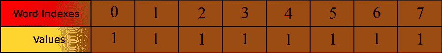

“我想把我的文本转换成数据”的一键编码。图片作者。

现在，如果我们想编码:“我想要我的数据”，我们会得到:

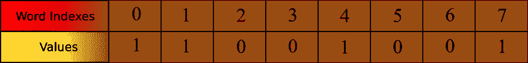

“我要我的数据”的一键编码。图片作者。

太好了，我们找到了一种将我们的数据编码成机器学习方式的方法！但是这里有很多问题需要解决:让我们考虑第一个问题——**词频——**这就是**词汇袋**模型的用武之地！

# 单词袋(蝴蝶结)模型

一种热编码只将值视为“存在”和“不存在”。这不适合发短信。在许多文本应用中，词频起着重要的作用。考虑以下两段:

> 狗是犬科的家养食肉动物。它是像狼一样的犬科动物的一部分，是最广泛丰富的陆地食肉动物。狗和大灰狼是姐妹分类群，因为现代狼与最初被驯化的狼没有密切关系，这意味着狗的直接祖先已经灭绝。狗是第一个被驯化的物种，几千年来因为各种行为、感觉能力和身体特征而被选择性繁殖。
> 
> 今天我带着我的狗出去，我在公园里发现了 100 美元。想到这些钱可能是某个可怜的老太太一周的午餐钱，我很难过。

第一个是维基百科关于狗的文章的第一段，第二个是我为了证明这个问题而写的一个伪博客。问题:你会向一个用“狗”这个词搜索假想引擎的用户推荐哪个网页？

一个热编码将在两个条目中为“dog”给出相同的值，所以这不好。

*进入词汇袋模式！*

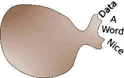

一袋单词😜。图片作者。

这个模型建议，**使用一个词频矢量**，而不是一个布尔值矢量。在上面的示例中，单词“dog”的列在第一个文本中将接收值“4 ”,而在第二个文本中仅接收值“1”。现在，规范化这些值是可以的，但不是必须的(只是为了更快的处理)。


一个乱七八糟的包！图片由 Pinterest 上的 [Cocoon Innovations](https://br.pinterest.com/pin/348747564875387277/) 提供。

这种模型被称为“包”，因为它不保持单词“秩序”(就像我们妈妈在 90 年代的包总是乱七八糟)。

但是在讨论单词袋模型的缺点之前，我们先来看看如何使用 Python 和 Numpy 实现它。

这很简单，但是让我们一步一步来看。我决定让它成为一个类，这样我就可以在一个模型中实例化多个 BoW。这是类构造函数:

基本上，我们有一组所有单词和几个字典来存储单词索引。

接下来，我们通过*拟合*来准备我们的单词包(一次添加所有的文档，所以它可以‘学习’我们可以使用的单词)。

最后，我们可以*转换*新的输入，返回整个词汇表大小的数组，并计算该单词出现的次数。为此，我使用 numpy，这是一个数学和代数库，专门研究向量/矩阵代数。这是 python 目前针对这类任务的默认库(并被用作大多数机器学习库的输入格式)。

这是一个用法和输出示例:

现在我们已经看到了它是如何完成的，我们可以讨论模型中的问题了:

**第一个**:完全无视语序。您可以通过查看下图来理解这一点:


图片作者。

**第二**:趋于**非常高维度**。根据[牛津英语语料库](https://web.archive.org/web/20120104170705/http://oxforddictionaries.com/words/the-oec-facts-about-the-language)，如果你的语料库只包含 90%最常见的英语单词至少一次，那将产生至少 7000 维的向量(其中大部分为零，但仍然是很多维)！

但是弓很简单，能为简单的问题带来快速的结果。如果在构建 NLP 解决方案时，您不确定从哪里开始，请尝试最基本的方法:使用 BoW 模型。它是一个很好的基线估计器。

仅指出一点，有一个变体在**大数据案例**中是有用的，特别是在您必须在字符库中比较文本的情况下(不考虑语义)。该方法使用文本瓦片区(*收缩*)。在这种情况下，不要将句子拆分成单词，而是在每 k 个字符或每个停用词处进行拆分。点击此处阅读更多内容:

[](https://nlp.stanford.edu/IR-book/html/htmledition/near-duplicates-and-shingling-1.html) [## 近似重复和重叠

### 下一篇:参考资料和进一步阅读:网络搜索基础知识上一篇:索引大小和估计内容索引一…

nlp.stanford.edu](https://nlp.stanford.edu/IR-book/html/htmledition/near-duplicates-and-shingling-1.html) 

# TF-IDF 模型

这个*实际上并不是一个模型*，而是对计算单词相对于文档的“相关性”的改进。为简单起见，我称之为模型。

在 TF-IDF 模型中，我们不是存储单词的频率，而是存储对输入数据执行 *tf-idf 算法*的结果。 **TF** 代表**词频**， **IDF** 代表**逆文档频率**。

简而言之，TF-IDF 计算一个词在特定文档中的权重，同时考虑词的总体分布。结果的呈现方式与单词包相同:一个稀疏的向量(0 表示没有出现的单词，否则有些单词会浮动)。

例如，在情感分析任务中，与单词袋相比，TF-IDF 模型可以返回更好的结果。

为了更好地理解，让我们把这个算法分成两部分:计算全局逆文档频率，然后计算单独的 TF-IDF 分数。

## 逆文档频率

第一部分是计算每个单词的全局 IDF 值。这个值表示每个单词在所有文档中的权重(在整个语料库中)。这意味着**非常常见的单词将具有较小的总权重**，而罕见的单词将具有较大的权重(这甚至消除了去除停用词的需要，因为它们非常常见，所以权重较小)。

有许多不同的方法来计算 TF 和 IDF(例如，看看算法[维基百科页面](https://en.wikipedia.org/wiki/Tf%E2%80%93idf))。我选择使用对数标度的 IDF，其计算公式如下:

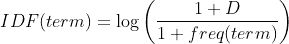

其中:

*   D =文件总数
*   freq =出现该术语的文档数。

首先，我们定义一个助手方法:

1)将句子转换成单词和频率的字典的简单方法(可以使用 Python 集合“Counter”来获得最佳性能，但为了简单起见，我将使用旧的字典方法):

然后我们初始化 IDF 类，类似于 BoW 类:

对于拟合，我们根据上面提到的公式计算全局词频率，然后是每个词的 idf。

太好了，我们的文档有了全球 IDF。现在，通过找到每个句子中每个术语的术语频率分数并乘以全局术语 IDF，为每个句子计算 TF-IDF。

## 计算词频

简而言之，我们通过以下方式获得一个句子的 TF-IDF 得分:

1.  统计句子中术语的出现频率。
2.  将每个术语的术语频率乘以逆文档频率。

下面是代码(注意，我添加了一些条件和私有方法来说明批量转换):

就这样，我们的 TF-IDF *特征化*完成了！

现在，对于每一个句子，我们得到一个数组，它的大小相当于整个词汇表的大小，包含每个单词与该句子的相关性(如果缺少，则为 0)。

下面是一个输出示例:

或者更“可读”一点:

```
{‘of’: 0.0, ‘list’: 0.0, ‘sentence’: 0.08664339756999316, ‘a’: 0.07192051811294521, ‘second’: 0.0, ‘sentences’: 0.0, ‘in’: 0.0, ‘complexity’: 0.0, ‘is’: 0.08664339756999316, ‘this’: 0.08664339756999316, ‘word’: 0.08664339756999316, ‘for’: 0.0}
```

你可以在这里找到用于生成上述‘解释’的代码。

这是到目前为止实现的提交，请注意代码中会有一些不同，因为我也将使用我的工具集中内置的一些结构。：

[](https://github.com/Sirsirious/NLPTools/tree/b48910b1db6e0de463b1713fcb65521df98e58e6) [## 各种/各种工具

### 此时您不能执行该操作。您已使用另一个标签页或窗口登录。您已在另一个选项卡中注销，或者…

github.com](https://github.com/Sirsirious/NLPTools/tree/b48910b1db6e0de463b1713fcb65521df98e58e6) 

## 关于 BoW 和 TF-IDF 的一些讨论:

正如我们所看到的，BoW 和 TF-IDF 方法为一个句子生成一个向量，其大小相当于整个词汇表。这不考虑词序或位置，使得这些技术不适合连续性敏感的应用程序(大多数 NLP 应用程序都是如此)。

一种可能的解决方法是对每个单词使用 BoW/TFIDF 数组，将它们堆叠起来并作为特征传递，如下图所示(以人工神经网络的输入层为例):

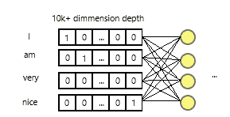

图片作者。

对于上面的图像，你有一个 10000*4 的稀疏矩阵，用于一个 4 个单词的句子(即使每个布尔使用一个位，你会得到大约 1kb 每个单词每个句子！想象一个大型语料库？).用于训练简单情感分析模型的计算时间和存储将使其过于昂贵或不可行(事实上，几年前，由于缺乏足够的内存和处理能力，当问题是机器学习时，文本几乎是一个未触及的话题)。

然而，这种方法允许我们保持单词顺序。如果我们能降低这个向量的维数呢？

输入单词嵌入！

# 单词嵌入

我不会深入解释单词嵌入，因为有几种计算它们的方法，并且大多数涉及深度神经网络，这本身需要时间来解释(这不是本文的重点)。

但我不会克制自己给你关于它的基本和最重要的信息。

让我们这样陈述:

> 单词嵌入是从上下文训练中学习到的单词的向量表示。它不是每个单词的分数，相反，它更像是单词的“坐标”。

因此，当训练一个模型而不是词汇大小的一次性编码时，您需要输入一个表示输入的单词嵌入数组。这个数组有一个预定义的 *d* 维深度，它通常比词汇表的大小小得多。

最著名的生成单词嵌入的技术之一是 Word2Vec，它是该方法的创始人。Word2Vec 本身可以使用两种不同的技术来计算，但是细节在这里并不重要。

相反，您最好知道训练/使用嵌入的方式有多种变化。这里总结了用于创建嵌入的技术:

*   Word2vec (Google) - 2 技术:连续词包(CBoW)和 Skip-Gram；
*   全局向量或手套(斯坦福)；
*   快速文本(脸书)——有趣的事实:解释了词汇之外的单词。

如果你想了解更多，我推荐这个来自 DeepLearning 的神奇课程。艾出席 Coursera:【https://www.coursera.org/learn/probabilistic-models-in-nlp】T2

生成单词嵌入的方式**通常通过训练过程**，允许单词根据其上下文进行编码。这导致了嵌入也能够表示单词语义(在一定程度上)的有趣效果。

因为单词是用坐标表示的，所以要进行比较(比较相似性)。如果使用诸如[主成分分析(PCA)](https://en.wikipedia.org/wiki/Principal_component_analysis)之类的技术来适当地降低维度，则可以绘制单词，并且绘制通常会将具有相似含义的**单词更紧密地显示在一起**，如下图所示，摘自 [IBM 研究博客](https://www.ibm.com/blogs/research/2018/11/word-movers-embedding/):


单词嵌入能够在一定程度上捕捉单词语义。句子甚至可以用嵌入来比较。图片由 [IBM Research 的编辑人员提供。](https://www.ibm.com/blogs/research/2018/11/word-movers-embedding/)

坐标通常以大量的维度给出，通常在 8 到 1024 之间。这样，我们就有了一个 8 到 1024 维的非稀疏数组，而不是一堆 10000 维的填充 0 的数组。这更适合计算机使用。

这是另一个很酷的例子，摘自大卫·罗扎多在《公共科学图书馆综合》杂志上的一篇文章:

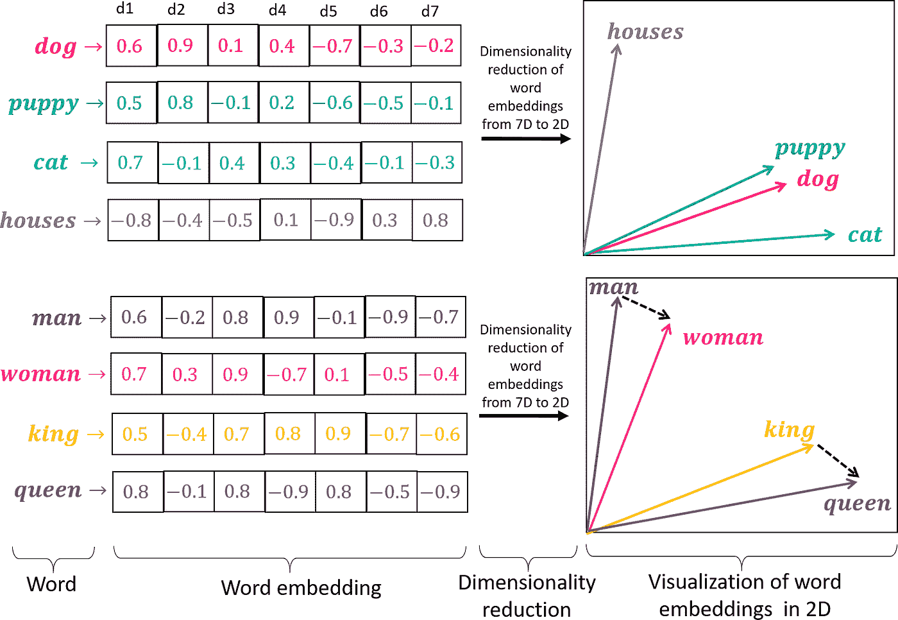

大卫·罗扎多拍摄。

当考虑人们如何使用嵌入时，重要的是指出单词嵌入可以通过两种不同的方式产生:

1.  通过与正在进行的过程(如情感分析任务)一起接受训练，并根据该特定任务捕捉单词之间的关系。这就是当您使用诸如 [**Keras**](https://keras.io/api/layers/core_layers/embedding/) **、** [**Pytorch**](https://pytorch.org/docs/stable/generated/torch.nn.Embedding.html) **或 Trax** 等库来定义嵌入层时会发生的情况。这些层将单词索引映射到嵌入值。
2.  通过在一个巨大的语料库上进行预处理来捕捉语言中最常见的关系。然后，可以将这些经过预训练的嵌入加载到模型中，以帮助加快学习过程或获得更好的结果。这就是 fastText、Word2vec 或 GloVe 的用武之地。诸如[**spaCy**](https://spacy.io/usage/vectors-similarity)**等库提供了这种嵌入用法。**

**我不会在这里讨论如何预训练一个嵌入，但是我准备了一个专门的帖子来解释这个实践。我建议你订阅我的帐户，以便在文章发表时得到通知，或者留意这一段，因为当它准备好时，我会在它下面发表一个链接。**

**关于这个主题再补充一点，当把文本转换成特征时，也可以进行特征工程。换句话说，数据科学家可以应用自己的规则(通常通过[预处理](https://medium.com/analytics-vidhya/nlp-preprocessing-pipeline-what-when-why-2fc808899d1f))来定义在将文本转换成数字数组之前应该提取什么。**

**正如我们所看到的，将文本转换成功能看起来可能是一件简单而琐碎的事情，但是需要考虑很多事情。**

**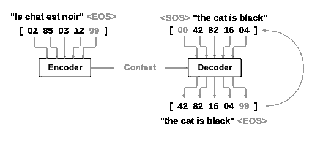**

**在被输入编码器之前，单词索引被映射到它们各自的嵌入，这是在训练过程中使用的真实值。图片取自[py torch seq seq 车型教程](https://pytorch.org/tutorials/intermediate/seq2seq_translation_tutorial.html)。**

**目前，NLP 中的大多数现有技术仅使用单词嵌入，因为它们更健壮并且能够以顺序方式使用。**

**当然，每个算法和问题都需要对输入文本进行特定的操作。例如，Seq2Seq 模型通常有一个固定的序列**

**长度。为了加强这一长度，使用了填充或压缩。但最后，填充和文字都转换成了嵌入。**

**既然我们已经完成了 NLP 预处理中最基本的主题，我们可以开始讨论应用程序和技术了。别忘了订阅敬请关注，收到下一个话题的通知！**

**此外，请经常查看我的存储库中的新代码。根据当前的许可，随意重用和贡献代码。如果你需要帮助，可以通过 Linkedin 联系我，只要查看我的个人资料就可以了！下一篇文章再见。**

**[](https://github.com/Sirsirious/NLPTools) [## 各种/各种工具

### 此时您不能执行该操作。您已使用另一个标签页或窗口登录。您已在另一个选项卡中注销，或者…

github.com](https://github.com/Sirsirious/NLPTools)**