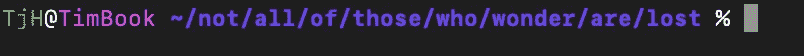
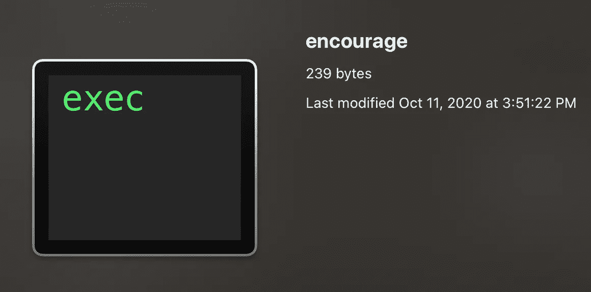

# 创建数据科学家工具带。

> 原文：<https://towardsdatascience.com/how-to-turn-your-python-scripts-into-an-executable-data-scientists-utility-belt-e2a68889909e?source=collection_archive---------50----------------------->

## 如何将 Python 程序从 IDE 中取出并放入命令行


由[杰西·奥里科](https://unsplash.com/@jessedo81?utm_source=unsplash&utm_medium=referral&utm_content=creditCopyText)在 [Unsplash](https://unsplash.com/s/photos/tool-belt?utm_source=unsplash&utm_medium=referral&utm_content=creditCopyText) 拍摄的照片

*TL；所有必要的步骤都在底部的代码片段中。*

作为一名学生，我看到我的许多同学创造了令人印象深刻的工具，我想把它们整合到我的工作流程中。但是这些功能要么归入 Jupyter 笔记本，要么归入 Slack 上共享的代码片段集合。

**这篇文章的目标是给你一个实用的知识，如何在你的 mac 上的任何地方创建一个可执行的脚本。本教程将涉及许多不同的主题。为了简短起见，我将不详细介绍任何步骤。我将为那些好奇的人提供进一步阅读的链接。**

另外，我用的是 [z-shell](https://en.wikipedia.org/wiki/Z_shell) 和一台 mac。如果你使用 z-shell 或者 bash **(将** `**zshrc**` **替换为** `**bashrc**` **)** ，所有这些步骤都可以工作。

# 教程大纲:

## 1)检查您是否有 python3，并且它是最新的

## 2)创建一个简单的示例程序来打印到 stdout

## 3)学习如何使你的脚本可执行

## 4)将脚本添加到新的源路径，以便在任何目录下都可以调用

# 1)检查您是否有 python3，并且它是最新的

如果你像我一样是计算机科学的新手，你可能不知道你在哪里安装了 Python3，或者你是否安装了它。让我们确保您将它放在正确的目录中。这篇[文章](https://www.techjunkie.com/macos-uninstall-python3/)概述了如果你犹豫不决，我们将要做的事情。

以下所有步骤都将发生在您的终端内部。



打开你的终端，让我们开始编码吧！

让我们检查一下你是否安装了 python3。为此，我们将调用`which`函数。`which`将在你的路径变量中搜索 python3 的位置。

```
which python3
```

**如果你看到类似于:**

```
something/something/python3
```

你可以跳过这一步，继续制作你的第一个命令行工具。

但是，如果您看到`python3 not found`，您需要遵循这里概述的[步骤。](https://realpython.com/installing-python/)我推荐做一个`brew install python3` ，但是如果你不太习惯自制软件，你也可以在这里下载安装程序。

安装 python3 后，重复上述步骤，python3 应该已经安装，PATH 变量现在将指向正确的目录。

让我们继续吧。

# 2)创建一个简单的程序来打印到标准输出

使用您喜欢的文本编辑器或 IDE [(我将使用 VIM)](https://formulae.brew.sh/formula/vim) 创建一个简单的“script.py”。对我们美国人来说，2020 年的情况尤其糟糕。为了振作起来，我将编写一个简单的命令行程序来鼓励用户！让我们称它为鼓励。py。它将 1 个参数，用户的名字和打印出一个个性化的笔记。

```
vim encourage.py
```

sys.argv 允许您为 CLI 提供命令行参数。

目前，这是一个 Python 脚本，我们只能使用函数 python3 来运行它。

```
python3 encourage.py tim
You're doing great, Tim!
```

您可能已经知道了 shell 中的[别名](https://scriptingosx.com/2019/07/moving-to-zsh-part-4-aliases-and-functions/)，我们可以通过将 alias 命令附加到 shell 资源文件(zshrc)中来实现。注意，如果你没有 [~/。zshrc](https://www.sitepoint.com/zsh-tips-tricks/) 文件，这将为您创建一个:

```
echo "alias py='python3'" >> ~/.zshrc
```

很好，现在我们可以简单地调用:

```
py encourage.py tim
You're doing great, Tim!
```

但是，这不是我们想要的。我们可以做得更好，并删除”。我们文件里的 py。的”。py”只对文本编辑器或 IDE 中的语法突出显示很重要。它不需要文件扩展名，因为您给函数 Python3 的是纯文本文件。这个你可以自己测试！

```
# rename your function
mv encourage.py encourage
py encourage tim
You're doing great, Tim!
```

太好了！现在我们要完全放弃“Python3”函数，制作一个完整的命令行程序。

# 3)让你的脚本可执行

在上一节中，我们了解到当我们调用 Python3 函数时，脚本的名称充当命令行参数。函数 Python3 不关心你的脚本是否有. py，因为它会接受你给它的任何纯文本文件。然而，如果我们想完全放弃调用 Python，那么我们必须在脚本的顶部插入 [shebang 命令](https://en.wikipedia.org/wiki/Shebang_(Unix)) `#!/usr/bin/env python3`:

这告诉您的 shell 在读取该文件时将它解释为 Python 代码。默认情况下，您的 shell 不允许您执行文件，因此您必须为[设置一个权限标志](https://en.wikipedia.org/wiki/Chmod)。在您的 shell 中运行这个命令，它将更改文件的权限，以便它是可执行的。

```
chmod +x encourage
```



在运行 chmod +x 鼓励我们的文件现在应该预览如下

现在我们可以运行我们的程序，只需:

```
./encourage tim
You're doing great, Tim!
```

有多简单？


[真诚媒体](https://unsplash.com/@sincerelymedia?utm_source=unsplash&utm_medium=referral&utm_content=creditCopyText)在 [Unsplash](https://unsplash.com/s/photos/thumb-up?utm_source=unsplash&utm_medium=referral&utm_content=creditCopyText) 上拍摄的照片

# 4)将脚本添加到我们的 PATH 变量中，这样它在任何目录中都是可调用的

> cp、touch、ls 和 mkdir 的目录都存储在 PATH 变量中

你会注意到，为了调用它，你必须和函数在同一个目录中，但是我们希望能够从任何地方调用我们的函数。**为了实现这一点，我们必须更新我们的** [**路径变量。**](https://en.wikipedia.org/wiki/PATH_(variable))PATH 变量加载到你的 shell 中，告诉 shell 在哪里寻找命令行函数。git、cd、ls 和 mkdir 目录的位置都存储在 PATH 变量中。我们有一个全新的功能**鼓励**我们需要添加到路径中。让我们首先在我们的用户目录中创建一个名为 **bin** 的新目录，并将我们程序的副本放在那里:

```
mkdir ~/.local/bin
cp encourage ~/.local/bin/encourage
```

然后，我们需要在 shell 资源文件中添加一个命令来更新我们的路径变量:

```
echo “PATH=$PATH:~/.local/bin/” >> ~/.zshrc
```

现在要么重启你的终端，要么运行`source ~/.zshrc`

您已经准备好测试您的程序了！切换到除您一直工作的目录之外的任何目录，并运行您的代码:

```
encourage tim
You're doing great, Tim!
```


[二万·赫斯里](https://unsplash.com/@erwanhesry?utm_source=unsplash&utm_medium=referral&utm_content=creditCopyText)在 [Unsplash](https://unsplash.com/s/photos/celebration?utm_source=unsplash&utm_medium=referral&utm_content=creditCopyText) 上拍照

恭喜你！你完了。所有代码都在一个地方:

```
# Remove old version of python and do a fresh brew installsudo rm -rf /Library/Frameworks/Python.framework/Versions/3.6
sudo rm -rf “/Applications/Python 3.7”
brew install python3# Shebang command to add to the top of your script (include the "#")#!/usr/bin/env python3# Make the script executable by running this in your terminalchmod +x script# Create a local bin and add it to your shell PATH variablemkdir ~/.local/bin
echo "PATH=$PATH:~/.local/bin/" >> ~/zshrc# move a copy of your script to the ./local/bin
cp script ~/.local/bin/script# Restart your terminal or shell
source ~/.zshrc
```