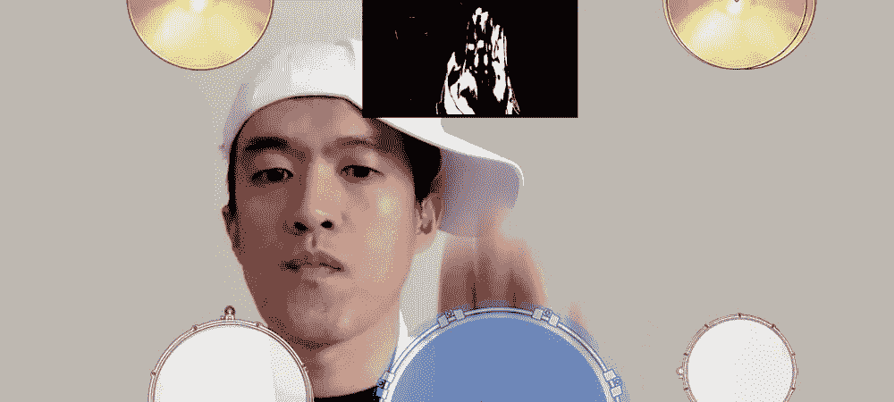
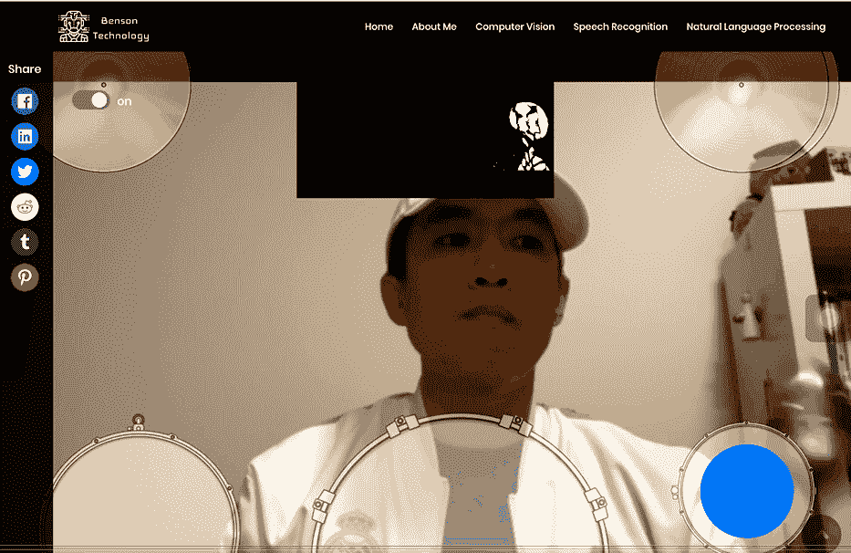
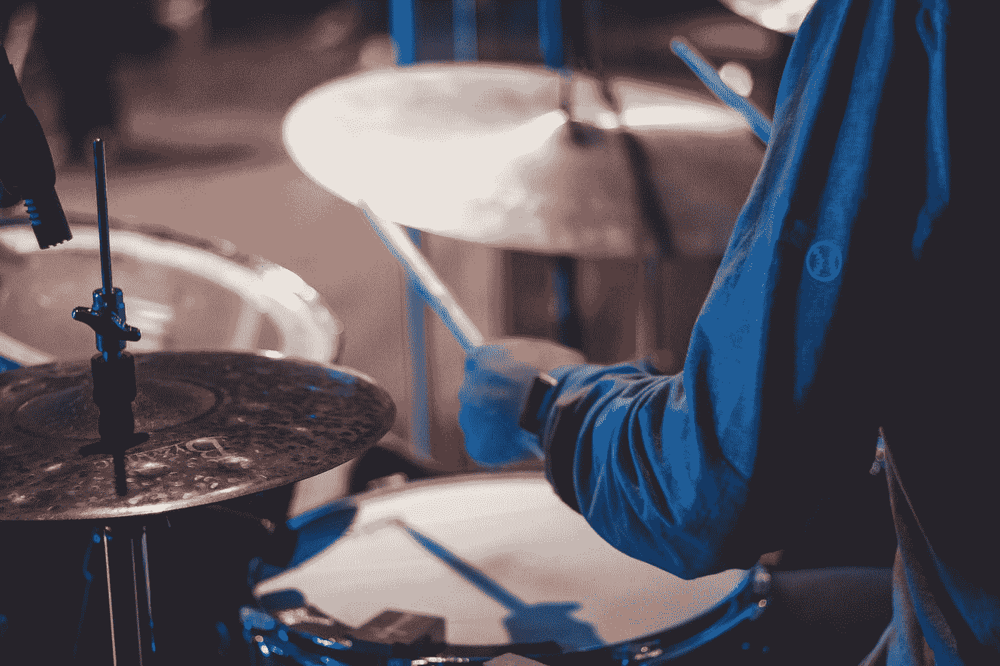

# 如何将您的网络摄像头变成运动检测控制器

> 原文：<https://towardsdatascience.com/how-to-turn-your-webcam-into-a-motion-detect-controller-9d4e9945644c?source=collection_archive---------22----------------------->

## 如何使用 JavaScript 实现运动检测的完整指南，构建一个虚拟鼓，你只需在空中挥舞双手就可以演奏。



来源:[bensonruan.com](https://bensonruan.com/motion-detection-play-drums-with-webcam/)

你玩过带运动传感器的 Xbox 游戏吗？在电子游戏中，只要挥动手臂去打网球就感觉很酷。运动检测是让这一奇迹发生的技术，它可以检测到物体相对于其周围环境的位置变化。

在这篇文章中，让我们来找点乐子。我打算建一个虚拟的鼓乐场，让你只需在空中挥舞双手就能敲鼓。它不需要任何运动传感器，只需要打开电脑或手机上的摄像头。

这是虚拟鼓游乐场的演示。正如你所看到的，当鼓和钹在那个区域探测到显著的运动时，它就会演奏。



来源:[bensonruan.com](https://bensonruan.com/motion-detection-play-drums-with-webcam/)

点击下面的链接亲自尝试一下:

[](https://bensonruan.com/motion-detection-play-drums-with-webcam/) [## 运动检测-使用网络摄像头播放鼓声- Benson 技术

### 你玩过带运动传感器的 Xbox 游戏吗？挥动手臂击球的感觉真酷…

bensonruan.com](https://bensonruan.com/motion-detection-play-drums-with-webcam/) 

# 履行

你玩得开心，像摇滚明星一样一直打鼓吗？你好奇这种神奇是怎么发生的吗？我首先受到了这个[木琴](https://soundstep.github.io/magic-xylophone/app/index.html)版本的启发，然后建立了我的上面的鼓版本。下面跟随我实现这个虚拟鼓游乐场的旅程。

## #步骤 1:将网络摄像头传输到浏览器

为了让你的网络摄像头进入浏览器，我使用了 JavaScript 库`navigator.mediaDevices.getUserMedia`。要了解更多细节，请参考我之前的博客:

[](https://medium.com/swlh/how-to-access-webcam-and-take-picture-with-javascript-b9116a983d78) [## 如何使用 JavaScript 访问网络摄像头并拍照

### 介绍网络摄像头-简易 npm 模块

medium.com](https://medium.com/swlh/how-to-access-webcam-and-take-picture-with-javascript-b9116a983d78) 

## #步骤 2:标记每个滚筒区域

用鼓和钹的图像覆盖网络摄像头。这是为了在网络摄像头中设置目标区域，以便每当在这些区域检测到重大运动时，它就会触发播放齿轮的效果。

**HTML**

**JavaScript**

通过齿轮的(x，y，宽度，高度)来存储齿轮的位置，请注意，宽度和高度需要通过全屏相机大小和混合画布大小之间的比率来计算。

## #步骤 3:加载声音音频

为了演奏鼓和钹，我们需要加载这些乐器的音频声道文件。

## #步骤 4:通过混合模式差异进行运动检测

这是进行运动检测的最重要的部分。它使用了一种叫做`Blend Mode Difference`的技术。

首先，我来解释一下混合模式差异的概念。想象你拍了一张照片，半秒钟后又拍了一张，如果在那半秒钟内没有任何东西移动，那两张照片会完全一样。当你减去这两张图片的像素值时，它将全是 0，混合图像将完全是黑色的。如果在某些区域有移动，混合图像将突出显示差异。

有关更多详细信息，请参考下面的文章:

[](https://www.adobe.com/devnet/archive/html5/articles/javascript-motion-detection.html) [## JavaScript 运动检测

### 了解如何使用 HTML5、JavaScript 和 jQuery 来检测网络摄像头流的移动，并对用户做出实时反应…

www.adobe.com](https://www.adobe.com/devnet/archive/html5/articles/javascript-motion-detection.html) 

## #第五步:播放效果和声音

我们为网络摄像头视频的每一帧反复调用以下函数进行运动检测。

```
**function****update()** {
  drawVideo();
  blend();
  checkAreas();
  **window.requestAnimationFrame(update);**
}
```

在鼓和钹的区域内，如果它检测到帧之间的显著差异，则表明该区域有运动。然后我们播放相应档位的效果和声音。

```
while (i < (blendedData.data.length * 0.25)) {
  **average += (blendedData.data[i*4] + blendedData.data[i*4+1] + blendedData.data[i*4+2]) / 3;**
  ++i;
}
average = Math.round(average / (blendedData.data.length * 0.25));
**if (average > 20)** { //over a threshold, means significant movement
  playHover(drum);          
}
```

代码就这么多了。让我们享受和玩一些疯狂的鼓！

# GitHub 知识库

您可以通过下面的链接下载上述演示的完整代码:

[](https://github.com/bensonruan/Motion-Detection-Virtual-Drums) [## Benson Ruan/运动检测-虚拟鼓

### 从网络摄像头检测动作，通过在空中挥舞双手来玩虚拟鼓。

github.com](https://github.com/bensonruan/Motion-Detection-Virtual-Drums) 

照片由[杰登哈奇](https://unsplash.com/@jaden_hatch?utm_source=medium&utm_medium=referral)在 [Unsplash](https://unsplash.com?utm_source=medium&utm_medium=referral) 拍摄

# 结论

如今，运动检测已经应用于许多领域，例如安全警报、自动门……有些与传感器一起工作，有些可能基于计算机视觉目标检测。毕竟，我希望你觉得这个虚拟鼓游乐场有趣，并激起你对最新技术的兴趣。

感谢您的阅读。如果你喜欢这篇文章，请在 LinkedIn 或 Twitter 上分享。如果你有任何问题，请在评论中告诉我。在 [GitHub](https://github.com/bensonruan/) 和 [Linkedin](https://www.linkedin.com/in/benson-ruan/) 上关注我。