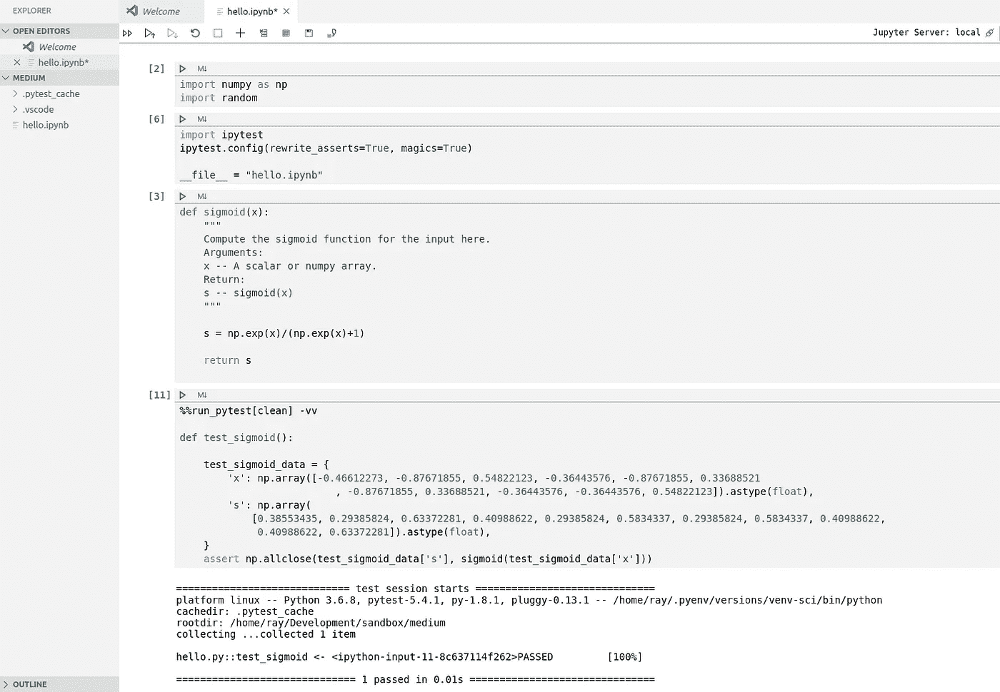
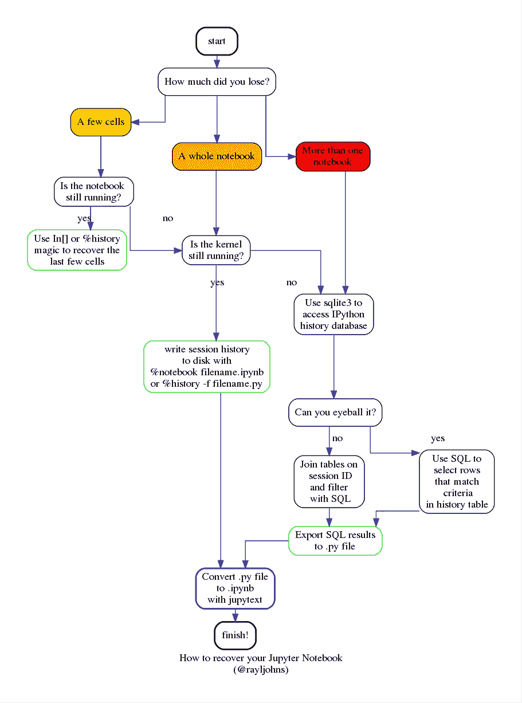
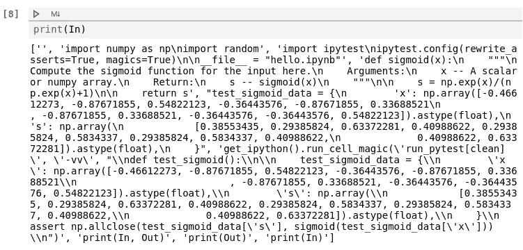
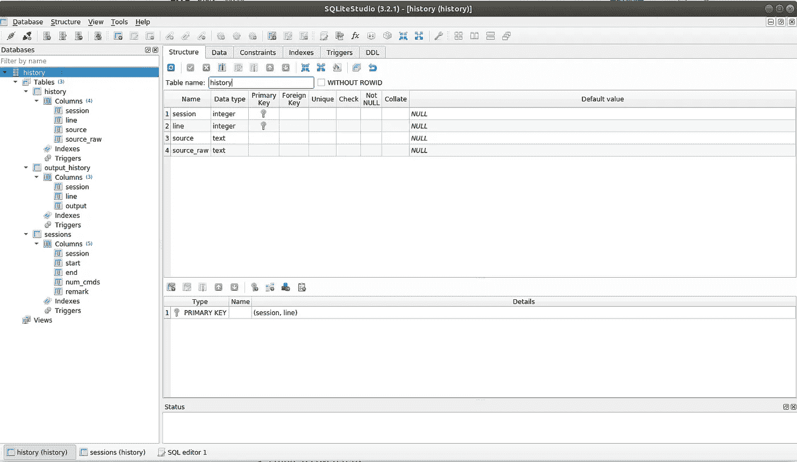
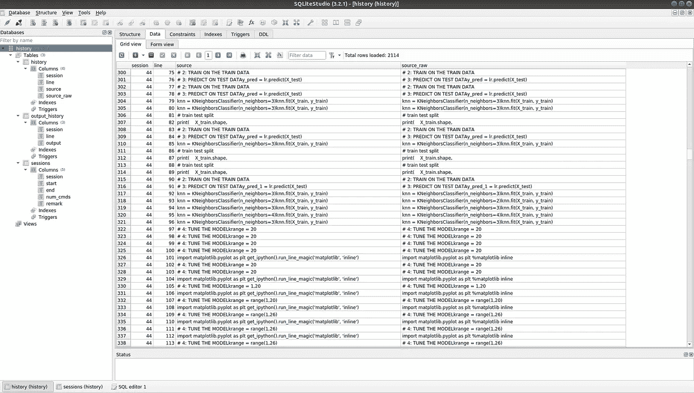

# 如何取消删除您的 Jupyter 笔记本

> 原文：<https://towardsdatascience.com/how-to-un-delete-your-jupyter-notebooks-1289e741705f?source=collection_archive---------17----------------------->

## 用 SQL 和命令行破解 Jupyter 笔记本的元数据科学

谁不爱 Jupyter 笔记本？它们是互动的，给你即时反馈的即时满足感。它们是可扩展的——你甚至可以把它们作为网站来部署。对于数据科学家和机器学习工程师来说，最重要的是，它们具有表现力——它们跨越了操纵*数据*的科学家和工程师与消费并希望理解数据所代表的*信息*的普通观众之间的空间。

但是 Jupyter 笔记本也有缺点。它们是大型 JSON 文件，存储您运行的每个单元的代码、降价、输入、输出和元数据。为了理解我的意思，我写了一个简短的笔记本来定义和测试 sigmoid 函数。



朱庇特笔记本。

以下是当 IPython 不渲染它时(的一部分)看起来的样子(除了第一个实际的输入单元格，我已经省略了所有的单元格，因为即使对于一个短笔记本来说，它也是又长又丑的):

```
{
 "nbformat": 4,
 "nbformat_minor": 2,
 "metadata": {
  "language_info": {
   "name": "python",
   "codemirror_mode": {
    "name": "ipython",
    "version": 3
   },
   "version": "3.6.8-final"
  },
  "orig_nbformat": 2,
  "file_extension": ".py",
  "mimetype": "text/x-python",
  "name": "python",
  "npconvert_exporter": "python",
  "pygments_lexer": "ipython3",
  "version": 3,
  "kernelspec": {
   "name": "python36864bitvenvscivenv55fc700d3ea9447888c06400e9b2b088",
   "display_name": "Python 3.6.8 64-bit ('venv-sci': venv)"
  }
 },
 "cells": [
  {
   "cell_type": "code",
   "execution_count": 2,
   "metadata": {},
   "outputs": [],
   "source": [
    "import numpy as np\n",
    "import random"
   ]
  },

   ...
}
```

因此很难对它们进行版本控制。这也意味着有很多你通常不太关心保存的垃圾数据，比如单元执行计数和输出。

下次你想知道为什么你的 Jupyter 笔记本运行如此缓慢时，在纯文本编辑器中打开它，看看你的笔记本元数据中有多少海量数据帧。

不过，在适当的情况下，所有这些垃圾看起来都像珍贵的宝石。这些情况通常包括:

*   意外关闭笔记本而未保存它
*   点击错误的快捷键，删除重要的单元格
*   在多个浏览器窗口中打开同一笔记本并覆盖您自己的工作

任何误入在 IPython 笔记本上进行开发的危险领域的人都至少做过一次这些事情，可能是在同一时间。

如果这是你，你在这里是因为你谷歌了*恢复删除 jupyter 笔记本刷新浏览器窗口*，不要惊慌。首先我要告诉你如何修理它。*然后我要告诉你如何防止它再次发生。

*是的，你能修好它。(大概吧。)



我为你做的一本指南，在笔记本上，关于笔记本

## 要求:

*   安装了 Jupyter、IPython(带有 nbformat 和 nbconvert)和 jupytext 的 Python [虚拟环境](https://medium.com/swlh/a-guide-to-python-virtual-environments-8af34aa106ac)(最好是一个新的 venv，这样您可以测试一下)
*   sqlite3 的工作安装(可选但推荐:像 [SQLiteStudio](https://sqlitestudio.pl/index.rvt?act=download) 这样的数据库浏览器)
*   希望和决心

# 场景:您意外删除了活动笔记本中的几个单元格

(不科学)估计恢复概率:90%

相对难度:更容易

在最坏的情况下，您点击了不想删除的单元格上的`x`,现在您想取回它的代码或数据。

## 方法一:进出

当您使用笔记本时，IPython 内核会运行您的代码。IPython 内核是一个独立于 Python 解释器的进程。(这也是为什么您需要将新的内核链接到新的虚拟环境。这两者不是自动连接的。)它使用 JSON 发送和接收消息，就像您的代码单元一样。

当您运行一个单元或点击“保存”时，笔记本服务器会将您的代码作为 JSON 发送到您计算机上的一个笔记本中，该笔记本存储您的输入和输出。所以你手机旁边的小单词`In`和`Out`不仅仅是单词，它们是容器——特别是你会话历史的列表。你可以打印出来并编入索引。



[]容器中的 IPython

## 方法二:IPython 魔术

使用`%history` line magic 打印您的输入历史(后进先出)。这个[强大的命令](https://ipython.readthedocs.io/en/stable/interactive/magics.html#magic-history)允许您通过绝对或相对数字访问当前和过去的会话。

如果当前的 IPython 进程仍然处于连接状态，并且您已经在您的[虚拟环境](https://medium.com/swlh/a-guide-to-python-virtual-environments-8af34aa106ac)中安装了`nbformat` ，那么在单元格中执行以下代码来恢复您的笔记本:

```
>>> %notebook your_notebook_filename_backup.ipynb
```

这种魔法将整个当前会话历史呈现为一个新的 Jupyter 笔记本。

嗯，还不算太糟。

这并不总是有效，您可能需要花费一些精力从输出中剔除无关的单元格。

你可以用历史魔法做更多的事情。这里有几个我觉得有用的食谱:

*   `%history -l [LIMIT]`获取最后的 *n 个*输入
*   `%history -g -f FILENAME`:将您的*整个*保存的历史记录写入一个文件
*   `%history -n -g [PATTERN]`:使用 glob 模式搜索您的历史，并打印会话和行号
*   `%history -u`:仅从当前会话中获取*唯一的*历史。
*   `%history [RANGE] -t`:获取本机历史，也就是 IPython 生成的源代码(有利于调试)
*   `%history [SESSION]/[RANGE] -p -o`:使用`>>>`提示符打印输入和输出(适合阅读和文档)

如果你已经在一个真正的大数据科学笔记本上工作了很长时间，那么`%notebook`魔法策略可能会产生很多你不想要的噪音。使用其他参数削减`%history -g`的输出，然后使用 jupytext(解释如下)转换结果。

# **场景:你关闭了一个未保存的笔记本**

(不科学的)估计恢复概率:70–85%

相对难度:更难

还记得我们说过笔记本的版本控制很难吗？一个内核可以同时连接到多个前端。这意味着打开同一笔记本的两个浏览器选项卡可以访问相同的变量。这就是你最初重写代码的方式。

IPython 将您的会话历史存储在数据库中。默认情况下，您可以在您的主目录下的一个名为`.ipython/profile_default`的文件夹中找到它。

```
$ ls ~/.ipython/profile_defaultdb  history.sqlite  log  pid  security  startup
```

备份`history.sqlite`到副本。

```
$ cp history.sqlite history-bak.sqlite
```

在数据库浏览器中或通过 sqlite3 命令行界面打开备份。它有三个表:历史、输出历史和会话。根据您想要恢复的内容，您可能需要将这三者结合在一起，所以请放弃您的 SQL。



IPython 历史的 SQLiteStudio 视图

## 盯着它

如果您可以从数据库浏览器 GUI 中判断出`history`表中的哪个会话号有您的代码，那么您的生活就简单多了。



历史表的 SQLiteStudio 视图

在浏览器中或命令行上执行 SQL 命令:

```
sqlite3 ~/.ipython/profile_default/history-bak.sqlite \
  "select source || char(10) from history where session = 1;" > recovered.py
```

这只是指定会话号和要写入的文件名(在给出的例子中是`1`和`recovered.py`)，并从数据库中选择源代码，用换行符(在 ASCII 中是 10)分隔每个代码块。

如果您想选择行号作为 Python 注释，可以使用如下查询:

```
"select '# Line:' || line || char(10) || source || char(10) from history where session = 1;"
```

一旦你有了一个 Python 可执行文件，你就可以松一口气了。但是你可以用 jupytext 把它变回笔记本，这是一个神奇的工具，可以把明文格式转换成 Jupyter 笔记本。

```
jupytext --to notebook recovered.py
```

***不太可怕！***

# 场景:你在多个标签页中打开你的笔记本，重新加载一个旧版本，删除你所有的工作，并杀死你的内核

(不科学的)估计恢复概率:50–75%

相对难度:最难

以上都不起作用，但你还不准备放弃。

## 硬模

回到你正在使用的任何工具来浏览你的`history-bak.sqlite`数据库。您编写的查询将需要[创造性的搜索技术](/advanced-google-skills-for-data-science-350bf828dbe6)来充分利用您拥有的信息:

*   会话开始的时间戳(总是非空)
*   会话结束的时间戳(有时以有用的方式为空)
*   输出历史
*   每个会话执行的命令数
*   您的输入(代码和降价)
*   IPython 的渲染源代码

例如，您可以通过以下查询找到您今年编写的与 pytest 相关的所有内容:

```
**select** line, source**from** history**join** sessions**on** sessions.session = history.session**where** sessions.start > '2020-01-01 00:00:00.000000'**and** history.source like '%pytest%';
```

一旦您将视图调整为您想要的行，您可以像以前一样将其导出到可执行的`.py`文件，并使用 jupytext 将其转换回`.ipynb`。

# 如何避免需要这篇文章

当你品味不必从头重写笔记本的解脱时，花点时间思考一些措施来防止未来的探索进入`history.sqlite`:

*   不要将相同的前端连接到同一个内核。换句话说，不要在多个浏览器标签中打开同一个笔记本。[使用 Visual Studio 代码作为您的 Jupyter IDE](/power-up-your-python-projects-with-visual-studio-code-401f78dd97eb) 很大程度上消除了这种风险。
*   定期备份您的 IPython 历史数据库文件，以防万一。
*   尽可能将您的笔记本转换为明文，至少为了备份。Jupytext 让这变得几乎微不足道。
*   使用 IPython 的`%store`魔法在 IPython 数据库中存储变量、宏和别名。你所需要做的就是在`profile_default`中找到你的`ipython_config.py`文件(或者如果你没有的话运行`ipython profile create`，添加这一行:`c.StoreMagics.autorestore = True`。如果你愿意，你可以存储、别名和访问从环境变量到小型机器学习模型的任何东西。这是完整的文档。

*Jupyter 笔记本给你带来的最大挑战是什么？对你想在以后的帖子中讨论的话题发表评论。*

# 资源

*   [使用 Visual Studio 代码启动您的 Python 项目](/power-up-your-python-projects-with-visual-studio-code-401f78dd97eb)
*   [谷歌数据科学高级技能](/advanced-google-skills-for-data-science-350bf828dbe6)
*   [Jupytext](https://jupytext.readthedocs.io/en/latest/introduction.html)
*   [IPython storemagic](https://ipython.readthedocs.io/en/stable/config/extensions/storemagic.html)
*   [IPython 历史魔法](https://ipython.readthedocs.io/en/stable/interactive/magics.html#magic-history)
*   [SQLiteStudio](https://sqlitestudio.pl/index.rvt?act=download)