# 如何从外太空理解全球贫困

> 原文：<https://towardsdatascience.com/how-to-understand-global-poverty-from-outer-space-442e2a5c3666?source=collection_archive---------32----------------------->

## 使用卫星图像和神经网络预测资产财富，以卢旺达为例

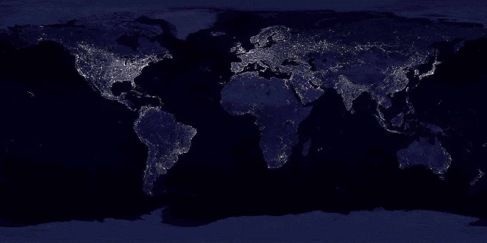

图片来自美国地球物理联合会

经济生计难以估计。即使在当今世界，也缺乏明确的数据来确定贫困地区，这导致资源分配不足——金钱、食物、药物和受教育机会。我们生产了大量的资源，为多达 100 亿人提供食物、衣服和住房，但仍有数亿人生活在贫困之中。

帮助缓解这一问题的一种方法是创建一个模型，利用计算机视觉来绘制和预测非洲国家卢旺达的贫困状况，这个模型足够小，可以提供丰富多样但不庞大的数据集。

我们如何完成这项任务？有几个关键步骤:

1.  **下载人口和健康调查(DHS)、夜灯卫星图像和白天卫星图像**
2.  **测试夜灯能否准确预测财富**
3.  **测试白天图像的基本特征是否也能准确预测财富，并提取图像特征**
4.  **利用白天和夜晚灯光图像的组合数据集构建一个卷积神经网络(CNN ),并应用迁移学习**
5.  **构建显示预测财富分布的地图**

在本文中，我们将学习如何开发一种可扩展的方法，使用识别图像特征的 CNN 来预测农村地区的贫困状况。我们将利用白天和夜间的卫星图像来创建一种准确而廉价的方法，以在集群级别(一个 10×10 公里的区域)估计资产财富。以下概述抓住了主要目标:

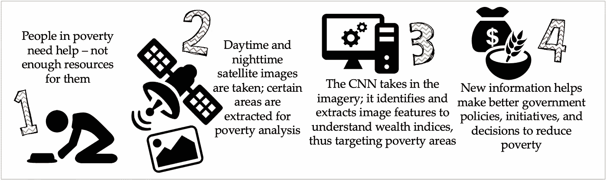

概观

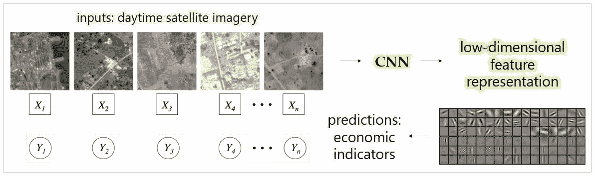

模型管道

# 1.下载数据

有三个组成部分:夜间照明，白天图像和 DHS 调查。

## 卢旺达 DHS

从[官方 DHS 页面](https://dhsprogram.com/data/dataset/Rwanda_Standard-DHS_2010.cfm?flag=0)下载卢旺达 DHS 数据并构建集群需要注册访问。这些调查提供了健康、人口和营养方面的代表性家庭数据，并通过给电力和技术设备等普通资产分配-2 到 6 的值，列出了资产得分(衡量财富的一种方法)。这些数据将作为我们的“地面实况”数据和标签系统，用于提取相应的白天和夜间图像。我们还使用地理数据集 shapefile 来报告每个指定聚类的坐标。具体来说，我们要求 RWHR61FL。ZIP(家庭调查)和 RWGE61FL。DHS 网站上的 ZIP (shapefile)文件。

## 夜灯

[2010 年夜灯文件](https://ngdc.noaa.gov/eog/dmsp/downloadV4composites.html)是一个包含来自世界各地的夜灯强度的单一大图像。为了只提取卢旺达，我们利用先前下载的 shapefile。

## 白天的图像

最后，我们使用 API 密匙从[谷歌地图平台](https://developers.google.com/maps/documentation/maps-static/dev-guide)获取白天的图像。像夜灯一样，它们是基于 DHS 数据集中提供的位置提取的，包含聚类级别的有价值的景观和活动特征。使用 Maps Static API 和卢旺达 shapefile，我们对成千上万的卫星图像进行了 ping 服务。我们使用 400×400 像素的图像，每幅图像代表 1 平方公里。

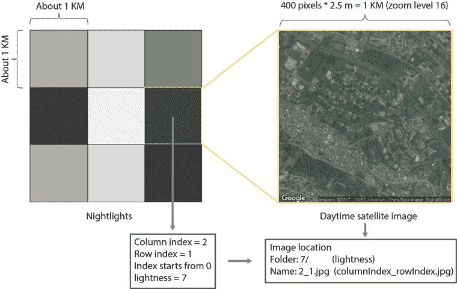

数据组织方案

# 2.尝试夜灯和 DHS 数据

在收集了必要的数据后，目标就变成了理解夜灯数据是否可以用来预测财富。首先，我们合并 DHS 和夜灯数据，然后拟合一个关于夜灯的财富模型。每个 DHS 星团的平均夜间亮度是通过对环绕星团中心的夜灯位置的亮度值取平均值来计算的。

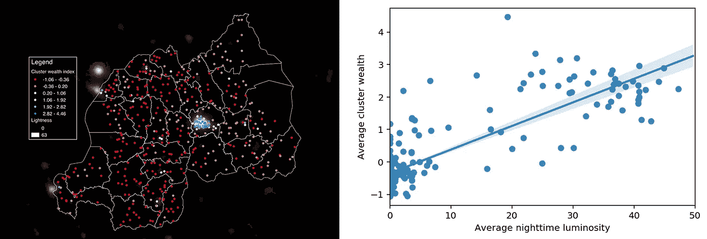

(左)资产评分和夜灯叠加；(右)回归模型说明了平均集群财富与相应集群夜灯亮度之间的关系

叠加可视化意味着夜灯亮度是较低贫困的一个很好的指标，因为较亮的区域有代表较高资产财富的冷色点簇。为了更深入地探究为什么较暗区域的资产分数是这样的，以及回归模型更好，我们问:*我们可以从卫星图像中提取出什么有意义的东西？*

# 3.切换到白天图像

白天的图像不断被记录，自动更新，并且大量可用，被证明是一种有价值的资源。

## 提取基本特征

为了测试白天图像是否可以预测集群财富，我们首先提取基本特征。对图像进行编码，使得每个像素由 0 到 255 之间的三个数值组成，对应于红色、绿色和蓝色级别。从这三个颜色层的每一层中，我们提取五个基本特征:像素值的最大值、最小值、平均值、中值和标准偏差。

然后将白天的图像与 DHS 数据合并，并拟合出一个财富模型，作为这些基本白天特征的函数。预测平均集群财富的线性回归模型得出的 R 值(相关系数)为 0.558。

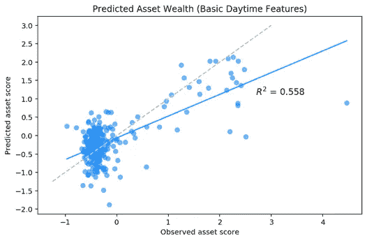

基本影像特征-当模型基于基本日间影像特征进行训练时的资产财富预测，产生 0.558 的 R 值

## 结合预先训练的神经网络

接下来，我们用深度学习提取特征。首先获得在 ImageNet 上预训练的 CNN (8 层，VGG-F ), ImageNet 是为对象识别研究设计的大型带注释的数据库。

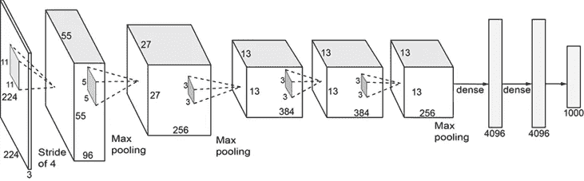

原始的 VGG-F 架构，其中有一个通过卷积和池层分析的输入。该模型从图像中提取 4096 个特征。

在学习从 1000 多个类别中正确分类每张图像的过程中，该模型识别边缘和拐角等低级特征，这些特征对计算机视觉任务至关重要。通过 Keras，我们使用 CNN 将白天的卫星图像输入到这个模型中，并输出 4096 维的特征向量，然后这些特征可以用于预测资产财富。R 值增加到 0.689。因此，我们得出结论，用深度学习提取特征确实提高了模型的准确性。

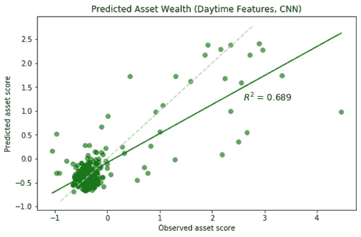

CNN 特征-根据 CNN 的日间影像特征训练模型时的资产财富预测，得出 R 值为 0.689

到目前为止，我们只合并了白天的图像。为了获得更好的预测，我们还应该以一种巧妙的方式包括夜间图像。

# 4.实施迁移学习

为了提高模型的准确性，我们应用了转移学习步骤，而不是直接使用 CNN 提取的图像特征，我们重新训练它从白天的图像中预测夜间灯光，以最终使用这些特征，这可能更适合估计资产财富的最终预测任务。该模型依赖于一种迁移学习方法，使用 CNN 从白天的卫星图像中提取图像特征。有三个步骤:

## 估计夜灯强度

DHS 调查数据集将夜间亮度表示为 0 到 63 范围内的整数。在预测夜灯时，我们将这些亮度分为三类——低(0 到 2)，中(3 到 34)，高(35 到 63)。

## 改变模型的用途

现在，我们通过重新训练最后一层，将该模型重新用作白天卫星图像的特征提取器；这是夜灯强度分类图层。本质上，我们要问的是:*给定一个白天的图像输入，同一个区域在晚上会是什么样子？*

该模型学习从每个输入的卫星图像到某个矢量表示的非线性映射，并具有在图像上“滑动”的过滤器，精确定位逐渐变得更加复杂的特征。例如，该模型最初学习诸如边和顶点之类的基本特征，但是最终寻找诸如道路、水路和建筑物之类的复杂得多的特征。

完全连接的层被转换成卷积层，随后是平均池层，这允许网络通过卷积对单个图像进行多次评估，并对结果进行平均，以产生概括每个图像的一个特征向量。卷积层对输入进行多次评估，输出多个特征向量。对图像的几次评估有助于处理每个输入图像的不同部分。

## 获得最终特征向量

然后，我们对这些特征向量进行平均，以获得每个聚类的一个向量，该向量被用作估计消费支出和资产财富的岭回归模型的输入。

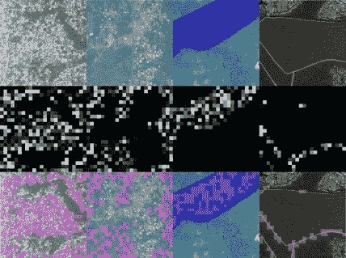

覆盖在卫星图像上的卷积滤波器(来源:[科学](https://science.sciencemag.org/content/353/6301/790)

我们分析这些特征，而不是仅仅使用白天图像收集的特征，是否在预测平均集群财富方面做得更好。他们做到了！R 值甚至进一步增加到 0.718，显著增加。

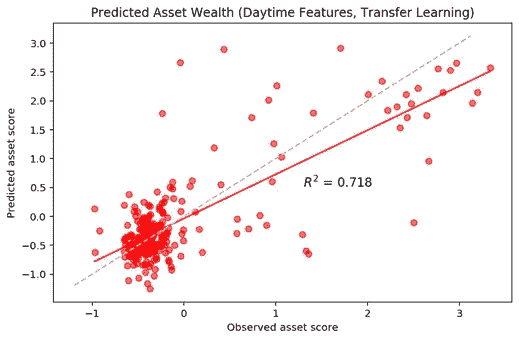

迁移学习-当模型通过迁移学习在白天影像特征上进行训练时的资产财富预测，产生 0.718 的 R 值。该模型现在更加可靠，由红色和灰色虚线的紧密程度以及较高的 R 值来表示。

# 5.创建资产财富图

用于评估经济福祉的迁移学习模型显著改进了现有的夜灯方法。我们分析了接近和低于贫困线的人口的福祉，因为夜灯显示的变化很小，并且在这些地区的预测能力很低。夜灯无法很好地区分贫穷、密集的区域和富裕、稀疏的区域，这两种区域的夜灯水平都很低。

在应用迁移学习之后，产生标准化的混淆矩阵。矩阵值沿对角线最大，表明相对较高的真阳性率。从图中可以明显看出，最低的夜灯级别具有最高的准确度(与仅夜灯模式的主要区别)，最高的夜灯级别具有第二高的准确度。

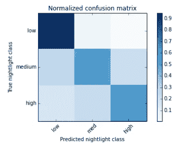

转移学习混淆矩阵，因为夜灯不能有效地表征低亮度区域

此外，我们可以构建财富预测的热图，将所有绘制的特征叠加到卢旺达地图上。您可以看到，结果非常像之前显示的资产财富和夜间照明数据叠加的彩色地图，这意味着该模型表现良好。

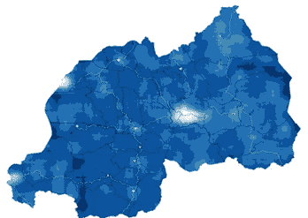

预测财富的热图-较亮的区域对应于贫困程度较低，较暗的区域对应于贫困程度较高。

# 结论

本文介绍的方法表明，我们可以利用 CNN 的日间和夜间卫星图像，配合调查数据，准确定位特定地方的高经济福祉和低经济福祉区域，从而确定贫困区域。由于这种方法是可扩展的和廉价的，我们希望将研究和结果扩展到更多的国家。

*完整代码可在此* [*GitHub 资源库*](https://github.com/asmikumar/poverty-prediction) *获得。*

# **参考文献**

[1] K. Beegle，L. Christiaensen，A. Dabalen 和 I. Gaddis，[崛起中的非洲的贫困问题](https://openknowledge.worldbank.org/handle/10986/22575) (2016 年)，世界银行

[2] M. Brems，[主成分分析一站式商店](/a-one-stop-shop-for-principal-component-analysis-5582fb7e0a9c) (2019)，*走向数据科学*

[3] N. Jean，M. Burke，M. Xie，W. Davis，D. Lobell，S. Ermon，[结合卫星图像和机器学习预测贫困](https://science.sciencemag.org/content/353/6301/790) (2016)， *Science*

[4] S. Athey，[超越预测:利用大数据解决政策问题](https://science.sciencemag.org/content/355/6324/483) (2017)，*科学*

[5] S. Pandey，T. Agarwal，C. Krishnan，[从卫星图像预测贫困的多任务深度学习](https://www.aaai.org/ocs/index.php/AAAI/AAAI18/paper/view/16441) (2018)，AAAI 2018

[6] S. Piaggesi，L. Gauvin，M. Tizzoni，C. Cattuto，N. Adler，S. Verhulst，A. Young，R. Price，L. Ferres，A. Panisson，[利用卫星图像预测城市贫困](https://openaccess.thecvf.com/content_CVPRW_2019/html/cv4gc/Piaggesi_Predicting_City_Poverty_Using_Satellite_Imagery_CVPRW_2019_paper.html) (2019)，CVPR，2019

[7] T. Stark，M. Wurm，H. Taubenbock，X. Zhu，[使用迁移学习深度特征在不平衡遥感数据集中绘制贫民窟](https://ieeexplore.ieee.org/document/8808965) (2019)，IEEE

[8] M .谢，n .让，m .伯克，d .洛布戴尔，s .埃蒙，[遥感与贫困制图深度特征迁移学习(2016)](https://arxiv.org/abs/1510.00098) ，2016