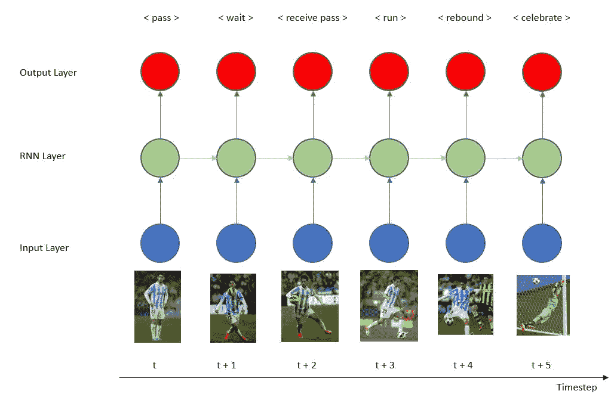
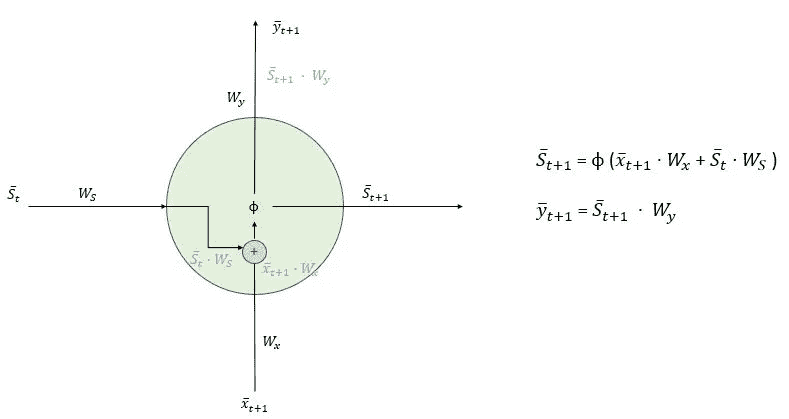
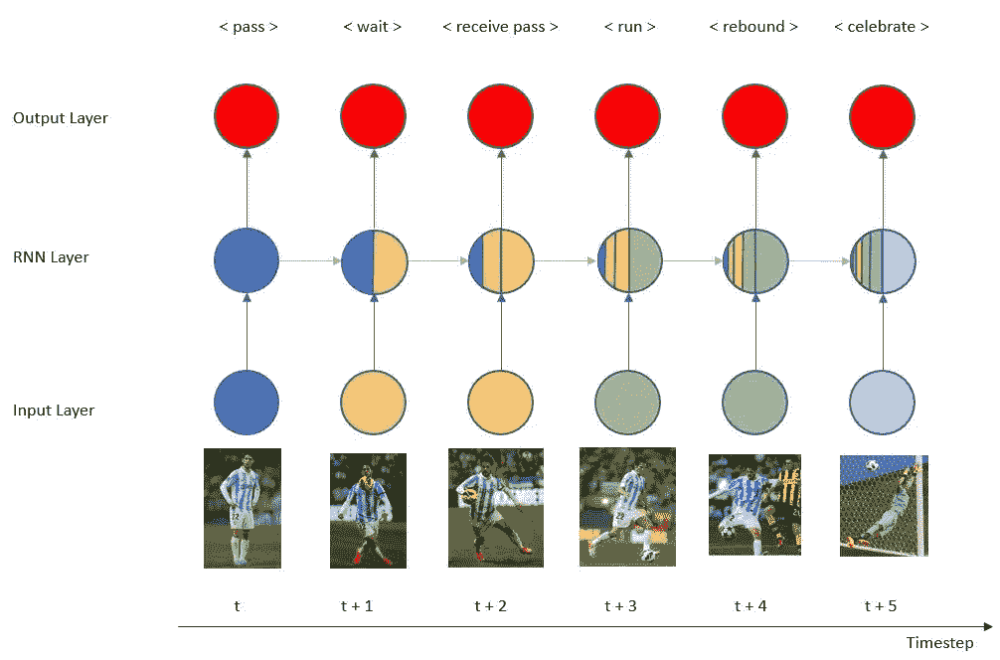
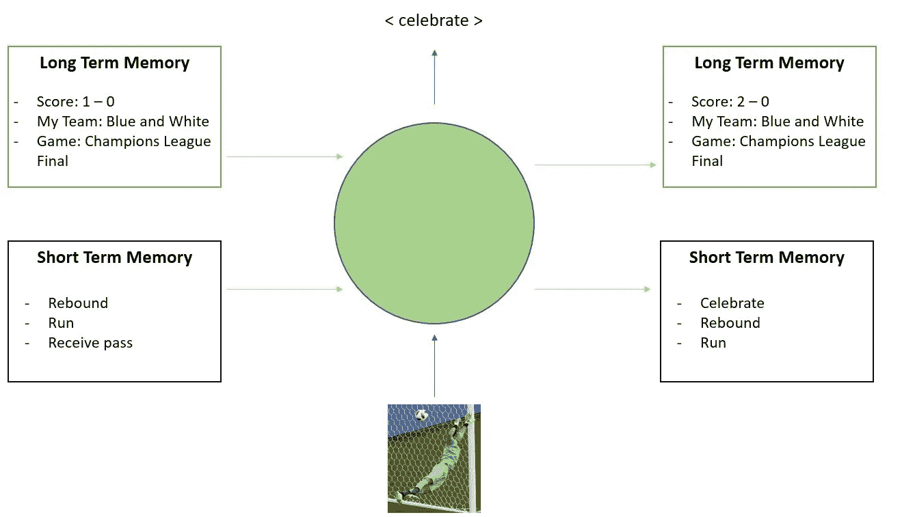
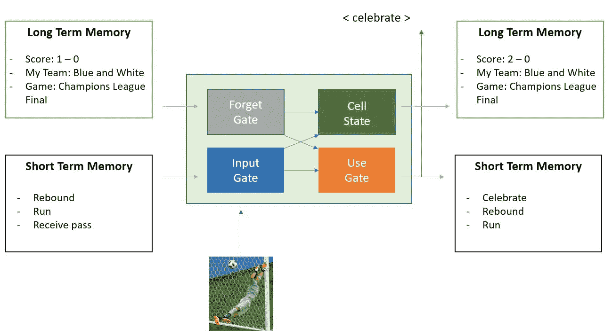
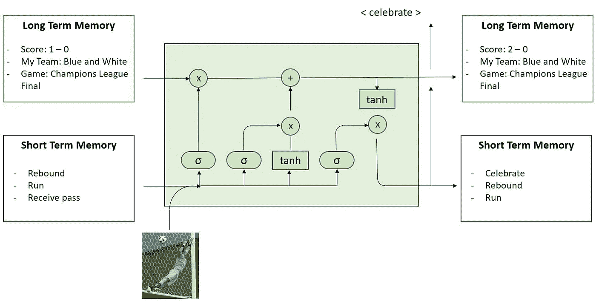
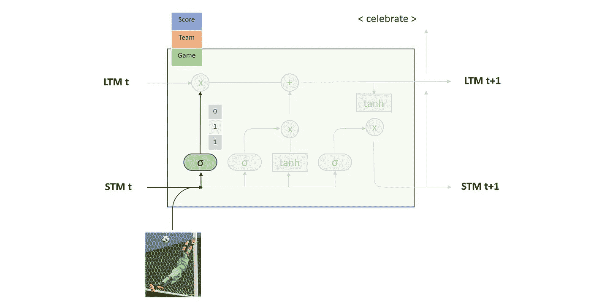
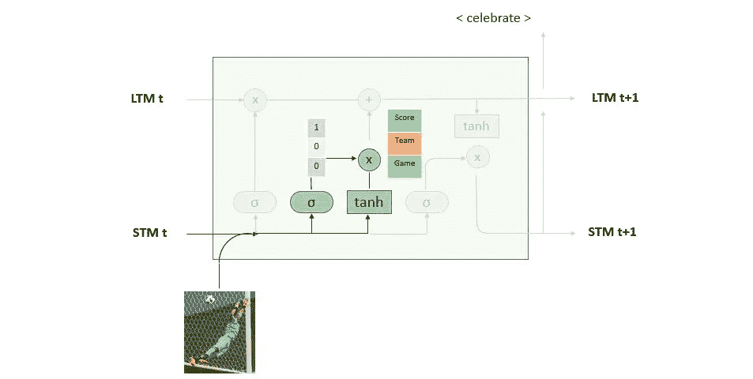
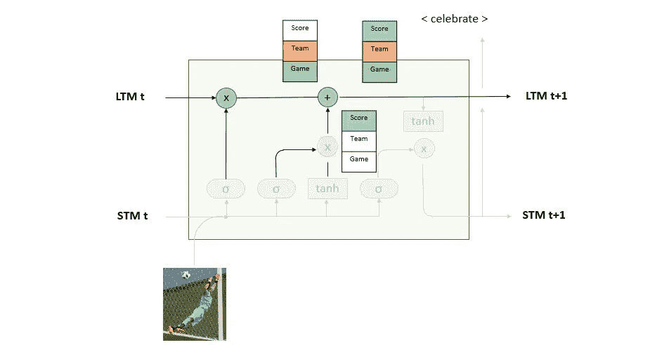
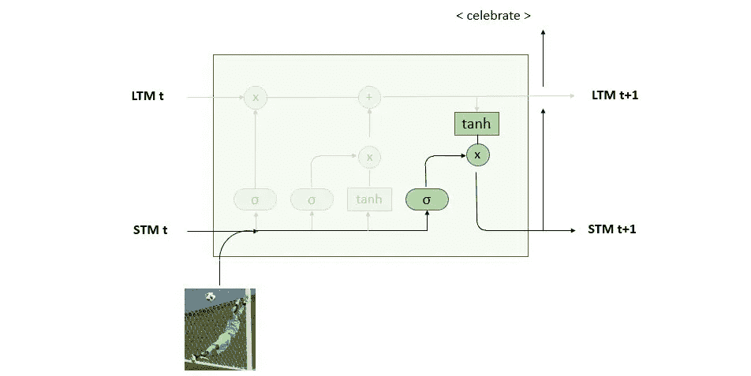

# 如何通过踢足球了解 LSTM

> 原文：<https://towardsdatascience.com/how-to-understand-lstm-by-playing-football-136c8431e451?source=collection_archive---------60----------------------->

## 得分时掌握长短期记忆门

足球图书概念' | ID 27329051 庞苏万| Dreamstime.com

在这一系列文章中，我们研究了前馈神经网络(FFNN)在理解上下文时的局限性。为了解决这个问题，我们[引入了递归神经网络(RNN)](https://medium.com/swlh/introduction-to-recurrent-neural-networks-rnn-c2374305a630) 的概念，并定义了存在的不同类型。然而，我们之前的分析没有充分解决 RNN 的关键问题，比如**是什么让 RNN 变得不同？细胞内部会发生什么样的计算？RNN 是如何学习的？**

**本文的目的就是要解决所有这些问题**，为了做到这一点，从历史的角度入手可能会有所帮助。Jeffrey L. Elman 在 20 世纪 90 年代早期首次尝试创建能够理解上下文的模型。这第一个 RNN，有时被称为香草 RNN，是同一层的两个单元共享信息的第一个单元之一，状态将从一个传递到另一个。

正如这篇文章的标题所暗示的，目的是通过踢足球而不是谈论历史来了解 LSTM，球在哪里？

# 比赛开始了

来了，**下面的模型代表了作为一名足球运动员你必须采取的行动的简化**。模型的输入是你的眼睛在野外看到的图像。然后一个 RNN 层对你的下一个动作做出正确的计算，它可以是“通过”、“等待”、“运行”…

在时间 t，你得到球，你看到你的一个同事没有被防守，所以 RNN 决定传球。下一个图像是你的同事试图控制球，你不知道他是否能做到，然后你在进攻或防守之前等待。在时间 t+2，他拿着球，如果他想把球传回来，你可以主动出击。他是一个非常优秀的球员，所以他决定向足球目标跑去，那么你的行动就是也跑。在时间 t+4，他正在投篮，所以你的第一个想法是准备好，如果有任何反弹。在时间 t+5，你看到球进了球门，所以你和你的同事一起庆祝进球，度过了一个美妙的时刻。

作者图片

一旦我们感受到进球和庆祝进球的激动时刻，是时候看看数学了。下面我们表示 RNN 层中的一个单元，**内部发生了什么计算？**

作者图片

**在时间 t+1，单元接收两个输入**，来自前一单元的状态 S̅ₜ和事件 x̄ₜ₊₁，在我们的例子中是图像。为了计算单元 S̅ₜ₊₁的下一个状态，我们将来自事件和状态的点积的结果与其各自的权重矩阵相加，并且我们应用激活函数φ。你不知道什么是激活函数吗？激活函数的概念将在下一节更详细地探讨。**结果向量在时间 t+2 作为其输入之一进入单元**。最后，通过 S̅ₜ₊₁与其权重矩阵 Wᵧ的点积获得预测 **y̅ₜ₊₁。**

那么，我们是不是说人类的记忆可以通过两次计算来复制？神经网络理解上下文就这么简单吗？答案是否定的，埃尔曼的方法是一个非常好的工作，但是它有一个障碍，叫做消失梯度问题，因此我们也知道这个单元是短记忆。计算机还没有变得比人更聪明。

# 1-谁在我的团队中？或者消失梯度问题

在代表 RNN 足球裁决的例子中，我们只关注了一个动作。但是结果是什么呢？还剩多少时间？是联赛还是冠军赛？**我要传球给的球员是否在我的队伍中？**

**Elman 结构遭受消失梯度问题:**这意味着细胞**不能从 8-10 个时间步长学习任何时间依赖性。**由于之前的 RNN 模型，我们可以找到问题的更清晰的表述。在这种情况下，我们将改变 RNN 层的颜色(绿色气泡)的表现多少数据，它可以记住从以前的步骤。在每个时间步，新数据被添加到由不同颜色表示的 RNN 中。第一步，我们只显示蓝色，而第二步，添加橙色。然后，当我们继续穿越时间时，从先前的时间步骤接收的信息开始消失，而由更近的步骤给出的信息变得更加可见。我们的模型已更改如下:

作者图片

即使我们没有涉及到消失梯度下降背后的数学，从这个图中我们可以清楚地理解这个问题。序列越长，神经网络就越难从前面的步骤中学习。

所以，我们已经看到我们的球员有短暂的记忆。然后他可能会忘记比赛的目标或者队友；因此，他所做的决定可能会阻止他赢得比赛。那么我们如何解决短期记忆的问题呢？

# 2-如何赢得' le *ballon d'or'* (长短期记忆)

90 年代中期，Sepp Hochreiter 和 Jürgen Schmidhuber 介绍了长短期记忆或 LSTM。**这个理论引入的创新是 gates 的想法，**我们数据中的一些信号可以保存为**【LTM】**，而其他信号可以保存为**短时记忆(STM)** 。这种区分允许根据情况在需要时使用长期或短期信息。为了更好地理解长时记忆和短时记忆的区别，让我们关注一下同事进球后的时间步长 t + 5。我们希望得到的最终图表如下所示:

作者图片

**作为输入，我们有我们正在分析的事件(图像)**，而不是只有一个状态或**记忆，我们有两个**，LTM 的目的是记住不会经常更新的一般信息，而 STM 专注于要使用的精确信息。然后我们应用 LSTM 细胞，我们输出一个新的 LTM，一个 STM 和一个预测。在图像的中间，我们再次看到代表 RNN 的绿色气泡。如果我们观察这个气泡内部，**我们将分析 4 种不同的计算**。为了便于表示，我们将气泡转换成了矩形。从概念上讲，RNN 单元看起来如下:

作者图片

**有 3 个门加一个单元状态。**在一些文章中，你可能会发现存在 4 个门，但这是因为它们也将单元状态称为门。在*“3-数学表示法”*部分，我们将看到不同之处。

为了更好地理解每个关卡的目的，让我们继续看时间步长 t+5 的例子，在这个例子中，我们的队友得分了。

*   **忘记门**:顾名思义，这个门的作用是**决定前一时间步**中哪些信息不再有用。例如，在 t + 5，因为我们的同事进了一球，我们不再需要记住前一分钟的比分。我们首先忘记旧的结果，然后添加新的结果。在这个门口，我们只是忘记了我们是 1-0 获胜。
*   **输入门** : **决定我们应该保留哪些新信息**。从输入图像中，我们不需要知道草是绿色的，或者球是圆的。并不是所有来自图像的信息都是相关的，我们将只保留例如我们进了一个球。
*   **细胞状态**:正如我们之前看到的，LSTM 允许拥有不仅仅是短暂的记忆。单元状态负责从遗忘门获取输出并遗忘不再有效的内容，然后从输入门获取输出并添加相关信息。**细胞状态的输出将是下一步的长期记忆。**
*   **使用 Gate** :我们已经计算了什么信息会作为长期传递到下一个时间步；现在是**计算短期状态的时刻。**我们一方面需要细胞状态的输出，另一方面需要来自事件(图像)和短期记忆的信息，以决定我们作为足球运动员的下一步行动是与我们的团队一起庆祝进球。这个结果将具有双重目的，一方面它将是要传递到下一层的短记忆状态，另一方面它将是 LSTM 层的预测。

很好，到目前为止，我们已经研究了埃尔曼提出的香草 RNN 的极限。我们理解了消失梯度的问题，以及这个模型如何只能创造短期记忆。为了解决这个问题，我们引入了一种新的 RNN 单元结构，称为 LSTM，由不同的门组成。上面的解释是对 LSTM 工作原理的简化解释，**让我们在更深层次上理解所使用的数学。**

# 3-数学表示

一旦我们把上面的图和门转换成计算，这就是它看起来的样子。

作者图片

第一次看到这张图片时，我有点不知所措，一个单元格中有太多的函数和线条。如果你也和我一样，没有必要担心，因为如果你已经理解了上面解释的概念；理解这种结构将会非常容易。

在详细解释 LSTM 之前，先说一下激活函数。为了理解激活功能，只要想想我们大脑中的**神经元**，**它们以开关的方式与电脉冲一起工作**。神经元是相互连接的，它们用这些脉冲交换信息。某些神经元的激活会触发我们的行动。回到我们的 **RNN，输入是用数字而不是脉冲来测量的，那么我们如何将这些数字转换成脉冲呢？**这正是激活功能开始为我们做这项工作的时候。让我们特别关注其中的两个:

*   **Sigmoid**(σ):Sigmoid 函数的每个输入都有一个介于 0 和 1 之间的输出值。万一忘记了信息，该函数输出 0。否则，该函数输出 1 以保留信息。
*   **双曲正切** (tanh):这个激活函数的输出在-1 和 1 之间。那么 tanh 的目标只是将它接收到的所有信息转换成[-1；1]这样网络才能正常工作。

*关于激活函数的更多信息，我推荐下面的文章* [*。*](https://medium.com/the-theory-of-everything/understanding-activation-functions-in-neural-networks-9491262884e0)

我们已经把图表转换成了数学表示，让我们用同样的方法来解释。一旦我们理解了用文字解释的每个门的作用，现在是时候用数字来解释了:

*   忘记入口:

作者图片

我们解释说这个门的作用是决定由于短期记忆和新图像**在 LTM 中哪些信息要忘记**。**因此，我们使用了一个 sigmoid 函数**。正如我们在图像中看到的，我们将 LTM 表示为一个向量，sigmoid 的输出将是一个相同形状的向量。**来自*团队*和*游戏*的信息将被保留，因为激活函数的输出是 1，而对于分数输出是 0。然后我们忘记了分数。**

*   输入门:

作者图片

它由两个动作组成，一方面**我们通过应用 tanh** 计算新信息，然后**我们根据这个新信息中的 sigmoid 决定我们应该保留哪个**。“分数”、“团队”和“游戏”的新信息已经计算出来，但我们将只保留新的“分数”。

*   单元格状态:

作者图片

在这里我们可以清楚地看到为什么这不是一个门。有一个乘法和一个加法，我们不是用 tanh 变换数据，也不是用 sigmoid 选择要保留什么信息。一旦我们知道从以前的 LTM 中保留什么信息，从新的输入中保存什么信息，我们就有了下一步的 LTM。

*   使用门:

作者图片

这个门将从新的 LTM 接收过滤的信息，由于 STM，新的图像将得到一个新的 STM。值得注意的是，这个门的输出同时是新的 STM 和预测。

这是一个长期的短期记忆结构，我们利用来自前一时间步的信息，感谢 LTM 和 STM 结合新的信息，图像。我们应用 sigmoid 来决定保留什么信息，并用 tanh 来保持值在-1 和 1 之间。每个门都有自己的角色和激活功能的组合。

我们必须考虑到，LSTM 不是唯一的结构，例如门控循环单元(GRU)也是一个众所周知的结构。它遵循相同的门和激活函数的思想，不同之处在于门的数量和它们各自的分布。

# 摘要

如果你到了这一步，恭喜你！你开始成为 RNN 专家。这意味着我们理解了 FFNN 在理解上下文以及如何应用 RNN 来解决它时的局限性。

**这也意味着我们知道存在不同的细胞结构。**第一个是**香草 RNN** ，它遇到了梯度消失的问题，换句话说就是无法在多个时间步上保持依赖性。这个短记忆的问题可以通过一种叫做 **LSTM 的新单元结构来解决。最重要的是，我们深入研究了 LSTM 细胞的结构，以了解它是如何工作的。**

长短期记忆不是像香草 RNN 那样只有一种状态，而是有长期记忆和短期记忆两种状态。我们分析了**遗忘门**的作用，它决定了前一时间步中哪些信息不再有用。然后**输入门**从新输入中过滤出相关的信息。**单元状态**从遗忘门和输入门获取输出以产生新的 LTM。最后，**使用门**结合新的 LTM 和输入来创建 STM。

到目前为止，我们已经关注了细胞本身，在接下来的文章中，我们将探索使用 LSTM 细胞的多种方法，例如创建一个编码器-解码器结构，以及它如何允许为注意力模型播下种子。

 [## 递归神经网络导论(RNN)

### 计算机是如何理解上下文的？什么是递归神经网络，它如何帮助我们？有没有…

medium.com](https://medium.com/swlh/introduction-to-recurrent-neural-networks-rnn-c2374305a630)  [## 如何用 RNN 和喀拉斯建立翻译管道

### 你有没有想过一台计算机是如何能够如此快速地学习多种语言的？按照这个逐步指南…

towardsdatascience.com](/how-to-build-a-translation-pipeline-with-rnn-and-keras-57c1cf4a8a7)