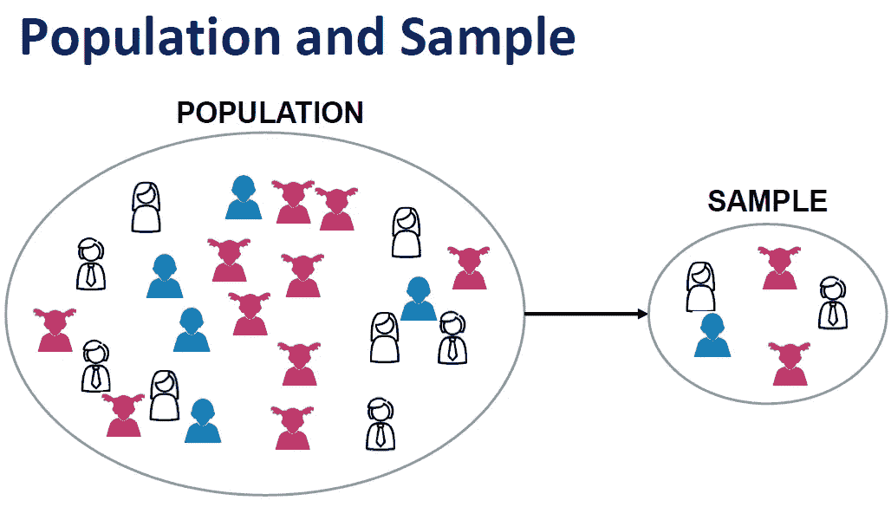
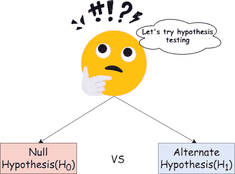
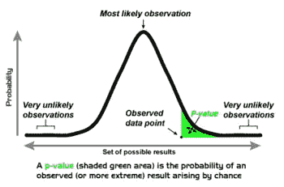

# 如何通俗地理解 p 值？

> 原文：<https://towardsdatascience.com/how-to-understand-p-value-in-layman-terms-80a5cc206ec2?source=collection_archive---------4----------------------->

## 理解 p 值的简单方法

统计学中最重要的概念之一是 p 值的解释。我想更简单的分享一下我对 p 值的理解。

假设一家公司声称其生产的巧克力“X”在 1 块巧克力中含有 70 克坚果。但是一些顾客抱怨巧克力棒的果仁少于 70 克。我们想测试一下该公司关于巧克力 X 中坚果平均重量的说法是否正确。让我们试着解决这个问题。

你认为所有这些巧克力棒都有同样多的坚果吗？？

我们抽取 20 个巧克力棒的样本，并找出这些巧克力棒中坚果的平均数量(样本平均值),以推断总体平均值。总体和样本的区别？见下文:

从人群中取样有不同的方法。这里我们从最近的商店里随机抽取了一些酒吧。

总体平均值(我们不知道)是该公司生产的所有巧克力棒中所含坚果的平均值，这在现实中是无法计算的。在我们的例子中，我们假设它的价值为 70gm(假设的平均值——公司所声称的)。

假设我们取样的 20 根棒线的坚果平均值为 68.5。我们能断定顾客的说法是真实的吗？这是否提供了足够的证据证明巧克力棒缺少坚果，或者这一结果只是运气使然？为了回答这个问题，我们进行假设检验。

让我们陈述无效假设和替代假设。

> **零假设:**巧克力棒中坚果的总体平均值为 70 克。(这是我们试图提供证据反对的事情。)
> 
> **替代假设:**巧克力棒中坚果的总体平均值小于 70 克。(这是我们试图证明的)

该规则规定，如果 p 值小于显著性水平(α),我们拒绝零假设。下一个问题:

## 显著性和 p 值是什么水平？

**显著性水平(alpha)** 是我们拒绝零假设时愿意承担的风险百分比。

**P 值**是随机机会产生的数据或其他相等或更少的数据的概率(在零假设下)。我们计算样本统计的 p 值(在我们的例子中是样本平均值)。我们可以通过查看 z 表来手动计算，或者使用一些统计软件来计算。

假设真正的巧克力数量平均为 70 克。这并不一定意味着，如果世界上有 100 万块 X 型巧克力，那么每块巧克力的平均坚果含量为 70 克。可能很少有平均重量小于 70 克的巧克力，也有一些平均重量大于 70 克的。因此，当我们抽取一些巧克力样品时，由于取样的变化，样品的平均值可能小于、等于或大于 70 克。

回到 p 值的解释。

> “p 值用于确定实验结果是否具有统计学意义。低 p 值意味着假设零假设是真的，那么这个结果是运气的结果的可能性非常低。高 p 值意味着假设零假设是真的，这种结果是非常可能的”

p 值-正态曲线下阴影区域的面积

## 如果 p 值

假设我们得到 p 值为 0.04。这意味着，在假设总体螺母平均值为 70 gm 的情况下，如果我们在零假设下重新运行测试，我们将获得 100 次样本平均值中的 4 次(在我们的情况下为 68.5)。非常不可能！因此，我们可以说——结果表明样本可能来自不同的亲本群体。

因此，我们拒绝零假设。在这种情况下，我们有强有力的证据再次无效。

> 得到如此罕见的东西(几率为 4/100)可能不太可能，但仍有可能是运气使然。

让我们试着理解我们拒绝零假设的基础——为什么我们得出样本不是来自零假设下的总体。假设你有两张彩票，然后随机洗牌。一张票来自有 300，000 个参与者和 1 个奖品的事件 X。另一张票来自 Y 事件，有 30 名参与者，有 10 个奖项。你中了一张彩票，但你不知道它属于哪个项目。你的猜测不会是:事件 Y，因为奖品多，人少的时候，你本来中奖的机会就多。但是假设你的中奖彩票来自 X 事件！万岁！！！运气发挥了作用，你得到了！

因此，当我们说一个事件不太可能发生时，它仍然有可能是侥幸发生的，这就是我们偶然发现第一类错误的时候——当它为真时拒绝空值。未能拒绝错误的零假设被称为第二类错误。

记住第一类和第二类错误定义的最好例子之一。(参考谷歌图片)

回到我们的定义，因为这会更有意义。显著性水平(Alpha) —在拒绝零假设或 I 型错误率时，我们愿意承担的风险百分比。

事实上，重要程度取决于我们基于假设检验试图回答的问题类型。如果这个问题是关于你当地核电站的熔毁风险，就在这条路不到一英里的地方，会怎么样？在接受错误答案的风险之前，你可能想更确定一点。

我相信这篇文章帮助你建立了对 p 值的基本理解。围绕在现实世界中使用它有很多争论。使用 p 值有一些优点和缺点。参考本文快速阅读:[https://www . prosancons . com/education/pros-and-cons-of-p-values/](https://www.prosancons.com/education/pros-and-cons-of-p-values/)

感谢阅读。希望得到您的反馈。

参考资料:

[1]https://www.investopedia.com/terms/p/p-value.asp

[2][https://blog . minitab . com/blog/adventures-in-statistics-2/how-to-correct-interpret-p-values](https://blog.minitab.com/blog/adventures-in-statistics-2/how-to-correctly-interpret-p-values)

[3][https://amstat . tandfonline . com/doi/full/10.1080/00031305 . 2016 . 1154108 # . xhx 1 tedkhpa](https://amstat.tandfonline.com/doi/full/10.1080/00031305.2016.1154108#.XhX1tEdKhPa)