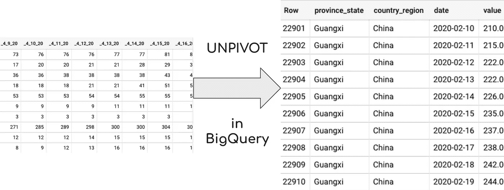
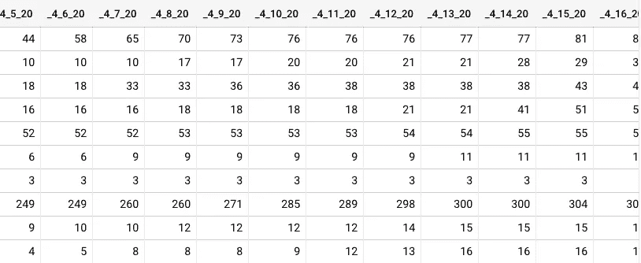
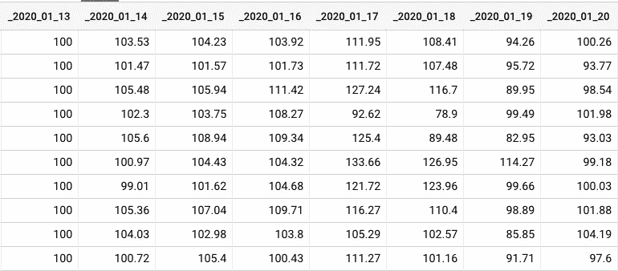
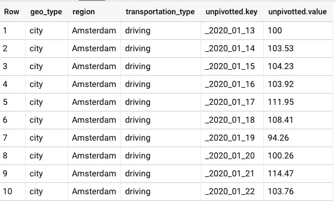
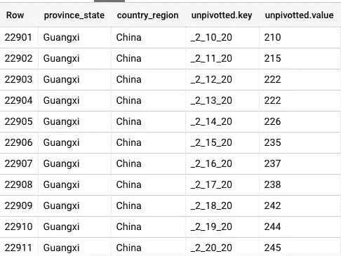
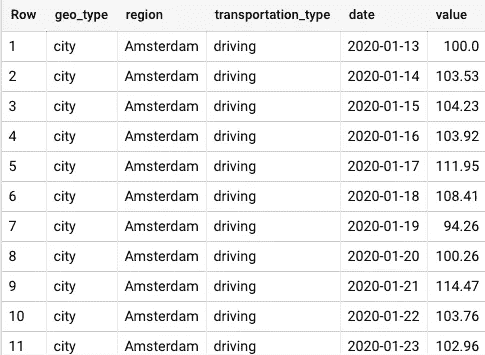
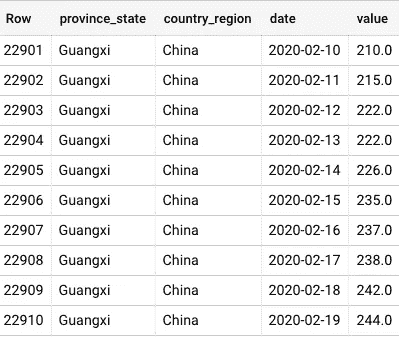
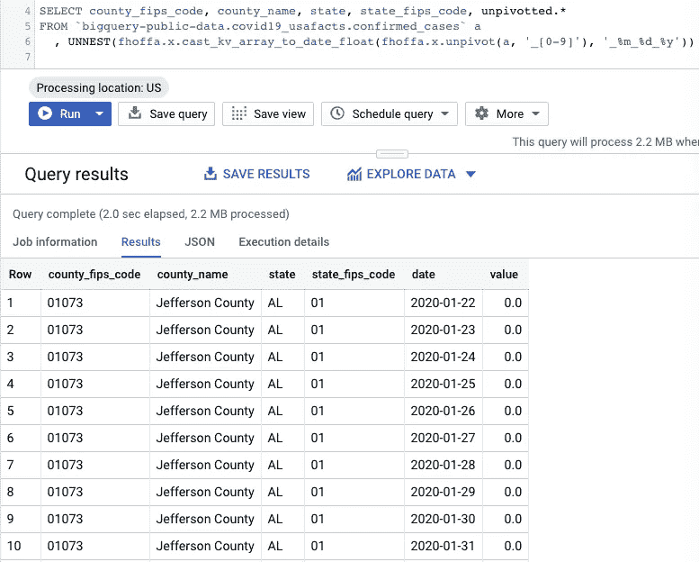

# 使用 BigQuery 和 SQL UDF 将多个列拆分成整齐的对

> 原文：<https://towardsdatascience.com/how-to-unpivot-multiple-columns-into-tidy-pairs-with-sql-and-bigquery-d9d0e74ce675?source=collection_archive---------18----------------------->



## 这篇文章是写给任何在 CSV 中处理时间序列的人的，每天都有一个新的专栏。拥有整洁的数据很重要！尤其是现在，一些公共数据的提供者选择了每天一列——这使得用 SQL 分析时间序列变得非常困难。在这篇文章中，可以找到一个共享的持久化 BigQuery UDF，它可以将数百个列转换成整齐的(日期，值)对，供您使用。

***重要更新*** : *我在 2020 年离开了谷歌，加入了雪花——所以我无法保持更新我的旧帖子。如果你想尝尝雪花啤酒，加入我们吧——我在❄️.玩得很开心*

作为非整齐数据的一个例子，我们可以看到新型冠状病毒(新冠肺炎)案例(由 JHU·CSSE 提供)和[苹果移动趋势报告](https://www.apple.com/covid19/mobility)表格的外观:



JHU CSSE 表格，苹果移动趋势报告表格:每个日期一列。我们不想那样。

我们不希望多列，每个日期。我们希望有(日期，值)对。因为这个问题似乎很常见，所以我编写了两个 BigQuery 持久性 UDF 来解决这个问题:

*   `fhoffa.x.unpivot()`
*   `fhoffa.x.cast_kv_array_to_date_float()`

让我们回顾一下它们是如何工作的。

## 使用 fhoffa.x.Unpivot()进行 unpivot

只需给`unpivot()`一个完整的行，以及每个列的名称如何显示的正则表达式。

苹果桌子:

```
SELECT a.geo_type, region, transportation_type, unpivotted
FROM `fh-bigquery.public_dump.applemobilitytrends_20200414` a
  , UNNEST(fhoffa.x.unpivot(a, '_2020')) unpivotted
```



颠覆苹果移动趋势

与 JHU 表:

```
SELECT province_state, country_region, unpivotted
FROM `bigquery-public-data.covid19_jhu_csse.confirmed_cases`  a
  , UNNEST(fhoffa.x.unpivot(a, '_[0-9]')) unpivotted
```



取消旋转 JHU 表

这就好多了，但我们还没完。我们如何将这些值转换成日期和数字？

## 用 cast_kv_array_to_date_float()转换数组

我们可以使用`cast_kv_array_to_date_float()`重新转换未透视的列。

当将这些列转换为日期时，更“令人恼火”的是它们使用不同的格式对日期进行编码。您不必担心，因为 UDF 也可以将日期格式作为输入。

例如，苹果的桌子:

```
SELECT a.geo_type, region, transportation_type, unpivotted.*
FROM `fh-bigquery.public_dump.applemobilitytrends_20200414` a
  , UNNEST(fhoffa.x.cast_kv_array_to_date_float(fhoffa.x.unpivot(a, '_2020'), '_%Y_%m_%d')) unpivotted
```



颠覆和铸造苹果移动趋势

还有 JHU 的桌子:

```
SELECT province_state, country_region, unpivotted.*
FROM `bigquery-public-data.covid19_jhu_csse.confirmed_cases`  a
  , UNNEST(fhoffa.x.cast_kv_array_to_date_float(fhoffa.x.unpivot(a, '_[0-9]'), '_%m_%d_%y')) unpivotted
```



拆除和铸造 JHU 表

看到了吗？这些结果看起来比开始的表格更整洁。

## 奖励:covid 19 _ USA facts . confirmed _ cases 表

一旦我们有了这两个 UDF，将它们应用到其他表就变得非常容易了:

```
SELECT county_fips_code, county_name, state, state_fips_code, unpivotted.*
FROM `bigquery-public-data.covid19_usafacts.confirmed_cases` a
  , UNNEST(fhoffa.x.cast_kv_array_to_date_float(fhoffa.x.unpivot(a, '_[0-9]'), '_%m_%d_%y')) unpivotted
```



取消“covid 19 _ USA facts . confirmed _ cases”表的透视

# 操作方法

查看我之前关于 BigQuery 中[持久 UDF 的帖子:](https://medium.com/@hoffa/new-in-bigquery-persistent-udfs-c9ea4100fd83)

[](https://medium.com/@hoffa/new-in-bigquery-persistent-udfs-c9ea4100fd83) [## BigQuery 中的新特性:持久性 UDF

### 用户定义的函数是扩展 BigQuery 的一种强有力的方法，但直到现在，它一直是一个必须复制粘贴的累赘…

medium.com](https://medium.com/@hoffa/new-in-bigquery-persistent-udfs-c9ea4100fd83) 

这两个 UDF 的源代码是:

```
CREATE OR REPLACE FUNCTION fhoffa.x.unpivot(x ANY TYPE, col_regex STRING) 
AS ((
  # [https://medium.com/@hoffa/how-to-unpivot-multiple-columns-into-tidy-pairs-with-sql-and-bigquery-d9d0e74ce675](https://medium.com/@hoffa/how-to-unpivot-multiple-columns-into-tidy-pairs-with-sql-and-bigquery-d9d0e74ce675)
  SELECT 
   ARRAY_AGG(STRUCT(
     REGEXP_EXTRACT(y, '[^"]*') AS key
   , REGEXP_EXTRACT(y, r':([^"]*)\"?[,}\]]') AS value
   ))
  FROM UNNEST((
    SELECT REGEXP_EXTRACT_ALL(json,col_regex||r'[^:]+:\"?[^"]+\"?') arr
    FROM (SELECT TO_JSON_STRING(x) json))) y
));CREATE OR REPLACE FUNCTION fhoffa.x.cast_kv_array_to_date_float(arr ANY TYPE, date_format STRING) 
AS ((
  # [https://medium.com/@hoffa/how-to-unpivot-multiple-columns-into-tidy-pairs-with-sql-and-bigquery-d9d0e74ce675](https://medium.com/@hoffa/how-to-unpivot-multiple-columns-into-tidy-pairs-with-sql-and-bigquery-d9d0e74ce675)
  SELECT ARRAY_AGG(STRUCT(SAFE.PARSE_DATE(date_format, key) AS date, SAFE_CAST(value AS FLOAT64) AS value))
  FROM UNNEST(arr)
));
```

这个函数背后的秘密引擎:用`TO_JSON_STRING()`将一整行转换成 JSON，然后对它执行一个`REGEXP_EXTRACT_ALL`。

## 历史笔记

我的[以前的解决方案](https://stackoverflow.com/a/27832362/132438)在 BigQuery 中的 UNPIVOT 已经收到了超过 5000 个关于堆栈溢出的视图:

[](https://stackoverflow.com/a/27832362/132438) [## 如何在 BigQuery 中取消透视？

stackoverflow.com](https://stackoverflow.com/a/27832362/132438) 

## 后续步骤

一旦我为这些函数编写了文档，并且我们确定了它们的最终名称——我将把它们提交给我们与社区 UDF(`[bqutil](https://github.com/GoogleCloudPlatform/bigquery-utils/tree/master/udfs/community)`)共享的存储库。

[](https://github.com/GoogleCloudPlatform/bigquery-utils/tree/master/udfs/community) [## Google cloud platform/big query-utils

### 该目录包含社区贡献的用户定义函数，以扩展 BigQuery 用于更专门的用途…

github.com](https://github.com/GoogleCloudPlatform/bigquery-utils/tree/master/udfs/community) 

# 想要更多吗？

查看[谷歌的公共数据集项目](https://cloud.google.com/blog/products/data-analytics/free-public-datasets-for-covid19)，在 BigQuery 中收集了越来越多的新冠肺炎相关数据集:

[](https://cloud.google.com/blog/products/data-analytics/free-public-datasets-for-covid19) [## 新冠肺炎免费公共数据集|谷歌云博客

### 数据在调查、研究和应对突发公共卫生事件的能力中始终发挥着至关重要的作用

cloud.google.com](https://cloud.google.com/blog/products/data-analytics/free-public-datasets-for-covid19) 

我是 Felipe Hoffa，谷歌云的开发者倡导者。在 [@felipehoffa](https://twitter.com/felipehoffa) 上关注我，在[medium.com/@hoffa](https://medium.com/@hoffa)上找到我以前的帖子，在[reddit.com/r/bigquery](https://reddit.com/r/bigquery)上找到所有关于 BigQuery 的帖子。