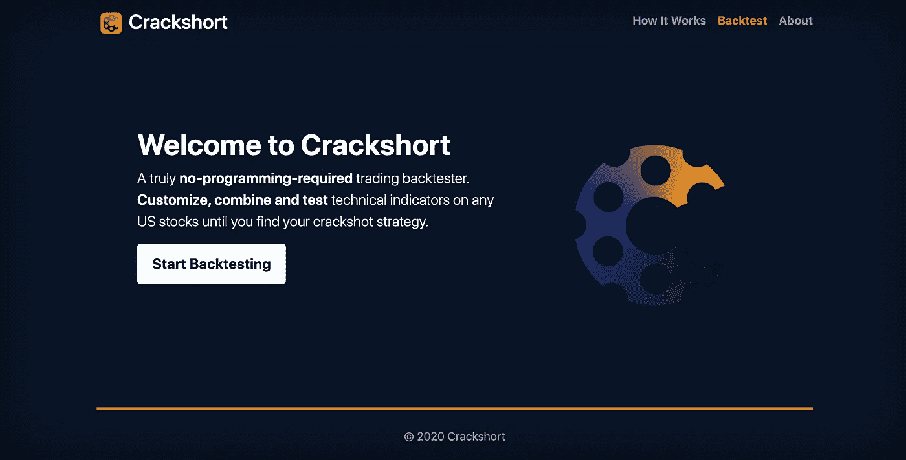

# 如何更新你的 Django 网站

> 原文：<https://towardsdatascience.com/how-to-update-your-live-django-website-b84645753ea1?source=collection_archive---------19----------------------->

## 数字海洋的逐步指南以及 AWS EB、Heroku 和 Azure 的链接



我的 Django-数字海洋网络应用。图片作者。

我最近用 Django 开发了一个网络应用程序([见此](https://www.crackshort.co/))并通过 DigitalOcean 部署了它。

使用 DigitalOcean 有很多绝妙的理由，但更新不是其中之一。因为它是云托管提供商，而不是像 AWS Elastic Beanstalk 一样的 PaaS，**更新过程 100%是你的问题**。

此外，如果您也部署了 DigitalOcean，您可能会意识到关于如何运行更新的资源非常少。这就是我进来的地方。

我已经在我如何建立我的网站的详细演练中写了这个过程(如果你愿意，你可以在下面阅读)，但我想详细说明这一点，以帮助填补像我这样的初学者的知识空白。

[](/from-zero-to-full-stack-web-development-in-37-days-97b8c254a3d1) [## 37 天内从零到全栈 web 开发

### 以及如何更快地完成它

towardsdatascience.com](/from-zero-to-full-stack-web-development-in-37-days-97b8c254a3d1) 

**如果你部署在数字海洋之外的地方，更新会容易得多，这里有一些可能与你相关的页面:**

*   AWS 弹性豆茎([控制台](https://aws.amazon.com/getting-started/hands-on/update-an-app/) / [命令行界面](https://stackoverflow.com/questions/42723302/how-to-update-an-elastic-beanstalk-app-from-the-aws-command-line-tool))
*   [Heroku](https://devcenter.heroku.com/articles/git)
*   [微软 Azure](https://www.quora.com/How-do-I-update-a-website-that-is-already-hosted-in-Microsoft-azure)

# 如何更新您现有的网站/应用程序

**步骤 1: If Django:** 为本地调试配置您的 Django 设置。您需要这样做来在您的本地主机上运行您正在进行的工作。

```
# in settings.py
DEBUG = True
ALLOWED_HOSTS = []
```

如果您在设置文件中使用自定义变量在“实时”和“本地”模式之间切换，尤其是当您的数据库也发生变化时(例如，如果您使用 PostgreSQL)，您可以使这变得稍微容易一些。

在这个例子中，当我想要编辑或部署时，我所做的就是切换 *live_deploy* 变量。

**步骤 2:** 更新项目代码。

第三步:如果姜戈:进行迁移。在本地进行迁移，但在服务器上进行迁移，因为迁移文件是源代码的一部分，不应该在服务器上被篡改。阅读这篇 StackOverflow 帖子了解更多信息。

```
# in terminal
python3 manage.py makemigrations
```

**第 4 步:如果 Django:** 重新配置您的设置以进行实时部署。

```
# in settings.py
DEBUG = False
ALLOWED_HOSTS = ['00.000.0.000','www.yourdomain.com'] # insert your IP or domain
```

**第五步:**准备好你的修改，提交到 Git，然后*推送到你选择的远程存储库。非常重要，因为在数字海洋(步骤 8)中，遥控器是您获取代码的地方。*

```
# in terminal
git commit -m "your commit message"
git push origin master
```

**第六步:**使用 SSH 登录您的数字海洋虚拟机。

```
# in terminal
ssh user@00.000.0.000
```

**步骤 7:** 激活您的项目所使用的虚拟环境，因为您需要运行 Django 命令。

```
# in terminal
source venv/bin/activate #replace with your venv
```

**步骤 8:** 从您的项目目录中，从您的远程存储库中提取您的更新代码。

```
# in terminal
cd /your/project/dir
git pull origin
```

**步骤 9:如果 Django:** 运行迁移并收集静态。**不进行迁移** —参考步骤 3。

```
# in terminal
python3 manage.py migrate
python3 manage.py collectstatic
```

**步骤 10:** 重启 Gunicorn(您的 WSGI 服务器)以应用更改。通常情况下，您不需要重启 NGINX，因为不会对 web 服务器进行任何更改——我唯一一次重启是在更新 SSL 证书的时候。

```
# in terminal
sudo service gunicorn restart
sudo service nginx restart #only if you need to
```

看起来有点冗长，但重要的是坚持所有的步骤，以确保您的新代码正确配置用于实时部署，使其进入虚拟机，并显示在您的网站或应用程序中。

如果你想自动更新，你可以用 Fabric 和 Ansible 来实现。你可以在这里找到一个相当完整的指南，所以我就不详述了。

但是，如果你像我一样刚刚开始，你可能不需要频繁更新，而是喜欢尽可能保持简单。

在这种情况下，这 10 个步骤将是您每次可靠地运行更新所需要的全部。