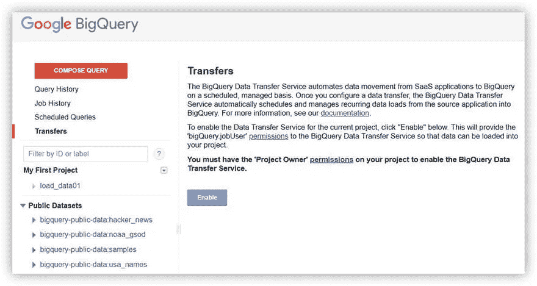

# 如何向 Google BigQuery 上传数据

> 原文：<https://towardsdatascience.com/how-to-upload-data-to-google-bigquery-989dc7b92583?source=collection_archive---------15----------------------->

## 在本文中，我们考虑将数据上传到 Google BigQuery 云存储的选项。我们考虑从 CSV/JSON 文件加载数据的简单方法，以及通过 API 或插件上传数据的方法。

Google BigQuery (GBQ)允许您从不同来源收集数据，并使用 SQL 查询进行分析。GBQ 的优势之一是计算速度快(即使数据量很大)和成本低。

为什么需要将数据加载到一个存储中？如果你想使用端到端的分析，使用原始数据来创建报告，并衡量你的营销效率，那么你应该使用谷歌大查询。

如果你需要在几秒钟内分析万亿字节的数据，Google BigQuery 是最简单、最实惠的选择。你可以通过观看 Google Developers YouTube 频道上的[短片来了解这项服务的更多信息。](https://www.youtube.com/watch?v=aupC-Wj7XDY)

# 创建数据集和表

在上传任何数据之前，您需要在 Google BigQuery 中创建一个数据集和表。为此，在[的 BigQuery 主页](https://console.cloud.google.com/bigquery?)上，选择要在其中创建数据集的资源。

图片由作者提供

在“创建数据集”窗口中，为数据集指定一个 ID，选择一个数据位置，并设置默认的表有效期。
注意:如果您为表过期选择“永不”，将不会定义物理存储位置。对于临时表，您可以指定存储它们的天数。

图片由作者提供

接下来，在数据集中创建一个表。

图片由作者提供

准备好了！现在可以开始加载数据了。

# 使用 Google Sheets 上传数据(OWOX BI BigQuery Reports 插件)

如果您需要将数据从 Google Sheets 上传到 Google BigQuery，最简单的方法是安装免费的 OWOX BI BigQuery Reports 插件。

你可以直接从 Google Sheets 或者从 [Chrome 网上商店安装这个插件。](https://chrome.google.com/webstore/detail/owox-bi-bigquery-reports/fepofngogkjnejgcbdmmkddnpeojbbin?utm_source=owox_bi)

图片由作者提供

安装后，会出现一个提示和权限请求的对话框。

图片由作者提供

现在是时候回到谷歌床单了。要将数据上传到 BigQuery，只需从 Add-ons –> OWOX BI big query Reports 菜单中选择 upload data to BigQuery。

图片由作者提供

指定要将数据上载到的项目、数据集和表的名称。仅此而已:)

OWOX BI BigQuery Reports 插件的一个不可否认的优势是它的易用性。您还可以使用该插件来设置计划报告。

要基于来自所有来源的准确原始数据构建报告，并自动将它们上传到 Google BigQuery 存储库，我们建议使用 [OWOX BI Pipeline](https://www.owox.com/products/bi/pipeline/) 服务。

借助 Pipeline，您可以从广告服务以及呼叫跟踪和 CRM 系统中设置自动数据收集。这使您能够快速、轻松地从您选择的源中获得现成的完整数据集。

图片由作者提供

只需选择数据源并授予访问权限；剩下的交给[奥克斯毕。](https://www.owox.com/)

有了 OWOX BI，您可以为每一种口味和需求构建报告，从投资回报、ROPO 效应和群组分析到 LTV 和 RFM 分析。

# 从 CSV 文件上传数据

要从 CSV 文件上传数据，请在“创建表”窗口中选择数据源并使用上传选项。

图片由作者提供

然后选择文件和文件格式。

图片由作者提供

接下来，定义数据的目的地，指定项目和数据集的名称。
注意:在 Google BigQuery 中，您可以选择两种类型的表:本地表和外部表。

图片由作者提供

Google BigQuery 将自动确定表结构，但是如果您想要手动添加字段，您可以使用文本修订功能或+ Add field 按钮。
注意:如果你想改变 Google BigQuery 从 CSV 文件中解析数据的方式，你可以使用高级选项。

图片由作者提供

有关 CSV 格式的更多信息，请参见互联网协会的详细文档。

# 从 JSON 文件上传数据

要从 JSON 文件上传数据，请重复所有步骤创建或选择您正在使用的数据集和表-仅选择 JSON 作为文件格式。

您可以从您的电脑、Google 云存储或 Google Drive disk 上传 JSON 文件。

图片由作者提供

注意:关于 JSON 格式的更多信息，请参见 Google Cloud 文档。

# 从谷歌云存储上传数据

[谷歌云存储](https://cloud.google.com/storage/)允许你安全地在线存储和传输数据。

关于使用此服务的有用信息:

*   [谷歌云存储入门](https://www.youtube.com/watch?v=TfOO-fSzTNA)
*   [云存储文档](https://cloud.google.com/storage/docs/)
*   [快速入门](https://cloud.google.com/storage/docs/quickstarts)
*   [在谷歌云平台上选择您的存储和数据库](https://www.youtube.com/watch?v=mmjuMyRBPO4)

您可以将以下格式的文件从 Google 云存储上传到 Google BigQuery:

*   战斗支援车
*   JSON(换行符分隔)
*   Avro
*   镶木地板
*   妖魔
*   云数据存储

图片由作者提供

您可以在[官方文档中了解更多关于使用云存储和大数据的信息。](https://cloud.google.com/storage/docs/working-with-big-data)

你也可以在谷歌云帮助中心了解[数据下载限制](https://cloud.google.com/bigquery/docs/loading-data-cloud-storage#limitations)和[云存储权限](https://cloud.google.com/bigquery/docs/loading-data-cloud-storage#required_permissions)。

# 从谷歌广告和谷歌广告管理器等其他谷歌服务上传数据

要从各种 Google 服务上传数据，首先需要配置 BigQuery 数据传输服务。在您可以使用它之前，您必须选择或创建一个数据项目，并且在大多数情况下，为它启用计费。例如，对于以下服务，计费是强制性的:

*   活动经理
*   谷歌广告经理
*   谷歌广告
*   Google Play(测试版)
*   YouTube —频道报道
*   YouTube —内容所有者报告

注意:在谷歌云帮助中心阅读更多关于[计费设置和变更](https://cloud.google.com/billing/docs/how-to/modify-project)的信息。

要启动 BigQuery 数据传输服务，在 BigQuery h [ome 页面](https://bigquery.cloud.google.com/)上，从左侧菜单中选择 Transfers。

图片由作者提供

注意:您将需要[管理员访问权限](https://cloud.google.com/bigquery/docs/enable-transfer-service#granting_bigqueryadmin_access)来创建传输。

在下一个窗口中，您所要做的就是选择您想要的数据源。

图片由作者提供

注意:BigQuery 数据传输服务不仅可以从平台控制台访问，还可以从以下位置访问:

*   с经典 bq_ui
*   bq 命令行工具
*   BigQuery 数据传输服务 API

配置完成后，该服务将自动定期向 BigQuery 上传数据。但是，您不能使用它从 BigQuery 下载数据。

# 使用 API 下载数据

通过云客户端库，您可以使用自己喜欢的编程语言来使用 Google BigQuery API。
注意:您可以在 [Google Cloud 文档中找到更多关于使用 API 下载数据的详细信息。](https://cloud.google.com/bigquery/docs/loading-data-local)

首先，您需要创建或选择您将使用的项目。然后在主页上，转到 API 部分。

图片由作者提供

在“API 概述”窗口中，您可以启用 API 和服务，并从库中选择 API。

图片由作者提供

在库中，您可以使用字段搜索或按类别过滤 API。

图片由作者提供

您可以使用 OWOX BI 中的一组 Python 脚本来自动将数据导入 Google BigQuery。

您可以从以下来源找到将数据自动导入 Google BigQuery 的脚本:

*   amoCRM
*   文件传送协议
*   FTPS
*   HTTP(S)
*   对讲机
*   专家发送器
*   关系型数据库
*   science for the people 为人类服务的科学

你可以从 GitHub 下载这些 Python 脚本。

注意:在谷歌开发者 YouTube 频道的这个[视频课程中，学习如何在使用谷歌 API 的同时使用 Python。](https://www.youtube.com/watch?v=IVjZMIWhz3Y)

# 关键要点

在我们的文章中，我们考虑了向 Google BigQuery 上传数据的最流行的方式。从简单地加载数据文件到通过 API 加载数据，任何用户都可以找到合适的选项。