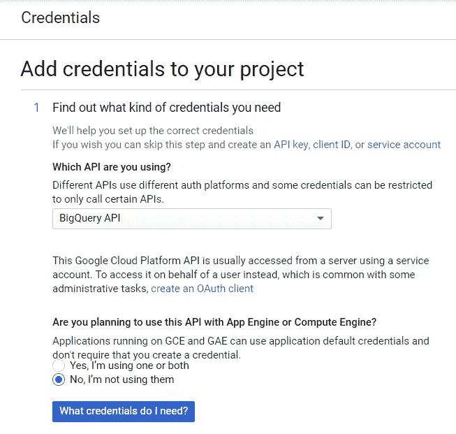

# 如何从 Google Ads 上传原始数据到 Google BigQuery

> 原文：<https://towardsdatascience.com/how-to-upload-raw-data-from-google-ads-to-google-bigquery-4bf0f2565f18?source=collection_archive---------39----------------------->


来源:[沉积照片](https://ru.depositphotos.com/170231376/stock-photo-backup-and-archive-concept.html)

## 如何将原始数据从你的谷歌广告账户上传到谷歌大查询，并识别自动标记广告活动的所有 UTM 标签

通过在 Google Analytics 中分析 Google Ads 广告活动的有效性，您可能会遇到采样、数据聚合或其他系统界面限制。幸运的是，这个问题很容易解决，只需将广告服务的原始数据上传到 Google BigQuery 即可。

# 为什么你需要谷歌广告的原始数据

来自谷歌广告的原始数据将允许你精确到每个关键词来分析广告活动。通过将数据上传到 BigQuery，您可以:

*   构建您想要的详细报告，不受 GA 限制。
*   在会话和用户层面确定广告活动的效果。
*   按地区、用户类型(新用户或老客户)、设备和任何其他参数计算 ROI、ROAS 和 CRR。
*   有效管理您的价格，并创建[再销售清单。](https://www.owox.com/blog/use-cases/remarketing/)
*   结合来自 Google Ads、Google Analytics 和 CRM 的数据，根据您的商品的利润和可赎回性来评估活动的有效性。
*   训练你的 ML 模型以获得更精确的计划。

要了解哪些活动、广告和关键词将用户带到您的网站，您需要将来自 Google 广告和分析的数据结合到 BigQuery 中。您可以使用 [OWOX BI 流来实现这一点。](https://www.owox.com/products/bi/pipeline/google-analytics-to-google-bigquery/)

流式传输这些信息会将您网站上未采样的用户行为数据发送到 GBQ。实时传输点击，然后基于这些点击形成会话。

OWOX BI 流量来源信息取自 UTM tags 广告标记。标签为手动，而[为自动。](https://support.google.com/analytics/answer/1033981?hl=en&ref_topic=1308612)

假设您手动标记了广告，并获得了以下 URL:

*https://example.com/?utm_source=facebook&UTM _ medium = CPC&UTM _ campaign = UTM _ tags*

在这种情况下，连接 OWOX BI 后，您将在 GBQ 表中获得来源、渠道和活动数据:

*   trafficSource.source —谷歌
*   trafficSource.medium — cpc
*   traffic source . campaign-UTM _ tags

如果您在广告服务中启用了自动标记，则会为您的每个广告分配一个特殊的 gclid 参数。当用户点击公告时，它被添加到登录页面 URL。

这种链接示例:

*http://www.example.com/?gclid=TeSter-123*

如果使用自动标记，没有原始数据就无法从 gclid 获得 source、medium 或 campaign 这些字段在 OWOX BI 收集的 BigQuery 表中将为空。

在这种情况下，如果只有 gclid，您能做什么？如何获得活动名称和其他参数？配置从 Google Ads 到 GBQ 的自动上传。

**注意:**如果公告根本没有标记，OWOX BI 将分配[链接](https://support.google.com/analytics/answer/6205762#flowchart)如下:

*   对于非 Google 来源，作为推荐流量(例如 facebook/referral)
*   对于 Google source 作为直接流量(直接/无)

如果您的报告中有大量[直接/无](https://www.owox.com/blog/articles/direct-traffic/)流量，您可能没有启用僵尸过滤，或者您可能有大量未标记的广告。

# 从 Google Ads 上传原始数据到 BigQuery 的两种方法

我们使用并推荐两种方法从 Google Ads 上传原始数据:[数据传输连接器](https://cloud.google.com/bigquery/transfer/)和 [Ads 脚本。](https://developers.google.com/google-ads/scripts/docs/solutions/bigquery-exporter)

选择哪种方式取决于你的目标和预算。为了让您更容易做出决定，我们准备了一份对照表:


# 你需要什么设置

以下位置的活动项目和客户:

*   谷歌云平台(GCP)
*   谷歌大查询
*   OWOX BI
*   谷歌广告

访问:

*   GCP 的所有者
*   GBQ 中的管理员
*   在 OWOX BI 中编辑。重要提示:只有创建了 Google Analytics→Google big query streaming pipeline 的用户才能打开从 Google Ads 下载。
*   在谷歌广告中阅读

# 如何在 GBQ 中授予访问权限

打开 [GCP 控制台](https://console.cloud.google.com/getting-started?angularJsUrl=)，从侧面菜单中选择 IAM 和 admin —管理资源。然后选择项目并单击添加成员。输入用户的电子邮件，选择 BigQuery 管理员角色，并保存您的更改。


图片由作者提供

# 如何使用数据传输配置上传

## 第一步。在谷歌云平台中创建一个项目

如果你在 GCP 已经有一个项目，跳过这一步。如果没有，打开 [GCP 控制台](https://console.cloud.google.com/getting-started?angularJsUrl=)并从侧面菜单中选择 IAM 和 admin —管理资源。单击创建项目按钮。然后输入项目名称，指定组织，并单击创建:


图片由作者提供

确保启用计费。为此，请打开侧面菜单中的“计费-账户管理”选项卡，选择项目，并链接计费账户:


图片由作者提供

接下来，通过输入您的联系人和支付卡详细信息来完成所有字段。如果这是你在 GCP 的第一个项目，你会得到 300 美元，可以用 12 个月。每月有 1-2 个谷歌广告账户和多达 100，000 个独立用户的项目将足够用一年。当你用完这个额度，就不需要还钱了。为了进一步使用，您只需将余额充值到与项目关联的卡上。

## 第二步。打开 API BigQuery

创建项目后，必须激活 BigQuery API。为此，请从 GCP 侧菜单转到“API 和服务—仪表板”,选择项目，然后单击“启用 API 和服务”:


图片由作者提供

在 API 库中，搜索“BigQuery API”并单击启用:


图片由作者提供

要使用 API，请单击创建凭据:


图片由作者提供

从下拉列表中选择 BigQuery API，然后单击我需要什么凭据？



图片由作者提供

创建服务帐户的名称，并指定 BigQuery 角色访问级别。选择 JSON 密钥的类型，然后单击继续:


图片由作者提供

## 第三步。激活数据传输 API

接下来，您需要激活 BigQuery 中的数据服务。为此，打开 [GBQ](https://console.cloud.google.com/projectselector2/bigquery?pli=1&supportedpurview=project) 并从左侧菜单中选择传输。然后启用 BigQuery 数据传输 API:


图片由作者提供

## 第四步。准备 GBQ 中的数据集

在 BigQuery 中，选择项目并单击右侧的 Create Dataset 按钮。完成新数据集的所有必填字段(名称、位置、保留期):


图片由作者提供

## 第五步。从 Google Ads 设置数据传输

单击侧面菜单上的“转移”选项卡，然后单击“创建转移”。然后选择 Google Ads(以前的 AdWords)作为来源，并输入上传的名称，例如 Data Transfer。

在“时间表选项”下，您可以保留默认设置“立即开始”,或者设置您想要开始下载的日期和时间。在重复字段中，选择上传频率:每天、每周、每月按需等。


图片由作者提供

然后，您必须指定 GBQ 数据集，以便从 Google Ads 加载报告。输入客户 ID(这是您的 Google Ads 帐户的 ID 或 MCC ID ),然后单击添加。你可以在谷歌广告账户的右上角查看客户 ID，就在你的邮箱旁边。


图片由作者提供

然后，您需要授权您正在使用的 Gmail 帐户。第二天，该信息将出现在您设置转移时指定的数据集中。

因此，您将在 GBQ 中收到大量原始数据,您可以使用这些数据:按活动、受众、常用(自定义)表格、关键字和转换的表格。例如，如果您想要构建一个定制的仪表板，您可以从这些表中提取非聚合数据。

## 如何使用 Ads 脚本设置上传

打开您的 Google Ads 帐户，单击右上角的工具和设置，选择批量操作—脚本，然后单击加号:


图片由作者提供

然后，在右上角，单击高级 API 按钮，选择 BigQuery，并保存您的更改:


图片由作者提供

请务必使用您登录 Google Ads 时使用的帐户进行注册:


图片由作者提供

复制[这个剧本](https://docs.google.com/document/d/1p0wrwR8XLq1xsBSiVBdNT_RfyaOrlCwu8W9zUP4PzAI/edit)。在 BIGQUERY_PROJECT_ID、BIGQUERY_DATASET_ID 和您的电子邮件行中，用您自己的信息替换这些值:项目名称、GBQ 数据集和电子邮件。将脚本文本粘贴到文本编辑器中。

在运行脚本之前，一定要单击右下角的预览按钮来检查结果。如果其中有错误，系统会警告您并指出错误发生在哪一行，如下图所示:


图片由作者提供

如果没有错误，请单击运行按钮:


图片由作者提供

因此，您将在 GBQ 中收到一份新的 CLICK_PERFORMANCE_REPORT 报告，该报告将于第二天提供:


图片由作者提供

回想一下，当您使用数据传输时，您会得到大量原始的非聚合数据。与广告脚本，你只会有关于[某些领域的信息。](https://developers.google.com/adwords/api/docs/appendix/reports/click-performance-report)

本次上传的以下字段包含在与会话相关的 OWOX BI 表中:

*   GclId
*   CampaignId
*   活动名称
*   AdGroupId
*   AdGroupName
*   标准 Id
*   标准参数
*   关键字匹配类型

## 如何将从 Google Ads 下载的数据连接到 OWOX BI

现在，你需要将谷歌广告的信息与网站数据结合起来，以了解用户通过哪些活动到达了你的网站。在 BigQuery 中得到的表，比如数据传输，没有客户机 ID 参数。您只能通过将 gclid 数据链接到 OWOX BI 流数据来确定哪个客户点击了广告。

如果你还没有 OWOX BI 中的 Google Analytics → Google BigQuery 流管道，请阅读[关于如何创建它的说明。](https://support.owox.com/hc/en-us/articles/217490557)

然后转到您的 OWOX BI 项目，打开这个管道。单击设置选项卡，然后在会话数据收集下，单击编辑设置:


图片由作者提供

使用滑块为 Google Ads 自动标记的活动启用数据收集，然后单击更改设置:


图片由作者提供

选择自动标签标记类型，指定如何将数据传输或 Ads 脚本加载到 BigQuery。指定将从中下载 Google Ads 数据的项目和数据集，并保存您的设置:


图片由作者提供

## 有用的提示

**提示 1。**通过数据传输，您可以将 Google Ads 中的历史数据上传到 GBQ。同时，对加载的总周期没有限制(一年或三年)，但每次只加载 180 天的数据。

您可以通过选择所需的传输，使用“传输”选项卡上的“计划回填”按钮来激活上传并指定时间段:


图片由作者提供

技巧二。如果您想检查 GCP 将收费的 Google Ads 帐户的数量，您需要使用以下查询来确定 Customer 表中 ExternalCustomerID 的数量:

```
**SELECT** 
ExternalCustomerId
**FROM** `project_name.dataset_name.Customer_*`
**WHERE** _PARTITIONTIME >= "2020-01-01 00:00:00" **AND** _PARTITIONTIME < "2020-07-10 00:00:00"
**group** **by** 1
```

您可以在查询中编辑日期。

技巧三。您可以使用 SQL 查询自己访问上传的数据。例如，下面是一个查询，用于从数据传输派生的“Campaign”和“CampaignBasicStats”表中确定活动的有效性:

```
**SELECT**
{**source** **language**="sql"}
  c.ExternalCustomerId,
  c.CampaignName,
  c.CampaignStatus,
  **SUM**(cs.Impressions) **AS** Impressions,
  **SUM**(cs.Interactions) **AS** Interactions,
{/**source**}
  (**SUM**(cs.Cost) / 1000000) **AS** **Cost**
**FROM**
  `[DATASET].Campaign_[CUSTOMER_ID]` c
**LEFT** **JOIN**
{**source** **language**="sql"}
{**source** **language**="sql"}
  `[DATASET].CampaignBasicStats_[CUSTOMER_ID]` cs
**ON**
  (c.CampaignId = cs.CampaignId
   **AND** cs._DATA_DATE **BETWEEN**
   **DATE_ADD**(**CURRENT_DATE**(), INTERVAL -31 **DAY**) **AND** **DATE_ADD**(**CURRENT_DATE**(), INTERVAL -1 **DAY**))
**WHERE**
  c._DATA_DATE = c._LATEST_DATE
**GROUP** **BY**
  1, 2, 3
**ORDER** **BY**
  Impressions **DESC**
```

页（page 的缩写）如果你需要帮助上传和合并数据到谷歌大查询，我们随时准备提供帮助。