# 如何在 GitHub 上上传 R 代码:MacOS 上的 R 脚本示例

> 原文：<https://towardsdatascience.com/how-to-upload-your-r-code-on-github-example-with-an-r-script-on-macos-3205d8d0d60?source=collection_archive---------50----------------------->

## 查看如何创建 GitHub 资源库以及如何使用 GitHub desktop 上传 R 代码和脚本的分步指南(带截图)

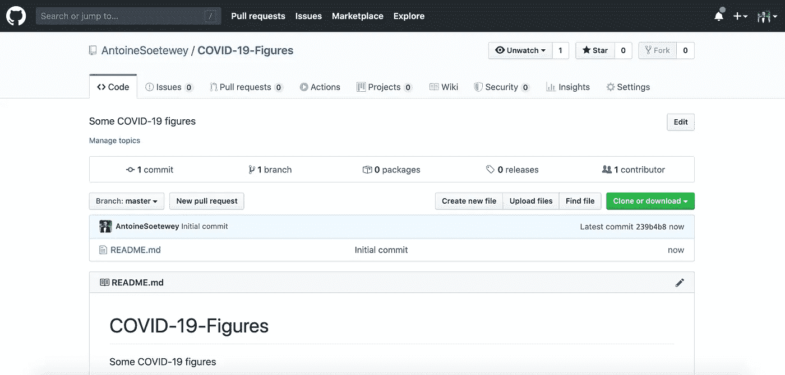

# 介绍

前几天，一个同事问我如何在 GitHub 上上传一些 R 代码，以便让每个人都可以访问。由于封锁，我不能直接去他的办公室，在他的电脑上给他看。所以我给他发了几张截图，一步一步地告诉他怎么做。

就在我删除刚刚拍摄的截图之前，我想它们可能对其他人有用，所以我写了这篇文章。

*注 1:截图是在 MacOS 上拍摄的，我没有在 Windows 上测试过。请在评论中告诉我它在其他操作系统上是否相似。*

*注 2:肯定还有其他方法，但下面的方法(在我看来)很简单，而且效果很好。*

# 先决条件

为了遵循这个指南并在 GitHub 上上传您的 R 代码，您至少需要:

*   GitHub 的一个账户
*   安装在您电脑上的 [GitHub 桌面](https://desktop.github.com/)应用程序

# 逐步指南

在本指南中，我使用了一个 R 脚本来绘制比利时因新冠肺炎而住院的[演变。如果您想在继续下一步之前看到最终结果，请查看 GitHub 上的](https://www.statsandr.com/blog/covid-19-in-belgium-is-it-over-yet/)[库。](https://github.com/AntoineSoetewey/COVID-19-Figures)

你经常听到

> *“一图胜千言”*

下面是如何将你的 R 脚本上传到 GitHub 上的简单方法:

第一步:去 github.com/login 并登录

步骤 2:转到您的 GitHub 概要文件并创建一个新的存储库

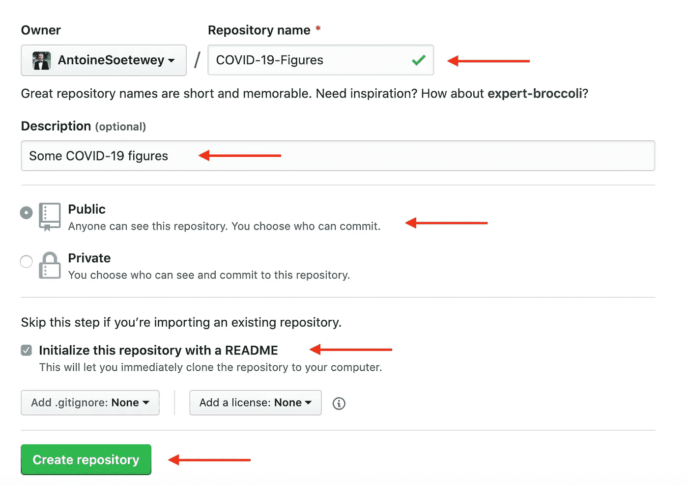

步骤 3:设置新存储库的名称、描述、受众和自述文件

请注意，如果您选择将**公开**，它将**对所有人可见**。如果您不想共享代码，但仍然希望它被上传到 GitHub，请选择 private 选项。

用 README 文件初始化 repo 不是强制性的，但是我强烈建议您这样做，以便您能够为这个 repo 添加信息。

步骤 4:现在您会看到新的存储库，其中只有自述文件

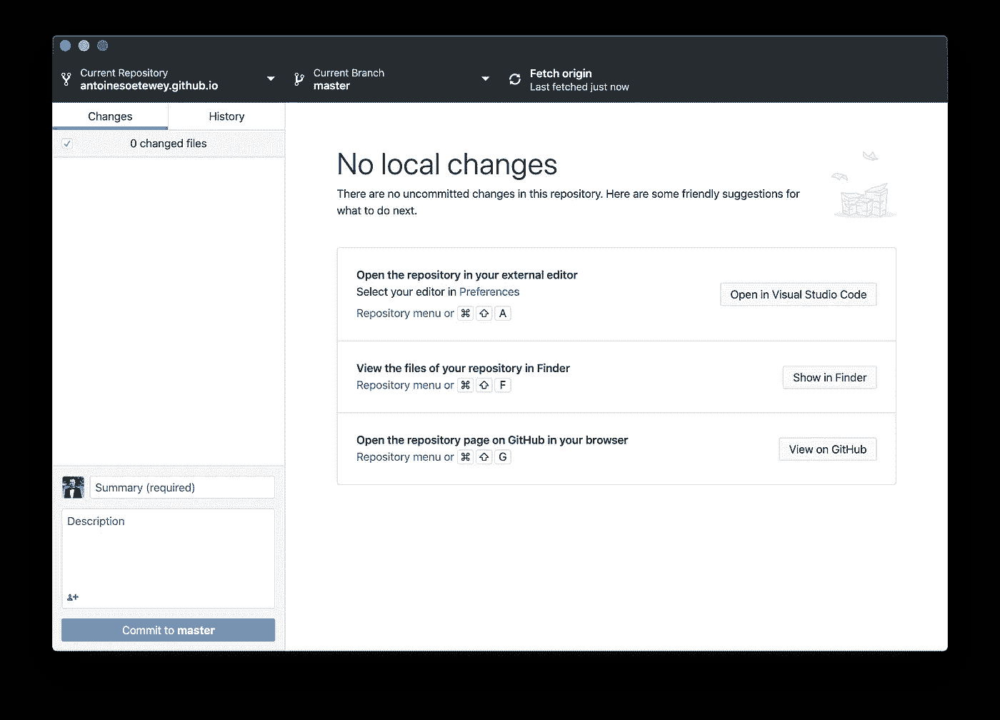

第五步:打开 GitHub 桌面应用程序，用你的 GitHub 账户登录

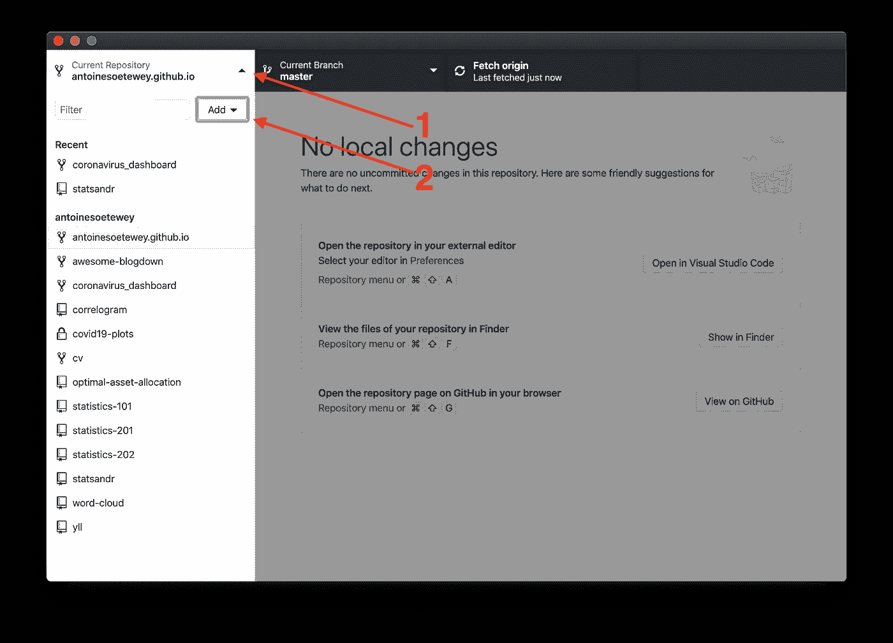

步骤 6 a:将您刚刚在 github.com 上创建的存储库克隆到您的计算机上

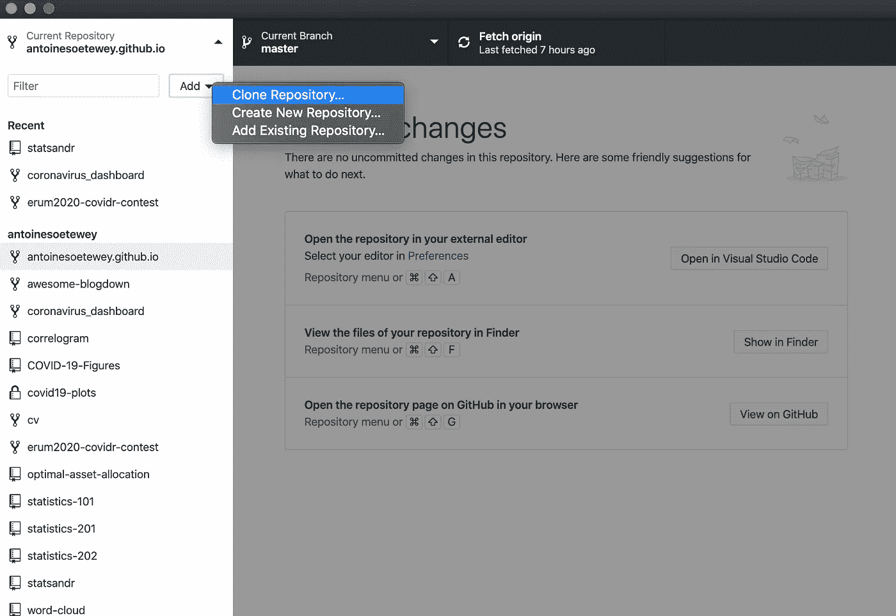

步骤 6 b:将您刚刚在 github.com 上创建的存储库克隆到您的计算机上

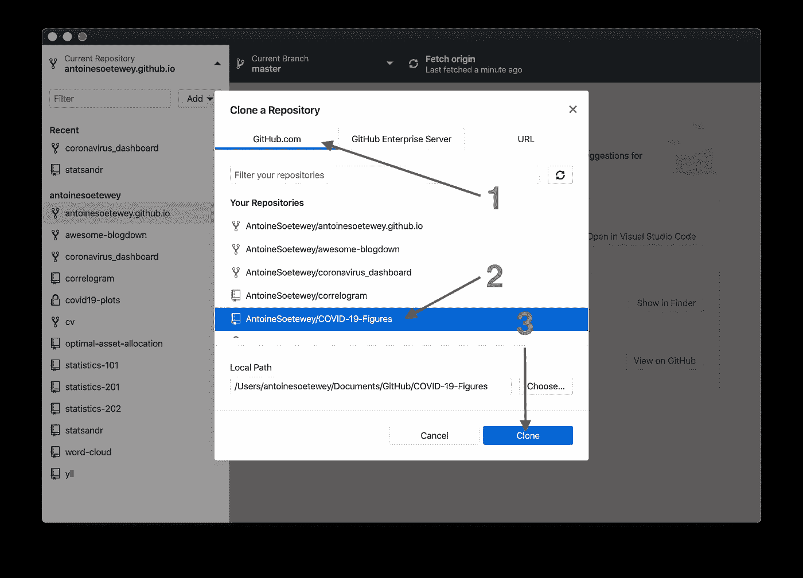

步骤 6 c:将您刚刚在 github.com 上创建的存储库克隆到您的计算机上

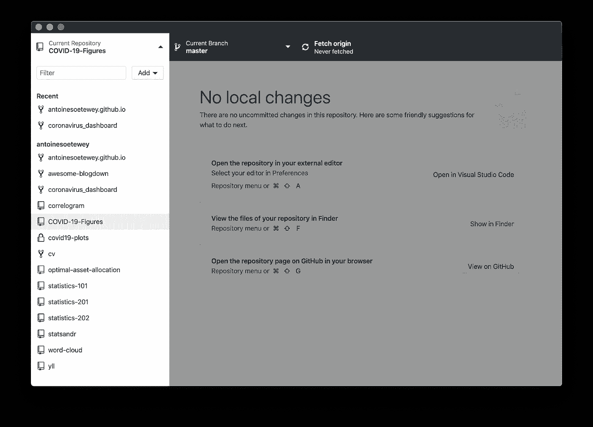

步骤 7:您的新回购出现在 GitHub 桌面应用程序上

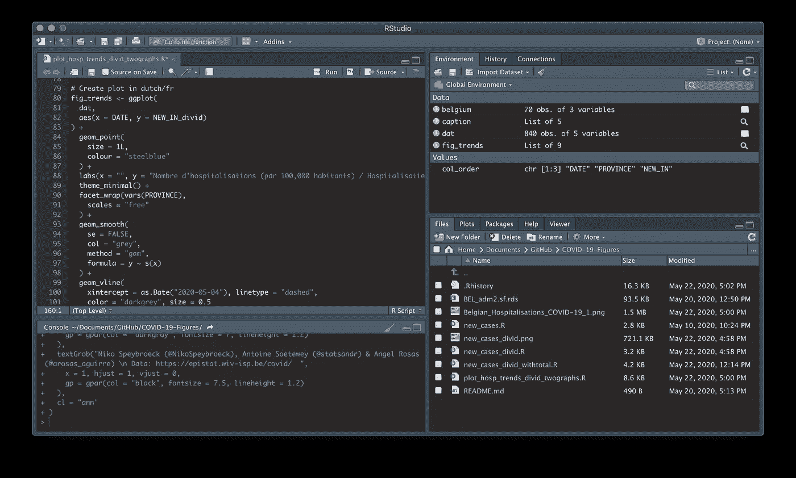

步骤 8:打开一个 R 脚本并编写代码

(如果不熟悉，请参见[如何安装 R 和 RStudio](https://www.statsandr.com/blog/how-to-install-r-and-rstudio/) 。)

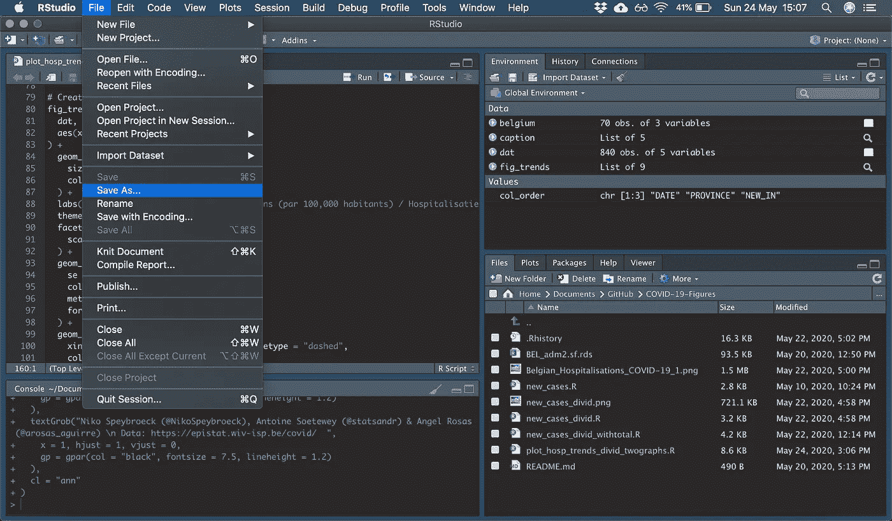

步骤 9 a:将你的 R 脚本保存在相应的文件夹中

您可以在步骤 6 c 中的“本地路径”下看到文件夹的路径。

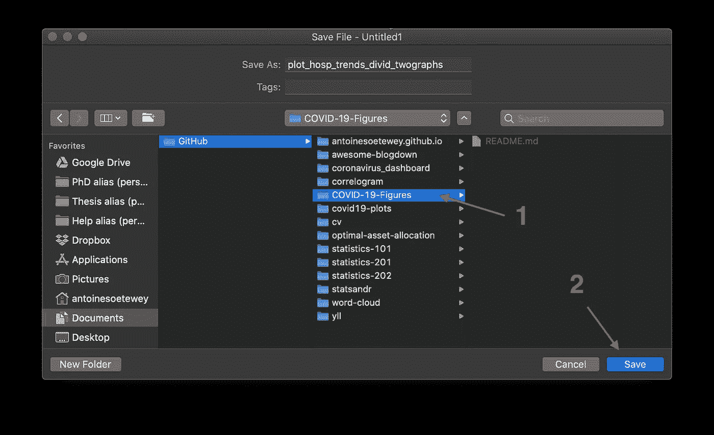

步骤 9 b:将你的 R 脚本保存在相应的文件夹中

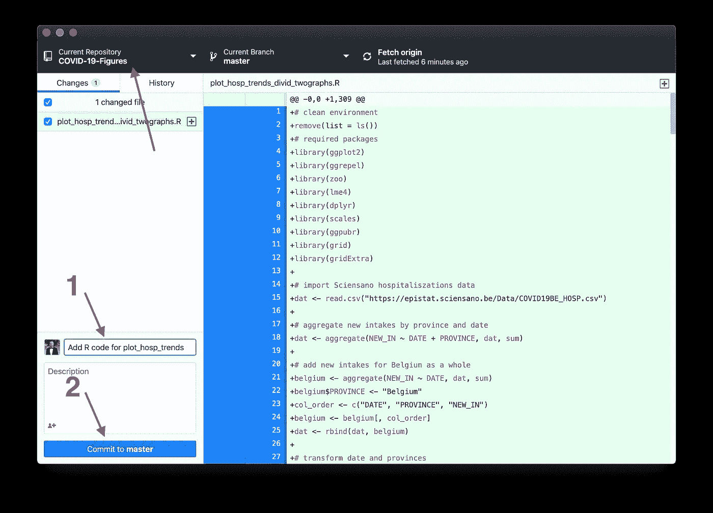

步骤 10:重新打开 GitHub 桌面，编辑提交标题(1)并点击提交按钮(2)

在步骤 10 中，确保当前存储库(见左上角)是您当前正在处理的 repo。

步骤 11:将提交推给 github.com

第 12 步:在你的 GitHub 概要文件中，点击新创建的存储库

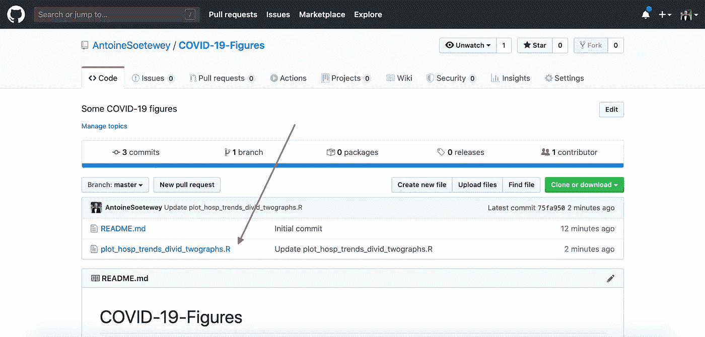

步骤 13:您现在看到您的脚本已经被添加到存储库中

您的 R 代码现在可以通过您的 GitHub 档案上的新存储库在线获得。如果需要分享，只需分享回购的网址即可。

# 附加注释

如果您需要编辑代码:

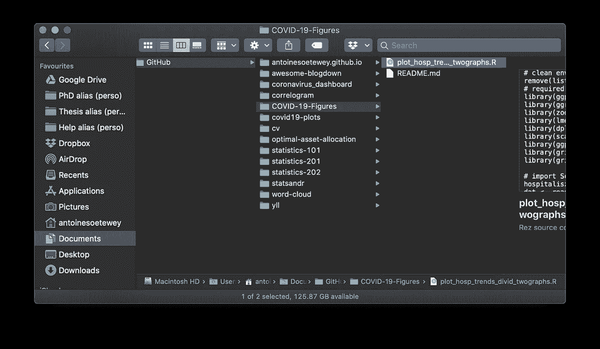

在您的计算机上找到 repo 的文件夹，打开 R 脚本，编辑并保存它

保存脚本后，**不要忘记提交更改，并按下 commit** (参见上面的步骤 10)。

如果您需要查看旧版本的代码，您可以通过点击 github.com 上的 repo 访问 commits 选项卡来查看所有提交:

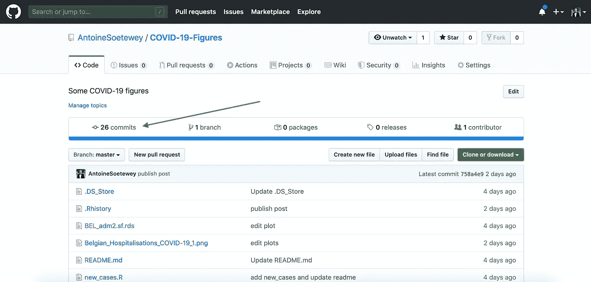

查看所有提交

感谢阅读。我希望这篇文章能帮助你创建一个 GitHub 库，并上传你的 R 脚本，以便任何人都可以使用。

和往常一样，如果您有与本文主题相关的问题或建议，请将其添加为评论，以便其他读者可以从讨论中受益。

# 相关文章

*   [一次比例和拟合优度检验(R 和手工)](https://www.statsandr.com/blog/one-proportion-and-goodness-of-fit-test-in-r-and-by-hand/)
*   [如何创建一个针对您所在国家的简单冠状病毒仪表板](https://www.statsandr.com/blog/how-to-create-a-simple-coronavirus-dashboard-specific-to-your-country-in-r/)
*   [如何手动执行单样本 t 检验，并对一个平均值进行 R:检验](https://www.statsandr.com/blog/how-to-perform-a-one-sample-t-test-by-hand-and-in-r-test-on-one-mean/)
*   [每个数据科学家都应该知道的概率中的 9 个概念和公式](https://www.statsandr.com/blog/the-9-concepts-and-formulas-in-probability-that-every-data-scientist-should-know/)
*   [R markdown 入门](https://www.statsandr.com/blog/getting-started-in-r-markdown/)

*原载于 2020 年 5 月 24 日 https://statsandr.com***。**