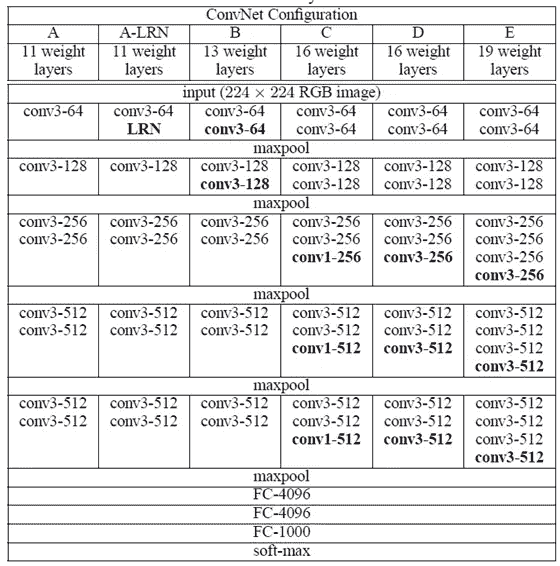
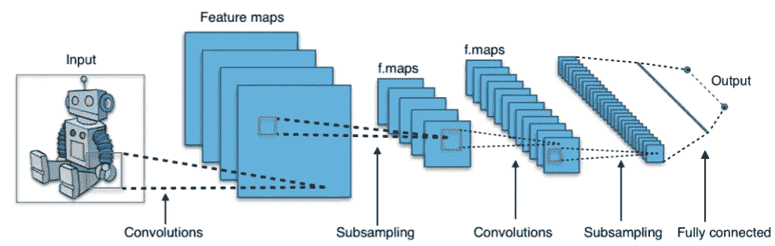
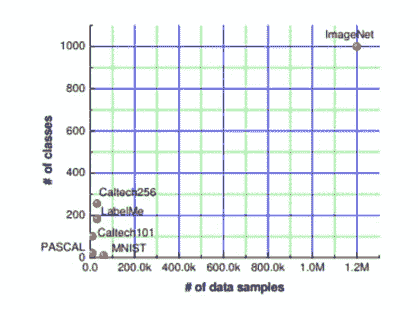
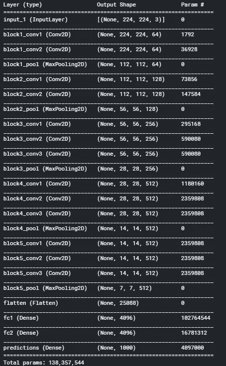
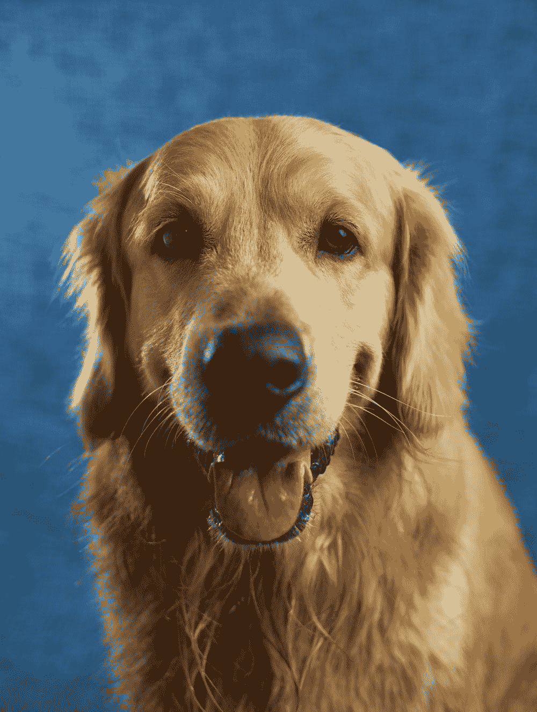
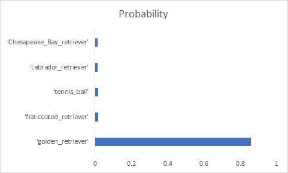

# 如何使用预训练模型(VGG)进行图像分类

> 原文：<https://towardsdatascience.com/how-to-use-a-pre-trained-model-vgg-for-image-classification-8dd7c4a4a517?source=collection_archive---------7----------------------->

## 为什么要重新发明轮子？


图片来源:[https://unsplash.com/photos/LJ9KY8pIH3E](https://unsplash.com/photos/LJ9KY8pIH3E)

嗨，伙计们，今天我要谈谈如何使用 VGG 模型作为预训练模型。让我们一小步一小步来

# 这些 VGG 模型是什么？

*   VGG 模型是由牛津大学视觉几何小组(VGG)的卡伦·西蒙扬和安德鲁·齐泽曼提出的一种 CNN 架构，它为 ImageNet 挑战赛带来了显著的成绩。
*   他们试验了 6 个模型，有不同数量的可训练层。根据型号数量，最受欢迎的两种型号是 VGG16 和 VGG19。

在我们继续之前，我们应该回答什么是 CNN 架构以及 ImageNet。

对于感兴趣的读者，可以参考下表来了解作者实验的所有 ConvNet 系列。



图 1:不同的 ConvNet 架构(图片来源:Simonyan、Karen 和 Andrew Zisserman。“用于大规模图像识别的非常深的卷积网络。” *arXiv 预印本 arXiv:1409.1556* (2014)。)

# 这是什么 CNN 架构？

CNN 是一个专门处理图像数据的深度神经网络模型。

*   它不需要传统的图像处理滤波器，如边缘、直方图、纹理等。，而不是在美国有线电视新闻网，过滤器是可以学习的。所以，这些不需要通过反复试验来确定。
*   CNN 有两个部分，第一部分是特征学习部分，然后是分类层(通常称为全连接层)
*   特征学习部分的两个主要构建块是卷积层和池层
*   **卷积层:**我们讨论过的可学习过滤器或特征提取器。
*   **池层:**这做了一些空间压缩，也带来了不变性。一辆车就一辆车，哪怕旋转一点点。

图 2 给出了 CNN 的架构概述。卷积创建特征图，汇集是通过二次采样实现的。

如果你需要更详细的解释，你可以看这里的。



图 2: CNN 架构(来源:维基百科[https://creativecommons.org/licenses/by-sa/4.0&gt](https://creativecommons.org/licenses/by-sa/4.0&gt "”Aphex34,")；，via Wikimedia Commons " href = "[https://commons.wikimedia.org/wiki/File:Typical_cnn.png](https://commons.wikimedia.org/wiki/File:Typical_cnn.png)">

# 预训练模型的原因和用途？

*   这些是模型，是具有大量参数的网络(一个恰当的例子是 VGG16，它具有 1.38 亿个参数)
*   一般来说，训练这样的网络是耗时且耗费资源的
*   CV 的预训练模型大多也非常通用
*   我们可以直接使用这些模型，如果我们选择 1000 个训练类中的任何一个
*   即使有一点点不同，我们也可以去掉顶层，只训练那一层的权重(迁移学习)

# 这个 ImageNet 数据集是什么？

这是斯坦福大学教授费-李非从 2006 年开始与 wordnet 合作的一个项目。图像注释是众包的。这实际上使得计算机视觉任务的试验台变得非常健壮、庞大和昂贵。基于 ImageNet 的 1000 类分类挑战始于 ImageNet 大规模视觉识别挑战(ILSVRC)。

实际上，这种竞争是 CNN 大多数杰出模特诞生的原因。



ImageNet 与其他图像数据集(来源:林等。艾尔。[https://www.dbs.ifi.lmu.de/~yu_k/cvpr11_0694.pdf](https://www.dbs.ifi.lmu.de/~yu_k/cvpr11_0694.pdf)

# **现在实施**

**T5 第一步:导入模型 **

```
from keras.applications.vgg16 import VGG16
model = VGG16(weights='imagenet')
print(model.summary())
```

还有很多其他 CNN 的型号可供选择，可以在这里[找到](https://keras.io/api/applications/)。



图 4: VGG 16 摩尔(图片来源:作者)

***第二步:加载样本图像***

```
from tensorflow.keras.preprocessing import image
from tensorflow.keras.applications.vgg16 import preprocess_input,decode_predictions
import numpy as np

img_path = '/kaggle/input/images/dog.jpg'
*#There is an interpolation method to match the source size with the target size*
*#image loaded in PIL (Python Imaging Library)*
img = image.load_img(img_path,color_mode='rgb', target_size=(224, 224))
display(img)
```

测试图像，我们使用的是黄金猎犬，也请注意图像是以 Python 图像库(PIL)格式加载的



测试图片: (图片来源:[https://unsplash.com/photos/x5oPmHmY3kQ](https://unsplash.com/photos/x5oPmHmY3kQ))

***第三步:使图像尺寸与 VGG16 输入兼容***

```
*# Converts a PIL Image to 3D Numy Array*
x = image.img_to_array(img)
x.shape
*# Adding the fouth dimension, for number of images*
x = np.expand_dims(x, axis=0)
```

这里，PIL 图像首先被转换成 3d 阵列，RGB 格式的图像是 3D 阵列。然后为多个图像添加另一维度。因此，输入实际上是一个 4D 数组。

***第四步:做预测***

```
*#mean centering with respect to Image*
x = preprocess_input(x)
features = model.predict(x)
p = decode_predictions(features)
```

在该步骤中，进行简单的均值居中预处理，然后进行预测，最后，将概率分布的预测解码为可理解的类名。我们已经在默认的前 5 名可能类模式中使用了它。

**输出**

```
[[('n02099601', 'golden_retriever', 0.8579672),
  ('n02099267', 'flat-coated_retriever', 0.018425034),
  ('n04409515', 'tennis_ball', 0.01615624),
  ('n02099712', 'Labrador_retriever', 0.015078514),
  ('n02099849', 'Chesapeake_Bay_retriever', 0.012522769)]]
```

如果我们使用条形图，这就是它的样子



图 5:最有可能的 5 类(图片来源:作者)

因此，无需创建模型并训练它，我们就可以完美地对一张金毛寻回犬的图像进行分类。

# 尾注:

*   预先训练的模型就像魔术一样，我们可以下载模型并开始使用它们，即使没有任何数据和训练。
*   如果源任务和目标任务是不同的，那么在域之间有一些相似性，那么我们可能必须训练几层，但是仍然，它不会像从头开始训练那样广泛，并且需要更少的数据

# 参考:

[1][https://www.kaggle.com/saptarsi/using-pre-trained-vgg-model](https://www.kaggle.com/saptarsi/using-pre-trained-vgg-model)

[2]西蒙扬、卡伦和安德鲁·齐泽曼。“用于大规模图像识别的非常深的卷积网络。” *arXiv 预印本 arXiv:1409.1556* (2014)。