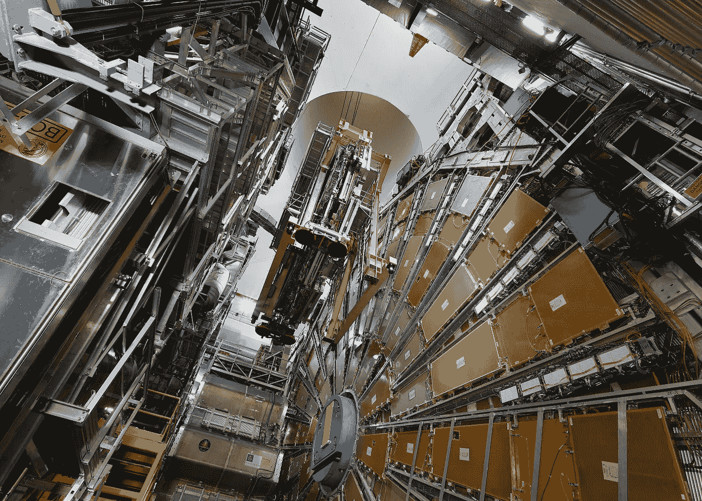
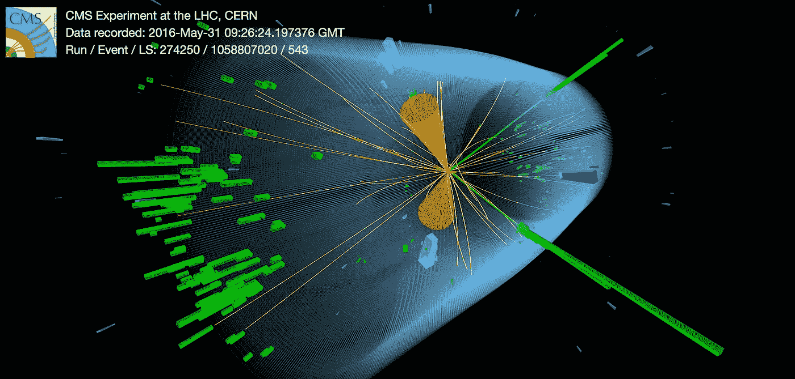
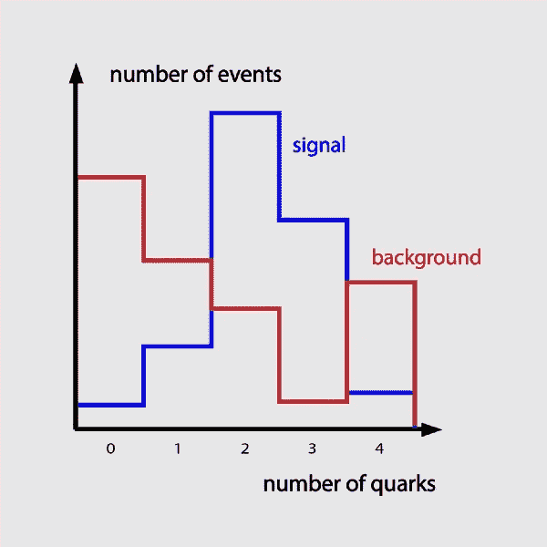

# 如何在希格斯玻色子上使用人工智能

> 原文：<https://towardsdatascience.com/how-to-use-ai-on-the-higgs-boson-e97ef4fb2fb2?source=collection_archive---------25----------------------->

## 上帝粒子仍然充满秘密

安装部分 ATLAS 探测器。欧洲核子研究中心提供

  P   *文章欧洲粒子物理研究所的物理学家在 2012 年发现了希格斯玻色子。现在，我们的任务是了解更多关于它的特性。人工智能在其中扮演着至关重要的角色。*

今天是星期天。你和我正在公园散步。我们的狗布鲁托在我们身边蹦蹦跳跳，渴望玩耍。你扔一根棍子让它接住。

然后你转向我。“你以前研究希格斯玻色子，对吗，”

没错。不过那是在它被发现的四年后。

如果它已经被发现了，还有什么可做的呢？

我们现在知道希格斯玻色子的存在。但是它的许多特性仍然未知。我和我的同事正在研究如何发现希格斯玻色子是否会在粒子对撞机中衰变为暗物质的策略。

“那么，比如说，希格斯玻色子破裂了，剩下的就是暗物质了？”

> 人工智能可以照亮希格斯玻色子的奥秘

理论上是这样，是的。我们不确定这是否真的会发生。但值得调查。这就是为什么我和我的同事考虑如何检测这些衰变——如果它们存在的话。我们发现人工智能是实现这一目标的最佳方式。

AI？“怎么做，”

为此，你首先需要了解我们在解决什么样的问题。

在欧洲粒子物理研究所，粒子探测器捕捉两个粒子以极高能量碰撞时发生的情况。每种类型的粒子——例如夸克或希格斯玻色子——都会在粒子探测器中留下特有的痕迹。“如果我们把这些痕迹放在一起，就可以重建两个粒子碰撞时发生的过程。”

CMS 探测器中产生希格斯玻色子的碰撞痕迹。欧洲核子研究中心提供

所以你用人工智能来找出哪些过程发生了？

没那么快！让我解释一下。

在一些碰撞中，会产生希格斯玻色子。但是希格斯玻色子的寿命相当短，所以它会很快衰变为其他粒子。这些可能是夸克或其他玻色子，或者可能是暗物质粒子。后者我们称之为信号事件——暗物质在产生的粒子中的碰撞。

当然，我们可以在探测器记录的许多过程中简单地搜索信号——我们正在谈论每秒发生的 5 亿次碰撞。

 [## 数据处理:这么多碰撞！

### 考虑到大量的数据，粒子物理学家必须选择那些他们想为他们的研究存储信息的碰撞。

home.cern](https://home.cern/science/computing/processing-what-record) 

问题是有些事件看起来和信号非常相似。但实际上它们是不同的过程。这些我们称之为背景事件。我们不希望这些扭曲我们的数据。所以我们的任务是教会探测器区分信号和背景。

“人工智能是如何发挥作用的？”

如果没有人工智能，我们只会查看信号的不同属性，然后在不太可能找到任何属性的地方剪切数据集。

例如，人们可以使用作为希格斯玻色子衰变为暗物质的副产品而释放出来的夸克数量。除了暗物质粒子之外，根据这个过程的基本物理性质，我们可能会想到两个夸克。有时候可能多一个夸克，有时候少一个。可能存在统计差异。

信号和背景事件及其各自的夸克数的示意图。如果只选择具有一个、两个或三个夸克的事件，就可以得到背景事件较少的数据集。作者图片

所以在这个例子中，我们可以从我们的数据集中去掉没有发现夸克或者多于三个夸克的碰撞。我们可以很有把握地说它们不是信号事件。通过这种方式，我们改进了数据集，因为它包含的背景比以前少了一些。

这就是人工智能的用武之地吗？

是的，没错。聪明的是，我们可以让人工智能算法学习信号事件的属性。“这让我们的工作变得容易多了，因为这意味着我们不一定需要了解太多的基础物理知识。”

“你在偷懒——不去研究基本的物理学！”

我称之为高效。

那好吧。人工智能如何学习什么是信号，什么是背景？

有很多不同的方法。在我们的例子中，我们使用了非常简单的算法，叫做决策树。基本原理是，你先用假数据集训练算法。该数据集来自计算机模拟，并且仅包含已经被正确标记为信号或背景的事件。

机器学习算法，如决策树，可以更快地提高数据集的质量。Javier Allegue Barros 在 [Unsplash](https://unsplash.com/s/photos/decision?utm_source=unsplash&utm_medium=referral&utm_content=creditCopyText) 上拍摄的照片

决策树对训练集应用随机切割，然后检查它将信号从背景中分离的程度。然后反复迭代，直到找到最佳切割。

但你为什么不能手动操作呢？

我们是手动完成的，但这需要大量关于底层流程的知识，否则会花费很长时间。此外，它很快变得复杂，因为信号的属性往往相互依赖。

例如，在一次信号碰撞中发射的两个夸克彼此之间可能有一定的距离。但是可能有其他信号事件涉及三个夸克。在这种情况下，三个夸克之间的距离可能不同于两个夸克之间的距离。所以我们不能只在夸克之间切割一段距离。决策树有助于考虑这种依赖性。

所以在某种程度上，机器知道的比你多！”

真的！这有助于我们揭示希格斯玻色子的特性。

 [## 在看不见的希格斯搜索中标记喷流

### 我们关于这个主题的原创论文！如果你不是在这个领域工作的话，可能会很难读懂。

inspirehep.net](https://inspirehep.net/record/1642733?ln=en) 

你又把棍子扔给布鲁托了。

这对你研究希格斯粒子有什么帮助？

有了人工智能，我们可以产生真正好的数据集，其中包含大量的信号和少量的背景事件。在我们的例子中，信号事件是希格斯玻色子衰变为暗物质之后的碰撞。

现在，我们需要做的就是计算我们发现的信号事件的数量。如果我们发现了一定的数量，我们就可以说我们发现了希格斯玻色子到暗物质粒子的衰变。

然后呢。“你发现了吗，”

没有。至少——还没有。我们的论文只是实现这一发现的众多步骤之一。“研究需要时间，”

> 希格斯玻色子的未来仍然令人兴奋

看看你是否会发现它，这将会很有趣！或者这些衰变是否根本不存在。

等着瞧吧！

我当然会…事实上，我认为人工智能真的很难理解。但现在看来这并不太疯狂。

公平地说，我们使用了现有的最简单的人工智能工具之一。如今，科学家经常使用更复杂的算法，包括监督深度学习和 GANs。但是如果你愿意的话，我们可以改天再谈。

“我很乐意！”当你试图把棍子从狗嘴里拔出来时，你惊叫了一声。“来吧，布鲁托，我们要回家了，”