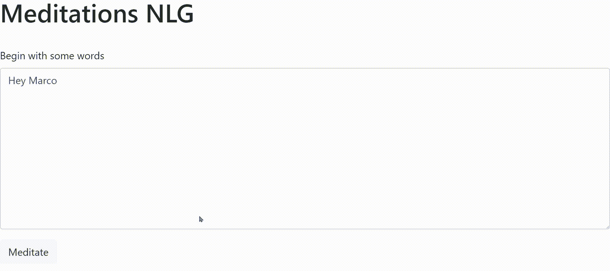
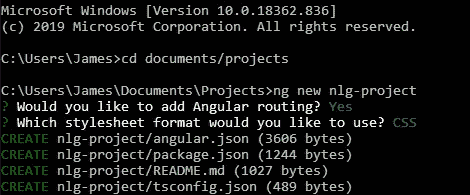
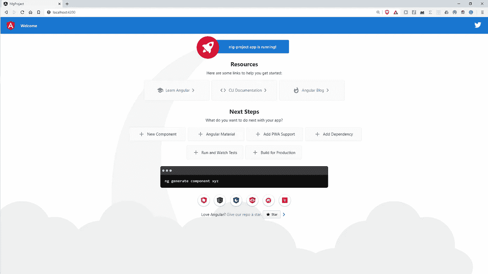
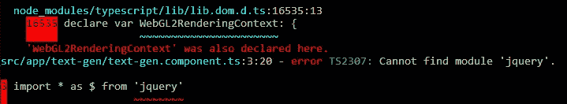
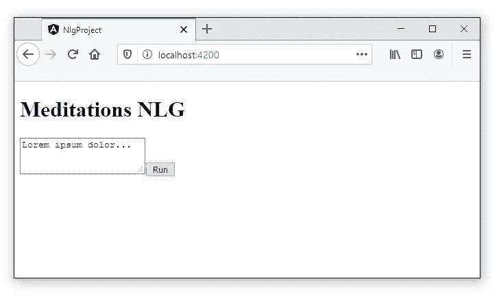
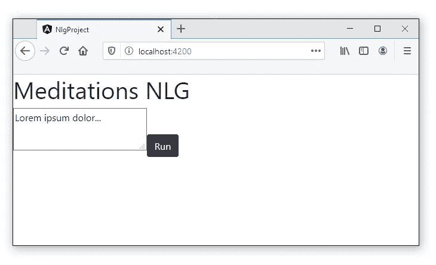
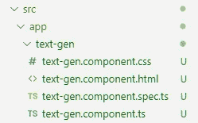
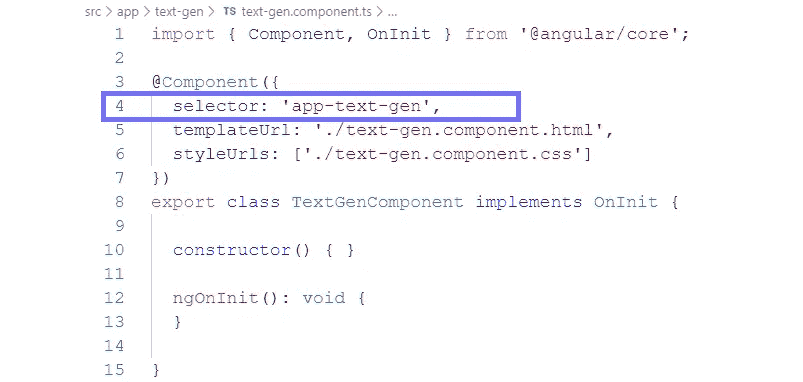
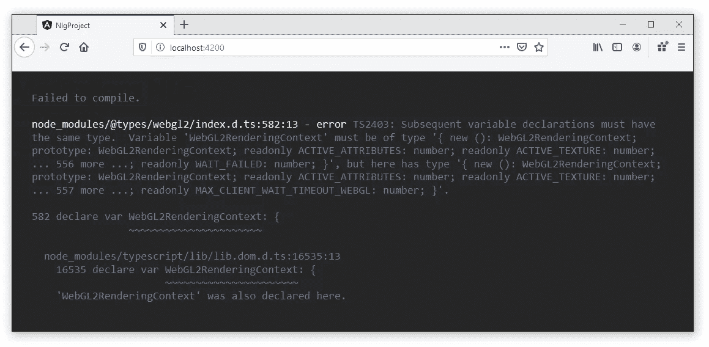
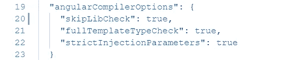

# 如何使用 Angular 部署 TensorFlow Web 应用程序

> 原文：<https://towardsdatascience.com/how-to-use-angular-to-deploy-tensorflow-web-apps-5675b5a042cc?source=collection_archive---------13----------------------->

## 在角度构建的 web 应用程序中使用 Python 构建的模型


法比安·格罗斯在 [Unsplash](https://unsplash.com?utm_source=medium&utm_medium=referral) 上拍摄的照片

在机器学习和人工智能的新时代，Python 无疑是任何崭露头角的工程师的首选语言。干净、伪代码外观的语法——世界上最大的科学计算和机器学习社区已经为希望让他们的机器更智能的开发人员创造了完美的语言。

然而，向大众部署任何用 Python 构建的东西并不容易。构建任何人都可以使用的东西的最有效途径是 web 开发。

几乎每个有电脑的人都可以上网和浏览网页。即使是那些没有手机的人也可以通过手机上网。

使用 Python 进行 Web 开发是可能的。两个最大的框架是 Django 和 Flask——都很好，但是都比不上 JavaScript 可用的框架。

被全球 96%的网站使用[1] — JavaScript 在客户端 web 浏览器语言中占主导地位。自然，这就是 web 开发的空间。

幸运的是，像 Angular 和 Node 这样的框架使得构建 web 应用程序变得更加容易。只需很少的时间，我们就可以构建动态、交互式、快速的应用程序。



我们会建造这个。

在本文中，我们将采用 Python 内置的**文本生成**模型，并使用 Angular 将其集成到一个交互式 web 应用程序中。这里有很多细节，所以作为参考:

```
**1\. Our Model** - brief description of the model and download links**2\. Tensorflow.js** - conversion of model from Python to JS**3\. Getting Started With Angular** - installation and set-up**4\. Bootstrap** - how to implement Bootstrap CSS styles in Angular**5\. Model Component** - setting up the model component**6\. Loading Our Model** - how to load a model using TypeScript**7\. Making Predictions** - setup of prediction function in Typescript**8\. TextGenComponent** - implementation of all this code with the app
```

# 1.我们的模型

我们将保持这一部分很短，所以我们可以更多地集中在角接下来。

该模型是一个自然语言生成器。它使用字符级嵌入和一个非常标准的 LSTM 网络。

它是用 Python 构建和训练的，使用 TensorFlow 2。

训练数据包括马库斯·奥勒留的《沉思》和塞内卡的《致卢西留的道德书》——这两本书在斯多葛派哲学领域都是有影响力的文本。

这个模型产生的是一种特别雄辩的胡言乱语。

> 请记住，理性这个词的本意是表示分散，或者分解成原子，或者湮灭，它要么消失，要么改变。—艾·马库斯·奥勒留，大约 2020 年

在 Python 中，我们打开控制台，加载模型，并为模型输入一些内容。

接下来的一切都是模型产生的。


几个模型迭代产生的句子截图——这里我们对每个句子进行评分，并选择得分最高的[文本](/recurrent-ensemble-learning-caffdcd94092)。

我们希望重现这一功能，但在一个易于分发的 web 应用程序中实现。我当然不是设计师——但我们也会努力让它看起来很酷。

如果你确实想了解更多关于这个模型的信息，这里有[GitHub repo](https://github.com/jamescalam/meditations_ai)，我已经在[这些文章](https://towardsdatascience.com/tagged/the-meditations)中描述了构建过程(第一篇应该足够了)。

构建需要时间，所以您可以从这里下载模型和映射，分别是`model.h5`和`char2idx.json`，。

# 2.TensorFlow.js

首先，我们需要将模型翻译成 JavaScript 可读的东西。

首先，`pip install tensorflowjs`安装我们需要的模型编译器，将模型从`h5`翻译到`json`。

打开命令行并导航到包含`modelname.json`的项目文件夹。在那里，我们可以键入以下内容:

```
tensorflow_js model_type="Keras"
    modelname.h5
    nlg_models/modelname.json
```

这产生了我们的`JSON`格式的模型，我们稍后将把它加载到我们的 web 应用程序中。

# 3.Angular 入门

Angular 是一个很棒的 web 应用框架。它是轻量级的，结构良好，并且拥有大量的追随者。

要设置我们的环境，我们首先从这里 [**安装节点**](https://nodejs.org/en/download/) 。我们不会直接使用 Node，但它提供了我们在 Angular 中开发应用程序所需的几个[功能](https://www.angularjswiki.com/angular/is-node-js-required-for-angular-2-or-angular/#:~:text=Reasons%20why%20we%20need%20Node.&text=%E2%80%9CAngular%E2%80%9D%20is%20entirely%20new%20framework,them%20in%20plain%20JavaScript%20i.e.%2C%20.&text=We%20need%20to%20use%20Node,can%20deploy%20them%20in%20production.)。

安装完成后，我们可以使用节点包管理器(NPM)来安装包——就像使用 Python 的`pip`一样。

我们需要的第一个工具是 Angular CLI(命令行界面)，我们将使用它为应用程序的不同部分快速生成模板。我们打开自己的命令行并键入:

```
npm install -g @angular/cli
```

现在我们可以使用 Angular CLI 来创建一个项目。仍然在命令行中，首先导航到我们希望项目所在的位置。然后，对于一个名为`nlg-project`的项目，我们将输入`ng new nlg-project`——我们将被询问路由和样式表:



我们的新项目目录看起来应该与图中所示类似。我们可以用`ng serve`为这个项目初始化一个本地服务器。



默认角度应用程序页面

我们的服务器将被托管在`localhost:4200`——在我们的浏览器中输入这个会给我们默认的 Angular 应用页面。

我们将在应用程序中使用 TensorFlow.js 和 jQuery。这些可以与以下设备一起安装:

```
npm install @tensorflow/tfjs --save
npm install jquery --save
```

安装后，两个库都可以在`node_modules`目录中找到。为了避免这种情况，在我们的代码中使用任一库之前，还必须重新启动服务器:



这就是我们所需要的 Angular。大多数编辑器都可以用于我们的 Angular 项目，但我会推荐尝试使用[括号](http://brackets.io/)或 [VS 代码](https://code.visualstudio.com/download)(我更喜欢后者)。

# 4.引导程序

我们将使用 [Bootstrap](https://getbootstrap.com/) 来设计我们 web 应用程序的大部分样式。Bootstrap 是一个预先格式化的 CSS 框架。它承载了一系列有用的预样式但灵活的元素。多亏了 Bootstrap，我们可以轻松地创建一个干净的动态页面。

要安装，我们键入`npm install bootstrap --save`。

Angular 使用`src/styles.css`来设计网络应用。现在我们已经安装了引导程序，我们只需通过向`styles.css`添加以下内容来导入`bootstrap.css`:

```
@import "~bootstrap/dist/css/bootstrap.css";
```

## 应用程序 HTML

我们不想要默认网页，所以让我们更新它。HTML 代码包含在`src/app/app.component.html`中。

让我们只放置一个简单的标题和段落，这样我们就可以看到我们已经更改了正确的文件并正确地实现了 Bootstrap:

```
<h1>Meditations NLG</h1>
<textarea>Lorem ipsum dolor...</textarea>
<button class="btn btn-dark">Run</button>
```



无引导(左)和有引导(右)—这是一个开始，但当然还需要做更多的工作。

现在一切就绪，我们可以开始集成模型本身了。

# 5.模型组件

Angular 的工作原理是将我们的应用模块化成不同的部分。我们已经在`src/app`中看到了“app”组件，它表现为主/顶层，我们将所有其他组件放在其中。

要创建新组件，我们需要返回 Angular CLI。确保命令行位于项目目录中，并使用以下内容生成我们的`text-gen`组件:

```
ng generate component text-gen
```

这里，我们使用 Angular CLI `ng`到`generate`一个新的`component`叫做`text-gen`。如果我们查看一下`app`目录，我们会注意到几个新文件:



这是我们新的`text-gen`组件。要将组件放在 web 应用程序页面上，我们必须将组件标识符添加到`app.component.html` —组件选择器的名称包含在下面的`text-gen.component.ts`中:



因此，要在我们的应用程序中包含这个组件，我们只需在`app.component.html`中将`<app-text-gen><app-text-gen/>`添加到我们的代码中。将之前包含在`app.component.html`中的所有内容移动到`text-gen.component.html`。

# 6.加载我们的模型

回到`src/app/text-gen`我们可以开始组装我们的模型。

首先，在`text-gen.component.ts`中，让我们编写加载模型的代码:

对我来说，这里最令人困惑的部分是`async`和`await`——其余部分与 Python 差别不大。


异步执行(左)和同步执行(右)—图片来自作者。

在 Python 中，我们一次运行一行代码——等待当前行完成处理，然后移动到下一行。

然而，JavaScript 可以并行运行我们的代码脚本。所以当第一行还在处理的时候，第二、三、四行已经被执行了——我们称之为异步执行。

如果这对你来说听起来像一场逻辑噩梦——相信我，当我说**时，它是**。

`loadLayersModel`功能是异步的。为了正确处理这个问题，我们需要使用`async`使加载函数异步——允许我们使用`await`和`loadLayersModel`函数。

在这里使用`await`使得这一小部分代码是同步的(像 Python 一样)。我们在加载和构建`char2idx`和`idx2char`映射时也会用到这个。

## 整合负载函数

目前，我们的加载函数没有内置到我们的`text-gen`组件中。为了干净地做到这一点，我们可以将它与现有的类定义集成在一起。

在`TextGenComponent`类中，有一个名为`ngOnInit`的函数——在类初始化时，这个函数会被立即调用。因此，如果我们将 load 函数放入其中，页面一加载，我们就加载模型。

修改`ngOnInit`，我们得到如下:

此时，您可能会(也可能不会)遇到以下错误:



如果是，我们导航到`tfconfig.json`并将`"skipLibCheck": true`添加为 TensorFlow 推荐的[，如下所示:](https://www.tensorflow.org/js/tutorials/setup#typescript)



# 7.做预测

我们已经加载了模型、字符到索引的映射和字符数组。现在，我们需要编写一个函数，它以文本的形式接受输入，并使用它来输出更多的文本，正如我们的模型所预测的那样。

我们可以把它分成三个部分:

*   **要索引的字符** —将文本转换为数字数组
*   **预测循环** —下一个最可能值的迭代预测
*   **字符索引** —将预测数字数组转换回文本

## 要索引的字符

第一部分是文本到数字数组的转换。为此，我们使用了`getNum`功能:

`getNum`接受`char2idx`和输入文本，并返回相同文本的编码版本。例如，用[这个 char2idx 字典](https://github.com/jamescalam/meditations_ai/blob/master/incl_models/LSTM_e256_sl100_0414/char2idx.json)我们得到:

```
getNum(char2idx, "Hello World")
```

`**[Out]:** [20, 45, 52, 52, 55, 1, 35, 55, 58, 52, 44]`

**预测循环**

这是我们代码中最复杂的部分，但它只做了一点点:

*   将由`getNum`生成的索引数组转换成张量——我们的模型需要的数据类型
*   将张量输入到我们的模型中，该模型输出一个新的张量，其中包含每个字符的预测概率——由数组索引表示
*   用`indexOfMax`取最高概率指数，并将其反馈到模型中进行另一次预测

在代码中，这给了我们:

注意,`[indexOfMax](https://gist.github.com/jamescalam/b54dba89fc02feb7e08dc5017e6ac38d)`函数查找数组中最大值的索引——我们把它放在我们的类之外。

## 字符索引

这部分是最简单的，实际上我们已经在预测循环的第 39 行实现了它:

```
this.text = this.text.concat(this.idx2char[yIdx]);
```

它所做的只是将预测的索引传递给`idx2char`，返回英文字符并将其连接到当前文本字符串。迭代生成我们预测的文本。

# 8.TextGenComponent

这些部分都是通过`generate`函数实现的——该函数是作为另一个方法添加到`TextGenComponent`类中的。

`getNum`和`indexOfMax`方法都被添加到组件类之外。

当我们在`text-gen.component.ts`中将所有这些放在一起时，我们得到了脚本的功能版本:

完整的 text-gen.component.ts 脚本。如果它看起来很多，不要担心——这个代码块也让我害怕，但是一旦你一次一行地完成它，它会出奇地简单。

## 连接页面和模型

现在，我们需要做的就是将我们的首页元素——`<textarea>`和`<button>`——连接到组件的内部。

导航至`src/text-gen/text-gen.component.html`并添加以下内容:

首先，我们需要将显示在`<textarea>`中的文本绑定到包含在`TextGenComponent`中的`text`变量。这很容易通过向`<textarea>`元素添加`[value]="text"`来完成。

现在，当`generate`运行时，它用新文本更新`TextGenComponent.text`——反过来更新`<textarea>`。

最后一部分是告诉 Angular 在点击“沉思”按钮时运行`generate`。还是那句话，这个超级简单，加上`(click)="generate( meditationInput.value)"`就行了。

`meditationInput`指的是`<textarea>`元素，而`.value`捕捉元素内部的文本，并将其传递给我们的`generate`函数。

# 拍拍自己的背

就这样，我们完成了！这款应用程序谈不上漂亮(正如我说过的——我不是设计师)，但功能齐全:


为了简洁起见，我将把进一步的开发、设计和清理工作留到以后的文章中进行——本指南已经远远超出了我的预期！

尽管这篇文章很长，但我希望它是有用的。欢迎提问，或者告诉我不清楚的地方。那些使用过 JavaScript/TypeScript 或 Angular 的人——让我知道什么需要改进。

感谢阅读！

# 参考

[1][JavaScript 作为客户端编程语言在](https://w3techs.com/technologies/details/cp-javascript/)、W3 Techs 网站上的使用统计