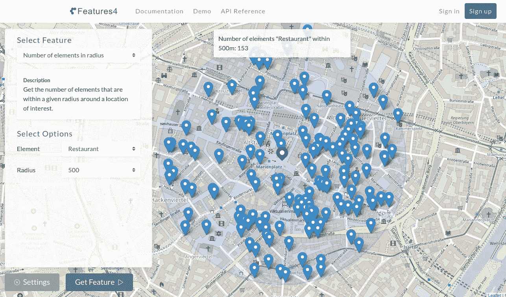
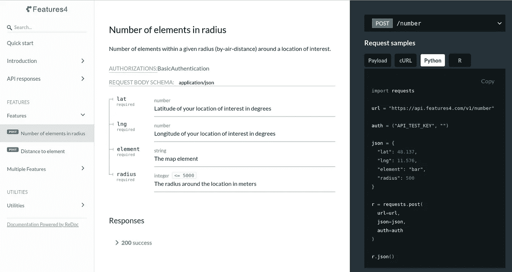

# 如何使用 API 获取模型的空间要素

> 原文：<https://towardsdatascience.com/how-to-use-apis-to-get-spatial-features-for-your-models-da729785f132?source=collection_archive---------81----------------------->

## 通过使用 API 中基于位置的功能，而不是另起炉灶，快速提高数据科学模型的性能。



在本文中，我将向您展示如何使用 API 快速获取空间数据集的许多要素，以构建更好的数据科学模型。

在我成为数据科学家的过程中，以及随后作为数据科学家的工作中，我建立了几个基于空间数据的模型，例如，预测房价，或者最近预测电动汽车充电站的预期用途。我很快发现，这些模型的性能(至少对于较小的数据集而言)并没有从模型的复杂性或广泛的参数搜索中受益，而是从良好的空间要素的可用性中受益。

我还意识到，提取这些空间特征可能相当麻烦:你需要识别和评估数据源，设置一套新的工具，如 PostGIS 数据库、OpenStreetMap 工具(如 transition、nomist 等。)，并学习许多新的东西，如地图投影、空间索引、特定查询语言等，这会大大降低您的特征提取速度。

然而，还有一种更简单快捷的方法来获取您的空间要素集:使用一个处理所有这些任务的 API，这样您就不必这么做了。

如果你刚开始接触数据科学，或者不是来自计算机科学家教育背景的人，那么 API 一开始可能会让人望而生畏(专业术语有资源、端点、基本身份验证等。).至少对我来说是这样，这在某种程度上阻止了我使用它们。

但是，通过学习更多关于 API 的一般知识和使用提供免费帐户的 API，您将很快熟悉使用 API，并能够将它们作为一种新的有用资源集成到您的建模工作流中。由于大多数 API 都是以类似的方式构建的(这是它们如此受欢迎的一个原因)，知道如何使用一个 API 也将有助于您理解其他 API 是如何工作的。

# **用于空间特征的 API**

我目前正在 features4.com(现已公开测试)构建一个新的 API，它提供了对丰富的空间特征的免费和便捷的访问，例如 500 米半径内的餐馆数量或到最近医生的距离。我将使用 Features4 API 作为如何使用 API 的例子。

那么，我们如何使用 Featurees4 API 来获取您的空间要素呢？

**鸟瞰图**

> 从鸟瞰的角度来看，使用 API 很像调用一个普通的函数。您需要函数名，向它传递参数，然后返回一个结果。这与 API 基本相同(只是名称不同):你需要一个 URL，向它发送一些数据，然后得到一个响应。

**网址**

最重要的区别是，当你的函数托管在你的计算机上时，API 托管在 web 服务器上。因此，API“函数名”将总是包含它所在的地址，通常是一个 URL(就像您在浏览器中输入以检索网站一样)。例如，features4 API 的所有 URL 都以 https://api.features4.com/v1 的[开始，因为这是 API 在服务器上可以到达的地方。例如*号*“功能”位于](https://api.features4.com/v1.)[https://api.features4.com/v1/number.](https://api.features4.com/v1/number.)

**传递参数**

一旦知道了 URL，就需要指定要发送给它的参数。你如何找出一个函数需要哪些参数？你只要看看它的文档就知道了。对于 API，您可以做同样的事情:为了知道 API 端点接受哪些参数，您可以查看一下 [API 参考](https://apidocs.features4.com)。在这样的参考中，您通常会找到关于参数的所有信息，包括它们的类型、描述和允许值。

我还没有提到的一点是，一般来说，API 比典型函数更加灵活。通常情况下，您可以用不同的方式发送参数值。一种常见的方法是以下面的形式传递它们(所谓的表单 urlencoded，因为您可以像这样将它们附加到 URL):

```
param1=value&param2=300&param4=true
```

指定参数的另一种常见方式是发送 JSON 编码的参数:

JSON 的好处是它支持嵌套参数和不同的数据类型，比如字符串、数字和列表:

**方法**

您需要向 API 提供一条信息:请求方法告诉服务器您希望服务器采取什么样的动作。这又使得 API 更加灵活，因此同一个 URL 可以服务于多个不同的响应。例如，`GET`表示应该获取一个项目，或者`POST`表示将数据推送到服务器(创建一个资源，或者生成一个临时文档发送回来)。

该方法还告诉服务器在哪里查找您传递的参数。使用`GET`方法，您可以将参数值附加到 URL，而使用`POST`方法，参数值将作为请求的一部分发送。

与传递参数一样，API 文档将让您确切地知道服务器接受什么方法，以及它将给出什么响应。为了一致性和简单性，特性 4 API 目前只使用 POST 方法，这样所有对 API 的调用都可以用同样的方式进行。

**回应**

API 非常可靠。除非无法访问他们的 web 服务器，否则无论您的请求是成功还是失败，他们都会给您返回一个响应。为了让你知道是否一切顺利，或者是否出了差错，它会给你发回一个 3 位数的数字(例如 200)，即所谓的状态码。每个状态代码都有特定的含义，并且有一个具有标准化含义的状态代码的大列表。别担心，你不必把它们都背下来，或者一开始就记住这一点:

如果状态代码以下列开头:

*   2 一切都好
*   4 您可能犯了一个错误(比如遗漏了一个参数)
*   API 出错(所以，你对此无能为力)

如果一切正常，并且您收到了状态代码为 200 的响应，那么您还将收到您向 API 请求的数据。例如，Features4 API 将返回您所请求的空间特征，例如 500 米半径范围内的餐馆数量。响应的格式取决于 API，但您经常会收到 JSON 格式的响应，您已经通过传递参数知道了这一点:

如果您收到一个状态代码以 4 开始的响应，这意味着您这边出了问题，一个好的 API 会告诉您更多关于您所犯错误的类型，以便您能够快速修复它。例如，如果您省略了一个名为“半径”的参数，Features4 API 会告诉您哪里出错了:

所以，这是一个关于 API 一般如何工作的非常简短的介绍。关于它和 HTTP 协议还有很多要学习的，例如, [Mozilla](https://developer.mozilla.org/en-US/docs/Web/HTTP/Messages) 提供了一个很好的信息来源。

# **一个具体的例子**

让我们继续看一个具体的例子，看看如何使用 [Features4 API](https://features4.com) 来检索一个位置的空间特征。我们将使用 Python 作为一种语言，但是基本上所有的语言都提供了向 API 发出请求的库。

假设你正在建立一个预测房价的模型，你认为中心性将是它的一个重要方面。假设酒吧和餐馆位于城市中心，密度较高，您希望获得给定位置周围 500 米半径范围内的餐馆数量。

**获取访问权限**

几乎所有的 API 都要求您提供一些凭证来访问它，比如用户名和密码。特性 4 允许你在注册一个[免费账户](https://features4.com/signup)后，用一个测试用户名`API_TEST_KEY`和没有密码或你的私有 API 密钥来试用 API(包括更多特性)。

**获得您的第一个功能**

首先要做的是在 API 参考中找出 Radius 中元素的特征号的 URL、方法和参数:



半径特征中元素数量的 API 参考

你可以在右上角找到网址和方法，上面说你要对`/number`网址使用 POST 方法。点击网址将显示完整的网址`https://api.features4.com/v1/number`。

在文档的中心部分，您可以看到 API 为此特性采用的所有参数，它们是:

*   `lat`:所在位置的纬度
*   `lng`:所在地的经度
*   `element`:您感兴趣的地图元素(如餐厅)
*   `radius`:该位置周围的半径，以米为单位(如 500)

例如，您可以使用这个[网站](https://www.latlong.net)来获取某个位置的纬度和经度。

一旦有了 URL、方法、凭证和参数，就可以使用请求库来检索特性。为了方便起见，API 参考提供了不同语言的代码示例，您只需复制和粘贴即可获得基本结构，然后您只需根据需要更改参数。因此，在示例中，只需将`bar`替换为`restaurant`。

如何使用 python 向 Features4 API 发出请求

很好:您可以看到，在某个地点(慕尼黑市中心)500 米半径范围内的餐馆数量为 153 家。

对 Features4 API 的请求结果

类似地，您可以检索另一个特征:到最近地图元素的距离。例如，对于房价，到最近的幼儿园的距离可能是感兴趣的。获得此功能的过程与之前相同:

*   查看 API 参考中相应的[部分](https://apidocs.features4.com/#operation/Distance%20to%20element)
*   识别这些信息:URL `/distance`、方法`POST`和参数`lat, lng, element`
*   提出请求

## 结论

通过使用新的 [Features4 API](https://features4.com) ，您已经了解了如何使用 API 为数据科学模型检索空间要素的一些基础知识。

随意探索 [API 参考](https://apidocs.features4.com)以获得更多特性，或者查看[文档](https://features4.com/docs/home)以了解哪些地图元素可用于这些特性。

作为一名数据科学家，掌握 API 知识将对你有很大帮助，因为对于许多事情，你不必重新发明轮子，而是可以使用别人已经为你做的工作。因此，利用现有的 API 将让您更快地提高工作效率。

我希望这篇文章能帮助你开始使用 API。