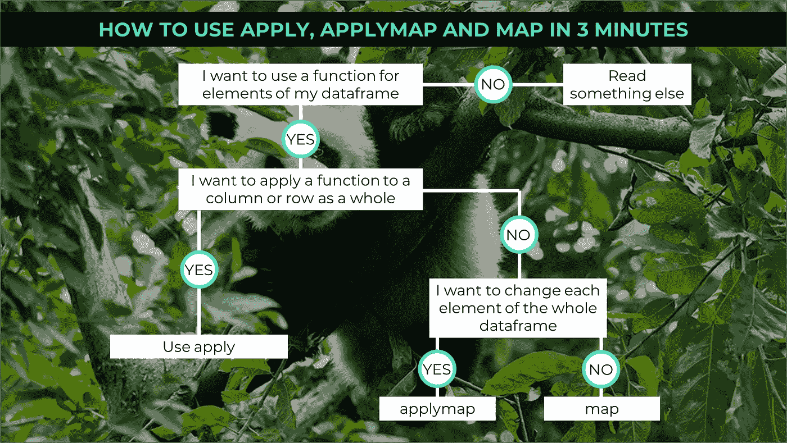

# 如何在 3 分钟内使用应用、应用地图和地图

> 原文：<https://towardsdatascience.com/how-to-use-apply-applymap-and-map-in-3-minutes-36a08c09257?source=collection_archive---------26----------------------->

## 有时不太清楚什么时候使用 map、applymap 或 map。我会解释何时使用哪一个。



当你开始使用 Python 进行数据分析时，你会对所有的可能性着迷，但有时你也会感到困惑。通常有很多方法可以达到相同的目标，但你不确定该用哪一种。比如，很多人并不清楚`apply`、`applymap`和`map`的区别。为此，我想讨论一下三种方法的区别以及何时使用哪一种方法。

## 示例 1 —应用

假设你是辛普森团队的数据科学家。该系列的明星得到了赞助，每个明星每一季都有预算来买东西。你有第一季到第三季的成本:

```
>>> df = pd.DataFrame({'Customer': 'Mr.Burns Lisa Marge Milhouse Bart Homer'.split(),
 'Costs_1': np.arange(6) *2, 'Costs_2': np.arange(6) * 4, 'Costs_3': np.arange(6) * 6})
>>> df
   Customer  Costs_1  Costs_2  Costs_3
0  Mr.Burns        0        0        0
1      Lisa        2        4        6
2     Marge        4        8       12
3  Milhouse        6       12       18
4      Bart        8       16       24
5     Homer       10       20       30
```

第一项任务是确定每个季度的支出差异有多大。为此，我们首先创建一个函数来确定列的最大值和最小值，并将它们相减:

```
>>> def diff_calc(x):
 diff = x.max() — x.min()
 return diff
```

在我们将该函数应用于数据帧中所有需要的列之后:

```
>>> df[['Costs_1', 'Costs_2', 'Costs_3']].apply(diff_calc)
Costs_1    10
Costs_2    20
Costs_3    30
dtype: int64
```

如您所见，我们总共得到三个结果。我们对其应用函数的每一列都有一个结果。这是一个有趣的发现:每一季差异都在增加，所以我们似乎有特别渴望消费的明星。

> 我们为什么使用 apply？

`apply`方法可以用于一维数组。该方法可用于列和行。一维数组总是作为输入，即函数是逐行或逐列执行的。如果我们添加`axis=1`作为参数，我们得到一个逐行计算:

```
>>> df[['Costs_1', 'Costs_2', 'Costs_3']].apply(diff_calc, axis=1)
0     0
1     4
2     8
3    12
4    16
5    20
dtype: int64
```

## 示例 2 —应用地图

在第一个例子中，我们希望对数据帧的每个数字列应用一个特定的函数。如果我们想单独改变每个元素呢？假设市场部的一位同事要求您将每个元素格式化为字符串，并为每个元素添加前缀“S_”作为 Simpson 值的标签。在这种情况下，您需要一个可以应用于每个单独元素的函数。让我们首先创建函数:

```
>>> def simpsons_string(x):
 result = "S_" + str(x)
 return result
```

使用`applymap`,我们现在可以将函数应用于数据帧的任何元素:

```
>>> df.applymap(simpsons_string)
     Customer Costs_1 Costs_2 Costs_3
0  S_Mr.Burns     S_0     S_0     S_0
1      S_Lisa     S_2     S_4     S_6
2     S_Marge     S_4     S_8    S_12
3  S_Milhouse     S_6    S_12    S_18
4      S_Bart     S_8    S_16    S_24
5     S_Homer    S_10    S_20    S_30
```

好吧，实际上我们应该告诉我们的同事，这个要求在数据处理方面不是最佳的，但是`applymap`为我们提供了很好的服务。

## 示例 3 —地图()

在我们准备了上面的数据并给每个元素添加了前缀之后，我们得到的反馈是这位同事犯了一个错误。他只希望所有的字符串元素都有一个前缀。所以现在我们必须改变列的每个元素:

```
>>> df['Customer'].map(simpsons_string)
0    S_Mr.Burns
1        S_Lisa
2       S_Marge
3    S_Milhouse
4        S_Bart
5       S_Homer
Name: Customer, dtype: object
```

完美！使用`map()`,我们可以将函数应用于一列中的每个元素，而使用`applymap()`,我们可以将函数应用于整个数据帧。

## 结论

通过这三种方法，`apply()`、`applymap()`和`map()`功能可应用于数据帧或部分数据帧。使用`apply()`将函数应用于列或行，`applymap()`对整个数据帧的元素起作用，`map()`对单个系列的元素起作用。

[如果您喜欢中级数据科学，并且尚未注册，请随时使用我的推荐链接加入该社区。](https://medium.com/@droste.benedikt/membership)