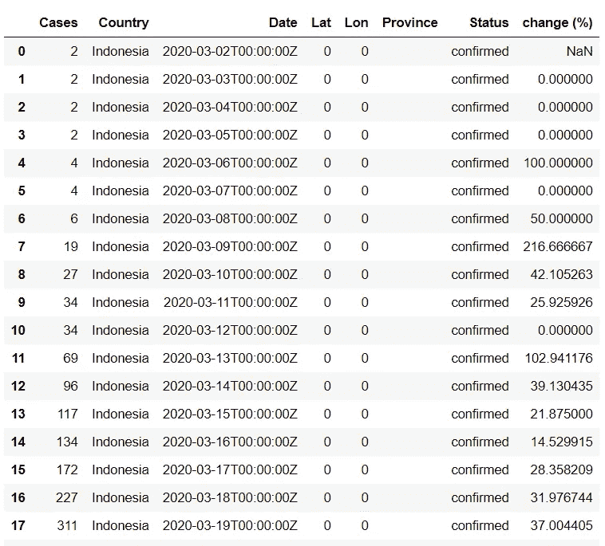
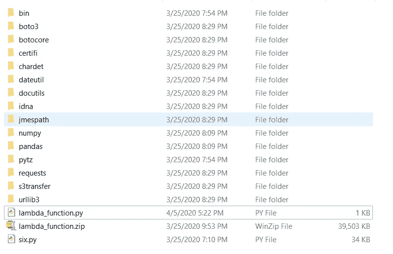
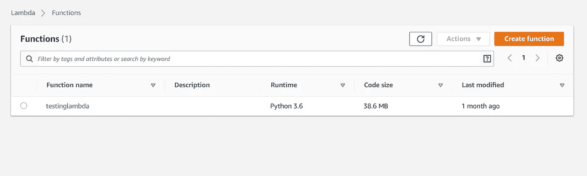
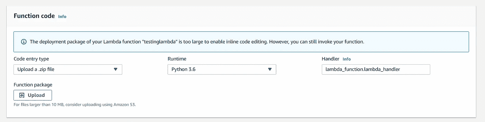
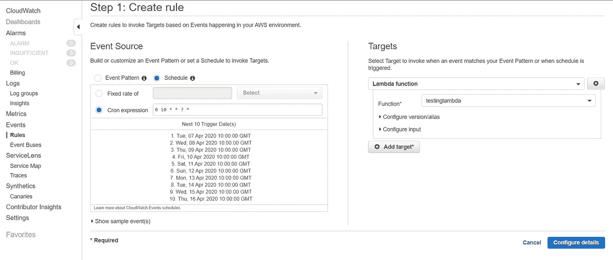
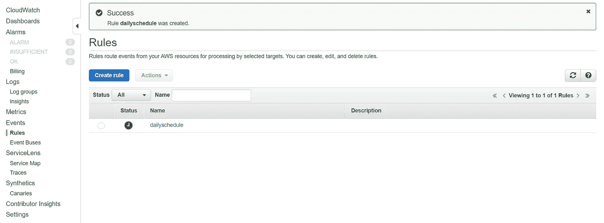

# 新手如何使用 AWS Lambda 和 CloudWatch

> 原文：<https://towardsdatascience.com/how-to-use-aws-lambda-and-cloudwatch-for-beginner-67df0755922e?source=collection_archive---------43----------------------->

## 让我们使用 AWS 服务构建一个简单的无服务器工作流！


我发现了一个很酷的网站([https://covid19api.com/](https://covid19api.com/))，在那里我们可以使用免费 API 轻松访问 COVID19 数据。这给了我一个想法，创建一个简单的函数来使用 AWS Lambda 获取数据，并将其保存到 S3。该脚本将使用 CloudWatch 每天自动执行。

以下是我需要完成的任务列表:

1.  **写一个函数来检索数据并保存到 S3。**
2.  **将函数部署为 AWS Lambda 函数。**
3.  **在 AWS CloudWatch 上创建一个事件，定时运行该功能。**

所以，让我们开始吧！

1.  **编写一个函数来检索数据并保存到 S3。**

一开始，我编写代码来检索本地计算机上的数据。下面是代码和结果:

```
import requests
import pandas as pd
from pandas.io.json import json_normalize
baseUrl = "[https://api.covid19api.com/total/dayone/country/indonesia/status/confirmed](https://api.covid19api.com/total/dayone/country/indonesia/status/confirmed)"
response = requests.get(baseUrl)
df = json_normalize(response.json())
df['change (%)'] = df['Cases'].pct_change()*100
```



如您所见，脚本运行良好。接下来，我们需要将脚本放在[处理函数](https://docs.aws.amazon.com/lambda/latest/dg/python-programming-model-handler-types.html)上，这是 Lambda 将要执行的函数。

```
import requests
import pandas as pd
from pandas import json_normalize
import boto3
from datetime import datetime
from io import StringIO def lambda_handler(event, context):

    baseUrl = "[https://api.covid19api.com/total/dayone/country/indonesia/status/confirmed](https://api.covid19api.com/total/dayone/country/indonesia/status/confirmed)"
    response = requests.get(baseUrl)
    df = json_normalize(response.json())
    df['change (%)'] = df['Cases'].pct_change()*100

    bucketname = 'my-beautiful-bucket'
    filename = 'corona_dataset.csv'

    csv_buffer = StringIO()
    df.to_csv(csv_buffer)

    client = boto3.client('s3')

    response = client.put_object(
        ACL = 'private',
        Body= csv_buffer.getvalue(),
        Bucket= bucketname,
        Key= filename
    )
```

我添加了两个新的库，即 boto3 和 StringIo，我还添加了脚本来将数据帧转换为 csv，并将其保存到我的 s3 存储桶中，名为“my-beautiful-bucket”。复制这个脚本并保存到一个名为 lambda_function 的. py 文件中。

**2。将函数部署为 AWS Lambda 函数。**

由于 AWS Lambda 不包括外部 python 库，我们不能只部署`lambda_function.py`。我们需要将`lambda_function.py`和所有那些库压缩成一个。zip 文件。

所以接下来要做的是创建一个新目录，并将`lambda_function.py`文件放入这个新目录。对于 windows 用户，打开命令提示符并转到我们刚刚创建的目录，使用 [pip](https://pypi.org/project/pip/) 将所有库安装到本地目录:

```
pip install -t . pandas
```

现在有一个棘手的部分，因为 AWS Lambda 使用亚马逊 Linux 作为操作系统。所以我们需要兼容 Linux 的熊猫和 Numpy。

要解决这个问题，首先移除移除`pandas`、`numpy`、`*.dist-info`和`__pycache__` 。接下来就是打开[https://pypi.org/project/pandas/#files](https://pypi.org/project/pandas/#files)下载最新的`*manylinux1_x86_64.whl`包。Numpy 也是一样:打开[https://pypi.org/project/numpy/#files](https://pypi.org/project/numpy/#files)下载最新的 Linux 兼容包。两者都提取。whl 文件放在我们的目录中，并将其全部压缩到一个新的。zp 文件(注意:不要忘记删除 whl 文件、`*.dist-info`和`__pycache__`。):



现在是时候创建一个 Lambda 函数了，登录你的 AWS 账户，找到 Lambda 服务，打开它，创建一个函数。



接下来，进入函数内部，选择“上传. zip 文件”作为代码输入类型，单击上传按钮，选择。zip 文件并单击 save 按钮来部署它。



如果。压缩文件太大，我们可以把它上传到我们的 S3 桶，然后上传。来自亚马逊 S3 的 zip 文件。单击测试按钮运行脚本。

**3。在 AWS CloudWatch 上创建一个事件，以便按计划运行该功能。**

假设我希望我的函数在每天 10:00 GMT 运行。转到 CloudWatch 服务，单击规则，然后单击创建规则按钮。选择 Schedule 然后选择 Cron expression 而不是 Fixed rate，然后输入 0 10 * *？0 10 * * ?*在文本框中，这意味着它将在每天 10:00 GMT 运行。选择我们的 Lambda 函数，单击 configure details 按钮，键入事件的名称，最后单击 create rule 按钮创建事件。



希望每一个读这篇文章的人都会觉得有用。当然，还有其他的 AWS 服务可以包含在这个项目中，使它变得更好，例如 AWS Athena 在 S3 使用 SQL 语言分析数据，AWS QuickSight 创建和分析数据的可视化。随意探索！