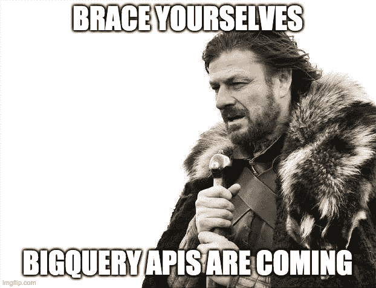
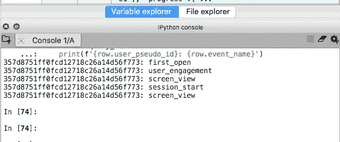
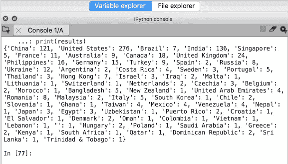

# 如何对自己的数据集使用 BigQuery API？

> 原文：<https://towardsdatascience.com/how-to-use-bigquery-api-with-your-own-dataset-c901972cebd?source=collection_archive---------12----------------------->

## 使用 Flask 和 Bigquery APIs 根据用户查询参数从 Bigquery 数据集中提取数据。



来源: [imgflip](https://imgflip.com/memetemplate/Brace-Yourselves-X-is-Coming)

# 我们要用 BigQuery APIs 做什么？

> big query(BQ)API 对于让最终用户与数据集和表进行交互非常有用。

我们在本文中的目标是利用一些 BQ API 函数建立与 BigQuery 项目的连接，然后查询存储在那里的数据库。该数据库包含通过将 firebase analytics 链接到 Firebase 仪表板中的 BigQuery 而获得的 firebase 事件数据。

这是我的`podcastApp`项目的云控制台的样子(它现在是一个 Android 和 IOS 应用程序，对那些有兴趣听播客的人来说是 [Podurama](https://podurama.com/) ):


# 装置

步骤 1:在终端中运行以下命令:

```
pip install --upgrade google-cloud-bigquery
```

步骤 2:使用以下步骤从 Google Cloud console 获取您的 BQ 项目的认证密钥:

*   前往 [**项目选择器页面**](https://console.cloud.google.com/projectselector2/home/dashboard?_ga=2.31442943.1164828906.1593094302-317534299.1590154480&_gac=1.251470514.1590548362.EAIaIQobChMIzsjynIbT6QIVsiCtBh0-wAAvEAAYASAAEgI2DvD_BwE&pli=1) 。
*   [**启用 API**](https://console.cloud.google.com/flows/enableapi?apiid=bigquery&_ga=2.64793711.1164828906.1593094302-317534299.1590154480&_gac=1.242952502.1590548362.EAIaIQobChMIzsjynIbT6QIVsiCtBh0-wAAvEAAYASAAEgI2DvD_BwE) 。
*   在云控制台中，进入 [**创建服务账号密钥**](https://console.cloud.google.com/apis/credentials/serviceaccountkey?_ga=2.231582815.1164828906.1593094302-317534299.1590154480&_gac=1.246546736.1590548362.EAIaIQobChMIzsjynIbT6QIVsiCtBh0-wAAvEAAYASAAEgI2DvD_BwE) 页面。
*   从**服务账户**列表中选择**新服务账户**。
*   在**服务帐户名称**字段中，输入一个名称。
*   从**角色**列表中，选择**项目** > **所有者**。
*   点击**创建**。一个 JSON 文件，包含下载到您计算机的密钥。

如果你在遵循这些步骤时遇到困难，在开始[官方 Bigquery 文档](https://cloud.google.com/bigquery/docs/quickstarts/quickstart-client-libraries)页面上的之前，检查一下*下的步骤 1、2 和 3。*

一旦您按照这些步骤操作，您的下载文件夹中就会有一个 JSON 文件。确保将它移动到您将要编写 python API 脚本的目录中。

# 在我们开始之前…

在我们之前的博客文章中，我们讨论了什么是 API 和端点，如何使用 Flask 框架编写一个简单的`HelloWorld` API，然后编写稍微高级的 API——从用户那里获取输入参数的 API。我们还深入讨论了如何通过在本地运行后端服务器来测试我们的 API。最后，我们还学习了如何编写简单而强大的 REST APIs 来部署机器学习模型。

我强烈推荐您去看看，因为在使用 Flask 框架方面有很多重叠，也因为在本文中我将更多地关注 BigQuery API。

注意:我将使用 **Spyder** 来编写 API 代码。最后，我将从 **Jupyter 笔记本中访问我的 API。**

# 让我们直接进入编码...

在存储 JSON 认证密钥的同一个目录中创建一个新的 Python 脚本`BigQuery_API.py`。

## 正在导入 BigQuery 库

```
from google.cloud import bigquery
```

## 直接在代码中设置环境变量

```
import os
os.environ["GOOGLE_APPLICATION_CREDENTIALS"] = 'podcastApp-e07020594640.json'
```

在上面的代码中替换 JSON 键的名称。

> 提示:我发现在代码中直接设置 Google 应用程序凭证**非常有用，当你同时处理需要不同凭证的项目时。**

## 初始化 BigQuery 客户端

```
*# simple non parameterized query*
client = bigquery.Client()
```

## 编写 SQL 查询

```
query = """
    SELECT user_pseudo_id, event_name 
    FROM `podcastapp-767c2.analytics_193436959.events_*` 
    LIMIT 5

"""
```

这是一个非常基本的查询，我希望看到两列的前五行数据——用户 id 和事件名称。当然，你的问题可能会比这更复杂。要获得一些查询灵感，请查看这篇文章。

## **发出 API 请求**

```
query_res = client.query(query)  # Make an API request.
```

## **打印结果**

```
*# to print in the console*
for row in query_res:
    print(f'{row.user_pseudo_id}: {row.event_name}')
```

## 最后，所有代码都在一个地方…

```
from google.cloud import bigqueryimport os
os.environ["GOOGLE_APPLICATION_CREDENTIALS"] = 'podcastApp-e07020594640.json'*# simple non parameterized query*
client = bigquery.Client()query = """
    SELECT user_pseudo_id, event_name 
    FROM `podcastapp-767c2.analytics_193436959.events_*` 
    LIMIT 5

"""query_res = client.query(query)  # Make an API request.*# to print in the console*
for row in query_res:
    print(f'{row.user_pseudo_id}: {row.event_name}')
```

运行该脚本会在 iPython 控制台中产生以下输出:



Wohoo！我们已经成功地从我们的 BigQuery 数据库中进行了查询。

# 参数化 SQL 查询

正如我之前提到的，我们选择了一个相对简单的查询作为例子。让我们继续，这次对数据集进行一个有用的查询:

查询以显示每个国家/地区的 ios 应用程序用户数量:

```
query = """
        SELECT geo.country AS country, COUNT(DISTINCT user_pseudo_id) AS count
        FROM `podcastapp-767c2.analytics_193436959.events_*` 
        WHERE device.operating_system = 'IOS'
        GROUP BY geo.country
        """
```

但是，如果我想将 WHERE 子句指定为用户的输入，该怎么办呢？好了，向**参数化查询**问好:

> 在参数化查询中，占位符用于参数，参数值在执行时提供。这些通常用于防止 SQL 注入袭击。

要指定一个已命名的参数，使用字符`@`后跟一个用户特定的变量名，例如`@device_name`。

## 让我们看看如何将它作为 BigQuery API 请求的一部分:

```
from google.cloud import bigqueryimport os
os.environ["GOOGLE_APPLICATION_CREDENTIALS"] = 'podcastApp-e07020594640.json'*# simple non parameterized query*
client = bigquery.Client()**query = """
        SELECT geo.country AS country, COUNT(DISTINCT user_pseudo_id) AS count
        FROM `podcastapp-767c2.analytics_193436959.events_*` 
        WHERE device.operating_system = @device_name
        GROUP BY geo.country
        """****job_config = bigquery.QueryJobConfig(
                query_parameters=[
                        bigquery.ScalarQueryParameter("device_name", "STRING", 'IOS')])**query_res = client.query(query, **job_config = job_config**) ***# to print in the console*
results = {} 
for row in query_res:
    results[row.country] = row.count
print(results)**
```

评估我们所做的修改:

*   查询中的 WHERE 子句现在有了一个占位符`@device_name`
*   该查询现在使用在`job_config`中指定的某些作业配置运行。
*   我们指定了一个名为`device_name`的`ScalarQueryParameter`，它的类型为`STRING`，值为`IOS`。

控制台中的输出如下所示:



这看起来很棒，除了让用户指定他们感兴趣的设备作为 API 调用的一部分对我们来说更有意义。幸运的是，我们已经知道(从我们的[之前的教程](/deploying-h2o-models-as-apis-using-flask-42065a4fa567)中)如何接受用户输入并使用 Flask 将它们作为 API 请求的一部分**插入。**

# 将 REST APIs 和 BigQuery APIs 结合成一个令人惊叹的大碗:

如果你完全遵循了之前和当前的教程，下面的代码将会非常有意义。

```
**from flask import Flask
from flask_restful import Resource, Api, reqparse** from google.cloud import bigqueryimport os
os.environ["GOOGLE_APPLICATION_CREDENTIALS"] = 'podcastApp-e07020594640.json'**app = Flask(__name__)
api = Api(app)****# argument parsing
parser = reqparse.RequestParser()
parser.add_argument('user_device', choices = ('IOS', 'ANDROID', 'WEB'), help = 'Bad Choice: {error_msg}')
parser.add_argument('countries', action = 'append')**# parameterized query- one is scalar and other is array 
**class PrintUserCount(Resource):
    def get(self):
        # parsing the input argument
        args = parser.parse_args()
        device = args['user_device']
        countries = args['countries']**

        client = bigquery.Client() query = """
        SELECT geo.country AS country, COUNT(DISTINCT user_pseudo_id) AS count
        FROM `podcastapp-767c2.analytics_193436959.events_*` 
        WHERE device.operating_system = [@device](http://twitter.com/device) **AND geo.country IN UNNEST(**[**@countries**](http://twitter.com/countries)**)**
        GROUP BY geo.country
        """ job_config = bigquery.QueryJobConfig(
                query_parameters=[
                        bigquery.ScalarQueryParameter("device", "STRING", device), **bigquery.ArrayQueryParameter("countries", "STRING", countries)**
                        ]
                ) query_res = client.query(query, job_config = job_config)

        # to store results in dataframe 
        results = {} #empty dataframe
        for row in query_res:
            results[row.country] = row.count
       ** return{'res': results}**

**api.add_resource(PrintUserCount, '/')

if __name__ == '__main__':
    app.run(debug=True, port = 1123)**
```

评估我们所做的一些修改:

*   我们现在接受来自用户的两个输入:
    (1)设备类型，可以是`IOS`、`ANDROID`或`WEB`、
    (2)您想要输出用户数量的国家列表。
*   作业配置必须将`countries`占位符指定为`ArrayQueryParameter`，因为这将是一个国家名称数组。
*   在访问 WHERE 子句中的`countries`占位符时，记住要`UNNEST`它。

最后，保存文件并使用顶部绿色的 run 按钮(或 Mac 上的 F5)运行它。正如您在 iPython 控制台中看到的，API 正在本地服务器上运行`[http://127.0.0.1:1123/](http://127.0.0.1:12345/)`。

现在打开 **Jupyter Notebook** 并输入以下代码来访问我们刚刚编写的 API。

```
url = '[http://127.0.0.1:1123/'](http://127.0.0.1:1123/')
params = {'user_device': 'IOS', 
          'countries':["China", "India", "Canada"]
         }
response = requests.get(url, params)
response.json()
```


瞧，我们有一个可用的 API，您可以使用它来查询您的 BigQuery 数据集，并接受来自用户的输入。

# 结束前的一些提示…

*   用生命保护您的 JSON 认证密钥。防止它落入坏人之手！
*   为了获得轻松的体验，在从您最喜欢的客户端库中访问 SQL 查询之前，请始终在 BigQuery Web UI 中尝试/测试/运行您的 SQL 查询。
*   如需进一步阅读，请查看 [API 参考文档](https://github.com/googleapis/google-cloud-python#google-cloud-python-client)。

# 结论

在本文中，我们学习了如何使用 Flask 和 Bigquery APIs 根据用户查询参数从 Bigquery 数据集中提取数据。我目前正在使用这些框架作为我先睹为快的播客数据集的一部分。这对于创建基于 user_id 和他们之前与其他播客节目的交互请求推荐的 API 非常有用。希望在不久的将来，我会分享这些脚本。

直到下次:)