# 如何在日常分析工作中使用因果推理——第 2 部分，共 2 部分

> 原文：<https://towardsdatascience.com/how-to-use-causal-inference-in-day-to-day-analytical-work-part-2-of-2-1824e7024cd2?source=collection_archive---------39----------------------->

来源:https://www.pexels.com/photo/paper-on-gray-laptop-669617/

在[第一部分](/how-to-use-causal-inference-in-day-to-day-analytical-work-part-1-of-2-b5efbdbf8ab0)中，我们看了如何使用因果推理从*观察*数据中得出正确的结论——或者至少不会跳到*错误的*结论。

我们看到*混杂因素常常是我们得出错误结论的原因，并了解了一种叫做 ***分层*** 的简单技术，它可以帮助我们 ***控制混杂因素*** 。*

*在这篇文章中，我们提出了另一个如何使用分层的例子，然后考虑当有如此多的混杂因素使分层变得混乱时该怎么办。*

*假设你在一家多渠道零售商工作。您一直在分析客户级别的销售数据，并注意到以下情况:*

> *从多个渠道购买的客户每笔交易的花费比从单一渠道购买的客户多 30%。*
> 
> *来源:灵感来自[http://bit.ly/2Q6BwTN](http://bit.ly/2Q6BwTN)*

*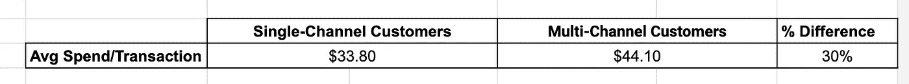*

*这是一个非常令人兴奋的发现，因为它非常具有可操作性*如果是真的话 *:* 你可以列出你的单一渠道购物者的名单，并向他们发送优惠信息，诱使他们在下次购物时从另一个*渠道购买——如果客户第一次在实体店购买，你可以通过电子邮件向他们发送 20%的网上优惠券。如果你的发现是真的，他们会花更多的钱，而你可以坐以待毙，看着钱滚滚而来:-)*

*人们很容易立即将这一发现告诉首席执行官——我的意思是，收入增加 30%是一大笔钱——但是让我们应用我们在[第 1 部分](/how-to-use-causal-inference-in-day-to-day-analytical-work-part-1-of-2-b5efbdbf8ab0)中定义的清单。*

***随机分配？**号购物者*自选*自己进入单通道和多通道组。*

*有混杂因素吗？影响购物者使用多少渠道以及每次交易花费多少的因素有哪些？*

****那么，在过去一年中，购物者与您一起购物的次数是多少？****

*   *在极端情况下，如果他们只和你一起购物过一次，他们就不可能加入多渠道团队。一般来说，他们在过去一年中与您一起购物的次数越多，就越有可能使用多个渠道。*
*   *他们与你一起购物的次数越多，他们就越有可能喜欢你的产品，更熟悉你的产品目录，因此更有可能在每笔交易中花费更多。*

*我们去追这个混蛋。*

*3.我们可以**控制**这个混杂因素，方法是使用混杂因素的不同值(作为拆分变量)拆分数据，并计算每个时段每笔交易的平均支出:*

*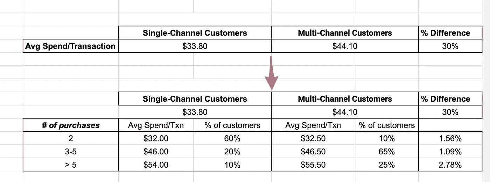*

*此表中有一些事项需要注意:*

*   *我们排除了那些在过去一年里只购买过一次*的客户，因为即使是多渠道的概念也不适用于他们。**
*   *我们使用三个类别进行了分层:2 次购买、3-5 次购买和 5 次以上购买。这是一种平衡行为——如果我们分层到太多的桶中，我们可能在一些桶中没有足够的数据。如果我们分层太少，我们将在同一个桶里混合苹果和橘子。我的方法是从一把桶开始分析，然后看看如果添加更多的桶，分析结果会如何变化。*
*   *总体数字(33.80 美元和 44.10 美元)只是以下数字的加权平均值。这只是一个检查，以确保我们在拆分数据时没有出错。*

*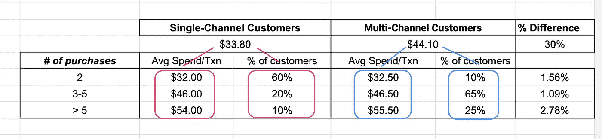*

*   *现在我们进入分析的核心。我们观察每个*阶层*(即每个混杂因素组)，并计算从单一渠道客户到多渠道客户的消费数字如何变化。*

*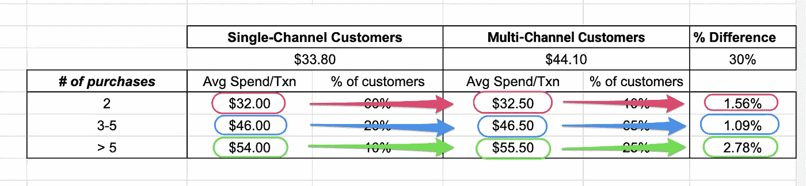*

*   *请注意，所有这些变化都在 1–3%的范围内，与我们开始时 30%的大数字形成对比。这表明混杂因素在起作用，30%的数字是可疑的。*

*最后，正如我们在[第 1 部分](/how-to-use-causal-inference-in-day-to-day-analytical-work-part-1-of-2-b5efbdbf8ab0)中了解到的，我们通过计算 ***调整后的*** 总体数字来进行*去混杂】*。*调整是通过用每个阶层的客户在整个数据集中的百分比对阶层级别的数字进行加权来完成的*。*

*我们计算*调整后的*单渠道客户的平均消费/交易如下…*

*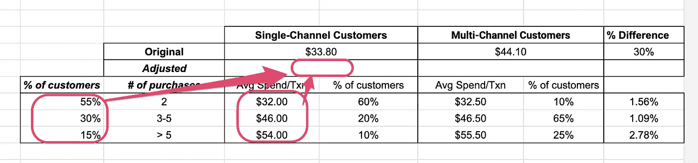*

*…多渠道客户也是如此。*

*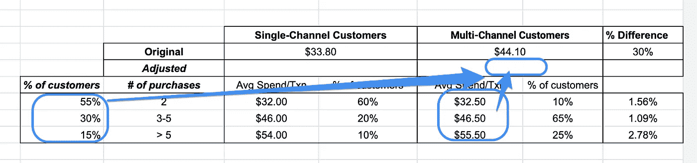*

*正如在[第一部分](/how-to-use-causal-inference-in-day-to-day-analytical-work-part-1-of-2-b5efbdbf8ab0)、*中所强调的，使用相同的权重(每个阶层中整个数据集中的客户百分比)来调整两组数字*至关重要。*

*好吧，我们得到了什么？*

*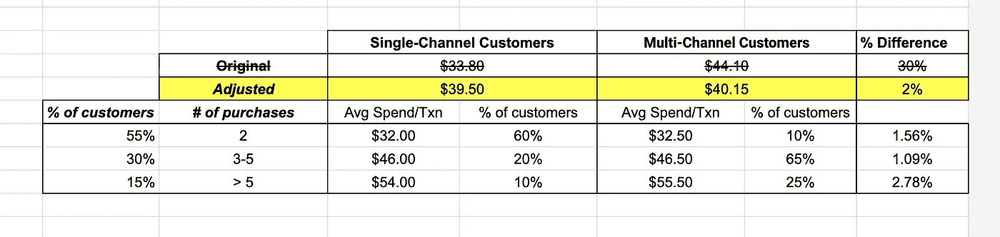*

*故事发生了剧烈的变化！*

*原本让我们兴奋的 30%的差异已经缩小到了 2%。*

*在过去一年有两次购买的客户中，多渠道客户的花费仅比单一渠道客户多 1.5%！在购买超过五次的客户中，多渠道客户仅比单一渠道客户多花了 2.8%的钱！*

*鉴于最初的 30%数字和调整后的(去混杂)数字 2%之间的巨大差异，多重渠道不太可能产生显著的因果影响。不要把这个交给首席执行官:-)*

*为了便于解释，我在上面只使用了一个混杂因素。但是如果你喜欢你可以用更多。例如，你可能怀疑住在远离实体店的农村地区的购物者可能只在网上购物(因此属于单一渠道群体)。农村购物者可能有不同于其他人的消费模式，因此这也可能影响消费指标。*

*假设您有数据，您可以如下扩展上表，并像我们上面所做的那样，将调整后的数字与总体数字进行比较:*

*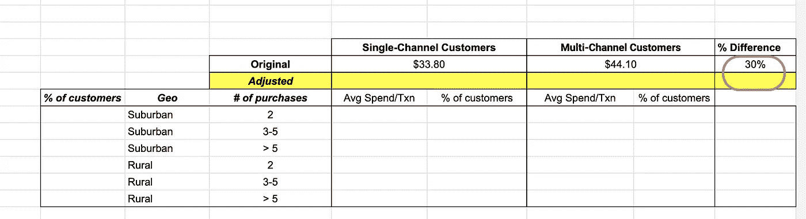*

*此时，你可能会想:“如果我有不止一两个联合创始人呢？如果我有半打呢？分层将变得相当笨拙，不是吗？”*

*好问题。是的，分层*将*弄得乱七八糟。你将需要使用多元方法，如[线性回归](https://en.wikipedia.org/wiki/Linear_regression)或[逻辑回归](https://en.wikipedia.org/wiki/Logistic_regression)来完成这项工作。您可以跟进这些参考资料([文章](https://linkinghub.elsevier.com/retrieve/pii/S0085253815529748)、[文章](https://www.ncbi.nlm.nih.gov/pmc/articles/PMC4017459/)、[文章](https://oem.bmj.com/content/62/7/500))以了解更多信息，但这里有一个来自我的经验的快速示例。*

*假设您为一家零售商工作，正在考虑购买一套价格优化系统。您如何理解/量化使用该系统对收入的影响？*

*在理想情况下，你可以做一个 A/B 测试，随机抽取 50%的产品使用价格优化系统进行定价，另外 50%使用你当前的方法进行定价。你可以运行这个测试一段时间，然后比较两组的收入等。*

*不幸的是，由于某些组织原因，这可能是不可能的(例如，也许你不能*强迫*你的销售团队在某些产品上使用该系统，而在其他产品上不使用)。但是你*能*做的是让*所有*终端用户都可以使用*这个系统，如果他们想*的话，也就是说，你可以允许终端用户*自行选择*他们想用新系统为哪些产品定价。*

*这种自我选择显然意味着非随机分配的情况，您不能简单地比较使用新系统定价的产品的平均收入与使用您当前方法定价的产品的平均收入。*

*那么，分析结果数据以评估系统收入影响的最佳方法是什么呢？*

*让我们应用清单。有哪些潜在的混淆因素？*

*   ***产品的类别**。不同的产品类别可能有很大不同的收入，如果负责这些类别定价的最终用户在某些方面被新系统吸引/排斥(例如，那些负责时尚前沿产品类别的人可能更容易相信没有优化系统可以击败他们的直觉)，这肯定会混淆结果。*
*   ***产品的销售率**。也许你的团队认为新系统有风险且未经验证，因此只会将它用于销量不多的产品；如果发生这种情况，新系统的性能看起来会比实际情况更差。*
*   *…等等。*

*利用这些考虑，可以确定几个潜在的混杂因素。但由于混杂因素太多，无法进行分层，我们可以用回归来代替。*

*我们组装这样一个数据集，每个产品一行:*

*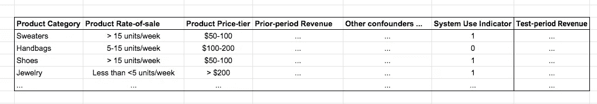*

*为了说明，我包括了产品类别、产品销售率、价格等级、去年同期的收入等列。作为潜在的混杂因素。在实践中，你必须运用你的领域知识和商业判断来列出这个清单。*

*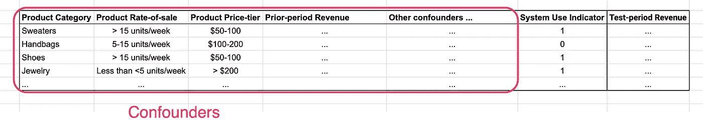*

*我还有一个列(“系统使用指标”)，它是一个 0-1 变量，表示新的价格优化系统是否用于该产品的定价。最后，我有一个列显示了每个产品在测试期间的收入。*

*有了这个数据集，我们可以用“测试期收入”作为因变量，所有其他列作为自变量来拟合回归模型*。*

*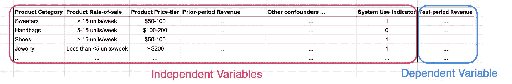*

*现在，找到使用价格优化系统与当前方法的因果关系就像从回归输出中读取一个数字一样简单。*

> **“系统使用指标”虚拟变量的系数给出了使用优化系统对测试期收入的增量*因果影响*,控制了所有其他变量。**

*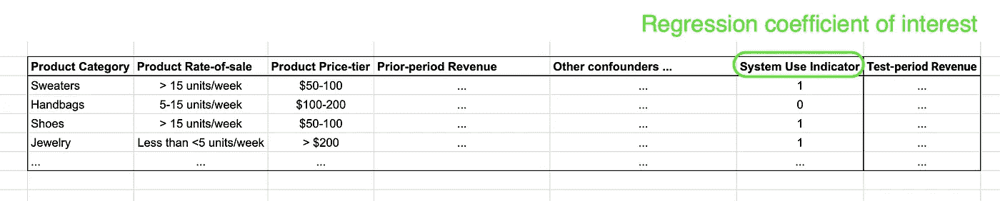*

*这种方法被广泛使用:当需要因果效应时，分析师将识别混杂因素，并通常*将它们与治疗和结果变量一起投入回归*，并提取治疗变量的系数作为因果治疗效应。当你在报纸上看到一篇文章说“在控制了年龄、性别、身体质量指数、血压和身体活动水平后，X 与更高的 Y、*风险相关”时，这是怎么回事。**

*这种方法绝对应该放在您的数据科学工具箱中，但请记住，它取决于一些非常关键的假设，包括:*

*   *所有混杂因素都包括在模型中，即没有其他混杂因素(这可能是最重要的假设)*
*   *变量对结果的影响是线性的*

*(延伸阅读:[使用分层 vs 回归的利弊](https://oem.bmj.com/content/62/7/500))*

*(*表格的布局意味着线性*加法*模型。我这样做是为了便于解释，但是如果你真的必须这样做，一个 [*乘法*模型](http://www-ist.massey.ac.nz/dstirlin/CAST/customCAST/Hmultiplicative/multiplicative1.html)可能更适合这个问题:将测试期收入表示为所有因素的乘积，取对数使其在参数中呈线性，然后拟合得到的线性回归模型)*

*关于如何从观察数据中做出好的推论，这个讨论仅仅触及了大量文献的表面。网上有大量的好材料，还有许多书籍和课程。如果你刚刚开始你的学习之旅，你会很高兴:-)。*

*最后，我想重申第一部分中的一个重要警告。*

*应用于观察数据的因果推断方法并不可靠。它们基于许多重要的假设(例如，数据中没有重要的混淆因素丢失)，并且不能保证你所发现的是真正的因果关系；评估这些数字的含义需要判断力和细心。*

*尽管如此，思考潜在的混淆因素以及如何控制它们会增加你的 ***因果智商*** ，并会让你避免频繁地得出错误的结论，以至于你应该养成这种习惯。*

*(如果您觉得这篇文章有帮助，您可能会发现这些感兴趣的*